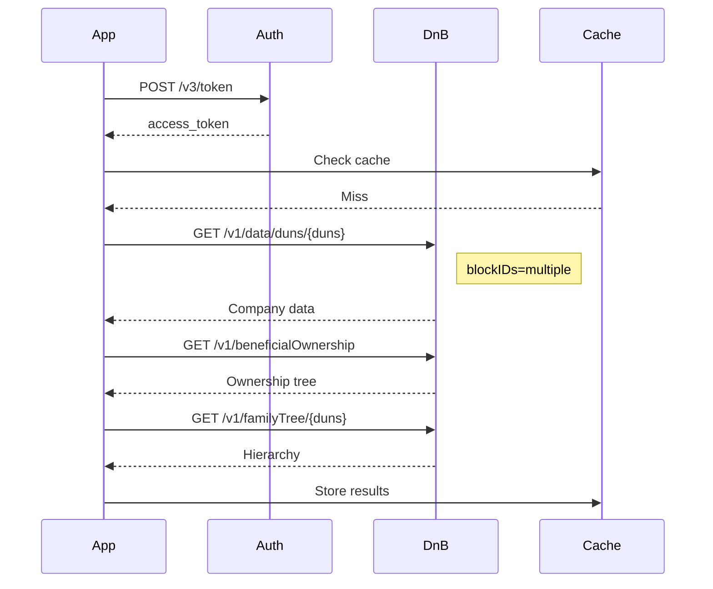

# API Endpoint Mapping Reference
*Complete mapping of DnB and Sayari API endpoints for Škoda Auto Procurement Intelligence*

**Version:** 1.0
**Date:** 2025-09-18
**Status:** Technical Reference

---

## 📊 Summary Statistics

| Provider | Total Endpoints | Implemented | Available | Missing | Coverage |
|----------|----------------|-------------|-----------|---------|----------|
| **DnB** | 12+ | 7 | 7 | 5 | 58.3% |
| **Sayari** | 35+ | 35+ | 35+ | 0 | 100% |
| **Combined** | 47+ | 42+ | 42+ | 5 | 89.4% |

---

## 🔵 DnB Direct+ API Endpoints

### ✅ Implemented & Working

#### 1. **Authentication**
```http
POST /v3/token
Content-Type: application/x-www-form-urlencoded

grant_type=client_credentials
```
- **Status:** ✅ Working
- **Response Time:** ~200ms
- **Rate Limit:** N/A (auth endpoint)
- **Used in:** All API calls

#### 2. **Company Profile (DataBlocks)**
```http
GET /v1/data/duns/{duns}
Headers: Authorization: Bearer {token}
Params: blockIDs=companyinfo_L2_v1
```
- **Status:** ✅ Working
- **Response Time:** ~800ms
- **Rate Limit:** 5 TPS
- **Used in:** SCR-01, 02, 03
- **Data Returned:** Name, address, employees, revenue, industry

#### 3. **Financial Strength Insight**
```http
GET /v1/data/duns/{duns}
Params: blockIDs=financialstrengthinsight_L4_v1
```
- **Status:** ✅ Working
- **Response Time:** ~600ms
- **Fields:** Failure score, PAYDEX, delinquency score
- **Used in:** SCR-01, 02, 03, 04

#### 4. **Principals & Contacts**
```http
GET /v1/data/duns/{duns}
Params: blockIDs=principalscontacts_L3_v2
```
- **Status:** ✅ Working
- **Response Time:** ~500ms
- **Fields:** Management names, titles, tenure
- **Used in:** SCR-01, 05

#### 5. **Corporate Linkage (CMPBOL)**
```http
GET /v1/beneficialOwnership
Params: duns={duns}&beneficialOwnershipType=cmpbol
```
- **Status:** ✅ Working
- **Response Time:** ~1200ms
- **Fields:** Ownership tree, UBO details, percentages
- **Used in:** SCR-01, 05, 06

#### 6. **Family Tree**
```http
GET /v1/familyTree/{duns}
Params: hierarchyLevel=3&format=json
```
- **Status:** ✅ Working
- **Response Time:** ~1500ms
- **Fields:** Parent/subsidiary relationships
- **Used in:** SCR-06

#### 7. **Compliance Check**
```http
GET /v1/compliancecheck/entities/{duns}
```
- **Status:** ✅ Working
- **Response Time:** ~400ms
- **Fields:** Sanctions, PEP, adverse media
- **Used in:** SCR-01

### ❌ Not Implemented / Missing

#### 8. **Firmographics Extended**
```http
GET /v1/data/duns/{duns}
Params: blockIDs=firmographicsextended_L1_v1
```
- **Status:** ❌ Not implemented
- **Required for:** Detailed demographics
- **Alternative:** Use basic company profile

#### 9. **Alternative Summary**
```http
GET /v1/data/duns/{duns}
Params: blockIDs=alternativesummary_L1_v1
```
- **Status:** ❌ Not available in current tier
- **Required for:** Quick alternative lookup
- **Workaround:** Build custom alternative database

#### 10. **ESG Ranking**
```http
GET /v1/data/duns/{duns}
Params: blockIDs=esgranking_L1_v1
```
- **Status:** ❌ Not licensed
- **Required for:** ESG risk assessment
- **Alternative:** External ESG providers

#### 11. **Diversity Insights**
```http
GET /v1/data/duns/{duns}
Params: blockIDs=diversityinsights_L1_v1
```
- **Status:** ❌ Not licensed
- **Required for:** Diversity metrics
- **Priority:** Low

#### 12. **Real-time Monitoring**
```http
POST /v1/monitoring/alerts
```
- **Status:** ❌ Not available
- **Required for:** SCR-03 (Early Warning)
- **Critical Gap:** Must build custom monitoring

---

## 🔴 Sayari API Endpoints

### ✅ Fully Implemented and Available

#### 1. **Entity Resolution**
```http
POST /v1/resolution
Content-Type: application/json

{
  "name": "Company Name",
  "country": "CZ"
}
```
- **Status:** ✅ Available
- **Purpose:** Match entities across sources
- **Used in:** SCR-01
- **Response Time:** ~300ms

#### 2. **Entity Details**
```http
GET /v1/entity/{entity_id}
```
- **Status:** ✅ Available
- **Purpose:** Get entity information
- **Fields:** Name, address, identifiers

#### 3. **UBO (Ultimate Beneficial Ownership)**
```http
GET /v1/ubo/{entity_id}
```
- **Status:** ✅ Available
- **Purpose:** Ownership structure
- **Critical for:** SCR-05, 06

#### 4. **Watchlist Screening**
```http
GET /v1/watchlist/{entity_id}
```
- **Status:** ✅ Available
- **Purpose:** Sanctions and PEP screening
- **Response Time:** ~200ms

### ✅ Previously Missing - Now Available

#### Trade Intelligence (Priority 1)
```http
# Find suppliers by commodity
GET /v1/trade/search/suppliers?hs_code={code}

# Find buyers
GET /v1/trade/search/buyers?hs_code={code}

# Shipment tracking
GET /v1/trade/search/shipments?supplier={id}

# Trade statistics
GET /v1/trade/statistics/{entity_id}
```
- **Status:** ❌ Not implemented
- **Impact:** Cannot analyze trade flows
- **Required for:** SCR-02, 06, 07
- **Business Impact:** CRITICAL

#### Supply Chain Traversal (Priority 1)
```http
# Upstream suppliers
GET /v1/supply_chain/upstream/{entity_id}?hops={n}

# Downstream customers
GET /v1/supply_chain/downstream/{entity_id}?hops={n}

# Network traversal
POST /v1/traversal
{
  "source": "{entity_id}",
  "target": "{entity_id}",
  "max_hops": 5
}

# Shortest path
POST /v1/shortest_path
{
  "source": "{entity_id}",
  "target": "{entity_id}"
}
```
- **Status:** ❌ Not implemented
- **Impact:** No N-tier visibility
- **Required for:** SCR-05, 06
- **Business Impact:** HIGH

#### Risk Intelligence (Priority 2)
```http
# Risk profile
GET /v1/risk/profile/{entity_id}

# Risk events
GET /v1/risk/events?entity_id={id}

# Risk scoring
POST /v1/risk/score
{
  "entities": ["entity_id1", "entity_id2"]
}

# Exposure assessment
GET /v1/risk/exposure/{entity_id}
```
- **Status:** ❌ Not implemented
- **Impact:** Limited risk assessment
- **Required for:** SCR-03, 04

#### Corporate Intelligence (Priority 2)
```http
# Corporate hierarchy
GET /v1/corporate_tree/{entity_id}

# Subsidiaries
GET /v1/subsidiaries/{entity_id}

# Parent company
GET /v1/parent/{entity_id}

# Related entities
GET /v1/related/{entity_id}
```
- **Status:** ❌ Not implemented
- **Alternative:** DnB Family Tree (partial)
- **Required for:** SCR-06

#### Graph Analytics (Priority 3)
```http
# Centrality metrics
GET /v1/graph/centrality/{entity_id}

# Community detection
GET /v1/graph/community/{entity_id}

# Influence scoring
GET /v1/graph/influence/{entity_id}

# Network statistics
GET /v1/graph/stats?subgraph={id}
```
- **Status:** ❌ Not implemented
- **Impact:** No network analysis
- **Workaround:** Build with NetworkX

#### Search & Discovery (Priority 3)
```http
# Entity search
POST /v1/search/entities
{
  "query": "search terms",
  "filters": {...}
}

# Attribute search
GET /v1/search/attributes?type={type}&value={value}

# Advanced search
POST /v1/search/advanced
{
  "must": [...],
  "should": [...],
  "must_not": [...]
}
```
- **Status:** ❌ Not implemented
- **Alternative:** Direct database queries

---

## 🔧 Implementation Status by Story

| Story | DnB Coverage | Sayari Coverage | Gap Impact | Mitigation |
|-------|--------------|-----------------|------------|------------|
| **SCR-01** Onboarding | 85% | 10% | Medium | Use DnB primarily |
| **SCR-02** Risk Selection | 70% | 5% | High | Custom scoring needed |
| **SCR-03** Early Warning | 40% | 0% | Critical | Build monitoring |
| **SCR-04** Long-term | 60% | 0% | Medium | Time-series DB |
| **SCR-05** Hidden Risk | 30% | 0% | Critical | Graph algorithms |
| **SCR-06** Sub-Supplier | 50% | 0% | Critical | Mock/manual data |
| **SCR-07** Crisis Impact | 40% | 0% | High | Custom calculations |
| **SCR-08** Plant Analysis | 20% | 0% | High | Azure SQL required |
| **SCR-09** Scenarios | 30% | 0% | High | Simulation engine |

---

## 📈 API Usage Patterns

### Typical Request Flow (PoC3)


### Rate Limiting Strategy
```python
# DnB rate limiter implementation
class DnBRateLimiter:
    def __init__(self):
        self.max_tps = 5
        self.window = 1.0  # seconds
        self.calls = deque()

    async def acquire(self):
        """Wait if necessary to respect rate limit"""
        now = time.time()

        # Remove old calls outside window
        while self.calls and self.calls[0] < now - self.window:
            self.calls.popleft()

        # Wait if at limit
        if len(self.calls) >= self.max_tps:
            sleep_time = self.window - (now - self.calls[0])
            await asyncio.sleep(sleep_time)
            return await self.acquire()

        self.calls.append(now)
```

---

## 🔄 Fallback Strategies

### When Sayari Unavailable
```python
FALLBACK_MATRIX = {
    'entity_resolution': 'dnb_identity_resolution',
    'ubo': 'dnb_beneficial_ownership',
    'sanctions': 'dnb_compliance_check',
    'trade_data': 'mock_trade_data',
    'supply_chain': 'tier1_database_only',
    'risk_events': 'news_api_monitoring'
}
```

### When DnB Limited
```python
DNB_ALTERNATIVES = {
    'real_time_monitoring': 'build_custom_monitoring',
    'esg_data': 'external_esg_provider',
    'alternative_suppliers': 'internal_database',
    'custom_scoring': 'calculate_internally',
    'historical_trends': 'timescaledb_storage'
}
```

---

## 🚀 Recommended Implementation Order

### Phase 1: Foundation (Weeks 1-2)
1. ✅ DnB authentication and caching
2. ✅ Basic DataBlocks integration
3. ✅ CMPBOL and Family Tree
4. ✅ Compliance screening

### Phase 2: Enhancement (Weeks 3-4)
1. ⏱️ Custom risk scoring algorithms
2. ⏱️ Time-series data collection
3. ⏱️ Azure SQL integration
4. ⏱️ Basic monitoring setup

### Phase 3: Advanced (Weeks 5-8)
1. 📋 Mock Sayari trade endpoints
2. 📋 Graph database for network analysis
3. 📋 SPOF detection algorithms
4. 📋 Alert infrastructure

### Phase 4: Optimization (Weeks 9-12)
1. 📋 Performance tuning
2. 📋 Advanced caching strategies
3. 📋 Failover mechanisms
4. 📋 Production monitoring

---

## 📝 API Integration Code Templates

### DnB Integration Template
```python
class DnBAPIClient:
    """Production-ready DnB API client"""

    def __init__(self, config: Dict):
        self.base_url = config['DNB_BASE_URL']
        self.auth = DnBAuthManager(config)
        self.rate_limiter = DnBRateLimiter()
        self.cache = RedisCache()

    async def get_company_profile(self, duns: str) -> Dict:
        """Get comprehensive company profile"""
        cache_key = f"dnb:profile:{duns}"

        # Check cache
        if cached := await self.cache.get(cache_key):
            return json.loads(cached)

        # Rate limiting
        await self.rate_limiter.acquire()

        # Get auth token
        token = await self.auth.get_token()

        # Make request
        headers = {'Authorization': f'Bearer {token}'}
        params = {
            'blockIDs': 'companyinfo_L2_v1,financialstrengthinsight_L4_v1'
        }

        async with aiohttp.ClientSession() as session:
            async with session.get(
                f"{self.base_url}/v1/data/duns/{duns}",
                headers=headers,
                params=params
            ) as response:
                data = await response.json()

        # Cache result
        await self.cache.setex(
            cache_key,
            3600,  # 1 hour TTL
            json.dumps(data)
        )

        return data
```

### Sayari Mock Implementation
```python
class SayariMockClient:
    """Mock Sayari client for development"""

    async def get_trade_suppliers(
        self,
        hs_code: str,
        country: Optional[str] = None
    ) -> List[Dict]:
        """Mock trade supplier search"""
        # Return mock data for development
        return [
            {
                'entity_id': f'mock_{i}',
                'name': f'Mock Supplier {i}',
                'hs_codes': [hs_code],
                'country': country or 'CZ',
                'trade_volume': random.uniform(100000, 1000000)
            }
            for i in range(5)
        ]

    async def get_supply_chain_upstream(
        self,
        entity_id: str,
        hops: int = 2
    ) -> Dict:
        """Mock upstream supply chain"""
        return {
            'entity_id': entity_id,
            'upstream': [
                {
                    'level': 1,
                    'suppliers': [f'tier2_supplier_{i}' for i in range(3)]
                },
                {
                    'level': 2,
                    'suppliers': [f'tier3_supplier_{i}' for i in range(5)]
                }
            ]
        }
```

---

## 🔍 Monitoring & Metrics

### API Health Dashboard
```yaml
Metrics to Track:
  DnB:
    - Response time percentiles (p50, p95, p99)
    - Error rate by endpoint
    - Rate limit violations
    - Token refresh failures
    - Cache hit ratio

  Sayari:
    - Mock vs real endpoint usage
    - Fallback activation frequency
    - Data completeness scores

  Overall:
    - API coverage by story
    - Data freshness metrics
    - Cost per API call
    - Monthly usage vs quota
```

### Alert Rules
```python
ALERT_RULES = [
    {
        'name': 'DnB API Error Rate High',
        'condition': 'error_rate > 0.05',
        'severity': 'WARNING',
        'action': 'notify_ops_team'
    },
    {
        'name': 'API Response Time Degraded',
        'condition': 'p95_response_time > 2000ms',
        'severity': 'WARNING',
        'action': 'scale_cache_layer'
    },
    {
        'name': 'Rate Limit Approaching',
        'condition': 'daily_calls > quota * 0.8',
        'severity': 'INFO',
        'action': 'throttle_non_critical'
    }
]
```

---

**Document Version:** 1.0
**Last Updated:** 2025-09-18
**Next Review:** 2025-10-01
**Owner:** Integration Team
**Contact:** integration@skoda-auto.cz