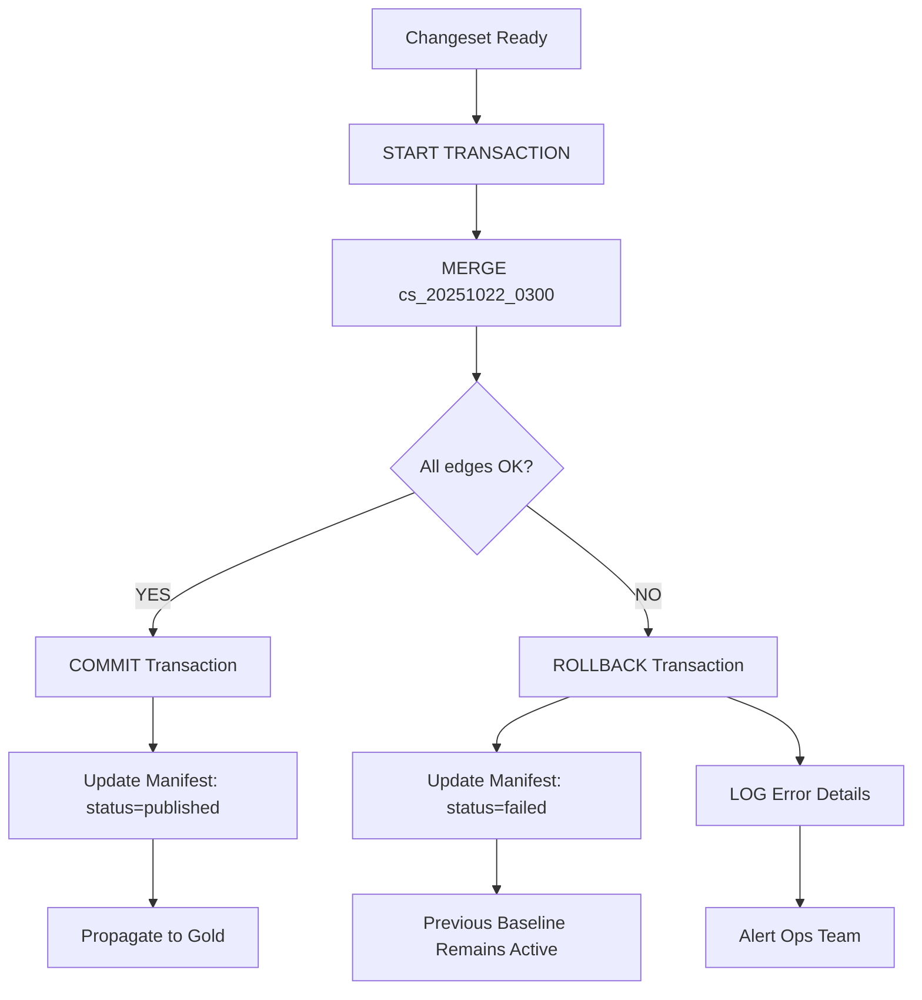
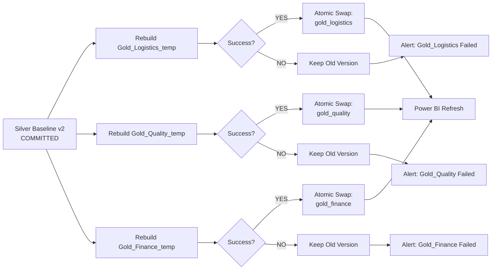

# TierIndex Update Workflow - Workshop Briefing

**Audience:** 🏗️ Architekti, 📊 AICC Data Platform Team
**Last updated:** 2025-10-22
**Status:** Draft (připraven pro workshop 2025-10-29)
**Related:** [CORE Architecture](../../CORE/), [Physical Model](../../physical_model.md), [SLA](../../SLA.md)

---

## Executive Summary

Tento dokument popisuje **realistické** update scénáře pro TierIndex na DAP platformě. Zaměřuje se na **must-have** rozhodnutí pro architekturu.

**Klíčové principy:**
- ✅ **Weekly baseline rebuild** (týdenní plný přepočet grafu)
- ✅ **Monthly full refresh** (měsíční refresh všech dat ze Sayari/DnB)
- ✅ **Sayari notification-driven monitoring** (risk factor changes, 24h cadence)
- ✅ **DnB on-demand verification** (neplatíme za opakované volání)
- ✅ **Internal systems on-demand** (SAP/Kvalita/Logistika - naše dotazy)

**Architektonická rozhodnutí (pro workshop):**
1. **Gold vrstva update propagation** - Cascade vs Parallel?
2. **Partial failure handling** - All-or-nothing vs Best-effort?
3. **Change detection strategy** - What triggers rebuild?

---

## 1. Trigger Mechanisms (Co spustí update?)

### 1.1 Sayari API - Notification-Driven

**Zdroj:** Email od Szilarda (October 2025) - viz `szilard_responses_summary.md`

```yaml
Mechanismus:
  - Sayari poskytuje: "Legacy Notifications API" (GET /v1/notifications/projects/:id)
  - Cadence: 24-hour polling (recommended by Sayari)
  - Obsah: Risk factor changes only (NOT attribute changes like name/address)
  - Scope: 15,000 suppliers v jednom project

Workflow:
  1. Scheduled job (každých 24h): Poll Sayari Notifications API
  2. Response obsahuje: added/removed risk factors per entity
  3. Change detection: Compare vs current TierIndex state
  4. Decision: Trigger baseline rebuild? (if >10% entities affected)
  5. Or: Incremental update? (if <10% entities affected)
```

**Příklad Sayari Notification Response:**
```json
{
  "project_id": "skoda_suppliers",
  "notifications": [
    {
      "entity_id": "sayari://entity/xyz",
      "project_entity_id": "pe_12345",
      "changes": [
        {
          "type": "risk_factor_added",
          "risk_type": "sanctions",
          "severity": "high",
          "timestamp": "2025-10-20T14:30:00Z"
        }
      ]
    }
  ]
}
```

**Implikace pro TierIndex:**
- Notifications API sleduje **pouze risk changes** (ne ownership/structure)
- Pro attribute changes → musíme čekat na monthly bulk data refresh
- Pro ownership changes → Sayari neposkytuje real-time notifications

### 1.2 D&B API - On-Demand Verification

```yaml
Mechanismus:
  - Neplatíme za opakované volání stejného DUNS
  - Strategy: On-demand verification při user query

Workflow:
  1. User query obsahuje DUNS (např. "DUNS 123456789 financial profile")
  2. Orchestrator check: Kdy byl DUNS naposledy fetchnut? (cache timestamp)
  3. Decision:
     - If <7 days ago → Use cached data from TierIndex
     - If >7 days ago → Fresh fetch from D&B API
  4. Fresh fetch → Update TierIndex Silver table
  5. No scheduled jobs (krom monthly baseline rebuild)
```

**Důvod:** D&B financial data se nemění denně → nepotřebujeme proactive polling

### 1.3 Internal Systems - On-Demand Queries

```yaml
SAP (Master Data):
  - Trigger: User query obsahuje vendor_number
  - Mechanismus: Direct SAP API call (naše dotazy, neplatíme)
  - Cache: Store v TierIndex Bronze (7-day TTL)

Kvalita (Incident Data):
  - Trigger: User query "quality issues for supplier X"
  - Mechanismus: Kvalita database query
  - Cache: Not needed (real-time data required)

Logistika (Delivery Performance):
  - Trigger: User query "logistics delays for tier 2"
  - Mechanismus: Logistika database query
  - Cache: Not needed (real-time data required)
```

**Implikace:** Internal systems = real-time, ne batch refresh

### 1.4 Monthly Bulk Data Refresh (Sayari)

```yaml
Mechanismus:
  - Sayari notifikuje clienty: "New bulk data snapshot available"
  - Format: 3.22 TiB Parquet files (entities + relationships)
  - Delivery: Signed URLs nebo SFTP pull
  - Cadence: Monthly

Workflow:
  1. Notification od Sayari: "goya4 snapshot available"
  2. DAP pipeline trigger: Download 3.22 TiB → Bronze layer
  3. Bronze → Silver transformation (full rebuild)
  4. Silver → Gold aggregations (full rebuild)
  5. Publish new baseline: TierIndex.baseline_v2
  6. Archive previous: TierIndex.baseline_v1 (Delta time-travel)
```

---

## 2. Change Detection Workflow

### 2.1 Co očekáváme při change detection?

```yaml
Scenario A: Stejná hodnota (No change)
  Entity před: { "name": "Bosch GmbH", "country": "DE", "tier": 1 }
  Entity po:   { "name": "Bosch GmbH", "country": "DE", "tier": 1 }
  Decision: SKIP (nic se nezměnilo)

Scenario B: Attribute change (Name/Address update)
  Entity před: { "name": "Bosch GmbH", "address": "Stuttgart" }
  Entity po:   { "name": "Robert Bosch GmbH", "address": "Stuttgart" }
  Decision: UPDATE entity attributes (NO tier recalculation)

Scenario C: Relationship change (New edge)
  Před: Bosch → Continental (supply)
  Po:   Bosch → Continental (supply) + Bosch → ZF (supply)
  Decision: ADD edge + RECALCULATE tiers (ZF může být nyní Tier 2)

Scenario D: Ownership change (Tier reclassification)
  Před: Entity X ownership 30% → Tier 1 (>25% threshold)
  Po:   Entity X ownership 20% → Tier 2 (5-25% threshold)
  Decision: UPDATE tier + CASCADE downstream entities
```

### 2.2 Change Detection Algorithm (Simplified)

```python
def detect_changes(new_data: DataFrame, current_baseline: DataFrame):
    """
    Compare new data vs current TierIndex baseline
    Returns: (no_change_count, attribute_updates, edge_changes, tier_reclassifications)
    """
    # 1. Join on entity_id
    comparison = new_data.join(current_baseline, on="entity_id", how="outer")

    # 2. Detect no-change entities (same values)
    no_change = comparison.where(
        (new_data.name == current_baseline.name) &
        (new_data.country == current_baseline.country) &
        (new_data.tier_level == current_baseline.tier_level)
    )

    # 3. Detect attribute updates (name/address changed, tier unchanged)
    attribute_updates = comparison.where(
        (new_data.name != current_baseline.name) |
        (new_data.address != current_baseline.address)
    ).where(
        new_data.tier_level == current_baseline.tier_level
    )

    # 4. Detect tier reclassifications (ownership/supply chain changed)
    tier_changes = comparison.where(
        new_data.tier_level != current_baseline.tier_level
    )

    return (
        no_change.count(),
        attribute_updates.count(),
        tier_changes.count()
    )
```

### 2.3 Decision Logic (Kdy spustit rebuild?)

```yaml
Thresholds:
  - No change: 95%+ → SKIP rebuild (data jsou stabilní)
  - Attribute updates: <5% → INCREMENTAL update (quick)
  - Tier reclassifications: >10% → FULL rebuild (significant change)

Example (15,000 suppliers):
  - 14,500 no change (96.7%) → OK, data stabilní
  - 400 attribute updates (2.7%) → Incremental update
  - 100 tier changes (0.7%) → Incremental update

Decision: Incremental changeset (cs_20251022_0300.json)

Example (15,000 suppliers):
  - 12,000 no change (80%)
  - 500 attribute updates (3.3%)
  - 2,500 tier changes (16.7%) → ⚠️ THRESHOLD EXCEEDED

Decision: Full baseline rebuild (TierIndex.baseline_v2)
```

---

## 3. Impact Analysis (Co to znamená pro TierIndex?)

### 3.1 Definice Impact Analysis

**Otázka z workshop prep:** "Impact analysis PŘED aplikací (Kolik entit překlasifikovat?) - tomuhle nerozumim."

**Vysvětlení:**

**Impact analysis** = Odhad, kolik entit se ZMĚNÍ po aplikaci changesetu.

**Příklad:**
```
Input changeset:
  - Bosch downgrade: Tier 1 → Tier 2 (ownership 30% → 20%)

Cascade effect:
  - Bosch má 50 přímých dodavatelů (Tier 2)
  - Pokud Bosch → Tier 2, pak jejich dodavatelé → Tier 3
  - Impact: 1 direct change + 50 cascade changes = 51 total entities affected

Decision před aplikací:
  - If impact <100 entities → AUTO-APPLY changeset
  - If impact >100 entities → MANUAL REVIEW required (vysoký dopad)
```

**Pro workshop:** Můžeme toto VYNECHAT (nice-to-have, ne must-have).

Důvod:
- PoC/MVP fáze: Aplikujeme changesety bez impact analysis
- Production: Můžeme přidat later (monitoring/alerting)

---

## 4. Partial Failure Handling (Jednoduché řešení)

### 4.1 Scenario: 90/100 edges fail během MERGE operace

**Návrh (jednoduchý):**

```yaml
Strategy: All-or-Nothing (ACID transaction)

Princip:
  - Databricks Delta Lake podporuje ACID transactions
  - Pokud MERGE selže na jakékoliv edge operaci → ROLLBACK ALL
  - No partial commits (vše nebo nic)

Workflow:
  1. START TRANSACTION
  2. MERGE changeset do Silver tables
  3. IF any edge operation fails:
       - LOG error (entity_id, edge_id, error_message)
       - ROLLBACK transaction
       - Mark changeset as "failed" v Manifest
  4. ELSE:
       - COMMIT transaction
       - Mark changeset as "published" v Manifest

Failure handling:
  - Failed changeset → neaplikuje se
  - Previous baseline → zůstává aktivní
  - Alerting: Email/Teams notification pro ops team
  - Manual review: Proč 10 edges selhalo? (data quality issue?)
```

**Výhody:**
- ✅ Jednoduchá implementace (native Delta Lake ACID)
- ✅ No data corruption (konzistence garantována)
- ✅ Jasný failure state (buď úspěch nebo rollback)

**Nevýhody:**
- ⚠️ Pokud 1/100 edges selže → celý changeset zahozen
- ⚠️ Může způsobit data staleness (pokud changesety často failují)

**Pro workshop:** Toto je **dostatečné pro MVP**. Production můžeme přidat:
- Retry logic (3× exponential backoff)
- Dead-letter queue (failed edges → manual review)
- Partial commit + compensation (advanced pattern)

### 4.2 Mermaid Diagram - Failure Handling



---

## 5. Gold Vrstva Update Propagation

### 5.1 Context (z workshop_architect_focus.md)

Workshop brief definoval 2 varianty:

**Varianta A: Cascade Update (Waterfall)**
```
Silver update → Gold_Logistics → Gold_Quality → Gold_Finance
```
- **Pro:** Jednodušší řízení, garantované pořadí
- **Proti:** Pomalé, jeden failed update blokuje ostatní

**Varianta B: Parallel Update** (N-Tier doporučení)
```
Silver update → [Gold_Logistics, Gold_Quality, Gold_Finance] (parallel)
```
- **Pro:** Rychlé, nezávislé refresh jednotlivých Gold vrstev
- **Proti:** Komplexnější řízení, možnost "half-updated" state

### 5.2 Návrh: Standard Parallel Pattern (Delta Lake Views)

**Doporučení pro workshop:**

```yaml
Pattern: Materialized Views + Atomic Swap

Princip:
  - Každá Gold vrstva = Materialized View nad Silver
  - Update = Rebuild view → Atomic swap
  - Power BI čte z "current" pointer (nikdy half-updated state)

Implementation:
  1. Silver update: COMMIT baseline_v2
  2. Gold views rebuild (parallel):
     - gold_logistics_temp ← Query Silver (WHERE tier IN [1,2])
     - gold_quality_temp ← Query Silver (WHERE quality_risk > threshold)
     - gold_finance_temp ← Query Silver (WHERE financial_score < threshold)
  3. Atomic swap (Delta Lake table rename):
     - RENAME gold_logistics → gold_logistics_old
     - RENAME gold_logistics_temp → gold_logistics
  4. Power BI refresh: Reads new "gold_logistics" (atomic, no half-state)

Transaction isolation:
  - Power BI vždy čte COMMITTED data (no dirty reads)
  - If Gold rebuild fails → old version zůstává (no downtime)
  - Each Gold vrstva independent (Quality fail ≠ Logistics fail)
```

**Výhody:**
- ✅ Paralelní rebuild (rychlost)
- ✅ Atomic swap (no half-updated state)
- ✅ Izolace (jeden Gold fail ≠ celkový fail)
- ✅ Standard pattern (používá se v produkčních DAP pipelines)

### 5.3 Mermaid Diagram - Gold Propagation



---

## 6. Weekly Baseline Rebuild (Hlavní Update Scenario)

### 6.1 Workflow (Realistický)

**Trigger:** Sobota 23:00 UTC (weekly schedule)

**Duration:** 4-6 hodin (DAP compute cluster: 2-8 workers)

```mermaid
flowchart TD
    A[Weekly Trigger:<br/>Saturday 23:00 UTC] --> B[Check for New Data]

    B --> C{New Sayari Bulk?}
    C -->|YES| D[Download 3.22 TiB<br/>→ Bronze Layer]
    C -->|NO| E[Use Cached Bronze]

    D --> F[Bronze → Silver<br/>Transformation]
    E --> F

    F --> G[Tier Recalculation<br/>Full Graph Traversal]

    G --> H[Validation Checks]
    H --> I{QA Pass?}

    I -->|YES| J[Publish Baseline v2]
    I -->|NO| K[ROLLBACK<br/>Keep Baseline v1]

    J --> L[Update Manifest:<br/>baseline_v2 + changesets=[]]

    L --> M[Parallel Gold Rebuild]
    M --> N1[Gold_Logistics]
    M --> N2[Gold_Quality]
    M --> N3[Gold_Finance]

    N1 --> O[Power BI Refresh]
    N2 --> O
    N3 --> O

    K --> P[Alert Ops Team:<br/>Rebuild Failed]
```

### 6.2 Steps Detail

```yaml
Step 1: Check for New Data (5 min)
  - Query Sayari: "Is goya4 snapshot available?"
  - Query D&B: "Any monthly credit updates?"
  - Decision: Full rebuild (new data) vs Skip (no new data)

Step 2: Bronze Ingestion (30-60 min)
  - Download Sayari Parquet files (3.22 TiB)
  - Validate checksums (integrity check)
  - Load into Unity Catalog: bronze.sayari_entities, bronze.sayari_relationships
  - Download D&B updates (if any)

Step 3: Silver Transformation (2-3 hours)
  - Normalize entity names (Robert Bosch GmbH vs Bosch GmbH)
  - Deduplicate entities (project_entity_id merging)
  - Edge canonicalization (raw_type → category)
  - Store: silver.ti_entity_s, silver.ti_edge_s

Step 4: Tier Recalculation (1-2 hours)
  - Full graph traversal from Škoda root
  - Apply tier rules (Tier 1/2/3 classification)
  - Store: silver.ti_tier_assignment_s

Step 5: Validation (10-20 min)
  - Smoke checks:
    * Entity count within 5% of previous baseline?
    * Tier distribution similar (e.g., 500 Tier 1, 3000 Tier 2)?
    * No orphan entities (entities without edges)?
  - Checksum validation
  - Business rules (e.g., Bosch MUST be Tier 1)

Step 6: Publish or Rollback (5 min)
  - If validation OK → Publish baseline_v2
  - If validation FAIL → Rollback (keep baseline_v1 active)
  - Update Manifest

Step 7: Gold Propagation (30-45 min)
  - Parallel rebuild: Gold_Logistics, Gold_Quality, Gold_Finance
  - Atomic swap (materialized views)
  - Power BI refresh trigger
```

---

## 7. Monthly Baseline Rebuild (Full Refresh)

**Rozdíl vs Weekly:**

```yaml
Weekly Baseline:
  - Používá CACHED Bronze data (Sayari bulk z minulého měsíce)
  - Pouze Silver → Gold refresh (tier recalculation)
  - Duration: 4-6h (tier traversal je expensive)

Monthly Baseline:
  - NEW Sayari bulk data (3.22 TiB download)
  - Bronze → Silver → Gold full pipeline
  - Duration: 6-8h (includes download + validation)
  - Přidává: New entities, new relationships, attribute updates
```

**Příklad:**
```
Week 1 (Oct 6): Weekly rebuild - cached Bronze, Silver tier refresh
Week 2 (Oct 13): Weekly rebuild - cached Bronze, Silver tier refresh
Week 3 (Oct 20): Weekly rebuild - cached Bronze, Silver tier refresh
Week 4 (Oct 27): Monthly rebuild - NEW Bronze (Sayari goya4), full pipeline
```

**Důvod měsíčního refresh:**
- Sayari poskytuje bulk data **monthly** (ne weekly)
- Attribute changes (name, address) dostupné jen v bulk data
- Weekly rebuild = pouze tier recalculation (ownership se nemění často)

---

## 8. Open Questions pro Architekty (Must-Have Decisions)

### Q1: Gold Vrstva Update Strategy

**Decision Required:**
```
Varianta A: Cascade (Waterfall)
  - Silver → Gold_Logistics → Gold_Quality → Gold_Finance (sequential)

Varianta B: Parallel (Atomic Swap) ⭐ DOPORUČENO
  - Silver → [Gold_Logistics, Gold_Quality, Gold_Finance] (parallel)
  - Atomic swap (no half-updated state)
```

**Criteria:**
- Expected Gold rebuild time? (<30 min OK → Parallel)
- Power BI query volume? (High → need atomic swap)
- Failure tolerance? (Independent Gold vrstvy → Parallel better)

**Recommendation:** Varianta B (Parallel) - standard pattern v production DAP pipelines

---

### Q2: Partial Failure Handling

**Decision Required:**
```
Varianta A: All-or-Nothing (ACID) ⭐ DOPORUČENO pro MVP
  - If 1/100 edges fail → ROLLBACK all
  - Simple, guaranteed consistency

Varianta B: Best-Effort (Partial Commit)
  - If 10/100 edges fail → COMMIT 90, log 10
  - Complex, requires dead-letter queue + manual review
```

**Criteria:**
- Data quality expectations? (High → All-or-Nothing)
- Failure frequency? (Rare → All-or-Nothing OK)
- Ops team capacity? (Small → Simple pattern better)

**Recommendation:** Varianta A pro MVP, evolve to B v production (pokud potřebné)

---

### Q3: Change Detection Threshold (Kdy trigger rebuild?)

**Decision Required:**
```
Threshold for Full Baseline Rebuild:
  - Option A: >10% entities with tier changes
  - Option B: >5% entities with tier changes (more sensitive)
  - Option C: Always weekly (ignore change magnitude)
```

**Criteria:**
- Baseline rebuild cost? (€8-32 per run → optimize frequency)
- Data freshness SLA? (<1 week → weekly rebuild mandatory)
- Risk tolerance? (High risk → lower threshold, more rebuilds)

**Recommendation:** Option C (Always weekly) - simplest, meets SLA (<1 week freshness)

---

### Q4: Sayari Notifications API Usage (Nice-to-Have for MVP)

**Decision Required:**
```
Varianta A: Use Notifications API (24h polling) ⭐ DOPORUČENO
  - Proactive risk monitoring
  - Incremental updates between baselines

Varianta B: Skip Notifications (weekly baseline only)
  - Simpler (no polling logic)
  - But: Risk factor latency up to 7 days
```

**Criteria:**
- Risk monitoring SLA? (<24h → Use Notifications)
- Ops complexity acceptable? (Polling + parsing → requires monitoring)
- Incremental updates needed? (Yes → Use Notifications)

**Recommendation:** Varianta A pro production, Varianta B OK pro PoC/MVP

---

## 9. Summary - Must-Have Decisions for Workshop

| Decision                 | Options                       | Doporučení                     | Priority        |
| ------------------------ | ----------------------------- | ------------------------------ | --------------- |
| **Gold Update Pattern**  | Cascade vs Parallel           | ⭐ Parallel (atomic swap)       | 🔴 MUST DECIDE   |
| **Failure Handling**     | All-or-Nothing vs Best-Effort | ⭐ All-or-Nothing (MVP)         | 🔴 MUST DECIDE   |
| **Rebuild Frequency**    | Weekly vs Bi-weekly           | ⭐ Weekly (fixed schedule)      | 🟡 SHOULD DECIDE |
| **Change Threshold**     | 5% vs 10% vs Fixed            | ⭐ Fixed (always weekly)        | 🟢 NICE TO HAVE  |
| **Sayari Notifications** | Use vs Skip                   | ⭐ Use (production), Skip (MVP) | 🟢 NICE TO HAVE  |

---

## Related Documents

**Core Architecture:**
- [CORE/01_core_concepts.md](../../CORE/01_core_concepts.md) - Baseline + Changeset architecture
- [CORE/03_core_data_model.md](../../CORE/03_core_data_model.md) - Tier classification rules
- [physical_model.md](../../physical_model.md) - Silver/Gold/API layers

**Communication:**
- [szilard_responses_summary.md](../szilard_responses_summary.md) - Sayari integration details
- [workshop_architect_focus.md](./workshop_architect_focus.md) - Workshop critical decisions

**SLA:**
- [SLA.md](../../SLA.md) - Freshness targets (<1 week baseline)

---

**Next Steps:**
1. ✅ Review tento dokument před workshopem (15-20 min read)
2. ⏳ Workshop 2025-10-29: Decide Q1-Q2 (Gold pattern, failure handling)
3. ⏳ Po schválení: Přesunout do `scrum/architecture/` + implementovat

**Owner:** Marek Minarovic
**Reviewers:** Honza (Architect), Jarmila (Business), AICC Data Platform Team
**Status:** 📝 Draft (čeká na workshop)
