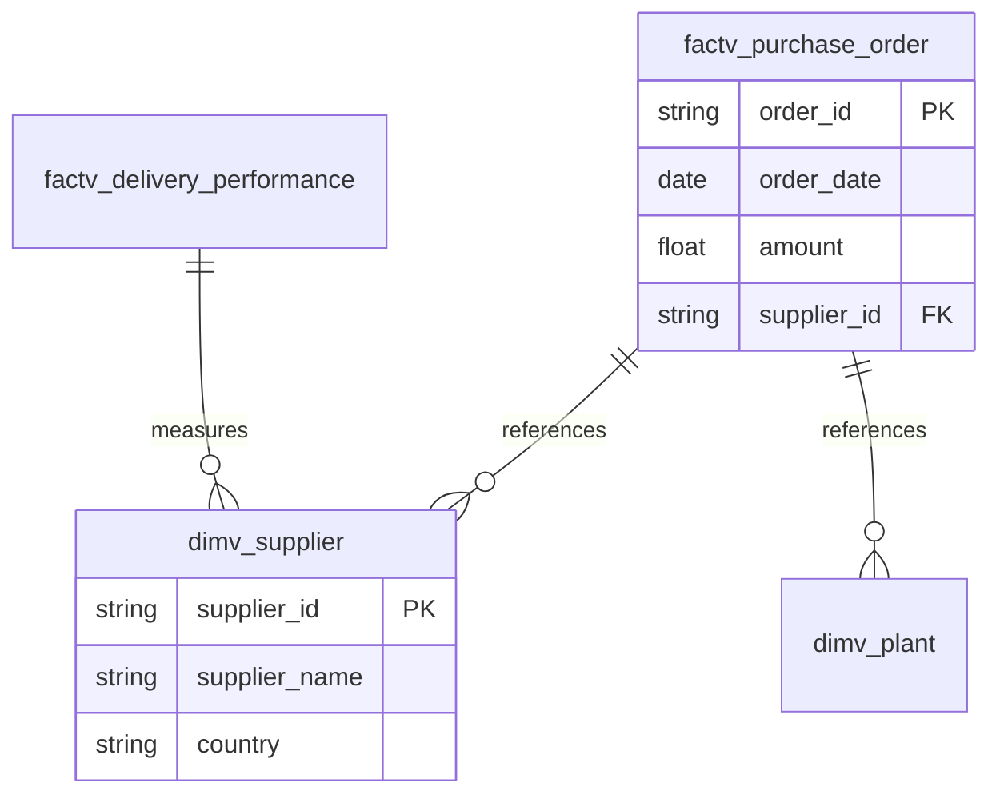

# Backend WebSocket Contract

> **Issue:** WebSocket: Add diagram, canvas_trigger, and metrics to agent response
> **Priority:** High - Frontend is production-ready but Canvas stays empty without this
> **Labels:** `enhancement`, `backend`, `websocket`

## Summary

Frontend is ready to display ER diagrams and metrics, but backend WebSocket handler doesn't include `diagram`, `canvas_trigger`, or `metrics` fields in the response.

## Current Behavior

```json
{
  "type": "agent",
  "content": "There are 2 FACT tables...",
  "timestamp": "2025-12-02T09:50:05.835093"
}
```

## Expected Behavior

```json
{
  "type": "agent",
  "content": "There are 2 FACT tables in the dm_bs_purchase schema...",
  "diagram": "erDiagram\n    factv_purchase_order ||--o{ dimv_supplier : references\n    factv_delivery_performance ||--o{ dimv_plant : references",
  "canvas_trigger": {
    "action": "switch_view",
    "view_type": "er_diagram",
    "reason": "Showing ER diagram for FACT tables",
    "confidence": 0.85
  },
  "metrics": {
    "total_tables": 2,
    "total_columns": 16,
    "facts_count": 2,
    "dimensions_count": 0,
    "schema_name": "dm_bs_purchase"
  },
  "timestamp": "2025-12-02T09:50:05.835093"
}
```

---

## Message Types

| Type            | Description             | When to use                |
| --------------- | ----------------------- | -------------------------- |
| `user`          | Echo of user message    | After receiving user input |
| `agent_partial` | Streaming chunk         | During LLM generation      |
| `agent`         | Final complete response | After LLM completes        |
| `tool`          | Tool execution status   | During tool calls          |
| `error`         | Error message           | On failure                 |

---

## Python Pydantic Models

```python
from pydantic import BaseModel
from typing import Optional, Literal
from datetime import datetime

class CanvasTrigger(BaseModel):
    """Controls frontend view switching."""
    action: Literal["switch_view", "new_analysis", "none"]
    view_type: Optional[Literal["er_diagram", "table_list", "relationship_graph"]] = None
    entity_name: Optional[str] = None
    query: Optional[str] = None
    reason: str
    confidence: Optional[float] = None  # 0.0-1.0, FE auto-switches if >= 0.6

class PipelineMetrics(BaseModel):
    """Metadata statistics for the MetricsHeader component."""
    total_tables: int
    total_columns: int
    facts_count: int
    dimensions_count: int
    quality_score: Optional[int] = None  # 0-100
    relationships_count: Optional[int] = None
    schema_name: Optional[str] = None
    as_of: Optional[datetime] = None
    is_stale: Optional[bool] = None  # True if data older than 1 hour

class WebSocketMessage(BaseModel):
    """WebSocket message sent to frontend."""
    type: Literal["user", "agent", "agent_partial", "tool", "error"]
    content: str
    tool_name: Optional[str] = None
    diagram: Optional[str] = None  # Mermaid ER diagram syntax
    canvas_trigger: Optional[CanvasTrigger] = None
    metrics: Optional[PipelineMetrics] = None
    timestamp: Optional[datetime] = None
```

---

## CanvasTrigger Behavior

### Confidence Threshold

Frontend uses **0.6 (60%)** as the auto-switch threshold:

| Confidence  | Behavior                                   |
| ----------- | ------------------------------------------ |
| `>= 0.6`    | Auto-switches to the specified view        |
| `< 0.6`     | Shows confirmation chip, user must approve |
| View pinned | Always shows confirmation chip             |

### Actions

| Action         | Description                   | Required Fields                     |
| -------------- | ----------------------------- | ----------------------------------- |
| `switch_view`  | Change Canvas view            | `view_type`, `reason`, `confidence` |
| `new_analysis` | Trigger new query             | `query`, `reason`                   |
| `none`         | No action (graceful fallback) | `reason`                            |

### View Types

- `er_diagram` - Mermaid ER diagram (default)
- `table_list` - Table listing view
- `relationship_graph` - Relationship visualization

---

## Mermaid Diagram Format

The frontend uses [Mermaid.js](https://mermaid.js.org/) to render ER diagrams.

### Example



### Relationship Syntax

```
ENTITY1 CARDINALITY ENTITY2 : label
```

| Symbol | Meaning      |
| ------ | ------------ |
| `\|\|` | Exactly one  |
| `}o`   | Zero or more |
| `\|{`  | One or more  |
| `o\|`  | Zero or one  |

---

## Example Messages

### Streaming Response

```json
{
  "type": "agent_partial",
  "content": "Analyzing the dm_bs_purchase schema..."
}
```

### Final Response with Diagram

```json
{
  "type": "agent",
  "content": "Found 2 FACT tables: factv_purchase_order and factv_delivery_performance. The diagram shows their relationships with dimension tables.",
  "diagram": "erDiagram\n    factv_purchase_order ||--o{ dimv_supplier : references\n    factv_purchase_order ||--o{ dimv_plant : located_at\n    factv_delivery_performance ||--o{ dimv_supplier : measures",
  "canvas_trigger": {
    "action": "switch_view",
    "view_type": "er_diagram",
    "reason": "Displaying ER diagram for purchase schema",
    "confidence": 0.9
  },
  "metrics": {
    "total_tables": 5,
    "total_columns": 42,
    "facts_count": 2,
    "dimensions_count": 3,
    "quality_score": 87,
    "relationships_count": 4,
    "schema_name": "dm_bs_purchase",
    "as_of": "2025-12-02T10:30:00Z",
    "is_stale": false
  },
  "timestamp": "2025-12-02T10:30:05.123456"
}
```

### Tool Execution

```json
{
  "type": "tool",
  "content": "Running data quality check on factv_purchase_order...",
  "tool_name": "quality_validator"
}
```

### Error

```json
{
  "type": "error",
  "content": "Failed to connect to metadata database: connection timeout",
  "timestamp": "2025-12-02T10:30:05.123456"
}
```

---

## Frontend Code References

| File                                                                | Purpose                             |
| ------------------------------------------------------------------- | ----------------------------------- |
| [useWebSocket.ts](../frontend/src/hooks/useWebSocket.ts)            | Parses `data.diagram` at line 56-58 |
| [Canvas.tsx](../frontend/src/components/Canvas.tsx)                 | Renders diagram and metrics         |
| [useCanvasTrigger.ts](../frontend/src/hooks/useCanvasTrigger.ts)    | Handles view switching logic        |
| [MermaidDiagram.tsx](../frontend/src/components/MermaidDiagram.tsx) | Renders Mermaid syntax              |
| [MetricsHeader.tsx](../frontend/src/components/MetricsHeader.tsx)   | Displays pipeline metrics           |

---

## Acceptance Criteria

- [ ] `agent` messages include `diagram` field when relevant (Mermaid syntax)
- [ ] `agent` messages include `canvas_trigger` with action, view_type, reason, confidence
- [ ] `agent` messages include `metrics` when table data is available
- [ ] Streaming `agent_partial` messages work correctly (no new fields needed)
- [ ] `error` messages are properly formatted

---

## Related

- **Frontend repo:** https://github.com/minarovic/front_archi-agent
- **Backend repo:** https://github.com/minarovic/archi-agent
- **Railway deployment:** https://practical-quietude-production.up.railway.app
