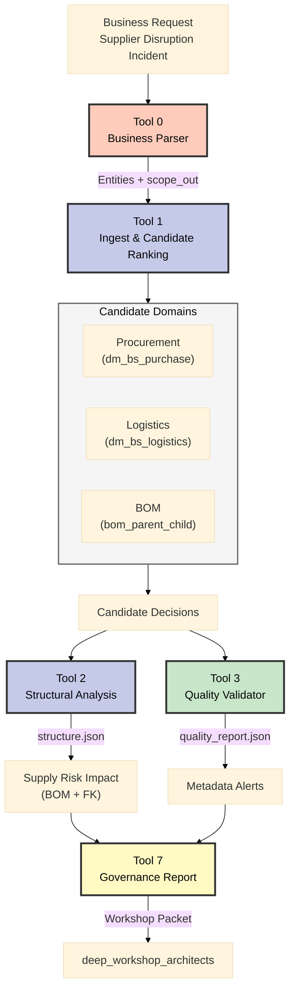

# Deep Workshop – Architect Enablement Brief

**Datum:** 2025-11-05
**Audience:** `deep_workshop_architects`
**Cíl:** Ukázat, jak Tool 0–3 MCOP pipeline podporuje rozhodování v incidentním scénáři „Supplier Disruption“ a jak s tím souvisí výstupy jako `data/tool1/filtered_dataset.json`.

---

## 1. Proč MCOP pro architekty
- **End-to-end průhlednost:** Tool 0 překládá business vstup (např. incident dodavatele) do strukturovaného kontextu, který architekti znají z backlogu.
- **Řízené propojení domén:** Tool 1 přiděluje kandidátní datamarty napříč procurement, logistikou a BOM – přesně ty domény, které budou na workshopu řešit.
- **Strukturální jistota:** Tool 2 ověřuje, zda vybrané tabulky skutečně drží vztahy (FK, hierarchie), takže architekt ví, jaké integrace jsou realistické.
- **Kvalita & governance:** Tool 3 hlídá kritická metadata (popisy, owner, security), což je klíčové pro enterprise architekturu a auditní stopu.

---

## 2. Signální výstupy pro workshop

### 2.1 `data/tool1/filtered_dataset.json`
- **Použití:** rychle ukazuje, jaké datamarty dostanou jednotlivé business entity z Tool 0.
- **Co sledovat:** vysoké confidence pro klíčové entity, sporné hodnoty (např. 0.62 pro `Delivery Performance`) otevřou diskusi, zda přidat logistický datamart.
- **Workshop tip:** promítnout konkrétní mappingy, probrat rationále a nechat architekty doplnit alternativní kandidáty.

### 2.2 `data/tool2/structure.json`
- Zviditelňuje fakt/dimenzní model a BOM hierarchie, tedy reálné vazby dodavatel → komponenta → produkt.

### 2.3 `scrum/artifacts/<datum>_incident-drill.json`
- Auditní log pro QA tým – důkaz, že incident drill prošel všemi kroky a Tool 3 nezvedl kritickou chybu.

---

## 3. Incident Storyline (Supplier Disruption + Compliance)
- **Trigger (T0):** 05:45 CET – dodavatel *NordMetal GmbH* oznamuje 14denní odstávku galvanizační linky → 28 % komponent převodovek v ohrožení.
- **Business dopad (T1):** Procurement žádá rychlé vyhodnocení alternativ, logistika hlásí zásoby na 6 dní; BOM tým potřebuje vědět, které projekty se zastaví.
- **Governance tlak (T2):** Compliance varuje, že náhradní dodavatel musí mít platné audity a RLS profily; bez toho nelze převést objednávky.
- **Akce MCOP (T3):** Spuštěn incidentní run – Tool 0–3 + auditní logy → rozhodovací podklady pro architekty během 30 minut.
- **Po incidentu (T4):** Výstupy se ukládají do backlogu (SCR‑07) a do governance boardu pro lessons learned.

---

## 4. Role & Zodpovědnosti (RACI)
| Role | Odpovědnost | R | A | C | I |
|------|-------------|---|---|---|---|
| Enterprise Architect | Řízení workshopu, rozhodnutí o arch. změnách | ✅ | ✅ | ✅ | ✅ |
| Data Steward (Procurement) | Validace datových zdrojů, quality flags | ✅ |  | ✅ | ✅ |
| Incident Manager | Eskalace incidentu, koordinace SLA |  | ✅ | ✅ | ✅ |
| MCOP Orchestrator Owner | Spuštění Tool 0–3, příprava artefaktů | ✅ |  | ✅ |  |
| Security & Compliance Lead | Kontrola `securityClassification`, RLS návrhů |  | ✅ | ✅ | ✅ |
| Workshop Scribe | Zápis rozhodnutí, action tracker | ✅ |  |  | ✅ |

Legenda: R = Responsible, A = Accountable, C = Consulted, I = Informed

---

## 5. Top Quality Flags z `quality_report.json`
- **Chybějící popisy (description coverage 5.8 %):** Nutné doplnit pro kritické tabulky `dimv_supplier`, `factv_purchase_order_item`; bez nich Tool 1/2 ztrácí sémantiku.
- **Owner/Steward mezery (8.3 % coverage):** U tabulek bez `ownerInSource` nelze při incidentu rychle eskalovat → požadavek na Data Stewarda.
- **Security classification (<1 % coverage):** Compliance nemůže schválit přístup náhradním dodavatelům; doporučit spuštění Tool 4 (Security Analyzer) hned po MVP.

---

## 6. Incident Drill Flow (Mermaid)

---

## 7. Doporučený workshopový průběh
1. **Set the scene:** Přečíst business dokument s incidentem, zvýraznit scope_in/out.
2. **Dive into Tool 1 output:** Vysvětlit logiku confidence skóre a rationále pro procurement/logistiku/BOM.
3. **Structure review:** Přes `structure.json` ukázat, jak se BOM hierarchie propisuje do analýzy dopadu.
4. **Quality checks:** Probrat varování z `quality_report.json`, zejména pokud chybí owner nebo security classification.
5. **Arch návrhy:** Diskutovat, kde přidat fallback data nebo další validace; výsledky zapsat do backlogu.

---

## 8. Storyboard pro prezentaci
1. **Intro (Why now?)** – jednoslajdová rekapitulace incidentu + mise MCOP.
2. **Use Case Detail** – timeline incidentu, hlavní business otázky (alternativní dodavatel, dopad na projekty).
3. **Pipeline Walkthrough** – vizualizace Tool 0–3, klíčové artefakty (`filtered_dataset.json`, `structure.json`, `quality_report.json`).
4. **Governance & Quality** – quality flags, compliance požadavky, auditní stopy.
5. **Roadmap & Next Steps** – Tool 4–6, backlog stories SCR‑06/05/07/09, akční body.
6. **Q&A + Action Tracker** – shrnutí rozhodnutí, RACI potvrzení, zápis follow-up úkolů.

---

### 9. Shrnutí
Ano, Tool 0–3 pipeline poskytuje architektům hmatatelný rámec pro deep workshop: od business zadání přes výběr dat až po kontrolu kvality. Tento balíček jim dá jasnou linku, jak incidentní scénář řešit bez toho, aby zůstali u čistě „meta“ debat.
