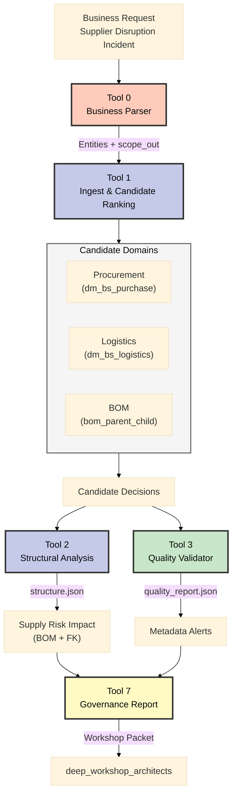

# MCOP Architect Workshop – Master Brief

**Datum:** 2025-11-06  
**Audience:** `deep_workshop_architects`, Sonnet 4.5 reviewers  
**Účel:** Jediný referenční dokument obsahující kontext, incidentní scénáře, backlog priority, governance podklady a materiály pro workshop.

---

## 0. Rychlé shrnutí
- **Mise:** MCOP spojuje business požadavky s technickými metadaty (Collibra, Databricks UC, SAP) pomocí LangGraph orchestrátoru (Tool 0–3/7 hotovo; Tool 4–6 roadmap Q1/Q2 2026).
- **Showcase:** Primární incident „Supplier Disruption + Compliance Escalation“, alternativní incident „Port Strike & Spare Parts Allocation“.
- **Priority backlog:** SCR‑06 (Sub-supplier mapping), SCR‑05 (SPOF detection), SCR‑07 (Crisis impact), SCR‑09 (What-if modelling).
- **Klíčové artefakty:** `data/tool1/filtered_dataset.json`, `data/tool2/structure.json`, `scrum/artifacts/<datum>_incident-drill.json`, `docs_langgraph/mcop-architecture.md` (sekce 11), `docs_langgraph/tool4-6_scenario_brief.md`.
- **Workshop podpora:** Incident timeline, RACI, quality flags, slide skeleton, action tracker šablona.

---

## 1. Kontext & Cíl projektu
- **Jasná mise:** MCOP automatizuje mapování business požadavků na technické artefakty → snižuje manuální práci a zrychluje krizové rozhodování.
- **Cílová skupina:** Enterprise/solution architekti, data stewardi, incident manažeři, compliance.
- **Stav roadmapy:** MVP (Tool 0–3, Tool 7) hotové; Tool 4–6 plán (Security Analyzer, ER diagram, Script Generator).
- **Závislosti:** Collibra metadata exporty, Databricks Unity Catalog, SAP BOM, Sayari & DnB API, Azure SQL, Azure OpenAI (deployment `test-gpt-5-mini`).

**Referenční dokumenty:**  
`docs_langgraph/mcop-architecture.md`, `docs_langgraph/tool4-6_scenario_brief.md`, `scrum/backlog/mcop-mvp-v1-scope.md`, `scrum/backlog/mcop-project-overview.md`.

---

## 2. Prioritní backlog stories (Deep Dive fokus)

| Story | Popis & přínos | Stav | Klíčové závislosti | Poznámky |
|-------|----------------|------|--------------------|----------|
| SCR‑20250918‑06 | Mapping & Verification of Sub-Supplier Chains (N-tier transparentnost) | planned | Sayari API, graph UI, ownership enrichment | Základ pro incident drill i SPOF |
| SCR‑20250918‑05 | Detection of Hidden Risk Accumulation (SPOF) | planned | SCR‑06, calculated metrics | Python algoritmus hotový (viz `calculated_metrics_specs.md`) |
| SCR‑20250918‑07 | Immediate Impact Analysis in Crisis | planned | SCR‑05, SCR‑06, alert infra | Napřímo odpovídá incidentnímu scénáři (<5 min SLA) |
| SCR‑20250918‑09 | What-If Scenario Modeling | planned | SCR‑07, Tool 5/6 roadmap | Přechod z reaktivního do proaktivního módu |

**Podpůrné analýzy:** `backlog_nepuvodni/implementation_roadmap.md`, `backlog_nepuvodni/BACKLOG_ANALYSIS_SUMMARY.md`, `backlog_nepuvodni/api_endpoint_mapping.md`, `backlog_nepuvodni/calculated_metrics_specs.md`.

---

## 3. Incident Storyline A – Supplier Disruption + Compliance (Primární showcase)

### 3.1 Timeline (T0–T4)
- **T0 – 05:45 CET:** *NordMetal GmbH* oznamuje 14denní odstávku galvanizační linky → ohrožení 28 % převodovek.
- **T1 – 06:00:** Procurement žádá alternativy; logistika potvrzuje zásoby na 6 dní; BOM tým potřebuje seznam projektů k zastavení.
- **T2 – 06:05:** Compliance upozorňuje, že přesměrování objednávek vyžaduje platné audity & RLS profily pro nové dodavatele.
- **T3 – 06:10:** MCOP spuštěn (Tool 0–3) → generuje mapping, strukturu, quality report, audit log.
- **T4 – 06:40:** Artefakty předány architektům; rozhodnutí a mitigace zapsány do backlogu (SCR‑07) a governance boardu.

### 3.2 Role & Zodpovědnosti (RACI)

| Role | Hlavní úkol | R | A | C | I |
|------|-------------|---|---|---|---|
| Enterprise Architect | Facilitace workshopu, rozhodnutí o řešení | ✅ | ✅ | ✅ | ✅ |
| Data Steward (Procurement) | Validace dat/quality flags, doplnění popisů | ✅ |  | ✅ | ✅ |
| Incident Manager | Koordinace SLA, eskalace |  | ✅ | ✅ | ✅ |
| MCOP Orchestrator Owner | Spuštění Tool 0–3, příprava artefaktů | ✅ |  | ✅ |  |
| Security & Compliance Lead | Kontrola `securityClassification`, návrh RLS |  | ✅ | ✅ | ✅ |
| Workshop Scribe | Zápis rozhodnutí a action tracker | ✅ |  |  | ✅ |

(Legenda: R = Responsible, A = Accountable, C = Consulted, I = Informed)

### 3.3 Quality Flags z `quality_report.json`
1. **Chybějící popisy (`description` coverage 5.8 %)** – ovlivňuje `dimv_supplier`, `factv_purchase_order_item`; doporučit doplnění před ostrým nasazením.
2. **Chybějící owner (`ownerInSource` coverage 8.3 %)** – bez vlastníků nelze rychle eskalovat; definovat data stewardship plan.
3. **Security classification (<1 %)** – compliance nemá vstup pro RLS; podpořit prioritizaci Tool 4 (Security Analyzer).

### 3.4 MCOP Pipeline (Mermaid)

### 3.5 Slide Skeleton (Jen incidentní část)
1. **Slide „Incident Timeline“** – body T0–T4 + hlavní dopad na provoz.
2. **Slide „Candidate Mapping & Confidence“** – výtah z `filtered_dataset.json` (entity → datamart → confidence).
3. **Slide „Structural Impact“** – screenshot/diagram z `structure.json` (BOM uzly, ovlivněné projekty).
4. **Slide „Quality & Compliance Flags“** – tabulka tří hlavních issue + doporučené kroky.
5. **Slide „Decision Summary“** – přehled doporučení (alternativní dodavatel, RLS, backlog tasks).

*(Intro/outro slidy se nyní neřeší – pouze incidentní obsah.)*

### 3.6 Action Tracker (template)

| # | Rozhodnutí / úkol | Owner | Due date | Stav | Poznámka |
|---|-------------------|-------|----------|------|----------|
| 1 | Zkontrolovat `dimv_supplier` popisy a doplnit chybějící metadata | Data Steward | 2025-11-09 | ☐ | Quality flag #1 |
| 2 | Připravit RLS návrh pro náhradní dodavatele | Security Lead | 2025-11-08 | ☐ | Tool 4 pilot |
| 3 | Zapsat follow-up story pro Tool 6 skripty (incident replay) | Enterprise Architect | 2025-11-12 | ☐ | SCR‑07 update |
| 4 | ... | ... | ... | ... | ... |

---

## 4. Incident Storyline B – Port Strike & Spare Parts Allocation (Alternativní showcase)
- **Trigger:** Stávka v přístavu Bremerhaven blokuje kontejnery se servisními díly pro EV flotilu; SLA se blíží porušení do 48 h.
- **Business otázky:** Které servisy a projekty budou zasažené? Máme lokální zásoby nebo alternativní distribuci? Jaké kontrakty je třeba aktivovat?
- **MCOP reakce:**  
  - Tool 0 parser načte nový request („Port Strike Allocation“),  
  - Tool 1 prioritizuje logistické datamarty (`dm_bs_logistics`, `inventory_snapshot`),  
  - Tool 2 identifikuje vazby mezi skladovými uzly a zákaznickými projekty (využití BOM/HS mapping),  
  - Tool 3 ověřuje kvalitu logistických dat (chybějící statusy, RLS).  
- **Specifika:** vyžaduje `BOM_HS_INTEGRATION_GAP_ANALYSIS.md` a SCR‑09 (What-if) pro simulaci redistribuce.  
- **Rozdíl oproti incidentu A:** Fokus na logistiku & servis (nikoli čistě procurement); ukazuje, že MCOP zvládne multi-domain incidenty.

*(Pro tento alternativní incident se zatím nepřipravují dedikované slidy/action tracker.)*

---

## 5. Workshop Flow (doporučení)
1. **Set the scene:** Představit incident (NordMetal) + scope_in/out z business dokumentu.
2. **Tool 1 deep dive:** Projít confidence skóre a rationále pro procurement/logistika/BOM.
3. **Tool 2 review:** Ověřit BOM hierarchii a dopad na projekty.
4. **Tool 3 governance:** Diskutovat quality flags a compliance požadavky.
5. **Decision & backlog:** Potvrdit mitigace, zapsat do action trackeru, propojit na SCR‑07/05/06/09.

---

## 6. Artefakty & Materiály k ruce
- **JSON výstupy:** `data/tool1/filtered_dataset.json`, `data/tool2/structure.json`, `scrum/artifacts/2025-11-03_datamarts-dq-audit.json`, `scrum/artifacts/<datum>_incident-drill.json`.
- **Dokumentace:** `docs_langgraph/mcop-architecture.md`, `docs_langgraph/tool4-6_scenario_brief.md`, `docs_langgraph/tool4-6_scenario_brief.md`, `docs_langgraph/deep_workshop_architects_master.md` (tento dokument).
- **Backlog:** `scrum/backlog/tool3-quality-validator.md`, `backlog_nepuvodni/implementation_roadmap.md`, `backlog_nepuvodni/BACKLOG_ANALYSIS_SUMMARY.md`.
- **Notebooks:** `notebooks/tool0_parser_demo.ipynb`, `notebooks/tool1_ingest_demo.ipynb`, `notebooks/tool2_structure_demo.ipynb`, `notebooks/tool3_quality_demo.ipynb`.

---

## 7. Sonnet 4.5 Review Checklist (výtažek)
- Je mise, cílovka a fáze projektu jasně popsána?
- Pokrývají materiály priority backlogu (SCR‑06/05/07/09) včetně závislostí?
- Obsahuje brief kvalitativní signály z Tool 3 (quality flags) a jasné mitigace?
- Máme připravené artefakty pro demo (JSON, diagramy, audit log)?
- Jsou definované RACI role a akční kroky pro rozhodnutí architektů?
- Ukazuje dokument, proč jsou Tool 4–6 kritické (security, ER diagram, skripty)?

---

## 8. Follow-up Po Workshopu
1. **Konsolidace výstupů:** Zapsat vyplněný action tracker do `scrum/artifacts/<datum>_architect-workshop.json`.
2. **Update backlogu:** Přidat/aktualizovat stories podle rozhodnutí (např. Tool 4 pilot, doplnění popisů).
3. **Governance board:** Předat shrnutí (quality flags, mitigace, timeline).
4. **Lessons learned:** Doplnit sekci FAQ/Checklist v další iteraci tohoto dokumentu.

---

## 9. Kontakty & odpovědnosti
- **Enterprise Architect (Owner):** Marek Minarovic – vedení workshopu.
- **MCOP Orchestrator Owner:** (viz `mcop-architecture.md`, sekce Deployment & Runtime) – technická příprava.
- **Data Steward (Procurement):** [TBD] – doplnění metadata popisů.
- **Security & Compliance Lead:** [TBD] – validace RLS a security classification.
- **Workshop Scribe:** [TBD] – aktualizace action trackeru.

---

> Tento dokument nahrazuje samostatné poznámky z `deep_workshop_architects_brief.md`, `deep_workshop_architects_brief-ideas.md` a `SONNET_45_REVIEW_CHECKLIST.md` pro účely přípravy workshopu. Originální soubory lze ponechat jako archivní reference.
