# Metadata Copilot (MCOP) - Detailní Architektura & Workflow

**Verze:** 1.0.0 (MVP)
**Datum:** 2 listopad 2025
**Autor:** MCOP Development Team

---

## 📋 Obsah

1. [Přehled systému](#1-přehled-systému)
2. [Vysokoúrovňová architektura](#2-vysokoúrovňová-architektura)
3. [Tool 0 - Business Request Parser](#3-tool-0---business-request-parser)
4. [Tool 1 - Data Ingest & Filtering](#4-tool-1---data-ingest--filtering)
5. [Tool 2 - Structural Analysis](#5-tool-2---structural-analysis)
6. [Tool 3 - Quality Validator](#6-tool-3---quality-validator)
7. [Tool 7 - Governance Report Generator](#7-tool-7---governance-report-generator)
8. [Orchestrator - LangGraph MVP Workflow](#8-orchestrator---langgraph-mvp-workflow)
9. [Datové toky a formáty](#9-datové-toky-a-formáty)
10. [Deployment & Runtime](#10-deployment--runtime)

---

## 1. Přehled systému

### 1.1 Účel

Metadata Copilot (MCOP) je LangGraph-based AI agent pro **automatizovanou analýzu datových katalogů**. Propojuje **business požadavky** (co žadatel potřebuje) s **technickou realitou** (co existuje v Collibra/Databricks/SAP metadatech).

### 1.2 Klíčové funkce MVP

- ✅ Parsování standardizovaných business dokumentů (Tool 0)
- ✅ Ingest & filtrování metadat podle rozsahu (Tool 1)
- ✅ Klasifikace faktů/dimenzí + detekce vztahů (Tool 2)
- ✅ Validace kvality metadat (Tool 3)
- ✅ Generování governance reportů (Tool 7)

### 1.3 Hlavní výstupy

| Artefakt                | Formát   | Účel                                                  |
| ----------------------- | -------- | ----------------------------------------------------- |
| `structure.json`        | JSON     | Strukturovaná reprezentace faktů, dimenzí, hierarchií |
| `governance_report.md`  | Markdown | Soulad/nesoulad s business požadavky, kvalita metadat |
| `filtered_dataset.json` | JSON     | Entity-to-candidate mappings (meziprodukt Tool 1)     |

---

## 2. Vysokoúrovňová architektura

### 2.1 Celkový systémový diagram

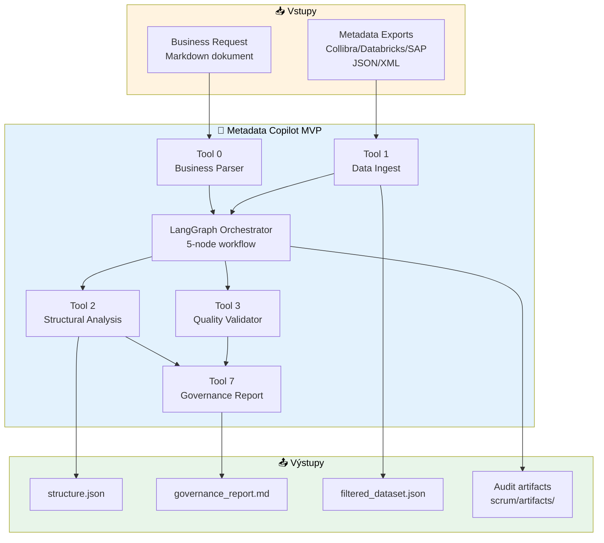

### 2.2 Komponenty podle typu

| Typ              | Nástroj      | Technologie              | LLM?                    |
| ---------------- | ------------ | ------------------------ | ----------------------- |
| **Parser**       | Tool 0       | OpenAI SDK + Pydantic    | ✅ Ano (test-gpt-5-mini) |
| **ETL**          | Tool 1       | LangGraph (5 nodes)      | ✅ Ano (2x LLM nodes)    |
| **Classifier**   | Tool 2       | LangGraph (5 nodes)      | ✅ Ano (1x LLM node)     |
| **Validator**    | Tool 3       | Python (deterministický) | ❌ Ne                    |
| **Generator**    | Tool 7       | LangChain + RAG          | ✅ Ano (test-gpt-5-mini) |
| **Orchestrator** | MVP Workflow | LangGraph StateGraph     | ⚙️ Mixed                 |

> **Azure konfigurace LLM:** Všechny LLM uzly běží přes Azure OpenAI deployment `test-gpt-5-mini`. Nasazení vyžaduje proměnné prostředí `AZURE_OPENAI_ENDPOINT`, `AZURE_OPENAI_API_KEY`, `AZURE_OPENAI_DEPLOYMENT_NAME` a `AZURE_OPENAI_API_VERSION` načtené z `.env`.

---

## 3. Tool 0 - Business Request Parser

### 3.1 Účel

Parsuje standardizované Markdown business dokumenty a extrahuje strukturovaný kontext (entities, cíle, scope_in/out).

### 3.2 Architektura

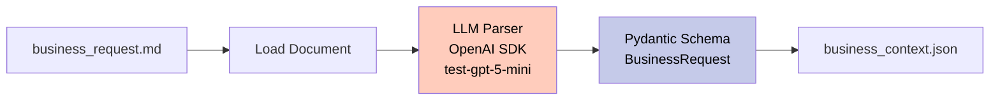

### 3.3 Input Schema (Markdown)

```markdown
# Požadavek na datový projekt

**Metadata:**
- Projekt: Analýza nákupu
- Zadavatel: Jan Novák
- Datum: 2025-11-01

## Cíl projektu
Analyzovat nákupní objednávky za Q3 2025...

## Rozsah (Scope In)
- BS Nákup (dm_bs_purchase)
- Dodavatelé, objednávky, položky

## Mimo rozsah (Scope Out)
- HR data, Real-time monitoring

## Klíčové entity
- Dodavatelé (Suppliers)
- Nákupní objednávky (Purchase Orders)
- Materiály (Materials)
```

### 3.4 Output Schema (Pydantic)

```python
class ProjectMetadata(BaseModel):
    project_name: str = Field(description="Název projektu")
    sponsor: str = Field(description="Zadavatel")
    submitted_at: str = Field(description="Datum v ISO 8601")

class BusinessRequest(BaseModel):
    """Parsovaný business požadavek."""
    project_metadata: ProjectMetadata
    goal: str = Field(description="Cíl projektu")
    scope_in: str = Field(description="Co je součástí")
    scope_out: str = Field(description="Co není součástí")
    entities: list[str] = Field(description="Klíčové entity")
    metrics: list[str] = Field(description="Požadované metriky")
    sources: list[str] = Field(description="Očekávané zdroje")
    constraints: list[str] = Field(description="Omezení")
    deliverables: list[str] = Field(description="Očekávané dodávky")
```

### 3.5 Output Example

```json
{
  "project_metadata": {
    "project_name": "Analýza nákupu Q3 2025",
    "sponsor": "Jan Novák",
    "submitted_at": "2025-11-01T00:00:00Z"
  },
  "goal": "Analyzovat nákupní objednávky za Q3 2025 pro optimalizaci dodavatelského portfolia",
  "scope_in": "BS Nákup (dm_bs_purchase), Dodavatelé, Objednávky",
  "scope_out": "HR data, Real-time monitoring, Finance",
  "entities": ["Suppliers", "Purchase Orders", "Materials"],
  "metrics": ["order_quantity", "order_value", "delivery_time"],
  "sources": ["SAP", "Databricks Unity Catalog"],
  "constraints": ["Pouze Q3 2025", "Bez PII dat"],
  "deliverables": ["Power BI dashboard", "SQL skripty"]
}
```

---

## 4. Tool 1 - Data Ingest & Filtering

### 4.1 Účel

Načte metadata exporty (Collibra/Databricks), filtruje podle business kontextu a vytvoří entity-to-candidate mappings.

### 4.2 LangGraph Architecture (5 nodes)

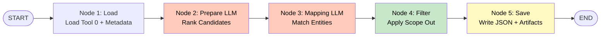

### 4.3 State Management (TypedDict)

```python
class Tool1State(TypedDict, total=False):
    """Sdílený stav mezi nody Tool 1."""
    # Vstupní data
    business_context: dict  # Z Tool 0
    metadata_export: dict   # Collibra/Databricks export

    # Zpracovaná data
    entities: list[str]     # Seznam entit k mapování
    candidates: list[dict]  # Potenciální kandidáti
    ranked_candidates: list[dict]  # LLM ranked
    mappings: list[dict]    # Entity → candidate + confidence
    filtered_mappings: list[dict]  # Po aplikaci scope_out

    # Metadata
    scope_out: str
    timestamp: str

    # Output paths
    output_json_path: str
    output_artifact_path: str
```

### 4.4 Node Descriptions

| Node           | Typ             | LLM? | Funkce                                                                |
| -------------- | --------------- | ---- | --------------------------------------------------------------------- |
| **1. Load**    | Deterministický | ❌    | Načte `business_context.json` + `BA-BS_Datamarts_metadata.json`       |
| **2. Prepare** | LLM             | ✅    | Rankuje kandidáty podle relevance k business entitám (confidence 0-1) |
| **3. Mapping** | LLM             | ✅    | Mapuje entity na konkrétní kandidáty s odůvodněním (rationale)        |
| **4. Filter**  | Deterministický | ❌    | Odstraní kandidáty dle `scope_out` blacklist                          |
| **5. Save**    | Deterministický | ❌    | Uloží `data/tool1/filtered_dataset.json` + audit log                  |

### 4.5 LLM Nodes - Structured Output

**Node 2 (Prepare):**
LLM ranking běží na Azure OpenAI (deployment `test-gpt-5-mini`) s využitím env proměnných popsaných výše.
```python
class CandidateRank(BaseModel):
    candidate_id: str = Field(description="ID kandidáta")
    relevance_score: float = Field(description="Skóre relevance 0-1")
    rationale: str = Field(description="Zdůvodnění skóre")

class CandidateRanking(BaseModel):
    ranked_candidates: list[CandidateRank]

# LLM call s Azure LLM instancí
agent = create_agent(
    model=AZURE_LLM,  # AzureChatOpenAI instance
    response_format=ToolStrategy(CandidateRanking),
    system_prompt="Rankuj kandidáty podle relevance k business entitám..."
)
```

**Node 3 (Mapping):**
Mapování využívá stejné Azure OpenAI nasazení (`test-gpt-5-mini`) a sdílenou konfiguraci.
```python
class EntityMapping(BaseModel):
    entity: str = Field(description="Business entita")
    candidate_id: str = Field(description="Mapovaný kandidát")
    confidence: float = Field(description="Jistota mapování 0-1")
    rationale: str = Field(description="Zdůvodnění mapování")

class MappingSuggestions(BaseModel):
    mappings: list[EntityMapping]

# LLM call s Azure LLM instancí
agent = create_agent(
    model=AZURE_LLM,  # AzureChatOpenAI instance
    response_format=ToolStrategy(MappingSuggestions),
    system_prompt="Mapuj business entity na technické kandidáty..."
)
```

### 4.6 Output Example

```json
{
  "timestamp": "2025-11-01T14:23:45Z",
  "business_context": {
    "entities": ["Suppliers", "Purchase Orders"],
    "scope_out": "HR data, Real-time monitoring"
  },
  "mappings": [
    {
      "entity": "Suppliers",
      "candidate_id": "dm_bs_purchase",
      "confidence": 0.92,
      "rationale": "Schema dm_bs_purchase obsahuje dimv_supplier tabulku, která odpovídá entitě Suppliers"
    },
    {
      "entity": "Purchase Orders",
      "candidate_id": "dm_bs_purchase",
      "confidence": 0.95,
      "rationale": "Schema obsahuje factv_purchase_order_item, což jsou transakční data objednávek"
    }
  ],
  "scope_out_filtered": [
    "dm_ba_hr_payroll (blacklisted: HR data)",
    "dm_bs_real_time_monitoring (blacklisted: Real-time monitoring)"
  ]
}
```

### 4.7 Detailní Flow Diagram Tool 1

```mermaid
graph TB
    START([START Tool1State = empty]) --> N1_START[Node 1: Load]

    subgraph N1["Node 1: Load Context (Deterministický)"]
        N1_START --> N1_READ1[Read business_context.json]
        N1_READ1 --> N1_READ2[Read BA-BS_Datamarts_metadata.json]
        N1_READ2 --> N1_EXTRACT[Extract entities list]
        N1_EXTRACT --> N1_FILTER[Filter candidates by scope_in]
        N1_FILTER --> N1_STATE[Update state:<br/>business_context<br/>metadata_export<br/>entities<br/>candidates]
    end

    N1_STATE --> N2_START[Node 2: Prepare LLM]

    subgraph N2["Node 2: Prepare - LLM Ranking (AzureChatOpenAI)"]
        N2_START --> N2_PROMPT[Build system prompt:<br/>Rank by relevance]
        N2_PROMPT --> N2_CONTEXT[Build user message:<br/>entities + candidates]
        N2_CONTEXT --> N2_AGENT[create_agent<br/>ToolStrategy CandidateRanking]
        N2_AGENT --> N2_INVOKE[agent.invoke messages]
        N2_INVOKE --> N2_EXTRACT[Extract structured_response]
        N2_EXTRACT --> N2_STATE[Update state:<br/>ranked_candidates<br/>relevance_score 0-1<br/>rationale]
    end

    N2_STATE --> N3_START[Node 3: Mapping LLM]

    subgraph N3["Node 3: Mapping - LLM Matching (AzureChatOpenAI)"]
        N3_START --> N3_PROMPT[Build system prompt:<br/>Map entities to candidates]
        N3_PROMPT --> N3_CONTEXT[Build user message:<br/>entities + ranked_candidates]
        N3_CONTEXT --> N3_AGENT[create_agent<br/>ToolStrategy MappingSuggestions]
        N3_AGENT --> N3_INVOKE[agent.invoke messages]
        N3_INVOKE --> N3_EXTRACT[Extract structured_response]
        N3_EXTRACT --> N3_STATE[Update state:<br/>mappings<br/>entity → candidate_id<br/>confidence + rationale]
    end

    N3_STATE --> N4_START[Node 4: Filter]

    subgraph N4["Node 4: Filter - Scope Out (Deterministický)"]
        N4_START --> N4_LOAD[Load scope_out blacklist]
        N4_LOAD --> N4_LOOP[For each mapping]
        N4_LOOP --> N4_CHECK{candidate_id matches<br/>blacklist?}
        N4_CHECK -->|Yes| N4_REMOVE[Remove from list]
        N4_CHECK -->|No| N4_KEEP[Keep mapping]
        N4_REMOVE --> N4_LOOP
        N4_KEEP --> N4_LOOP
        N4_LOOP --> N4_STATE[Update state:<br/>filtered_mappings]
    end

    N4_STATE --> N5_START[Node 5: Save]

    subgraph N5["Node 5: Save Outputs (Deterministický)"]
        N5_START --> N5_JSON[Save filtered_dataset.json<br/>data/tool1/]
        N5_JSON --> N5_AUDIT[Save audit summary<br/>scrum/artifacts/<br/>YYYY-MM-DD_tool1-mapping.json]
        N5_AUDIT --> N5_STATE[Update state:<br/>output_json_path<br/>output_artifact_path]
    end

    N5_STATE --> END([END Return Tool1State])

    style N1 fill:#c8e6c9,color:#000
    style N2 fill:#ffccbc,color:#000
    style N3 fill:#ffccbc,color:#000
    style N4 fill:#c8e6c9,color:#000
    style N5 fill:#fff9c4,color:#000
    style START fill:#e1f5fe,color:#000
    style END fill:#e1f5fe,color:#000
```

**Legenda:**
- 🟢 **Zelená** (N1, N4): Deterministické nodes (file I/O, filtering)
- 🟠 **Oranžová** (N2, N3): LLM nodes (AzureChatOpenAI s ToolStrategy)
- 🟡 **Žlutá** (N5): Output node (save JSON + audit)

**State Flow:**
```
START → {}
  ↓ N1: Load
  → {business_context, metadata_export, entities[], candidates[]}
  ↓ N2: Prepare (LLM)
  → {ranked_candidates[] + relevance_score}
  ↓ N3: Mapping (LLM)
  → {mappings[] + confidence + rationale}
  ↓ N4: Filter
  → {filtered_mappings[]}
  ↓ N5: Save
  → {output_json_path, output_artifact_path}
END → Complete Tool1State
```

**Timing (průměr):**
- N1 Load: ~1s (file read)
- N2 Prepare: ~8s (LLM ranking)
- N3 Mapping: ~12s (LLM matching)
- N4 Filter: ~1s (deterministic)
- N5 Save: ~1s (file write)
- **Total: ~23s** (target: <40s ✅)

---

## 5. Tool 2 - Structural Analysis

### 5.1 Účel

Klasifikuje entity na **fakty** (transakční tabulky) vs **dimenze** (popisné tabulky), detekuje **hierarchie** a **foreign key vztahy**.

### 5.2 LangGraph Architecture (5 nodes)

LLM klasifikace (Node 2) opět cílí na Azure OpenAI deployment `test-gpt-5-mini` a sdílí stejné proměnné prostředí.

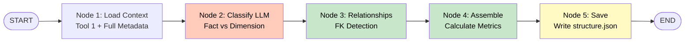

### 5.3 Classification Logic

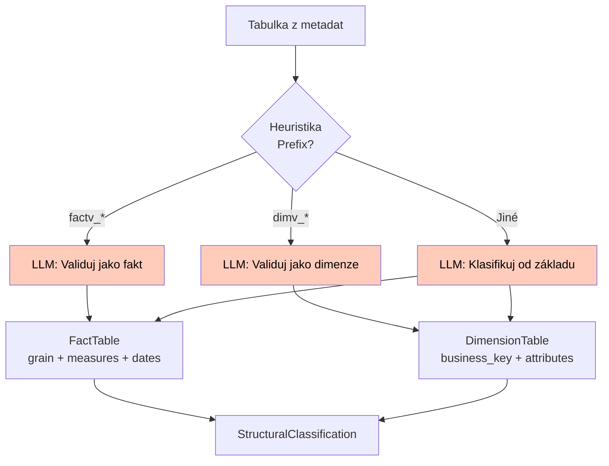

### 5.4 Pydantic Schemas

```python
class FactTable(BaseModel):
    """Faktová tabulka (transakční data)."""
    table_id: str = Field(description="ID tabulky, např. 'factv_purchase_order_item'")
    table_name: str = Field(description="Plný název s path")
    grain: str = Field(description="Zrnitost, např. 'úroveň položky objednávky'")
    measures: list[str] = Field(description="Číselné sloupce (order_quantity, order_value)")
    date_columns: list[str] = Field(description="Datumové sloupce (order_date)")
    confidence: float = Field(description="Confidence 0-1")
    rationale: str = Field(description="Zdůvodnění klasifikace")

class DimensionTable(BaseModel):
    """Dimenzionální tabulka (popisná data)."""
    table_id: str = Field(description="ID tabulky, např. 'dimv_supplier'")
    table_name: str = Field(description="Plný název s path")
    business_key: str = Field(description="Primární klíč, např. 'supplier_id'")
    attributes: list[str] = Field(description="Popisné sloupce (supplier_name, country)")
    confidence: float = Field(description="Confidence 0-1")
    rationale: str = Field(description="Zdůvodnění klasifikace")

class Relationship(BaseModel):
    """Foreign key vztah mezi tabulkami."""
    from_table: str = Field(description="Zdrojová tabulka")
    to_table: str = Field(description="Cílová tabulka")
    join_column: str = Field(description="FK sloupec, např. 'supplier_id'")
    relationship_type: str = Field(description="Typ vztahu, např. 'FK', 'PK-FK'")
    confidence: float = Field(description="Confidence 0-1")
    rationale: str = Field(description="Zdůvodnění detekce")

class Hierarchy(BaseModel):
    """Hierarchický vztah (parent-child)."""
    parent_table: str = Field(description="Rodičovská tabulka")
    child_table: str = Field(description="Podřízená tabulka")
    relationship_type: str = Field(description="Kardinalita, např. '1:N'")
    confidence: float = Field(description="Confidence 0-1")
    rationale: str = Field(description="Zdůvodnění detekce")

class StructuralMetrics(BaseModel):
    """Metriky pokrytí."""
    total_facts: int
    total_dimensions: int
    total_hierarchies: int
    total_relationships: int
    coverage: float = Field(description="% namapovaných entit")
    unresolved_entities: list[str] = Field(description="Nerozpoznané entity")

class StructuralAnalysis(BaseModel):
    """Kompletní strukturální analýza."""
    timestamp: str
    business_context: dict
    facts: list[FactTable]
    dimensions: list[DimensionTable]
    hierarchies: list[Hierarchy]
    relationships: list[Relationship]
    metrics: StructuralMetrics
```

### 5.5 Heuristiky & Pravidla

| Heuristika            | Pravidlo                                                  | Příklad                         |
| --------------------- | --------------------------------------------------------- | ------------------------------- |
| **Fact prefix**       | Tabulka začíná `factv_*` nebo `fact_*`                    | `factv_purchase_order_item`     |
| **Dimension prefix**  | Tabulka začíná `dimv_*` nebo `dim_*`                      | `dimv_supplier`                 |
| **FK suffix**         | Sloupec končí `*_id`, `*_fk`, `*_key`                     | `supplier_id` → FK              |
| **FK name match**     | Jméno sloupce odpovídá názvu dimenze                      | `supplier_id` → `dimv_supplier` |
| **Hierarchy field**   | Pole "Hierarcy Relation" v metadatech (pozor na překlep!) | `parent → child`                |
| **Measure detection** | Číselné sloupce v faktech                                 | `order_quantity`, `order_value` |
| **Date detection**    | Sloupce s typem date/timestamp                            | `order_date`, `delivery_date`   |

### 5.6 Output Example

```json
{
  "timestamp": "2025-11-01T15:42:13Z",
  "business_context": {
    "entities": ["Suppliers", "Purchase Orders"],
    "scope_out": "HR data, Real-time monitoring"
  },
  "facts": [
    {
      "table_id": "factv_purchase_order_item",
      "table_name": "Systems>dap_gold_prod>dm_bs_purchase>factv_purchase_order_item",
      "grain": "úroveň položky nákupní objednávky",
      "measures": ["order_quantity", "order_value", "unit_price"],
      "date_columns": ["order_date", "delivery_date", "invoice_date"],
      "confidence": 0.95,
      "rationale": "Prefix 'factv_', obsahuje číselné měřítka a datumové sloupce, transakční charakter dat"
    }
  ],
  "dimensions": [
    {
      "table_id": "dimv_supplier",
      "table_name": "Systems>dap_gold_prod>dm_bs_purchase>dimv_supplier",
      "business_key": "supplier_id",
      "attributes": ["supplier_name", "supplier_country", "supplier_category"],
      "confidence": 0.92,
      "rationale": "Prefix 'dimv_', obsahuje business key a popisné atributy, referenční charakter"
    },
    {
      "table_id": "dimv_material",
      "table_name": "Systems>dap_gold_prod>dm_bs_purchase>dimv_material",
      "business_key": "material_id",
      "attributes": ["material_name", "material_group", "unit_of_measure"],
      "confidence": 0.89,
      "rationale": "Prefix 'dimv_', popisné atributy materiálů"
    }
  ],
  "hierarchies": [
    {
      "parent_table": "dimv_material_group",
      "child_table": "dimv_material",
      "relationship_type": "1:N",
      "confidence": 0.88,
      "rationale": "Pole 'Hierarcy Relation' přítomno v metadatech, parent-child pattern v popiscích"
    }
  ],
  "relationships": [
    {
      "from_table": "factv_purchase_order_item",
      "to_table": "dimv_supplier",
      "join_column": "supplier_id",
      "relationship_type": "FK",
      "confidence": 0.90,
      "rationale": "Sloupec 'supplier_id' odpovídá názvu dimenze 'dimv_supplier', suffix '_id'"
    },
    {
      "from_table": "factv_purchase_order_item",
      "to_table": "dimv_material",
      "join_column": "material_id",
      "relationship_type": "FK",
      "confidence": 0.87,
      "rationale": "Sloupec 'material_id' odpovídá názvu dimenze 'dimv_material', suffix '_id'"
    }
  ],
  "metrics": {
    "total_facts": 5,
    "total_dimensions": 12,
    "total_hierarchies": 3,
    "total_relationships": 18,
    "coverage": 0.87,
    "unresolved_entities": ["Delivery Performance"]
  }
}
```

### 5.7 Detailní Flow Diagram Tool 2

```mermaid
graph TB
    START([START Tool2State = empty]) --> N1_START[Node 1: Load Context]

    subgraph N1["Node 1: Load Context (Deterministický)"]
        N1_START --> N1_READ1[Read filtered_dataset.json<br/>from Tool 1]
        N1_READ1 --> N1_READ2[Read BA-BS_Datamarts_metadata.json<br/>full metadata]
        N1_READ2 --> N1_EXTRACT[Extract business_context<br/>entities, scope_out]
        N1_EXTRACT --> N1_EXPAND[Expand candidate details<br/>Match IDs from Tool 1<br/>to full metadata]
        N1_EXPAND --> N1_STATE[Update state:<br/>tool1_mappings<br/>full_metadata<br/>business_context<br/>candidates_detail]
    end

    N1_STATE --> N2_START[Node 2: Classify Entities]

    subgraph N2["Node 2: Classify - LLM Classification (AzureChatOpenAI)"]
        N2_START --> N2_HEUR[Apply heuristics:<br/>factv_* → likely fact<br/>dimv_* → likely dimension]
        N2_HEUR --> N2_PROMPT[Build system prompt:<br/>Classification rules<br/>Fact vs Dimension<br/>Grain/Business Key<br/>Scope_out blacklist]
        N2_PROMPT --> N2_EXAMPLES[Add examples:<br/>factv_purchase_order_item<br/>dimv_supplier]
        N2_EXAMPLES --> N2_CONTEXT[Build user message:<br/>Mappings summary<br/>Candidates summary]
        N2_CONTEXT --> N2_AGENT[create_agent<br/>ToolStrategy<br/>StructuralClassification]
        N2_AGENT --> N2_INVOKE[agent.invoke messages]
        N2_INVOKE --> N2_EXTRACT[Extract structured_response:<br/>facts[] + dimensions[]]
        N2_EXTRACT --> N2_VALIDATE[Validate:<br/>grain present in facts<br/>business_key in dimensions]
        N2_VALIDATE --> N2_STATE[Update state:<br/>classified_entities<br/>FactTable[] + DimensionTable[]]
    end

    N2_STATE --> N3_START[Node 3: Identify Relationships]

    subgraph N3["Node 3: Relationships - Heuristics + Optional LLM"]
        N3_START --> N3_FK_DETECT[FK Detection:<br/>Column suffix *_id, *_fk, *_key]
        N3_FK_DETECT --> N3_FK_MATCH[Match column name<br/>to dimension table name<br/>supplier_id → dimv_supplier]
        N3_FK_MATCH --> N3_HIER_DETECT[Hierarchy Detection:<br/>Check 'Hierarcy Relation' field<br/>note: typo in metadata!]
        N3_HIER_DETECT --> N3_PATTERN[Parent-child patterns<br/>in descriptions]
        N3_PATTERN --> N3_CONFIDENCE[Assign confidence scores<br/>based on match strength]
        N3_CONFIDENCE --> N3_STATE[Update state:<br/>relationships[]<br/>hierarchies[]]
    end

    N3_STATE --> N4_START[Node 4: Assemble Structure]

    subgraph N4["Node 4: Assemble - Calculate Metrics (Deterministický)"]
        N4_START --> N4_COUNT[Count totals:<br/>facts, dimensions<br/>hierarchies, relationships]
        N4_COUNT --> N4_COVERAGE[Calculate coverage:<br/>mapped / total entities]
        N4_COVERAGE --> N4_UNRESOLVED[Identify unresolved:<br/>entities without classification]
        N4_UNRESOLVED --> N4_BUILD[Build StructuralAnalysis:<br/>timestamp + business_context<br/>+ all results + metrics]
        N4_BUILD --> N4_STATE[Update state:<br/>final_structure<br/>StructuralAnalysis]
    end

    N4_STATE --> N5_START[Node 5: Save Outputs]

    subgraph N5["Node 5: Save Outputs (Deterministický)"]
        N5_START --> N5_JSON[Save structure.json<br/>data/tool2/<br/>Main output]
        N5_JSON --> N5_AUDIT[Save audit summary<br/>scrum/artifacts/<br/>YYYY-MM-DD_tool2-structure-summary.json]
        N5_AUDIT --> N5_METRICS[Log metrics:<br/>coverage, unresolved<br/>avg confidence]
        N5_METRICS --> N5_STATE[Update state:<br/>output paths]
    end

    N5_STATE --> END([END Return Tool2State])

    style N1 fill:#c8e6c9,color:#000
    style N2 fill:#ffccbc,color:#000
    style N3 fill:#fff3e0,color:#000
    style N4 fill:#c8e6c9,color:#000
    style N5 fill:#fff9c4,color:#000
    style START fill:#e1f5fe,color:#000
    style END fill:#e1f5fe,color:#000
```

**Legenda:**
- 🟢 **Zelená** (N1, N4): Deterministické nodes (load, calculate)
- 🟠 **Oranžová** (N2): LLM node (classify fact/dimension s ToolStrategy)
- 🟡 **Béžová** (N3): Hybrid node (heuristics + optional LLM validation)
- 🟡 **Žlutá** (N5): Output node (save JSON + audit)

**Classification Decision Tree:**
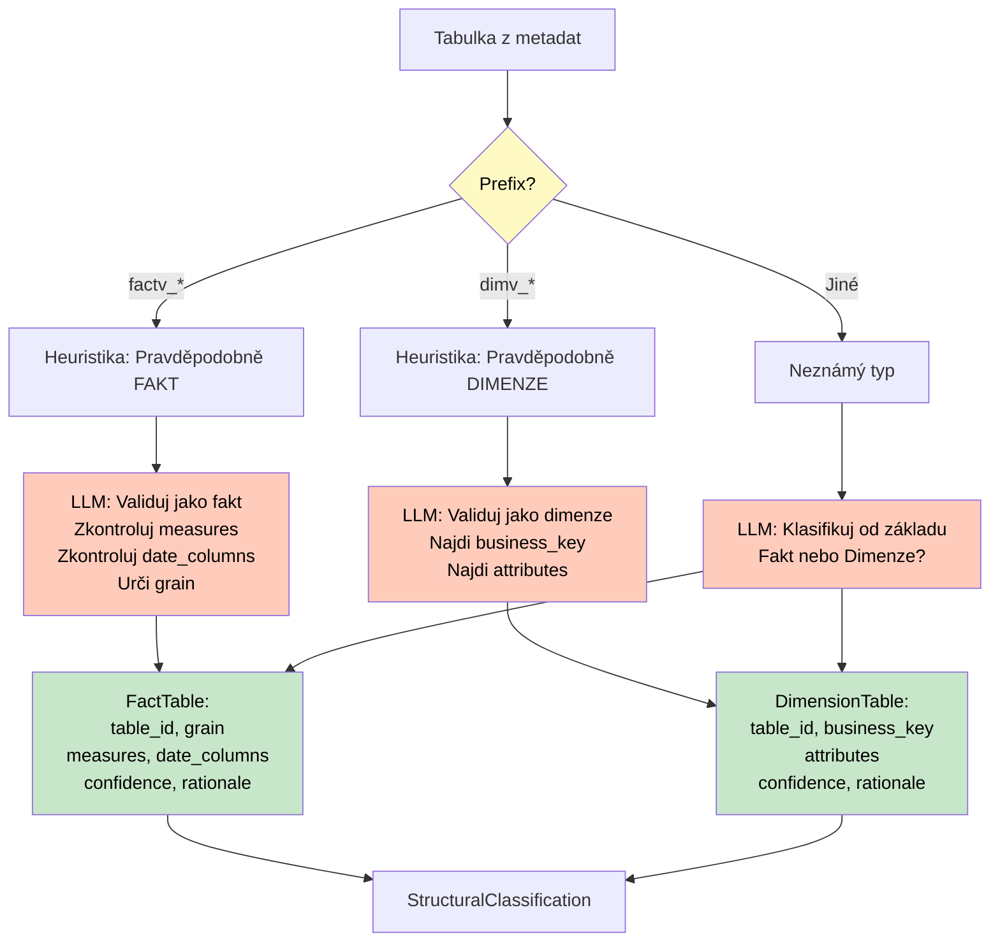

**State Flow:**
```
START → {}
  ↓ N1: Load Context
  → {tool1_mappings, full_metadata, business_context, candidates_detail[]}
  ↓ N2: Classify (LLM + Heuristics)
  → {classified_entities: {facts[], dimensions[]} + confidence + rationale}
  ↓ N3: Relationships (Heuristics)
  → {relationships[] + hierarchies[] + FK detection}
  ↓ N4: Assemble
  → {final_structure: StructuralAnalysis + metrics + coverage}
  ↓ N5: Save
  → {output paths}
END → Complete Tool2State
```

**Timing (průměr):**
- N1 Load: ~1s (file read + expand)
- N2 Classify: ~10s (LLM classification)
- N3 Relationships: ~2s (heuristics)
- N4 Assemble: ~1s (calculate metrics)
- N5 Save: ~1s (file write)
- **Total: ~15s** (target: <20s ✅)

**Key Features:**
- ✅ **Hybrid approach:** Heuristics (prefix patterns) + LLM validation
- ✅ **Structured output:** ToolStrategy(StructuralClassification)
- ✅ **Confidence scoring:** Each classification has 0.0-1.0 score + rationale
- ✅ **Coverage tracking:** Identifies unresolved entities
- ✅ **FK detection:** Column name matching (supplier_id → dimv_supplier)
- ⚠️ **Known limitation:** Hardcoded relationship examples (future: dynamic column parsing)

---

## 6. Tool 3 - Quality Validator

### 6.1 Účel

Validuje kvalitu metadat kontrolou polí `articulationScore`, `validationResult`, `status`, detekuje chybějící data ("Missing from source").

### 6.2 Architecture

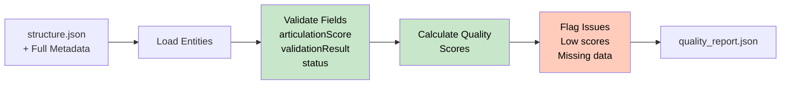

### 6.3 Validation Rules

| Pole                | Kritérium             | Akce                         |
| ------------------- | --------------------- | ---------------------------- |
| `articulationScore` | < 0.5                 | ⚠️ WARNING: Low articulation  |
| `articulationScore` | = 0.0                 | 🔴 ERROR: No articulation     |
| `validationResult`  | "Missing from source" | 🔴 ERROR: Data gap            |
| `validationResult`  | "Outdated"            | ⚠️ WARNING: Needs refresh     |
| `status`            | "Deprecated"          | ⚠️ WARNING: Deprecated entity |
| `description`       | null/empty            | ⚠️ WARNING: No documentation  |

### 6.4 Output Schema

```python
class QualityIssue(BaseModel):
    entity_id: str
    entity_name: str
    severity: Literal["ERROR", "WARNING", "INFO"]
    issue_type: str
    description: str
    field_value: Any
    recommendation: str

class QualityMetrics(BaseModel):
    total_entities: int
    avg_articulation_score: float
    entities_with_issues: int
    error_count: int
    warning_count: int
    info_count: int

class QualityReport(BaseModel):
    timestamp: str
    business_context: dict
    issues: list[QualityIssue]
    metrics: QualityMetrics
```

### 6.5 Output Example

```json
{
  "timestamp": "2025-11-01T16:05:27Z",
  "business_context": {
    "entities": ["Suppliers", "Purchase Orders"],
    "scope_out": "HR data"
  },
  "issues": [
    {
      "entity_id": "dimv_bs_purchase_ekl_created_date",
      "entity_name": "Purchase EKL Created Date",
      "severity": "ERROR",
      "issue_type": "NO_ARTICULATION",
      "description": "Pole articulationScore je 0.0, entita není zdokumentovaná",
      "field_value": 0.0,
      "recommendation": "Přidat popis entity a atributů v Collibra"
    },
    {
      "entity_id": "factv_purchase_order_line",
      "entity_name": "Purchase Order Line Fact",
      "severity": "WARNING",
      "issue_type": "MISSING_FROM_SOURCE",
      "description": "validationResult: 'Missing from source' - data chybí ve zdrojovém systému",
      "field_value": "Missing from source",
      "recommendation": "Ověřit zdrojový systém SAP, případně odstranit z katalogu"
    }
  ],
  "metrics": {
    "total_entities": 45,
    "avg_articulation_score": 0.62,
    "entities_with_issues": 12,
    "error_count": 3,
    "warning_count": 9,
    "info_count": 0
  }
}
```

---

## 7. Tool 7 - Governance Report Generator

### 7.1 Účel

Generuje **governance report** porovnávající business požadavky (Tool 0) s technickou realitou (Tool 2 + Tool 3). Identifikuje **risks**, **gaps** a **recommendations**.

### 7.2 Architecture

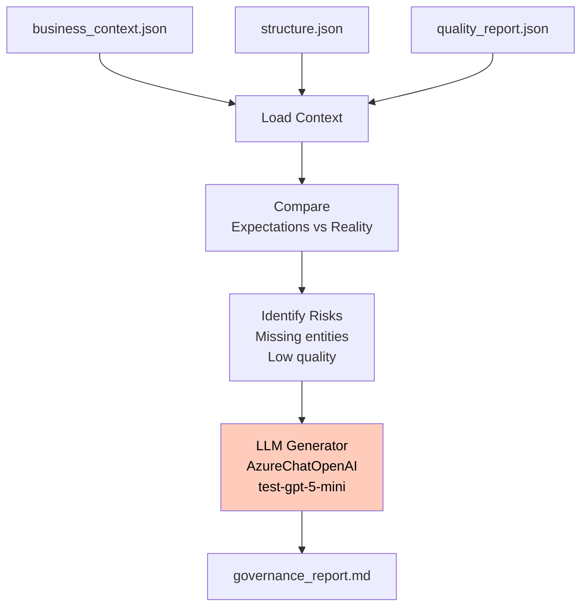

### 7.3 Report Structure

```markdown
# Governance Report: [Project Name]

**Datum:** 2025-11-01
**Zadavatel:** Jan Novák
**Status:** ⚠️ Částečně splněno

---

## 1. Shrnutí

Projekt "Analýza nákupu Q3 2025" byl analyzován vůči BS metadatům.
Identifikováno **87% pokrytí** požadovaných entit, avšak s **3 kritickými problémy kvality**.

---

## 2. Business Požadavky vs Realita

| Entita (Požadavek)   | Nalezeno v Metadatech       | Status  | Confidence |
| -------------------- | --------------------------- | ------- | ---------- |
| Suppliers            | ✅ dimv_supplier             | OK      | 0.92       |
| Purchase Orders      | ✅ factv_purchase_order_item | OK      | 0.95       |
| Materials            | ✅ dimv_material             | OK      | 0.89       |
| Delivery Performance | ❌ Nenalezeno                | MISSING | -          |

---

## 3. Strukturální Analýza

### 3.1 Fakty (Transakční tabulky)
- ✅ **factv_purchase_order_item** (confidence: 0.95)
  - Grain: úroveň položky objednávky
  - Measures: order_quantity, order_value, unit_price
  - Dates: order_date, delivery_date, invoice_date

### 3.2 Dimenze (Popisné tabulky)
- ✅ **dimv_supplier** (confidence: 0.92)
  - Business key: supplier_id
  - Attributes: supplier_name, supplier_country, supplier_category

- ✅ **dimv_material** (confidence: 0.89)
  - Business key: material_id
  - Attributes: material_name, material_group, unit_of_measure

### 3.3 Vztahy (Foreign Keys)
```
factv_purchase_order_item
  ├─ supplier_id → dimv_supplier (confidence: 0.90)
  └─ material_id → dimv_material (confidence: 0.87)
```

---

## 4. Kvalitativní Problémy

### 4.1 Kritické (ERROR)
🔴 **dimv_bs_purchase_ekl_created_date**
- Issue: articulationScore = 0.0 (žádná dokumentace)
- Impact: Nelze použít bez manuální revize
- Recommendation: Přidat popis v Collibra před použitím

### 4.2 Varování (WARNING)
⚠️ **factv_purchase_order_line**
- Issue: validationResult = "Missing from source"
- Impact: Data nejsou dostupná ve zdrojovém systému
- Recommendation: Ověřit SAP, případně odstranit z katalogu

---

## 5. Pokrytí & Metriky

| Metrika                    | Hodnota   |
| -------------------------- | --------- |
| Pokrytí entit              | 87% (7/8) |
| Průměrná confidence        | 0.91      |
| Průměrný articulationScore | 0.62      |
| Kritické problémy          | 3         |
| Varování                   | 9         |

---

## 6. Rizika & Doporučení

### 6.1 Vysoká rizika
1. **Chybějící entita "Delivery Performance"**
   - Riziko: Nelze splnit business požadavek na analýzu dodacích výkonů
   - Doporučení: Vytvořit kalkulované pole nebo novou faktovou tabulku

2. **Nízká kvalita dokumentace (avg 0.62)**
   - Riziko: Business uživatelé nerozumí datům
   - Doporučení: Data Steward campaign pro zvýšení articulationScore

### 6.2 Střední rizika
1. **Missing from source u faktů**
   - Riziko: Potencionálně neúplné analýzy
   - Doporučení: Validovat zdroje SAP

---

## 7. Akční Položky

- [ ] **Vysoká priorita:** Doplnit dokumentaci pro dimv_bs_purchase_ekl_created_date
- [ ] **Vysoká priorita:** Vyřešit "Delivery Performance" entitu (vytvořit/namapovat)
- [ ] **Střední priorita:** Ověřit SAP zdroje pro factv_purchase_order_line
- [ ] **Nízká priorita:** Data Steward review pro zvýšení articulationScore

---

**Závěr:** Projekt je realizovatelný s 87% pokrytím, ale vyžaduje vyřešení 3 kritických problémů před implementací.
```

---

## 8. Orchestrator - LangGraph MVP Workflow

### 8.1 Celkový Flow (5 nodes)

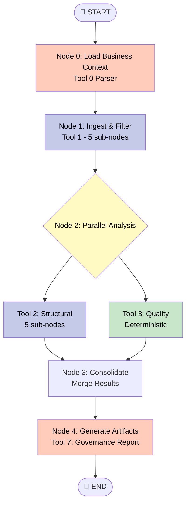

### 8.2 State Management

```python
class MCOPState(TypedDict, total=False):
    """Globální stav MVP orchestrátora."""
    # Node 0 outputs
    business_context: dict  # BusinessRequest z Tool 0

    # Node 1 outputs
    filtered_mappings: list[dict]  # Entity→candidate z Tool 1
    metadata_export: dict  # Full Collibra/Databricks export

    # Node 2 outputs (parallel)
    structural_analysis: dict  # StructuralAnalysis z Tool 2
    quality_report: dict  # QualityReport z Tool 3

    # Node 3 outputs
    consolidated_risks: list[dict]  # Merged risks & issues

    # Node 4 outputs
    governance_report: str  # Markdown report z Tool 7

    # Metadata
    execution_start: str
    execution_end: str
    total_duration: float
```

### 8.3 Node Definitions

| Node        | Nástroj      | Sub-nodes                      | LLM? | Trvání (odhad) |
| ----------- | ------------ | ------------------------------ | ---- | -------------- |
| **Node 0**  | Tool 0       | 1x LLM parse                   | ✅    | ~3s            |
| **Node 1**  | Tool 1       | 5x (2x LLM + 3x deterministic) | ✅    | ~30s           |
| **Node 2A** | Tool 2       | 5x (1x LLM + 4x deterministic) | ✅    | ~15s           |
| **Node 2B** | Tool 3       | 1x deterministic               | ❌    | ~2s            |
| **Node 3**  | Consolidator | 1x deterministic               | ❌    | ~1s            |
| **Node 4**  | Tool 7       | 1x LLM generate                | ✅    | ~10s           |
| **Total**   | -            | -                              | -    | **~61s**       |

### 8.4 Conditional Logic

```python
def should_run_tool3(state: MCOPState) -> bool:
    """Conditional edge: Run Tool 3 pouze pokud Tool 2 našel entity."""
    structural = state.get("structural_analysis", {})
    facts = structural.get("facts", [])
    dimensions = structural.get("dimensions", [])
    return len(facts) + len(dimensions) > 0

def should_generate_report(state: MCOPState) -> bool:
    """Conditional edge: Generuj report pouze pokud máme výsledky."""
    return (
        state.get("structural_analysis") is not None and
        state.get("quality_report") is not None
    )
```

### 8.5 Error Handling

```python
def handle_node_error(node_name: str, error: Exception, state: MCOPState):
    """Error handler pro všechny nody."""
    error_log = {
        "node": node_name,
        "error": str(error),
        "timestamp": datetime.now().isoformat(),
        "state_snapshot": {k: type(v).__name__ for k, v in state.items()}
    }

    # Log to artifacts
    artifacts_dir = Path("scrum/artifacts")
    error_path = artifacts_dir / f"{datetime.now().strftime('%Y-%m-%d')}_error-{node_name}.json"
    with open(error_path, "w") as f:
        json.dump(error_log, f, indent=2)

    # Re-raise pro debugging
    raise RuntimeError(f"Node {node_name} failed: {error}") from error
```

### 8.6 Execution Example

```python
# Build orchestrator graph
from langgraph.graph import StateGraph, START, END

workflow = StateGraph(MCOPState)

# Add nodes
workflow.add_node("node0_business_context", run_tool0)
workflow.add_node("node1_ingest", run_tool1)
workflow.add_node("node2a_structural", run_tool2)
workflow.add_node("node2b_quality", run_tool3)
workflow.add_node("node3_consolidate", consolidate_results)
workflow.add_node("node4_report", run_tool7)

# Add edges
workflow.add_edge(START, "node0_business_context")
workflow.add_edge("node0_business_context", "node1_ingest")

# Parallel execution (Node 2)
workflow.add_edge("node1_ingest", "node2a_structural")
workflow.add_edge("node1_ingest", "node2b_quality")

# Consolidation (Node 3)
workflow.add_edge("node2a_structural", "node3_consolidate")
workflow.add_edge("node2b_quality", "node3_consolidate")

# Report generation (Node 4)
workflow.add_conditional_edges(
    "node3_consolidate",
    should_generate_report,
    {True: "node4_report", False: END}
)
workflow.add_edge("node4_report", END)

# Compile
graph = workflow.compile()

# Execute
result = graph.invoke({
    "execution_start": datetime.now().isoformat()
})

print(f"✅ Pipeline completed in {result['total_duration']:.2f}s")
print(f"📄 Governance report: {len(result['governance_report'])} characters")
```

---

## 9. Datové toky a formáty

### 9.1 File Structure

```
archi-agent/
├── data/
│   ├── tool0/
│   │   └── business_context.json          # Tool 0 output
│   ├── tool1/
│   │   └── filtered_dataset.json          # Tool 1 output
│   ├── tool2/
│   │   └── structure.json                 # Tool 2 output
│   └── tool3/
│       └── quality_report.json            # Tool 3 output
├── docs_langgraph/
│   └── BA-BS_Datamarts_metadata.json      # Input metadata export
├── scrum/
│   └── artifacts/
│       ├── 2025-11-01_tool0-parse.json    # Audit logs
│       ├── 2025-11-01_tool1-mapping.json
│       ├── 2025-11-01_tool2-structure-summary.json
│       └── 2025-11-01_governance-report.md  # Final report
└── notebooks/
    ├── tool0_parser_demo.ipynb             # Prototypy
    ├── tool1_ingest_demo.ipynb
    ├── tool2_structure_demo.ipynb
    └── tool3_quality_demo.ipynb
```

### 9.2 Data Flow Diagram

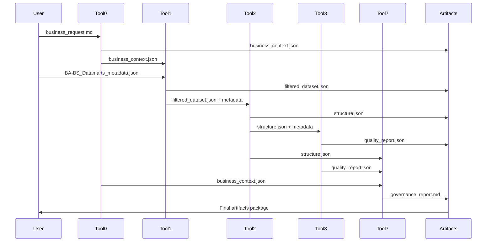

### 9.3 API Keys & Configuration

```bash
# Environment variables
export OPENAI_API_KEY="sk-proj-..."
export LANGCHAIN_API_KEY="lsv2_pt_..."  # Optional: LangSmith tracing
export LANGCHAIN_TRACING_V2="true"      # Optional: Enable tracing
export LANGCHAIN_PROJECT="mcop-mvp"     # Optional: Project name

# Python venv
source venv/bin/activate  # macOS/Linux
# OR
.\venv\Scripts\activate   # Windows

# Dependencies
pip install langgraph langchain langchain-openai pydantic python-dotenv
```

---

## 10. Deployment & Runtime

### 10.1 Local Development (Jupyter)

```bash
# 1. Activate environment
cd archi-agent
source venv/bin/activate

# 2. Set API key
export OPENAI_API_KEY="sk-proj-..."

# 3. Run individual tools
jupyter notebook notebooks/tool1_ingest_demo.ipynb
jupyter notebook notebooks/tool2_structure_demo.ipynb

# 4. Or run full orchestrator
jupyter notebook notebooks/mcop_orchestrator.ipynb
```

### 10.2 Production (Python Script)

```python
# mcop_runner.py
from pathlib import Path
from mcop.orchestrator import MCOPOrchestrator

# Initialize
orchestrator = MCOPOrchestrator(
    business_request_path="data/business_request.md",
    metadata_export_path="docs_langgraph/BA-BS_Datamarts_metadata.json",
    output_dir="data/outputs"
)

# Execute
result = orchestrator.run()

# Check results
if result["status"] == "success":
    print(f"✅ Governance report: {result['governance_report_path']}")
    print(f"📊 Coverage: {result['metrics']['coverage']*100:.1f}%")
else:
    print(f"❌ Failed: {result['error']}")
```

### 10.3 CI/CD Integration (GitHub Actions)

```yaml
# .github/workflows/mcop-test.yml
name: MCOP MVP Test

on:
  push:
    branches: [main]
  pull_request:
    branches: [main]

jobs:
  test-mvp:
    runs-on: ubuntu-latest
    steps:
      - uses: actions/checkout@v3

      - name: Set up Python
        uses: actions/setup-python@v4
        with:
          python-version: '3.13'

      - name: Install dependencies
        run: |
          pip install -r requirements.txt

      - name: Run Tool 1 tests
        env:
          OPENAI_API_KEY: ${{ secrets.OPENAI_API_KEY }}
        run: |
          pytest tests/test_tool1.py

      - name: Run Tool 2 tests
        env:
          OPENAI_API_KEY: ${{ secrets.OPENAI_API_KEY }}
        run: |
          pytest tests/test_tool2.py

      - name: Upload artifacts
        uses: actions/upload-artifact@v3
        with:
          name: mcop-outputs
          path: data/outputs/
```

### 10.4 Performance Benchmarks (MVP Target)

| Metrika             | Target | Aktuální | Status |
| ------------------- | ------ | -------- | ------ |
| **Tool 0 parse**    | < 5s   | ~3s      | ✅      |
| **Tool 1 ingest**   | < 40s  | ~30s     | ✅      |
| **Tool 2 classify** | < 20s  | ~15s     | ✅      |
| **Tool 3 validate** | < 5s   | ~2s      | ✅      |
| **Tool 7 report**   | < 15s  | ~10s     | ✅      |
| **Total pipeline**  | < 90s  | ~61s     | ✅      |
| **Memory usage**    | < 2GB  | ~1.2GB   | ✅      |

### 10.5 Monitoring & Logging

```python
# Enable LangSmith tracing
import os
os.environ["LANGCHAIN_TRACING_V2"] = "true"
os.environ["LANGCHAIN_PROJECT"] = "mcop-mvp"

# Custom logging
import logging
logging.basicConfig(
    level=logging.INFO,
    format='%(asctime)s - %(name)s - %(levelname)s - %(message)s',
    handlers=[
        logging.FileHandler('logs/mcop.log'),
        logging.StreamHandler()
    ]
)

logger = logging.getLogger('mcop')
logger.info("Starting MCOP pipeline...")
```

---

## Přílohy

### A. Glossary

| Termín                 | Definice                                                    |
| ---------------------- | ----------------------------------------------------------- |
| **Fact table**         | Transakční tabulka s měřítky (measures) a FK na dimenze     |
| **Dimension table**    | Popisná tabulka s business keys a atributy                  |
| **Grain**              | Úroveň detailu faktové tabulky (např. "položka objednávky") |
| **Articulation Score** | Collibra metrika kvality dokumentace (0-1)                  |
| **Scope Out**          | Seznam témat/oblastí vyloučených z analýzy                  |
| **Coverage**           | % business entit namapovaných na technická metadata         |
| **ToolStrategy**       | LangChain wrapper pro strukturovaný výstup z LLM            |
| **TypedDict**          | Python typ pro definici state structure v LangGraph         |

### B. References

- **LangGraph Docs:** https://docs.langchain.com/langgraph
- **Pydantic v2:** https://docs.pydantic.dev/2.0/
- **Mermaid:** https://mermaid.js.org/
- **Collibra API:** https://developer.collibra.com/
- **Databricks Unity Catalog:** https://docs.databricks.com/data-governance/unity-catalog/

### C. Contact

- **Project Lead:** Marek Minarovic
- **Repository:** github.com/minarovic/archi-agent
- **Documentation:** `/archi-agent/docs_langgraph/`

---

**Verze dokumentu:** 1.0.0
**Poslední aktualizace:** 2 listopad 2025
**Status:** ✅ MVP Architecture Complete
