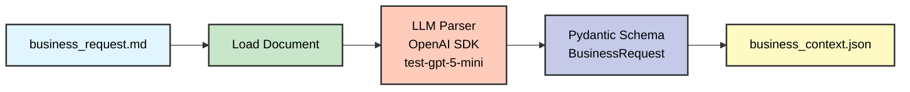

# Tool 0 - Business Request Parser - Detailní Dokumentace

**Účel:** Parsuje standardizované Markdown business dokumenty a extrahuje strukturovaný kontext pro downstream tools.

**Pattern:** Direct OpenAI SDK with Azure endpoint + JSON mode (Pattern A)

---

## Architektura



**Legenda:**
- 🔵 **Modrá** (INPUT): Vstupní Markdown dokument
- 🟢 **Zelená** (LOAD): Deterministický load operace
- 🟠 **Oranžová** (LLM): OpenAI SDK s Azure endpoint
- 🟣 **Fialová** (SCHEMA): Pydantic validace
- 🟡 **Žlutá** (OUTPUT): JSON output

---

## Input Schema (Markdown Template)

Tool 0 očekává standardizovaný Markdown formát:

```markdown
# Požadavek na datový projekt

**Metadata:**
- Projekt: Analýza nákupu
- Zadavatel: Jan Novák
- Datum: 2025-11-01

## Cíl projektu
Analyzovat nákupní objednávky za Q3 2025 pro optimalizaci
dodavatelského portfolia a identifikaci úspor.

## Rozsah (Scope In)
- BS Nákup (dm_bs_purchase)
- Dodavatelé, objednávky, položky objednávek
- Data za Q3 2025

## Mimo rozsah (Scope Out)
- HR data
- Real-time monitoring
- Finance modul

## Klíčové entity
- Dodavatelé (Suppliers)
- Nákupní objednávky (Purchase Orders)
- Materiály (Materials)

## Požadované metriky
- Objem objednávek (order_quantity)
- Hodnota objednávek (order_value)
- Doba dodání (delivery_time)

## Zdroje dat
- SAP ERP
- Databricks Unity Catalog (dm_bs_purchase)

## Omezení
- Pouze Q3 2025
- Bez PII dat (osobní údaje)
- GDPR compliance

## Očekávané dodávky
- Power BI dashboard
- SQL skripty pro analýzu
- Dokumentace datového modelu
```

---

## Output Schema (Pydantic)

```python
from pydantic import BaseModel, Field

class ProjectMetadata(BaseModel):
    """Metadata business požadavku."""
    project_name: str = Field(description="Název projektu")
    sponsor: str = Field(description="Zadavatel projektu")
    submitted_at: str = Field(description="Datum podání v ISO 8601 formátu")
    extra: dict = Field(default_factory=dict, description="Další metadata")

class BusinessRequest(BaseModel):
    """Kompletní parsovaný business požadavek."""
    project_metadata: ProjectMetadata
    goal: str = Field(description="Hlavní cíl projektu")
    scope_in: str = Field(description="Co je součástí rozsahu")
    scope_out: str = Field(description="Co není součástí rozsahu")
    entities: list[str] = Field(
        default_factory=list,
        description="Klíčové business entity (např. Suppliers, Orders)"
    )
    metrics: list[str] = Field(
        default_factory=list,
        description="Požadované metriky a KPIs"
    )
    sources: list[str] = Field(
        default_factory=list,
        description="Očekávané datové zdroje (SAP, Databricks, atd.)"
    )
    constraints: list[str] = Field(
        default_factory=list,
        description="Omezení projektu (časová, technická, právní)"
    )
    deliverables: list[str] = Field(
        default_factory=list,
        description="Očekávané dodávky projektu"
    )
```

---

## Output Example

```json
{
  "project_metadata": {
    "project_name": "Analýza nákupu Q3 2025",
    "sponsor": "Jan Novák",
    "submitted_at": "2025-11-01T00:00:00Z",
    "extra": {}
  },
  "goal": "Analyzovat nákupní objednávky za Q3 2025 pro optimalizaci dodavatelského portfolia a identifikaci úspor",
  "scope_in": "BS Nákup (dm_bs_purchase), Dodavatelé, Objednávky, Položky objednávek, Data za Q3 2025",
  "scope_out": "HR data, Real-time monitoring, Finance modul",
  "entities": [
    "Suppliers",
    "Purchase Orders",
    "Materials"
  ],
  "metrics": [
    "order_quantity",
    "order_value",
    "delivery_time"
  ],
  "sources": [
    "SAP ERP",
    "Databricks Unity Catalog (dm_bs_purchase)"
  ],
  "constraints": [
    "Pouze Q3 2025",
    "Bez PII dat",
    "GDPR compliance"
  ],
  "deliverables": [
    "Power BI dashboard",
    "SQL skripty pro analýzu",
    "Dokumentace datového modelu"
  ]
}
```

---

## Implementation Pattern (Pattern A)

Tool 0 používá **přímý OpenAI SDK** s Azure endpointem, **ne LangChain agents**.

### Azure Configuration

```python
import os
from openai import OpenAI
from dotenv import load_dotenv

load_dotenv()

# Azure OpenAI konfigurace
AZURE_ENDPOINT = os.getenv("AZURE_OPENAI_ENDPOINT")
AZURE_API_KEY = os.getenv("AZURE_OPENAI_API_KEY")
DEPLOYMENT_NAME = os.getenv("AZURE_OPENAI_DEPLOYMENT_NAME")  # test-gpt-5-mini

client = OpenAI(
    base_url=AZURE_ENDPOINT,
    api_key=AZURE_API_KEY
)
```

### Parsing Logic

```python
from pydantic import ValidationError
import json

def parse_business_request(markdown_text: str) -> tuple[dict, str, str]:
    """
    Parsuje Markdown business dokument pomocí Azure OpenAI.

    Args:
        markdown_text: Obsah Markdown dokumentu

    Returns:
        tuple: (parsed_json, raw_response, prompt_used)
    """

    # System prompt
    system_prompt = """Jsi expert na analýzu business požadavků.
Tvým úkolem je extrahovat strukturovaná data z Markdown dokumentu.

PRAVIDLA:
- Extrahuj všechny sekce podle vzoru
- Zachovej původní formát a jazyk (čeština/angličtina)
- Pro chybějící sekce vrať "unknown" nebo prázdné pole []
- Datum převeď do ISO 8601 (YYYY-MM-DDTHH:MM:SSZ)
- Entities: seznam klíčových business entit (Suppliers, Orders, atd.)
- Metrics: seznam měřitelných metrik (order_value, delivery_time, atd.)
- Sources: seznam datových zdrojů (SAP, Databricks, atd.)
- Constraints: seznam omezení (časová, technická, právní)
- Deliverables: seznam očekávaných dodávek
"""

    # User message
    user_message = f"""Analyzuj tento business požadavek a extrahuj strukturovaná data:

{markdown_text}

Vrať výsledek jako validní JSON objekt podle předepsaného schématu."""

    # LLM call s JSON mode
    response = client.chat.completions.create(
        model=DEPLOYMENT_NAME,
        messages=[
            {"role": "system", "content": system_prompt},
            {"role": "user", "content": user_message}
        ],
        response_format={"type": "json_object"},  # JSON mode
        temperature=1.0  # default pro gpt-5-mini (nelze změnit)
    )

    raw_response = response.choices[0].message.content

    # Parse JSON
    parsed_json = json.loads(raw_response)

    # Pydantic validace
    try:
        validated = BusinessRequest(**parsed_json)
        return (validated.model_dump(), raw_response, system_prompt + "\n\n" + user_message)
    except ValidationError as e:
        raise ValueError(f"Pydantic validation failed: {e}")
```

---

## Key Features

- ✅ **Simple architecture:** Jediný LLM call bez složitých agent workflows
- ✅ **JSON mode:** Garantované JSON strukturované výstupy
- ✅ **Pydantic validation:** Striktní kontrola schématu po LLM odpovědi
- ✅ **Czech/English support:** Multilingvální podpora (zachovává původní jazyk)
- ✅ **Fallback logic:** `default_factory=list` pro chybějící sekce
- ✅ **ISO 8601 dates:** Standardizované datum formáty
- ✅ **Return tuple:** Vrací (parsed_json, raw_response, prompt) pro audit trail

---

## Timing

- **Average execution:** ~3-5s (depends on document length)
- **Target:** <10s ✅
- **Breakdown:**
  - Document load: <1s
  - LLM parsing: 2-4s (Azure Sweden Central)
  - Pydantic validation: <1s

---

## Sample Files

**Input samples:** `data/tool0_samples/business_request_*.md`
**Output samples:** `data/tool0_samples/YYYY-MM-DDTHH:MM:SS.*_parsed.json`

---

## Testing

**Demo notebook:** `notebooks/tool0_parser_demo.ipynb`
**Test script:** `test_azure_model.py`

---

## Known Limitations

- ⚠️ **Temperature fixed:** gpt-5-mini doesn't support temperature parameter (always 1.0)
- ⚠️ **No streaming:** Pattern A uses synchronous calls only
- ⚠️ **Manual validation:** Pydantic validation happens post-LLM (not during generation)
- ⚠️ **Section detection:** Relies on Markdown headers (case-sensitive)

---

## Future Enhancements (Post-MVP)

- 🔮 Add streaming support for large documents
- 🔮 Implement confidence scoring per field
- 🔮 Add automatic language detection
- 🔮 Support alternative input formats (Word, PDF)
- 🔮 Add validation against Collibra taxonomy

---

**Návrat na hlavní dokumentaci:** [mcop-architecture.md](./mcop-architecture.md#3-tool-0---business-request-parser)
