# Tool 3 - Quality Validator - Detailní Flow Diagram

**Účel:** Dokumentuje detailní 4-node hybrid pipeline pro Tool 3 včetně deterministických heuristik a LLM enhancement layer s fallback strategií.

---

## Hlavní Flow Diagram

```mermaid
graph TB
    START([START Tool3State = empty]) --> N1_START[Node 1: Load & Validate]

    subgraph N1["Node 1: Load & Validate (Deterministický)"]
        N1_START --> N1_READ1[Read structure.json<br/>from Tool 2]
        N1_READ1 --> N1_READ2[Read business_context.json<br/>from Tool 0]
        N1_READ2 --> N1_READ3[Read full metadata<br/>BA-BS_Datamarts_metadata.json]
        N1_READ3 --> N1_VALIDATE[Schema validation:<br/>StructuralAnalysis format<br/>Business context format]
        N1_VALIDATE --> N1_SANITIZE[Input sanitization:<br/>Remove nulls, normalize IDs]
        N1_SANITIZE --> N1_STATE[Update state:<br/>structure<br/>business_context<br/>metadata]
    end

    N1_STATE --> N2_START[Node 2: Calculate Deterministic]

    subgraph N2["Node 2: Calculate Deterministic (Python Heuristics)"]
        N2_START --> N2_LOOP[For each entity in structure]
        N2_LOOP --> N2_ARTICULATION[calculate_articulation_score<br/>Based on field presence<br/>description: +20<br/>owner: +20<br/>lineage: +15<br/>source_mapping: +15<br/>dq_rules: +10<br/>governance_tags: +10<br/>last_updated: +10]
        N2_ARTICULATION --> N2_VALIDATION[validate_entity_status<br/>Pass: score ≥50 + description<br/>Warning: score <50 OR missing desc<br/>Fail: score=0 OR missing from source]
        N2_VALIDATION --> N2_MISSING[detect_missing_entities<br/>Compare business_entities<br/>with structure coverage]
        N2_MISSING --> N2_METRICS[Calculate summary metrics:<br/>avg_articulation_score<br/>p0_blocker_count<br/>entities_with_issues]
        N2_METRICS --> N2_STATE[Update state:<br/>entity_scores<br/>validation_flags<br/>missing_entities]
    end

    N2_STATE --> N3_START[Node 3: Enhance with LLM]

    subgraph N3["Node 3: Enhance with LLM (AzureChatOpenAI + ToolStrategy)"]
        N3_START --> N3_PROMPT[Build system prompt:<br/>Quality assessment rules<br/>P0-P2 priority guidelines<br/>Risk level criteria<br/>Anomaly detection patterns]
        N3_PROMPT --> N3_CONTEXT[Build user message:<br/>Deterministic summary<br/>entity_scores + validation_flags<br/>missing_entities<br/>Structure sample first 3 entities]
        N3_CONTEXT --> N3_AGENT[create_agent<br/>ToolStrategy<br/>LLMEnhancement]
        N3_AGENT --> N3_INVOKE[agent.invoke messages]
        N3_INVOKE --> N3_TRY{LLM call<br/>successful?}
        N3_TRY -->|Success| N3_EXTRACT[Extract structured_response:<br/>risk_level + risk_rationale<br/>text_quality_score<br/>recommendations P0-P2<br/>anomaly_notes<br/>summary]
        N3_EXTRACT --> N3_VALIDATE_IDS[Validate entity IDs:<br/>Cross-check against structure<br/>Reject hallucinated entities]
        N3_VALIDATE_IDS --> N3_SUCCESS[Update state:<br/>llm_enhancements<br/>llm_fallback_mode=false]
        N3_TRY -->|Timeout/Error| N3_FALLBACK[generate_fallback_enhancements:<br/>Generic recommendations<br/>based on deterministic findings]
        N3_FALLBACK --> N3_FALLBACK_STATE[Update state:<br/>llm_enhancements fallback<br/>llm_fallback_mode=true]
        N3_SUCCESS --> N3_END
        N3_FALLBACK_STATE --> N3_END
    end

    N3_END --> N4_START[Node 4: Merge & Serialize]

    subgraph N4["Node 4: Merge & Serialize (Deterministický)"]
        N4_START --> N4_MERGE[Merge results:<br/>Deterministic entity_scores<br/>+ validation_flags<br/>+ LLM enhancements]
        N4_MERGE --> N4_METRICS[Calculate final metrics:<br/>total_entities<br/>avg_articulation_score<br/>entities_with_issues<br/>p0_blockers count<br/>coverage percentage]
        N4_METRICS --> N4_BUILD[Build QualityReport:<br/>timestamp ISO8601<br/>source_files paths<br/>All metrics + recommendations]
        N4_BUILD --> N4_SAVE1[Save quality_report.json<br/>data/tool3/]
        N4_SAVE1 --> N4_SAVE2[Save audit summary<br/>scrum/artifacts/<br/>YYYY-MM-DD_tool3-quality-summary.json]
        N4_SAVE2 --> N4_LOG[Log execution metrics:<br/>Timing per node<br/>Fallback mode flag<br/>Score distribution]
        N4_LOG --> N4_STATE[Update state:<br/>final_report<br/>output_path]
    end

    N4_STATE --> END([END Return Tool3State])

    style N1 fill:#c8e6c9,color:#000,stroke:#333,stroke-width:2px
    style N2 fill:#c8e6c9,color:#000,stroke:#333,stroke-width:2px
    style N3 fill:#ffccbc,color:#000,stroke:#333,stroke-width:2px
    style N4 fill:#fff9c4,color:#000,stroke:#333,stroke-width:2px
    style START fill:#e1f5fe,color:#000,stroke:#333,stroke-width:2px
    style END fill:#e1f5fe,color:#000,stroke:#333,stroke-width:2px
```



---

## Legenda

- 🟢 **Zelená** (N1, N2): Deterministické nodes (load, heuristics, calculate)
- 🟠 **Oranžová** (N3): LLM node (enhance s ToolStrategy + fallback)
- 🟡 **Žlutá** (N4): Output node (merge + save JSON + audit)

---

## Articulation Score Calculation


**Bodování:**
- **P0 Critical** (40 bodů): description (20) + owner (20)
- **P1 Important** (30 bodů): lineage (15) + source_mapping (15)
- **P2 Nice-to-have** (30 bodů): dq_rules (10) + governance_tags (10) + last_updated (10)

**Alignment s DQ auditem:** Baseline 28.1/100 → 94.2% missing descriptions, 91.7% missing owners

---

## Validation Status Decision Tree


---

## LLM Enhancement Flow


---

## State Flow

```
START → {}
  ↓ N1: Load & Validate
  → {structure, business_context, metadata}
  ↓ N2: Calculate Deterministic (Python heuristics)
  → {entity_scores{}, validation_flags{}, missing_entities[]}
  ↓ N3: Enhance with LLM (ToolStrategy)
  → {llm_enhancements: LLMEnhancement, llm_fallback_mode: bool}
  ↓ N4: Merge & Serialize
  → {final_report: QualityReport, output_path: str}
END → Complete Tool3State
```

---

## Timing (průměr)

- N1 Load: ~1s (3 file reads + validation)
- N2 Calculate: ~3s (heuristics loop)
- N3 Enhance: ~10s (LLM call + validation, or <1s fallback)
- N4 Merge & Save: ~1s (JSON serialize + file write)
- **Total: ~15s** (target: <15s ✅, fallback mode: <6s)

---

## Key Features

- ✅ **Hybrid approach:** Deterministické baseline (stable scores) + LLM enhancement (contextual insights)
- ✅ **Structured output:** ToolStrategy(LLMEnhancement) pro LLM node only
- ✅ **Fallback strategy:** Robust handling of LLM timeouts/errors (generic recommendations)
- ✅ **Hallucination mitigation:** Entity ID validation against input structure
- ✅ **P0-P2 prioritization:** Clear actionable recommendations with estimated impact
- ✅ **DQ audit alignment:** Scoring weights based on 2025-11-03 audit findings (28.1/100 baseline)
- ⚠️ **Known limitation:** Fallback recommendations are generic (less actionable than LLM-generated)

---

## Concrete Example

### Input (dimv_supplier entity):
```json
{
  "table_id": "dimv_supplier",
  "metadata": {
    "description": null,
    "owner": null,
    "lineage": "unknown",
    "source_mapping": "Databricks Unity Catalog",
    "dq_rules": null,
    "governance_tags": null,
    "last_updated": "2025-11-03"
  }
}
```

### Node 2 Output (Deterministic):
```json
{
  "entity_scores": {"dimv_supplier": 25},
  "validation_flags": {"dimv_supplier": "warning"},
  "missing_entities": []
}
```
**Calculation:** source_mapping(+15) + last_updated<90d(+10) = 25 points

### Node 3 Output (LLM Enhancement):
```json
{
  "risk_level": "high",
  "risk_rationale": "P0 blockers: dimv_supplier lacks description (20pts) and owner (20pts). Current score 25/100 indicates critical metadata gaps.",
  "text_quality_score": null,
  "recommendations": [
    {
      "priority": "P0",
      "entity_id": "dimv_supplier",
      "issue_type": "MISSING_DESCRIPTION",
      "description": "No business description provided",
      "action": "Add description in Collibra: 'Supplier master data from SAP MM module'",
      "estimated_impact": "+20 articulation score"
    },
    {
      "priority": "P0",
      "entity_id": "dimv_supplier",
      "issue_type": "MISSING_OWNER",
      "description": "No data steward assigned",
      "action": "Assign ownership to Procurement team in Collibra",
      "estimated_impact": "+20 articulation score"
    }
  ],
  "anomaly_notes": [],
  "summary": "High risk. Immediate P0 action required: Add descriptions and ownership for dimv_supplier to unblock production deployment."
}
```

### Node 4 Output (Final QualityReport):
```json
{
  "schema_version": "1.0.0",
  "timestamp": "2025-11-04T20:15:00Z",
  "source_files": {
    "structure": "data/tool2/structure.json",
    "business_context": "data/tool0_samples/2025-10-31T01:14:27.960789.json"
  },
  "articulation_scores": {"dimv_supplier": 25},
  "validation_results": {"dimv_supplier": "warning"},
  "missing_from_source": [],
  "risk_level": "high",
  "risk_rationale": "P0 blockers: dimv_supplier lacks description (20pts) and owner (20pts). Current score 25/100 indicates critical metadata gaps.",
  "recommendations": [
    {
      "priority": "P0",
      "entity_id": "dimv_supplier",
      "issue_type": "MISSING_DESCRIPTION",
      "description": "No business description provided",
      "action": "Add description in Collibra: 'Supplier master data from SAP MM module'",
      "estimated_impact": "+20 articulation score"
    },
    {
      "priority": "P0",
      "entity_id": "dimv_supplier",
      "issue_type": "MISSING_OWNER",
      "description": "No data steward assigned",
      "action": "Assign ownership to Procurement team in Collibra",
      "estimated_impact": "+20 articulation score"
    }
  ],
  "anomaly_notes": [],
  "summary": "High risk. Immediate P0 action required: Add descriptions and ownership for dimv_supplier to unblock production deployment.",
  "metrics": {
    "total_entities": 1,
    "avg_articulation_score": 25.0,
    "entities_with_issues": 1,
    "p0_blockers": 2,
    "coverage": 1.0
  }
}
```

---

## CLI Command

**Usage:**
```bash
python3 src/tool3/validator.py \
  --structure data/tool2/structure.json \
  --business-context data/tool0_samples/2025-10-31T01:14:27.960789.json \
  --output data/tool3/quality_report.json \
  --verbose
```

**Or via LangGraph:**
```python
from src.tool3.validator import graph

result = graph.invoke({
    "structure_path": "data/tool2/structure.json",
    "business_context_path": "data/tool0_samples/2025-10-31T01:14:27.960789.json"
})

print(f"Risk level: {result['final_report'].risk_level}")
print(f"P0 blockers: {result['final_report'].metrics['p0_blockers']}")
print(f"Avg score: {result['final_report'].metrics['avg_articulation_score']}")
```

---

## Fallback Strategy Decision Matrix

| **Condition**       | **Fallback Risk Level** | **Generic Recommendations**                                                                               |
| ------------------- | ----------------------- | --------------------------------------------------------------------------------------------------------- |
| p0_blockers > 0     | HIGH                    | "Add descriptions for {count} entities with missing descriptions", "Assign ownership to {count} entities" |
| avg_score < 30      | HIGH                    | "Critical metadata gaps detected. Prioritize P0 field completion."                                        |
| 30 ≤ avg_score < 50 | MEDIUM                  | "Improve lineage documentation and source mappings for low-scoring entities"                              |
| avg_score ≥ 50      | LOW                     | "Minor quality improvements needed. Focus on governance tags and DQ rules."                               |

---

## Performance & Cost

**Timing Breakdown (target <15s):**
- Node 1 (load): <1s
- Node 2 (calculate): <3s (loop over entities)
- Node 3 (enhance): <10s (LLM call with retry)
- Node 4 (save): <1s

**Fallback Mode Timing:** <6s total (no LLM call)

**Cost:** ~$0.01 per run (4000 input + 1500 output tokens, gpt-5-mini pricing)

**Retry Strategy:** 3 attempts with exponential backoff (10s → 20s → 30s timeout)

---

## LLM Hallucination Mitigation

1. **Entity ID Validation:** Cross-check all `recommendation.entity_id` against `structure.facts[]` + `structure.dimensions[]`
2. **Reject invalid IDs:** Set `entity_id = null` if not found in structure
3. **P0 enforcement:** Require recommendations for all `validation_flags == 'fail'` entities
4. **Fact-checking:** LLM recommendations must reference deterministic findings (no recalculated scores)

**Example validation:**
```python
valid_ids = {e["table_id"] for e in structure["facts"] + structure["dimensions"]}
for rec in llm_enhancements.recommendations:
    if rec.entity_id and rec.entity_id not in valid_ids:
        print(f"⚠️  LLM hallucinated entity: {rec.entity_id}")
        rec.entity_id = None  # Nullify invalid reference
```

---

**Návrat na hlavní dokumentaci:** [mcop-architecture.md](./mcop-architecture.md)
