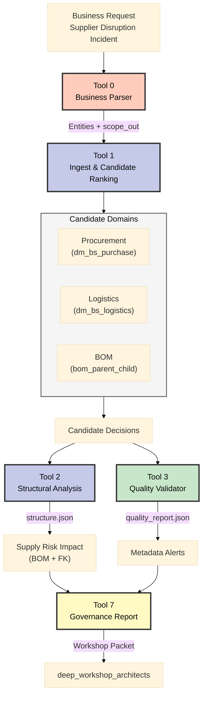

# Incident Scenario A – Supplier Disruption & Compliance

**Datum aktualizace:** 2025-11-06
**Business fokus:** Výpadek klíčového dodavatele (*NordMetal GmbH*) a nutnost rychlé reakce napříč procurement/logistika/BOM/compliance.

---

## Business Dopad (The Hook)

**Situace:** Pátek 05:45, NordMetal oznamuje 14denní odstávku galvanizační linky.

**Okamžité riziko:**
- 🚨 **28% produkce převodovek** ohroženo
- ⏱️ **6 dní** zásoby zbývá (logistics)
- 💰 **€2.5M+ denní ztráta** při zastavení výroby
- 📋 **3 projekty** (3V0, 3J0, 3P0) v riziku zpoždění SOP

**Klíčová otázka:** Jak rychle dokážeme identifikovat náhradní dodavatele a posoudit strukturální dopady na BOM?

---

## Timeline (T0–T4) – Od problému k rozhodnutí
- **T0 – 05:45 CET:** NordMetal oznamuje 14denní odstávku galvanizační linky → ohroženo 28 % produkce převodovek.
- **T1 – 06:00:** Procurement žádá alternativní dodavatele; logistika potvrzuje zásoby pouze na 6 dní; BOM tým identifikuje projekty k pozastavení.
- **T2 – 06:05:** Compliance upozorňuje, že přesměrování objednávek vyžaduje platné audity a RLS profily náhradních dodavatelů.
- **T3 – 06:10:** MCOP Tool 0–3 spuštěny → generují mapping kandidátů, strukturální analýzu, quality report a auditní log.
- **T4 – 06:40:** Artefakty předány architektům; rozhodnutí a mitigace zapsány do backlogu (SCR‑07) a prezentovány governance boardu.

---

## Link to SCR-06 – Proč tento incident vyžaduje novou architekturu?

### Problém (Business Perspektiva)

Dnešní stav: **Nevidíme dostatečně hluboko do supply chain**
- Procurement zná jen Tier 1 (NordMetal)
- Logistics nevidí, které sub-komponenty jsou kritické
- BOM tým nemá spojení dodavatel ↔ materiál ↔ projekt
- Při výpadku řešíme **ad-hoc 30+ minut** místo <5 minut

### Řešení (SCR-06 Use Case)

**SCR-06 (Mapping & Verification of Sub-Supplier Chains)** přináší:

1. **N-tier transparentnost** (Business value)
   - Viditelnost Tier 1 → Tier 2 → Tier 3
   - Okamžitá identifikace alternativních dodavatelů
   - Proaktivní SPOF detection (SCR-05)

2. **Data Infrastructure** (Co potřebujeme vybudovat)
   - **Bronze layer:** `sap_bom_structure` tabulka v Unity Catalog → čeká na ETL job
   - **Silver layer:** `ti_bom_usage_s` mapping (materiál ↔ dodavatel ↔ projekt)
   - **Gold layer:** Domain-specific views (Procurement, Logistics, Risk)

3. **Tool Integration** (Jak to funguje v praxi)
   - Tool 1 hledá kandidáty napříč Bronze sources
   - Tool 2 analyzuje strukturální dopady přes `ti_bom_usage_s`
   - Tool 3 ověřuje metadata quality (owner, security, descriptions)

### Workshop Fokus

Tento incident slouží jako **reálný use case** pro architektonická rozhodnutí:
- ❓ Multi-Gold (per domain) vs Shared Gold?
- ❓ SQL recursive CTEs nebo Neo4j graph database?
- ❓ Jak rychle dokážeme Bronze ingest implementovat?

Více detailů: [SCR-06/README.md](../../metadata_BOM/SCR-06/README.md)

---

## MCOP Pipeline (Tool 0–3)

---

## RACI (Incident A)

| Role                       | Hlavní úkol                                    | R   | A   | C   | I   |
| -------------------------- | ---------------------------------------------- | --- | --- | --- | --- |
| Enterprise Architect       | Facilitace workshopu, rozhodnutí o arch řešení | ✅   | ✅   | ✅   | ✅   |
| Data Steward (Procurement) | Validace dat, doplnění popisů                  | ✅   |     | ✅   | ✅   |
| Incident Manager           | Koordinace SLA, eskalace                       |     | ✅   | ✅   | ✅   |
| MCOP Orchestrator Owner    | Spuštění Tool 0–3, příprava artefaktů          | ✅   |     | ✅   |     |
| Security & Compliance Lead | Kontrola `securityClassification`, RLS návrh   |     | ✅   | ✅   | ✅   |
| Workshop Scribe            | Zápis rozhodnutí, action tracker               | ✅   |     |     | ✅   |

Legenda: R = Responsible, A = Accountable, C = Consulted, I = Informed

---

## Top Quality Flags (z `quality_report.json`)
1. **`description` coverage 5.8 %** – chybí popisy u `dimv_supplier`, `factv_purchase_order_item`; nutné pro sémantickou orientaci Tool 1/2.
2. **`ownerInSource` coverage 8.3 %** – bez vlastníků nelze rychle eskalovat; potřeba data stewardship plánu.
3. **`securityClassification` <1 %** – compliance nemá podklad pro RLS; doporučit prioritizaci Tool 4 (Security Analyzer).

---

## Prezentační Flow (Storytelling)

### Fáze 1: PROBLEM (Build Tension)
**Slide 1-2: Business Dopad**
- Začít čísly: €2.5M/den, 28% produkce, 6 dní zásoby
- Timeline T0-T4: Eskalace od 05:45 do 06:40 (55 minut)
- Ukázat chaos: Procurement, Logistics, BOM, Compliance každý v jiném systému

### Fáze 2: SOLUTION (Show the Way)
**Slide 3: MCOP Pipeline**
- Diagram: Tool 0→1→2→3→7 (vizuální uklidnění)
- Vysvětlit, jak MCOP agreguje data z procurement/logistics/BOM
- Zvýraznit: z 30+ minut na <5 minut response time

**Slide 4: Candidate Mapping**
- Výtah z `data/tool1/filtered_dataset.json`
- Ukázat confidence scores, filtrované kandidáty
- Business value: "3 alternativní dodavatelé za 2 minuty místo 2 hodin"

### Fáze 3: DEPTH (Technical Details)
**Slide 5: Structural Impact**
- Diagram z `data/tool2/structure.json`
- Které projekty (3V0/3J0/3P0) dotčeny?
- Jaké BOM nodes/components kritické?
- Vazba na SCR-06: "Potřebujeme `ti_bom_usage_s` Silver table"

**Slide 6: Quality & Governance**
- Top 3 Quality Flags (tabulka výše)
- Compliance risks (RLS, security classification)
- Zdůraznit: "Bez metadata quality nemůžeme incident řešit auditovatelně"

### Fáze 4: DECISION (Call to Action)
**Slide 7: Architecture Decisions**
- Link na SCR-06 key_decisions.md
- 4 kritická rozhodnutí (Bronze ownership, Gold architecture, Graph persistence, Timeline)
- Action tracker template

**Key Message:** "Tento incident není jen o toolingu – je o architektuře dat, která umožňuje rychlé rozhodování."

---

## Action Tracker (Template)

| #   | Rozhodnutí / úkol                                                | Owner                | Due date   | Stav | Poznámka              |
| --- | ---------------------------------------------------------------- | -------------------- | ---------- | ---- | --------------------- |
| 1   | Doplnit popisy pro `dimv_supplier` a `factv_purchase_order_item` | Data Steward         | 2025-11-09 | ☐    | Quality flag #1       |
| 2   | Připravit RLS návrh pro náhradní dodavatele                      | Security Lead        | 2025-11-08 | ☐    | Vyžaduje Tool 4 pilot |
| 3   | Zapsat follow-up story pro Tool 6 skripty (incident replay)      | Enterprise Architect | 2025-11-12 | ☐    | Navazuje na SCR‑07    |
| 4   | ...                                                              | ...                  | ...        | ...  | ...                   |

---
