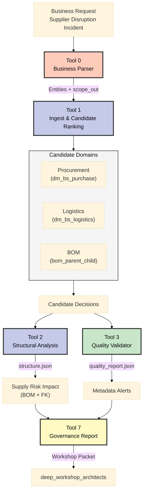

# Incident Scenario A – Supplier Disruption & Compliance

**Datum aktualizace:** 2025-11-06  
**Business fokus:** Výpadek klíčového dodavatele (*NordMetal GmbH*) a nutnost rychlé reakce napříč procurement/logistika/BOM/compliance.

---

## Timeline (T0–T4)
- **T0 – 05:45 CET:** NordMetal oznamuje 14denní odstávku galvanizační linky → ohroženo 28 % produkce převodovek.
- **T1 – 06:00:** Procurement žádá alternativní dodavatele; logistika potvrzuje zásoby pouze na 6 dní; BOM tým identifikuje projekty k pozastavení.
- **T2 – 06:05:** Compliance upozorňuje, že přesměrování objednávek vyžaduje platné audity a RLS profily náhradních dodavatelů.
- **T3 – 06:10:** MCOP Tool 0–3 spuštěny → generují mapping kandidátů, strukturální analýzu, quality report a auditní log.
- **T4 – 06:40:** Artefakty předány architektům; rozhodnutí a mitigace zapsány do backlogu (SCR‑07) a prezentovány governance boardu.

---

## MCOP Pipeline (Tool 0–3)

---

## RACI (Incident A)

| Role | Hlavní úkol | R | A | C | I |
|------|-------------|---|---|---|---|
| Enterprise Architect | Facilitace workshopu, rozhodnutí o arch řešení | ✅ | ✅ | ✅ | ✅ |
| Data Steward (Procurement) | Validace dat, doplnění popisů | ✅ |  | ✅ | ✅ |
| Incident Manager | Koordinace SLA, eskalace |  | ✅ | ✅ | ✅ |
| MCOP Orchestrator Owner | Spuštění Tool 0–3, příprava artefaktů | ✅ |  | ✅ |  |
| Security & Compliance Lead | Kontrola `securityClassification`, RLS návrh |  | ✅ | ✅ | ✅ |
| Workshop Scribe | Zápis rozhodnutí, action tracker | ✅ |  |  | ✅ |

Legenda: R = Responsible, A = Accountable, C = Consulted, I = Informed

---

## Top Quality Flags (z `quality_report.json`)
1. **`description` coverage 5.8 %** – chybí popisy u `dimv_supplier`, `factv_purchase_order_item`; nutné pro sémantickou orientaci Tool 1/2.
2. **`ownerInSource` coverage 8.3 %** – bez vlastníků nelze rychle eskalovat; potřeba data stewardship plánu.
3. **`securityClassification` <1 %** – compliance nemá podklad pro RLS; doporučit prioritizaci Tool 4 (Security Analyzer).

---

## Slide Skeleton (pro Incident A)
1. **Incident Timeline** – body T0–T4 + hlavní metriky dopadu.
2. **Candidate Mapping & Confidence** – výtah z `data/tool1/filtered_dataset.json`.
3. **Structural Impact** – diagram/screenshot z `data/tool2/structure.json`.
4. **Quality & Compliance Flags** – tabulka výše + doporučené kroky.
5. **Decision Summary** – doporučené mitigace, vazby na backlog (SCR‑07, Tool 4–6).

---

## Action Tracker (Template)

| # | Rozhodnutí / úkol | Owner | Due date | Stav | Poznámka |
|---|-------------------|-------|----------|------|----------|
| 1 | Doplnit popisy pro `dimv_supplier` a `factv_purchase_order_item` | Data Steward | 2025-11-09 | ☐ | Quality flag #1 |
| 2 | Připravit RLS návrh pro náhradní dodavatele | Security Lead | 2025-11-08 | ☐ | Vyžaduje Tool 4 pilot |
| 3 | Zapsat follow-up story pro Tool 6 skripty (incident replay) | Enterprise Architect | 2025-11-12 | ☐ | Navazuje na SCR‑07 |
| 4 | ... | ... | ... | ... | ... |

---
