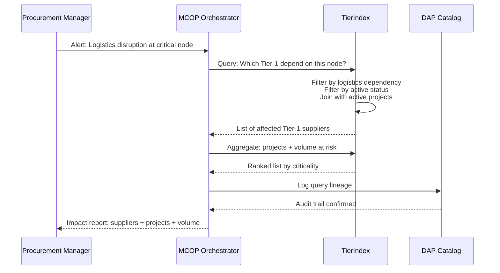
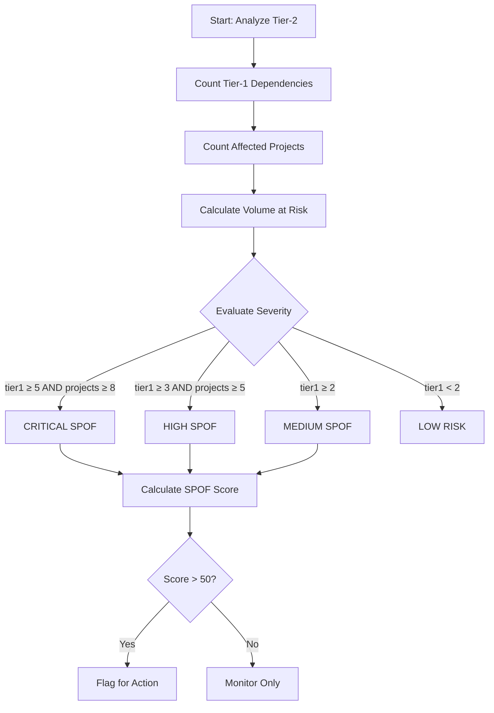

# Mapping & Verification of Sub-Supplier Chains
*Use Case: Transparency řetězce N-tier dodavatelů pro řízení rizik*

**Audience:** Deep Architects Workshop 2025-11-07
**Status:** Production-Ready Capability
**Business Owner:** Procurement Intelligence
**Technical Foundation:** TierIndex Data Platform

---

## 🌉 Mentální Most: TierIndex → MCOP → ML Monitoring

### Tři vrstvy architektury

**1. TierIndex (FOUNDATION) - Kde jsme dnes**
- Datová platforma s HS, WGR, BOM, Tier mappings
- Silver layer (normalizovaná data), Gold layer (předpočítané agregace)
- Umožňuje 4 capabilities: Mapping, Crisis, SPOF, Early Warning (rule-based)

**2. MCOP (ORCHESTRATOR) - Co přidá metadata kontext**
- LangGraph agent spojující TierIndex ↔ Collibra ↔ DAP Catalog ↔ DAP (SAP)
- Enrichment dat o quality scores, lineage, business metadata
- Feature Store pro historické snapshoty (základ pro ML)

**3. ML Monitoring (FUTURE VISION) - Proaktivní predikce**
- LightGBM model predikující supplier deterioration
- Alert pipeline s SHAP explanations (proč model varuje?)
- Automated retraining na nových datech

### Klíčový vhled
> *TierIndex je **CORE data asset**, MCOP je **HELPER orchestrator**. Bez foundation (TierIndex) nemá MCOP co orchestrovat. MCOP pomáhá udělat mentální most mezi daty a jejich významem - bez něj vzniká mentální gap pro ML modely.*

---

## 🎯 Business Context

### Business Goal

> **Potřebujeme stabilně vidět celý dodavatelský řetězec do hloubky a umět včas upozornit na skryté rizikové vzorce.**

**Typická očekávání businessu (klíčové scénáře):**
- **Onboarding screening**: Rychlé posouzení nového dodavatele - finanční zdraví, sankční riziko, vlastnická struktura, zkušenosti s podobnými díly
- **Subdodavatelský řetězec**: Kompletní mapování Tier-1 → Tier-2/3 s automatickou detekcí rizikových jurisdikcí, duplicitních závislostí, vendor lock-inu
- **Prevence výpadku**: Včasná detekce finančního zhoršení (payment delays, credit score trends, vlastnické změny) u stávajících dodavatelů
- **Kumulace rizik**: Identifikace skrytých SPOF (Single Point of Failure) - více Tier-1 dodavatelů spoléhá na stejného kritického Tier-2/3 subdodavatele
- **What-if modelování**: Simulace dopadů logistických disrupcí nebo trade embargo na portfolio dodavatelů

---

## 📊 Reference Scenario: Critical Logistics Disruption

### Situation

- **Trigger (modelový příklad):** Zpráva o disruption kritického logistického uzlu na omezenou dobu (např. přístav, hranice, dopravní koridor)
- **Business tlak:** Do několika minut vědět, kdo je zasažen, jaké díly/projekty jsou ohrožené a jaké existují alternativní trasy

**Questions we always expect:**
1. Které Tier-1 dodavatele (a jejich zakázky) závisí na tomto uzlu?
2. Jaký je jejich upstream (Tier-2/3) footprint a sdílí stejnou infrastrukturu?
3. Mají finanční problémy nebo sankční riziko, které by krizi zhoršilo?
4. Existují ověřené alternativy s jinou infrastrukturou a nižším rizikem?

### TierIndex Data Foundation

Náš systém staví na **TierIndex** - unifikované datové platformě pro procurement intelligence:

| **TierIndex Component**     | **Co obsahuje**                                           | **Kde používáme**                       | **Business Value**                                               |
| --------------------------- | --------------------------------------------------------- | --------------------------------------- | ---------------------------------------------------------------- |
| **HS Codes**                | 6-místné Harmonized System kódy pro každý obchodovaný díl | Celní data, importní záznamy            | Mapování "co" se obchoduje (např. XXXX.XX = kritické komponenty) |
| **WGR (Warengruppe)**       | Interní commodity taxonomy Škoda Auto                     | Interní katalogy, procurement kategorie | Napojení na business procesy (např. WGR "Elektrika" → HS 8544)   |
| **BOM (Bill of Materials)** | Hierarchie parent-child vztahů mezi díly                  | ----                                    | Propagace dopadu přes strukturu vozidla                          |
| **Tier1/2/3 Mappings**      | Relationship grafy mezi dodavateli                        | Sayari Trade API, DnB Family Tree       | Viditelnost "kdo dodává komu"                                    |
| **DnB Financial**           | Credit scores, failure risk, revenue, počet zaměstnanců   | DnB D&B Direct API                      | Finanční zdraví dodavatelů, early warning deterioration          |
| **Sayari Sanctions**        | Watchlist, UBO (ultimate beneficial owner), adverse media | Sayari Compliance API                   | Sankční riziko, vlastnická struktura, státní firmy               |

**Klíčový princip:** TierIndex data jsou **jádro**. Metadata Copilot (MCOP) je **helper orchestrátor**, který tyto strukturované data propojuje s externími metadata systémy (Collibra, DAP Catalog, SAP) a umožňuje jejich enrichment.

### Data Journey: Jak odpovídáme na otázky

#### Step 1: Identifikace ovlivněných Tier-1 dodavatelů

**UML Sequence Diagram:**


**Typical insight pack:**
- Seřazený seznam Tier-1 dodavatelů podle objemu nebo kritičnosti
- Počet projektů/dílů, které na nich závisí, a očekávaný dopad na dodávky
- Shrnutí doporučené reakce (aktivace alternativy, zvýšení zásob, vyjednání slotů)

---

#### Step 2: Mapování Tier-2/3 subdodavatelů (N-Tier Traversal)

**High-level orchestration:**
1. **TierIndex seed:** Vytáhnout plný profil Tier-1 dodavatele (identifikátory, smlouvy, projekty)
2. **External traversal:** Volat Sayari (nebo jiné zdroje) pro upstream graf do požadované hloubky a typu relací
3. **BOM propagation:** Ověřit, které díly/projekty jsou dotčené, a vypočítat dopad přes strukturální závislosti
4. **Confidence scoring:** Spojit signály do jednoho skóre, které říká, jak spolehlivý je obrázek supply chainu

**Network View (obecný formát):**

```
Tier-1 Supplier A (závislý na kritickém uzlu)
└── Tier-2 Supplier X (Region A) – ⚠️ exkluzivní dodavatel kritických komponent, žádná záloha
    └── Tier-3 Supplier X1 – geografické/politické riziko
└── Tier-2 Supplier Y (Region B) – ✅ více alternativ, diverzifikované
└── Tier-2 Supplier Z (Region C) – 🟠 sdílí stejnou infrastrukturu jako Supplier X
```

**MCOP Role:**
- 🔄 **Orchestruje** API calls mezi Sayari, DAP Catalog, Collibra
- 📊 **Enrichuje** network data s HS codes, WGR categories, BOM dependencies
- ✅ **Validuje** data quality a completeness skrze Collibra metadata
- 🔍 **Loguje** všechny transformace do DAP Catalog audit trail

---

#### Step 3: Automatická detekce rizik (Risk Pattern Recognition)

**MCOP Risk Detection Algorithms:**

##### **3A. Single Point of Failure (SPOF) Detection**

**UML Activity Diagram:**


**How we implement it (shrnutí):**
- Vstupy: počty napojených Tier-1 + projektů, kritičnost dílů, dostupnost alternativ a objem spendu
- Heuristiky: kombinace graph centrality + business pravidel (co je přijatelné, co už je SPOF)
- Výstup: seřazený seznam Tier-2 dodavatelů s kategoriemi (Critical / High / Monitor) a doporučeným dalším krokem

---

##### **3B. Geographic Clustering Risk**

- Využíváme prostorové clustering algoritmy (např. DBSCAN + haversine vzdálenost) k nalezení skupin subdodavatelů, kteří sdílí stejný region / infrastrukturu
- Každý cluster dostává atributy jako počet dodavatelů, sdílené projekty, spend share a kvalita infrastruktury
- Výstupem je heatmapa priorit, kde jedna geopolitická nebo počasím vyvolaná událost může zasáhnout celou skupinu

---

##### **3C. Vendor Lock-in Detection**

- Sledujeme kombinaci poptávky (měsíční objemy), lead time a počtu ověřených alternativ
- Pravidla lze snadno vysvětlit businessu: žádná alternativa = „critical lock-in“, jedna alternativa = „high lock-in“, dvě = „monitor“
- Report obsahuje jen díly, kde je potřeba akce (např. RFQ na druhého dodavatele, navýšení bezpečnostních zásob)

---

### Step 4: Impact Quantification & Decision Support

- Používáme jednoduché Monte Carlo / scénářové simulace: délka výpadku, úspěšnost alternativních tras, multiplikátory nákladů
- Každý běh vrací kombinaci produkční ztráty + mimořádných nákladů (expedice, zásoby, penalty)
- Report zobrazuje **mean / median / P95 / interval spolehlivosti** a rozklad podle nákladových složek, aby business okamžitě věděl, kde jednat

Příklad výstupu:
- Mean impact = významný finanční dopad (pokud se aktivují zálohy)
- Worst case = výrazně vyšší dopad, pokud zálohy selžou
- Doporučený krok = kombinace rychlých zásahů (expedice, rerouting) + strategických opatření (RFQ, audit zásob)

---

### Step 5: Automated Recommendations (Decision Support)

- Výstup je pochopitelné **playbook** v Markdown/Teams formátu: co udělat dnes, tento týden, tento měsíc
- Strukturu držíme konzistentní:
  - **Priority 1 (Okamžitě):** Např. ověřit zásoby, spustit rychlou logistickou změnu, potvrdit kapacity
  - **Priority 2 (Krátkodobě):** Zajistit diverzifikaci sítě, připravit backup lokace, sjednat dual-port strategie
  - **Priority 3 (Strategicky):** RFQ na nové dodavatele, redesign dílu, úprava smluv
- MCOP k doporučení vždy přikládá: zdroje dat, úroveň jistoty a kontakt odpovědného člověka

---

## 🔄 TierIndex + MCOP Architecture: How It Works Together

### Data Flow Diagram


### Key Principles

| Principle                   | Description                                                                                            | Example                                                                           |
| --------------------------- | ------------------------------------------------------------------------------------------------------ | --------------------------------------------------------------------------------- |
| **TierIndex = Truth**       | Veškerá procurement data (HS, WGR, BOM, Tier mappings) žijí v TierIndex jako single source of truth    | „HS kód X → anonymní Tier-2 → konkrétní projekt"                                  |
| **MCOP = Orchestrator**     | MCOP agent neukladá data, pouze orchestruje queries mezi TierIndex a external systems                  | MCOP nejdřív zavolá Sayari, pak Collibru, nakonec DAP Catalog pro audit           |
| **Metadata as Context**     | External systémy (Collibra, DAP Catalog) poskytují metadata kontext - data quality, lineage, ownership | Collibra dodá skóre kvality + čas posledního refreshu                             |
| **Real-time Orchestration** | MCOP reaguje na business events a dynamicky sestavuje N-tier analýzy                                   | „Port disruption alert" → MCOP spustí Tier-2/3 traversal → Risk detection → Alert |

---

## 🔮 Path to Predictive Monitoring

- **Dnes:** Reagujeme na události do minut, ale startujeme až po externím triggeru
- **Zítra:** Stejný orchestrátor (MCOP) sleduje signály průběžně a dokáže upozornit ještě před krizí
- **Co k tomu potřebujeme:** Historické snapshoty (feature store), kvalitní metadata z Collibry, jasné SLA pro data freshness a jednoduché workflow pro potvrzení alertu business týmem

### Jak vypadá „proaktivní alert"
- Popis dodavatele (anonymizovaný ID + Tier + commodity)
- Pravděpodobnost problému + očekávaný horizont (např. 10–14 dní)
- Hlavní faktory (logistika, finance, geopolitika, kvalita dat)
- Doporučené preventivní kroky (zásoby, alternativy, kontaktování projektů)

## 📈 Úspěch měříme trendově, ne přes jedna čísla

- **Rychlost odpovědi:** z hodin/dnů na minuty – cílem je, aby ad-hoc mapování trvalo méně než meeting
- **Pokrytí:** vyšší než 90 % Tier-2 pro kritické komodity, se sledovaným progressem po kvartálech
- **Signál vs. šum:** cílem je udržet falešné poplachy v nízkých desítkách procent a transparentně sdílet, proč alert vznikl
- **Finanční dopad:** sledujeme řádově milionové úspory (vyhnuté výpadky, méně expedited shippingu, lepší smlouvání) oproti nákladům na provoz platformy

## 🎓 Co si mají architekti odnést

1. **TierIndex jako jednotný zdroj pravdy** – HS, WGR, BOM a tier relationships musí být kurátorované a auditované
2. **MCOP = chytrá vrstva mezi daty a uživateli** – místo replikace dat propojujeme existující systémy a zajišťujeme audit
3. **Hybridní analytika** – kombinujeme relační pohledy (SQL) s grafovými traversalmi a přidáváme business pravidla jako kód
4. **Proaktivní mindset** – vše stavíme tak, aby šlo přepnout z reaktivních scénářů na prediktivní bez přepsání celého stacku

## 🔗 Diskusní otázky na workshop

- Jaké týmy vlastně spravují data potřebná pro TierIndex a jak sladíme jejich SLA?
- Které signály chceme mít v „watchlistu“ pro proaktivní monitoring (logistika, ESG, finance…)?
- Jaký governance model potřebujeme, aby business důvěřoval anonymizovaným alertům?
- Kde chceme čerpat kapacitu na historické snapshoty (Delta tables vs. feature store vs. Collibra views)?

---

**Document Version:** 1.1 (anonymised playbook)
**Last Updated:** 2025-11-07
