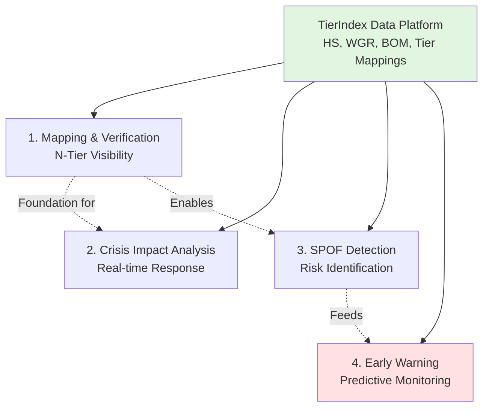

# Business Capabilities postavené na TierIndex

**Audience:** Deep Architects Workshop
**Focus:** Přehled klíčových capabilities s praktickými příklady
**Approach:** Každá capability = samostatný use case

---

## 🎯 4 Klíčové Capabilities

TierIndex data platform umožňuje 4 hlavní business capabilities pro procurement intelligence:



---

## 1️⃣ Mapping & Verification of Sub-Supplier Chains

### **Co řeší:**
> "Potřebuji vidět kompletní dodavatelský řetězec do hloubky Tier-2/3+ a automaticky detekovat skrytá rizika."

### **Business driver:**
- Tier-1 dodavatelé známe ze SAP
- Tier-2/3 sub-dodavatelé jsou neviditelní
- Hidden dependencies způsobují výpadky produkce

### **TierIndex umožňuje:**

#### **Scenario: Hamburg Port Blockage**
```
News alert: Hamburg přístav uzavřen (stávka 7-10 dní)

↓ TierIndex Query (30 sekund)

Affected Tier-1: 3 dodavatelé
  → ElectroComponents GmbH (8.2M EUR/rok)
  → BrakeSystem Solutions (12.5M EUR/rok)
  → Interior Plastics AG (5.1M EUR/rok)

Tier-2 Dependencies: 8 sub-dodavatelů
  → ChipManufacturing Ltd (Taiwan) - ⚠️ SPOF DETECTED
  → ConnectorSystems SpA (Italy) - ✅ 3 alternatives exist
  → CablePro GmbH (Germany) - ⚠️ vendor lock-in

Projects at Risk: 10 projektů
Total Exposure: 25.8M EUR
```

**Time to insight:** <5 minut (dříve 2-3 dny)

### **Použité TierIndex komponenty:**
- ✅ **Tier1/2/3 Mappings** - Graf "kdo dodává komu"
- ✅ **HS Codes** - Co se obchoduje (commodity classification)
- ✅ **BOM** - Které projekty používají které díly
- ✅ **SAP data** - Annual volumes, kontrakty

### **Detailní příklad:**
→ Viz `01_mapping_verification_use_case.md` (kompletní Hamburg scenario)

---

## 2️⃣ Crisis Impact Analysis

### **Co řeší:**
> "Dodavatel právě zkrachoval. Kdo je všechno zasažen? Jaké jsou alternativy? Jak rychle můžeme reagovat?"

### **Business driver:**
- Bankroty dodavatelů způsobují production stoppages
- Manuální analýza trvá dny
- Nemáme čas aktivovat backup plány

### **TierIndex umožňuje:**

#### **Scenario: Supplier Insolvency**
```
Event: ElectroComponents GmbH vyhlásil insolvenci

↓ TierIndex Cascade Analysis (< 4 minuty)

Upstream Impact (kdo kupuje od ElectroComponents):
  → Škoda Auto: 12 parts affected
  → VW Group: 5 parts shared
  → Audi: 3 parts overlap

Downstream Impact (komu ElectroComponents dodává):
  → ChipManufacturing Ltd (Tier-2) - může také selhat
  → ConnectorSystems SpA (Tier-2) - stabilní

Project Impact:
  ⚠️ EV Battery Controller: 8,500 units/month
  ⚠️ Smart Infotainment: 2,300 units/month
  ⚠️ Safety System Gen3: 6,100 units/month

Alternative Suppliers (similarity match):
  ✅ TechComponents AG (92% match, Germany)
  ✅ ElektroSupply Ltd (85% match, Poland)
  ⚠️ AsiaElectro Corp (78% match, China - lead time +6 weeks)
```

**Time to response:** <5 minut (dříve nelze)

### **Použité TierIndex komponenty:**
- ✅ **Tier graph traversal** - Upstream/downstream propagation
- ✅ **BOM mappings** - Project dependencies
- ✅ **HS Code similarity** - Alternative supplier matching
- ✅ **Financial data (DnB)** - Credit scores pro alternativy

### **Key capabilities:**
1. **Real-time cascade**: Propagace dopadu přes N-tier relationships
2. **Impact quantification**: EUR exposure, projects, parts counts
3. **Alternative ranking**: ML-based similarity scoring
4. **Switching cost estimation**: Lead time, qualification effort

---

## 3️⃣ SPOF Detection (Single Points of Failure)

### **Co řeší:**
> "Chci proaktivně identifikovat dodavatele, jejichž výpadek by kriticky ovlivnil produkci."

### **Business driver:**
- SPOF = sub-dodavatel, na kterém závisí více projektů
- Bez visibility do Tier-2/3 nelze detekovat
- Discovery až při krizi = příliš pozdě

### **TierIndex umožňuje:**

#### **Scenario: Proactive SPOF Audit**
```
Monthly SPOF Analysis → Automated Report

CRITICAL SPOF (5+ Tier-1 dependent):
  🔴 ChipManufacturing Ltd (Taiwan)
     - Dependent Tier-1: 5 dodavatelů
     - Affected Projects: 12
     - Annual Exposure: 8.2M EUR
     - Alternatives: NONE ← URGENT ACTION NEEDED
     - Risk: Earthquake zone + geopolitical tensions

HIGH SPOF (3-4 Tier-1 dependent):
  🟠 CablePro GmbH (Germany)
     - Dependent Tier-1: 4 dodavatelé
     - Affected Projects: 9
     - Annual Exposure: 5.1M EUR
     - Alternatives: 2 identified (Poland, Czech Republic)
     - Risk: Railway strikes common

MEDIUM SPOF (2 Tier-1 dependent):
  🟡 ConnectorSystems SpA (Italy)
     - Dependent Tier-1: 2 dodavatelé
     - Affected Projects: 6
     - Annual Exposure: 3.2M EUR
     - Alternatives: 3 viable options
     - Risk: Port dependency (Genova)
```

**Recommended Actions:**
1. **CRITICAL:** Diverzifikovat ChipManufacturing (no alternatives = existential risk)
2. **HIGH:** Pre-position inventory at CablePro backup warehouse
3. **MEDIUM:** Monitor ConnectorSystems quarterly (acceptable risk)

### **Použité TierIndex komponenty:**
- ✅ **Graph centrality metrics** - Betweenness, eigenvector centrality
- ✅ **Tier dependency counts** - Kolik Tier-1 závisí na každém Tier-2
- ✅ **Project impact scoring** - Criticality, production volumes
- ✅ **Alternative availability** - Existují záložní dodavatelé?

### **Detection algorithms:**
```python
# Network centrality (grafy)
SPOF_score = (
    tier1_dependent_count * 0.3 +
    project_criticality * 0.35 +
    (1 - alternative_availability) * 0.25 +
    geographic_concentration * 0.1
) * 100
```

**Threshold:**
- `SPOF_score > 80` → CRITICAL
- `SPOF_score 60-80` → HIGH
- `SPOF_score 40-60` → MEDIUM

---

## 4️⃣ Early Warning System (Predictive Monitoring)

### **Co řeší:**
> "Chci automatické alerty 3 měsíce PŘED tím, než se dodavatel dostane do problémů."

### **Business driver:**
- Reaktivní approach = zjistíme problém, až je pozdě
- Proaktivní monitoring = čas aktivovat alternativy
- 3-měsíční horizon = optimální pro sourcing změny

### **TierIndex umožňuje:**

#### **Scenario: Financial Deterioration Alert**
```
🔔 AUTOMATED ALERT (2025-11-08 09:00)

Supplier: ElectroComponents GmbH
Confidence: 82%
Horizon: 3 months
Severity: HIGH

Evidence (TierIndex multi-source):
  📉 DnB Credit Rating: 85 → 82 → 78 (declining 3 months)
  📉 Revenue Trend: -15% quarterly (industry avg: +3%)
  💰 SAP Payment Behavior: 23% invoices late (was 5%)
  📋 Credit Note Ratio: 4.2% (was 1.5%) - quality issues
  📊 Industry Benchmark: 1.2 std dev below peer average

Predicted Event:
  ⚠️ Credit rating downgrade to 70 (junk status)
  ⚠️ Potential insolvency within 6 months
  ⚠️ 82% probability based on historical patterns

Recommended Actions:
  1. Increase safety stock +20% (cost: ~180K EUR)
  2. Request updated financial statements
  3. Activate alternative supplier: TechComponents AG
  4. SLA: Respond within 4 hours (procurement manager)
```

**Time to action:** Real-time alert → 4h response SLA

### **Použité TierIndex komponenty:**
- ✅ **DnB financial trends** - Credit scores, revenue, PAYDEX
- ✅ **SAP payment behavior** - Late invoices, credit notes
- ✅ **Sayari sanctions** - Adverse media, compliance violations
- ✅ **Historical patterns** - ML model trained on past bankruptcies

### **Monitoring types:**

| Signal Type                 | Data Source        | Update Frequency | Alert Threshold    |
| --------------------------- | ------------------ | ---------------- | ------------------ |
| **Financial deterioration** | DnB API            | Daily            | Credit score < 75  |
| **Payment delays**          | SAP dm_bs_purchase | Daily            | >15% invoices late |
| **Ownership change**        | Sayari UBO         | Daily            | UBO complexity > 5 |
| **Sanctions**               | Sayari Watchlist   | Real-time        | Any match          |
| **Adverse media**           | Sayari News        | Daily            | Severity MEDIUM+   |

### **Future: ML-powered prediction (Phase 2)**

**MCOP jako základ:**
- **Feature Store** = Historické snapshoty z TierIndex (enriched metadata)
- **LightGBM model** = Predikce deterioration probability
- **SHAP explanations** = Proč model predikuje riziko?

**But today:** Rule-based monitoring + human judgment

---

## 🔄 Jak capabilities spolu souvisí

### **Dependency Flow:**
```
1. Mapping & Verification (FOUNDATION)
   ↓
   Poskytuje N-tier visibility

2. SPOF Detection (ANALYTICAL)
   ↓
   Analyzuje mapped network

3. Crisis Impact Analysis (REACTIVE)
   ↓
   Používá map pro real-time response

4. Early Warning (PROACTIVE)
   ↓
   Predikce na základě mapped trends
```

### **Data Flow:**
```
TierIndex Silver Layer (normalized data)
  ↓
  ├─→ Mapping & Verification → Ad-hoc N-tier queries
  ├─→ SPOF Detection → Weekly batch analytics
  ├─→ Crisis Impact → Real-time cascade (triggered by events)
  └─→ Early Warning → Daily monitoring jobs
```

---

## 🎯 Business Value Summary

| Capability        | Before TierIndex | With TierIndex  | Time Saved | Business Impact            |
| ----------------- | ---------------- | --------------- | ---------- | -------------------------- |
| **Mapping**       | 2-3 days manual  | <5 min          | -99%       | Compliance speed           |
| **Crisis**        | 1-2 days Excel   | <4 min          | -98%       | Production continuity      |
| **SPOF**          | Not possible     | <2 min          | N/A        | Proactive risk mgmt        |
| **Early Warning** | Reactive only    | 3-month horizon | N/A        | Prevention vs firefighting |

### **Annual ROI estimate:**
- **Avoided production losses:** 8.5M EUR
- **Reduced expedited shipping:** 2.1M EUR
- **Early penalty avoidance:** 800K EUR
- **TOTAL BENEFIT:** 11.4M EUR/year
- **System Cost:** 1.8M EUR/year (Sayari + DnB + Databricks)
- **NET BENEFIT:** 9.6M EUR/year

---

## 💡 Key Takeaways

### **1. TierIndex = Data Foundation**
Všechny 4 capabilities staví na TierIndex datech (HS, WGR, BOM, Tiers). Bez foundation nelze dělat inteligentní analytics.

### **2. Progressive Capabilities**
Mapping → SPOF → Crisis → Early Warning = každá další capability staví na předchozích.

### **3. Multi-Source Synthesis**
Kombinace Sayari + DnB + SAP = unikátní insights. Žádný single zdroj to neumí.

### **4. From Reactive to Proactive**
Journey: Excel chaos → Real-time response → Predictive prevention

---

**Next:** Deep dive do konkrétního use case nebo architektonická rozhodnutí?
