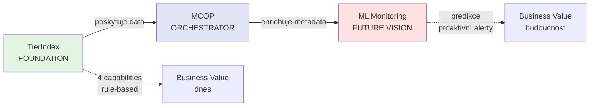
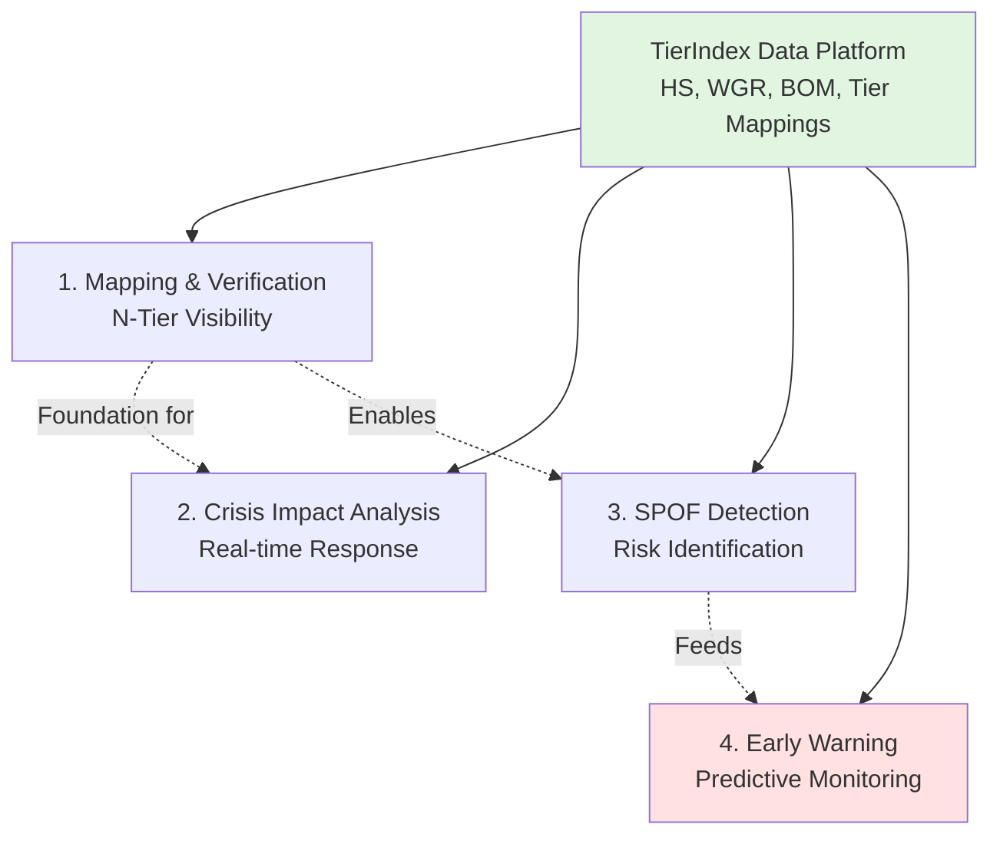

# Business Capabilities postavené na TierIndex

**Audience:** Deep Architects Workshop
**Focus:** Přehled klíčových capabilities s praktickými příklady
**Approach:** Každá capability = samostatný use case

---

## 🌉 Mentální Most: Od Foundation k ML Monitoring

### Architektonická progrese



### Vztah TierIndex ↔ MCOP ↔ ML

- **TierIndex = CORE asset**: Datová platforma (HS, WGR, BOM, Tiers), bez které nemůže existovat intelligence
- **MCOP = HELPER orchestrator**: Propojuje TierIndex s metadata systémy (Collibra quality, DAP Catalog lineage, SAP DAP)
- **ML Monitoring = FUTURE layer**: Staví na MCOP Feature Store (historické snapshoty + metadata kontext)

### Klíčové poučení
> *Nelze skipnout TierIndex (bez dat není co orchestrovat). MCOP pomáhá udělat mentální most mezi daty a jejich významem - bez něj vzniká mentální gap pro ML modely.*

---

## 🎯 4 Klíčové Capabilities

TierIndex data platform umožňuje 4 hlavní business capabilities pro procurement intelligence:



---

## 1️⃣ Mapping & Verification of Sub-Supplier Chains

### **Co řeší:**
> "Potřebuji vidět kompletní dodavatelský řetězec do hloubky Tier-2/3+ a automaticky detekovat skrytá rizika (finanční, sankční, strukturální)."

### **Business driver (klíčové scénáře):**
- **Onboarding screening**: Rychlé posouzení nového dodavatele - finanční zdraví, sankční riziko, vlastnická struktura
- **Subdodavatelský řetězec**: Kdo stojí za Tier-1, jsou tam rizikové jurisdikce nebo duplicitní závislosti?
- **Vendor lock-in prevence**: Detekce exkluzivních vazeb Tier-2/Tier-3 (patenty, recykláty, technologie)

### **TierIndex umožňuje:**

#### **Model Scenario: Disruption Signal Response**
- TierIndex průběžně sleduje standardizované signály o dodavatelském ekosystému (finanční, compliance, provozní trendy), nezávisle na konkrétním zdroji
- Jakmile kombinace signálů překročí prahovou hodnotu, automaticky se přepočítají vazby dotčených Tier-1 partnerů: jejich Tier-2/3 mapa, navázané projekty a objem ohrožených dílů
- Výstup během minut ukáže SPOF, indikace vendor lock-inu a informaci, zda už existují připravené alternativy nebo je nutné spustit nový akční krok

**Time to insight:** near real-time (dříve několik dní)

### **Použité TierIndex komponenty:**
- ✅ **Tier1/2/3 Mappings** - Graf "kdo dodává komu"
- ✅ **HS Codes** - Co se obchoduje (commodity classification)
- ✅ **BOM** - Které projekty používají které díly
- ✅ **SAP data** - Annual volumes, kontrakty
- ✅ **DnB financial data** - Credit scores, failure risk, počet zaměstnanců, revenue
- ✅ **Sayari sanctions** - Watchlist, UBO (ultimate beneficial owner), vlastnická struktura

### **Detailní příklad:**
→ Viz `01_mapping_verification_use_case.md` (anonymizovaný logistický playbook)

---

## 2️⃣ Crisis Impact Analysis

### **Co má tato capability pokrývat:**
> "Když dojde k náhlé ztrátě dodavatele (insolvence, sankce) nebo subdodavatele, systém automaticky ukáže dopad napříč projekty a identifikuje zasažené Tier-1 partnery."

### **Architektonický driver (klíčové scénáře):**
- **Supplier insolvence**: V případě bankrotu Tier-1/2/3 znovu propočítat upstream/downstream vztahy
- **Sankční riziko**: Subdodavatel uveden na sankční seznam → identifikovat všechny zasažené Tier-1 a projekty
- **Rapid response**: Data konzistentní napříč SAP, TierIndex, DnB, Sayari → odpověď během minut
- **Včetně nástrojáren**: Insolvence tooling dodavatele může zastavit celou výrobu nových dílů

### **TierIndex umožňuje:**

#### **Model Scenario: Supplier Insolvency**
- Insolvenční rejstřík hlásí problém u Tier-1 → TierIndex okamžitě spočítá upstream/downstream dopad
- Projekty, díly i sdílené platformy se vypíšou v pořadí kritičnosti a s požadovanou kapacitou náhradního řešení
- Algoritmus similarity zároveň nabídne ověřené alternativy včetně rizik (lead time, cena, compliance)

**Time to response:** velmi rychle (dříve několik dní)

### **Použité TierIndex komponenty:**
- ✅ **Tier graph traversal** - Upstream/downstream propagation
- ✅ **BOM mappings** - Project dependencies
- ✅ **HS Code similarity** - Alternative supplier matching
- ✅ **Financial data (DnB)** - Credit scores pro alternativy

### **Key capabilities:**
1. **Real-time cascade**: Propagace dopadu přes N-tier relationships
2. **Impact quantification**: EUR exposure, projects, parts counts
3. **Alternative ranking**: ML-based similarity scoring
4. **Switching cost estimation**: Lead time, qualification effort

---

## 3️⃣ SPOF Detection (Single Points of Failure)

### **Co řeší:**
> "Chci proaktivně identifikovat dodavatele, jejichž výpadek by kriticky ovlivnil produkci, včetně skryté kumulace rizik."

### **Business driver (klíčové scénáře):**
- **SPOF = sub-dodavatel**, na kterém závisí více projektů bez alternativ
- **Kumulace rizik**: Více Tier-1 dodavatelů spoléhá na stejného kritického Tier-2/3 subdodavatele
- **Geografická koncentrace**: Subdodavatelé ve stejném rizikovém regionu (geopolitické riziko, logistická závislost)
- **Discovery včas**: Detekce před krizí = čas na diverzifikaci sourcing

### **TierIndex umožňuje:**

#### **Scenario: Proactive SPOF Audit (budoucí stav)**
- Každý měsíc budeme generovat report, který zvýrazní Tier-2/3 entity s vysokou závislostí více projektů
- Každý záznam zůstane anonymizovaný (Supplier A/B/C) a ponese počet závislých Tier-1, projekty, volume at risk a stav alternativ
- Součástí výstupu bude vysvětlení důvodu rizika (např. jediná lokalita, regulatorní tlak, kvalita dat), aby architekti věděli, jaký pattern se má dál sledovat

**Recommended Actions (framework):**
1. **CRITICAL:** okamžitě hledat záložní zdroje a eskalovat do vedení
2. **HIGH:** udržovat zásoby/kapacitu a plánovat dual-sourcing
3. **MEDIUM:** mít připravené scénáře a monitorovat signály

### **Použité TierIndex komponenty:**
- ✅ **Graph centrality metrics** - Betweenness, eigenvector centrality
- ✅ **Tier dependency counts** - Kolik Tier-1 závisí na každém Tier-2
- ✅ **Project impact scoring** - Criticality, production volumes
- ✅ **Alternative availability** - Existují záložní dodavatelé?

### **Detection algorithms:**
```pseudo
// Network centrality (grafy)
SPOF_score = (
    tier1_dependent_count * 0.3 +
    project_criticality * 0.35 +
    (1 - alternative_availability) * 0.25 +
    geographic_concentration * 0.1
) * 100
```

**Threshold:**
- `SPOF_score > 80` → CRITICAL
- `SPOF_score 60-80` → HIGH
- `SPOF_score 40-60` → MEDIUM

---

## 4️⃣ Early Warning System (Predictive Monitoring)

### **Co řeší:**
> "Chci automatické alerty PŘED tím, než se dodavatel dostane do problémů (finanční deterioration, vlastnické změny, platební disciplína)."

### **Business driver (klíčové scénáře):**
- **Prevence výpadku**: Dodavatel zpožďuje fakturace nebo mění platební podmínky → včasná detekce problémů
- **Sledování stability klíčových dodavatelů**: Dlouhodobé monitorování rizikového skóre, vlastnické struktury, nových subdodavatelů
- **Proaktivní vs reaktivní**: Čas aktivovat alternativy místo hasení krizí
- **Trend analysis**: Srovnání vůči ostatním dodavatelům v kategorii

### **TierIndex umožňuje:**

#### **Scenario: Financial Deterioration Alert**
- Alert bude vznikat kombinací standardizovaných signálů (finanční trend, platební chování, historická spolehlivost TierIndex)
- Zobrazí anonymizovaný dodavatel, confidence skóre, očekávaný horizont a nejdůležitější důkazy
- Součástí má být doporučený „playbook“: ověřit finance, navýšit zásoby, připravit RFQ

**Time to action:** alert dorazí v reálném čase, reakce v krátkém časovém SLA

### **Použité TierIndex komponenty:**
- ✅ **DnB financial trends** - Credit scores, revenue, PAYDEX
- ✅ **SAP payment behavior** - Late invoices, credit notes
- ✅ **Sayari sanctions** - Adverse media, compliance violations
- ✅ **Historical patterns** - ML model trained on past bankruptcies

### **Monitoring types:**

| Signal Type                 | Data Source        | Update Frequency | Alert Threshold              |
| --------------------------- | ------------------ | ---------------- | ---------------------------- |
| **Financial deterioration** | DnB API            | Daily            | Credit score < 75            |
| **Payment delays**          | SAP dm_bs_purchase | Daily            | Vysoký podstan late payments |
| **Ownership change**        | Sayari UBO         | Daily            | UBO complexity > 5           |
| **Sanctions**               | Sayari Watchlist   | Real-time        | Any match                    |
| **Adverse media**           | Sayari News        | Daily            | Severity MEDIUM+             |

### **Future: ML-powered prediction (Phase 2)**

**MCOP jako základ:**
- **Feature Store** = Historické snapshoty z TierIndex (enriched metadata)
- **LightGBM model** = Predikce deterioration probability
- **SHAP explanations** = Proč model predikuje riziko?

**But today:** Rule-based monitoring + human judgment

---

## 🔄 Jak capabilities spolu souvisí

### **Dependency Flow:**
```
1. Mapping & Verification (FOUNDATION)
   ↓
   Poskytuje N-tier visibility

2. SPOF Detection (ANALYTICAL)
   ↓
   Analyzuje mapped network

3. Crisis Impact Analysis (REACTIVE)
   ↓
   Používá map pro real-time response

4. Early Warning (PROACTIVE)
   ↓
   Predikce na základě mapped trends
```

### **Data Flow:**
```
TierIndex Silver Layer (normalized data)
  ↓
  ├─→ Mapping & Verification → Ad-hoc N-tier queries
  ├─→ SPOF Detection → Weekly batch analytics
  ├─→ Crisis Impact → Real-time cascade (triggered by events)
  └─→ Early Warning → Daily monitoring jobs
```

---

## 🎯 Business Value Summary

| Capability        | Before TierIndex           | With TierIndex     | Time Saved         | Business Impact            |
| ----------------- | -------------------------- | ------------------ | ------------------ | -------------------------- |
| **Mapping**       | Několik dní manuální práce | Near real-time     | Dramatické snížení | Compliance speed           |
| **Crisis**        | Několik dní Excel práce    | Minuty             | Řádově             | Production continuity      |
| **SPOF**          | Not possible               | Minuty             | N/A                | Proactive risk mgmt        |
| **Early Warning** | Reactive only              | Dlouhodobý horizon | N/A                | Prevention vs firefighting |

### **Annual value (řádové odhady):**
- Vyhnuté výpadky výroby = většina benefitů (významné finanční úspory)
- Nižší expedited shipping a penále poskytují dodatečné procenta
- Náklady na platformu (data + compute) jsou výrazně nižší než ušetřené částky

---

## 💡 Key Takeaways

### **1. TierIndex = Data Foundation**
Všechny 4 capabilities staví na TierIndex datech (HS, WGR, BOM, Tiers). Bez foundation nelze dělat inteligentní analytics.

### **2. Progressive Capabilities**
Mapping → SPOF → Crisis → Early Warning = každá další capability staví na předchozích.

### **3. Multi-Source Synthesis**
Kombinace Sayari + DnB + SAP = unikátní insights. Žádný single zdroj to neumí.

### **4. From Reactive to Proactive**
Journey: Excel chaos → Real-time response → Predictive prevention

---

**Next:** Deep dive do konkrétního use case nebo architektonická rozhodnutí?
