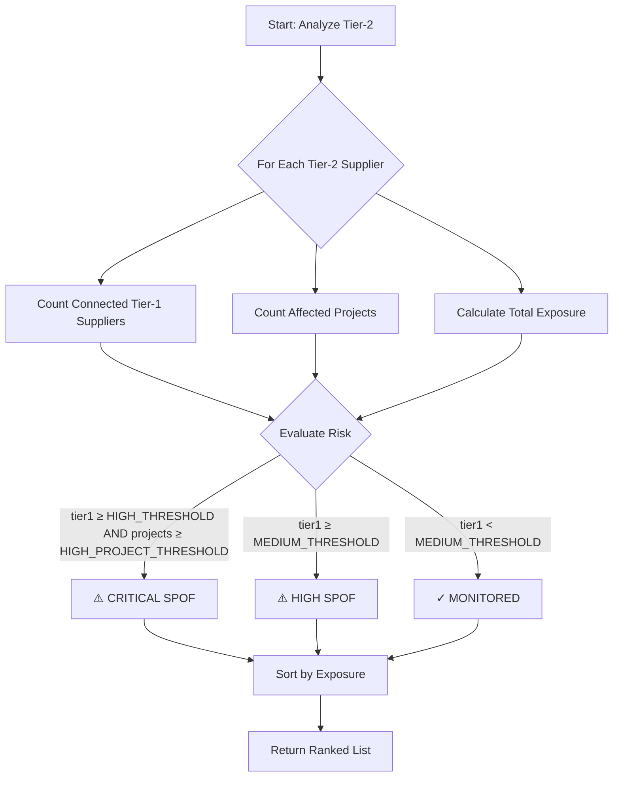
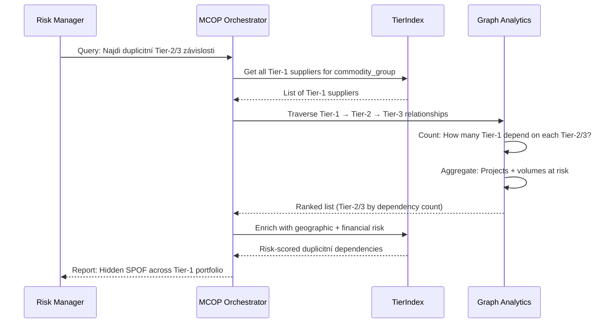

# TierIndex – Co to je a proč ho potřebujeme

**Audience:** Deep Architects Workshop
**Focus:** Praktické příklady použití TierIndex dat
**Level:** Conceptual s technickými detaily

---

## 🎯 Co je TierIndex?

> **TierIndex je unifikovaná datová platforma pro procurement intelligence – strukturovaná databáze 15 000+ dodavatelů, jejich vztahů, finančního zdraví a obchodních dat.**

### Jednoduše řečeno:
Když procurement manager nebo risk manager potřebuje odpověď typu:
- *"Kteří dodavatelé jsou závislí na čínských sub-dodavatelích?"*
- *"Které projekty jsou ohrožené, když dodavatel XYZ zkrachuje?"*
- *"Máme alternativy pro kritické komponenty z Ukrajiny?"*

...tak **TierIndex poskytuje data pro tyto odpovědi**.

---

## 💡 Proč TierIndex potřebujeme: 4 praktické příklady

> **Poznámka:** Níže uvedené situace jsou anonymizované modelové scénáře – čísla i názvy slouží jen jako ilustrace.

### **Příklad 1: "Rychlé posouzení nového dodavatele (onboarding screening)"**

**Modelová situace:**
Potřebujeme urychleně zařadit nového Tier-1 nebo Tier-2 dodavatele do výběrového řízení.

**Co nás zajímá:**
- Má dodavatel přímé nebo nepřímé sankční riziko?
- Je vlastněn firmou z rizikové jurisdikce?
- Má dostatečné finanční zdraví (credit score, revenue, failure risk)?
- Základní info: počet zaměstnanců, zkušenosti s podobnými díly?

**Bez TierIndex:**
- Manuální sběr dat z DnB, Sayari, SAP
- Nejasná vlastnická struktura (UBO není viditelný)
- Několik dní práce
- Riziko přehlédnutí skrytého sankčního propojení

**Co má TierIndex zajistit:**
- Jednotný dotaz spojující Sayari (UBO, watchlist), DnB (financials), SAP (historie), TierIndex (Tier relationships)
- Výstup: Supplier profile s finančním skóre, sankčním rizikem, vlastnickou strukturou, zkušenostmi (podobné HS kódy)
- Výsledek v řádu minut, aby nákupčí mohl rychle rozhodnout

#### **Co nám TierIndex poskytl:**
- ✅ **Sayari Sanctions** = Watchlist matching, UBO complexity, vlastnická struktura
- ✅ **DnB Financial** = Credit rating, failure score, revenue, počet zaměstnanců
- ✅ **HS Codes + Trade data** = Zkušenosti s podobnými commodities
- ✅ **Tier level** = Je to nový Tier-1 nebo skrytý Tier-3 subdodavatel?

---

### **Příklad 2: "Prevence výpadku – detekce zhoršení u stávajícího dodavatele"**

**Modelová situace:**
Dodavatel (Tier-1) začal zpožďovat fakturace nebo požádal o změnu platebních podmínek → žádáme okamžitou kontrolu finančního zdraví.

**Co nás zajímá:**
- Má finanční problémy? (credit score trend, failure risk)
- Je v systému varování o zhoršení solventnosti nebo pozdních platách?
- Je napojen na subdodavatele v rizikové zemi (geopolitické riziko)?
- Potřebujeme včas zvážit alternativy

**Bez TierIndex:**
- Projít SAP zakázky ručně
- Hledat BOM struktury v PLM systému
- Kontaktovat project managery
- 1-2 dny analýzy
- Mezitím produkce může stát

**Cílová funkčnost:**
- Jednotný dotaz kombinující DnB (financial trends), SAP (payment behavior), Sayari (UBO changes)
- Výstup: Financial deterioration alert s důkazy (credit score ↓, late payments ↑, revenue trend ↓)
- Automatické doporučení: ověřit finance, navýšit zásoby, připravit RFQ pro alternativy
- Odezva v minutách, aby navazující workflow (aktivace záložních zdrojů) mohlo běžet automatizovaně

#### **Co nám TierIndex poskytl:**
- ✅ **DnB financial trends** - Credit score timeline, failure risk, revenue trend
- ✅ **SAP payment behavior** - Late invoices, credit notes, platební disciplína
- ✅ **Sayari UBO** - Změny vlastnické struktury (nový fond, čínská entita?)
- ✅ **Tier-2/3 dependencies** - Subdodavatelský řetězec (geografické riziko)

---

### **Příklad 3: "Máme SPOF v dodavatelském řetězci?"**

**Business situace:**
Risk manager chce proaktivně identifikovat Single Points of Failure – subdodavatele, na kterých závisí více projektů a nemají alternativy.

**Bez TierIndex:**
- Teoreticky nelze zjistit (sub-dodavatelé jsou neviditelní)
- Tier-1 dodavatelé nesdílí své sub-dodavatele
- Discover SPOF až když nastane krize

**Co má TierIndex zvládnout:**

**UML Activity Diagram:**


**Pseudo-kód:**
```pseudo
FUNCTION detect_spof_in_tier2()
  FOR EACH tier2_supplier IN TierIndex.Tier2
    tier1_count = COUNT(connected Tier-1 suppliers)
    project_count = COUNT(affected projects via Tier-1)
    total_exposure = SUM(annual volumes from Tier-1)

    IF tier1_count >= HIGH_THRESHOLD AND project_count >= HIGH_PROJECT_THRESHOLD THEN
      risk_level = "CRITICAL_SPOF"
    ELSE IF tier1_count >= MEDIUM_THRESHOLD THEN
      risk_level = "HIGH_SPOF"
    ELSE
      risk_level = "MONITORED"
    END IF

    IF tier1_count >= MEDIUM_THRESHOLD THEN
      COLLECT: supplier_id, name, risk_level, tier1_count, project_count, exposure
    END IF
  END FOR
  SORT BY total_exposure DESC
  RETURN results
END FUNCTION
```

**Příklad výstupu:**
| Supplier (Tier-2)     | Tier-1 Dependent | Projects      | Exposure                | SPOF Level    |
| --------------------- | ---------------- | ------------- | ----------------------- | ------------- |
| Tier-2 Supplier Alpha | Vyšší počet      | Vyšší počet   | Významná finanční zátěž | CRITICAL_SPOF |
| Tier-2 Supplier Beta  | Střední počet    | Střední počet | Střední finanční zátěž  | HIGH_SPOF     |

**Čas:** Krátký horizont
**Akce:** Urgentně diverzifikovat sourcing pro CRITICAL_SPOF dodavatele

#### **Co nám TierIndex poskytl:**
- ✅ **Tier-1 → Tier-2 relationships** = Kdo dodává komu (visibility do sub-dodavatelů)
- ✅ **Network centrality** = Graph analytics pro SPOF detection
- ✅ **Exposure quantification** = Business impact v EUR

---

### **Příklad 4: "Který WGR commodity group je nejvíc rizikový?"**

**Business situace:**
Strategický procurement plánuje diverzifikaci. Chce vědět, které commodity skupiny mají nejvyšší koncentraci v rizikových regionech.

**Bez TierIndex:**
- Commodity groups (WGR) jsou v SAP
- Dodavatelé a jejich lokace jsou v jiném systému
- Ruční spojování dat z multiple systémů
- Týdny práce

**Cílové chování TierIndex:**

**Pseudo-kód:**
```pseudo
FUNCTION analyze_geographic_clustering_risk()
  // Definice rizikových regionů
  HIGH_RISK_COUNTRIES = ["RU", "BY", "UA", "CN"]
  MEDIUM_RISK_COUNTRIES = ["TR", "IN", "TH"]

  FOR EACH commodity_group IN TierIndex.WGR_CommodityGroups
    FOR EACH supplier IN commodity_group.suppliers
      country = supplier.country
      spend = supplier.annual_volume

      // Klasifikace rizika
      IF country IN HIGH_RISK_COUNTRIES THEN
        risk_level = "HIGH_RISK"
      ELSE IF country IN MEDIUM_RISK_COUNTRIES THEN
        risk_level = "MEDIUM_RISK"
      ELSE
        risk_level = "LOW_RISK"
      END IF

      // Agregace po commodity group + country
      AGGREGATE: commodity_group, country, supplier_count, total_spend, risk_level
    END FOR

    // Výpočet koncentrace
    FOR EACH country IN commodity_group.countries
      spend_share_pct = (country.spend / commodity_group.total_spend) * 100
      COLLECT: commodity_group, country, supplier_count, spend, risk_level, spend_share_pct
    END FOR
  END FOR

  FILTER BY risk_level IN ["HIGH_RISK", "MEDIUM_RISK"]
  SORT BY commodity_group, total_spend DESC
  RETURN results
END FUNCTION
```

**Příklad výstupu:**
| Commodity Group (WGR) | Country  | Suppliers     | Annual Spend    | Risk        | Share %             |
| --------------------- | -------- | ------------- | --------------- | ----------- | ------------------- |
| Elektrika             | Region A | Vyšší počet   | Významná částka | HIGH_RISK   | Vysoká koncentrace  |
| Plastové díly         | Region B | Střední počet | Střední částka  | MEDIUM_RISK | Střední koncentrace |
| Kovové komponenty     | Region C | Nižší počet   | Střední částka  | MEDIUM_RISK | Nižší koncentrace   |

**Čas:** Krátký horizont
**Akce:** Prioritizovat diverzifikaci "Elektrika" commodity (vysoká geografická koncentrace)

---

### **Příklad 5: "Proaktivní identifikace kumulace rizik napříč dodavateli" (Scénář 10)**

**Business situace:**
Máme několik Tier-1 dodavatelů pro podobné komodity (např. plastové komponenty). Chceme vědět, zda se více nezávislých Tier-1 dodavatelů nespoléhá na stejného kritického Tier-2/3 subdodavatele.

**Co nás zajímá:**
- Sdílí více Tier-1 dodavatelů stejného Tier-2 nebo Tier-3 subdodavatele?
- Jsou tyto subdodavatelé ve stejném geograficky rizikovém regionu?
- Jaké by byly dopady, kdyby tento společný Tier-2/3 subdodavatel náhle vypadl? Ovlivnilo by to více projektů současně?

**Bez TierIndex:**
- Tier-1 dodavatelé nesdílí své sub-dodavatele
- Nelze zjistit skryté duplicitní závislosti
- Discovery až při krizi (např. společný Tier-3 zkrachuje → zjistíme, že zasáhl 5 Tier-1 současně)

**Co má TierIndex zvládnout:**

**UML Sequence Diagram:**


**Příklad výstupu:**
| Tier-2/3 Supplier     | Dependent Tier-1 Count | Projects Affected | Geographic Risk | Financial Risk | SPOF Severity |
| --------------------- | ---------------------- | ----------------- | --------------- | -------------- | ------------- |
| Tier-2 Plastics Alpha | 4 Tier-1               | 9 projects        | HIGH (Region A) | MEDIUM         | CRITICAL      |
| Tier-3 Resin Beta     | 3 Tier-1               | 6 projects        | MEDIUM          | HIGH           | HIGH          |
| Tier-2 Tooling Gamma  | 2 Tier-1               | 3 projects        | LOW             | MEDIUM         | MEDIUM        |

**Klíčový insight:**
> Plastový subdodavatel "Tier-2 Plastics Alpha" je skrytý SPOF - pokud vypadne, zasáhne 4 nezávislé Tier-1 dodavatele současně. Nutná urgentní diverzifikace.

**Čas:** Minuty (graph traversal)
**Akce:** Dual-sourcing pro kritické plastové komponenty, audit závislostí

---

### **Příklad 6: "What-if modelování logistických disrupcí" (Scénář 13)**

**Business situace:**
Chceme se připravit na potenciální budoucí krize - co by se stalo, kdyby došlo k uzavření klíčového logistického uzlu (např. přístav, hranice, dopravní koridor)?

**Co nás zajímá:**
- Pokud by došlo k uzavření kritického logistického uzlu, dokáže systém odhadnout, kteří Tier-1 dodavatelé a které díly by byly nejrychleji zasaženy?
- Jak by se změnil rizikový profil portfolia dodavatelů, pokud by určitá země zavedla rozsáhlá obchodní omezení?

**Bez TierIndex:**
- Logistické trasy jsou implicitní (country of origin + import port)
- Nelze rychle simulovat what-if scénáře
- Ruční Excel modelování trvá dny

**Co má TierIndex zvládnout:**

**Pseudo-kód:**
```pseudo
FUNCTION simulate_logistics_disruption(disrupted_node_type, disrupted_location)
  // disrupted_node_type: "port", "border", "region"
  // disrupted_location: generic identifier (not specific Hamburg)

  affected_suppliers = []

  FOR EACH tier1 IN TierIndex.Tier1Suppliers
    // Check if Tier-1 depends on disrupted logistics node
    IF tier1.primary_logistics_dependency == disrupted_location THEN
      affected_suppliers.ADD(tier1)
    END IF

    // Check Tier-2/3 dependencies
    FOR EACH tier2 IN tier1.tier2_suppliers
      IF tier2.logistics_dependency == disrupted_location THEN
        affected_suppliers.ADD(tier1)  // Tier-1 indirectly affected
      END IF
    END FOR
  END FOR

  // Calculate impact
  FOR EACH supplier IN affected_suppliers
    projects = GET_PROJECTS(supplier)
    parts = GET_PARTS(supplier)
    volume_at_risk = SUM(supplier.annual_volumes)

    AGGREGATE: supplier, projects, parts, volume_at_risk, alternative_routes
  END FOR

  SORT BY volume_at_risk DESC
  RETURN what_if_scenario_report
END FUNCTION
```

**Příklad výstupu (what-if scénář):**
| Scenario                        | Affected Tier-1 | Projects | Parts at Risk       | Alternative Routes Available? |
| ------------------------------- | --------------- | -------- | ------------------- | ----------------------------- |
| Critical logistics node closure | 6 Tier-1        | 11       | Významný objem dílů | 3 Tier-1 ANO, 3 Tier-1 NE     |
| Trade embargo (Region A)        | 8 Tier-1        | 14       | Vysoký objem dílů   | 2 Tier-1 ANO, 6 Tier-1 NE     |

**Klíčový insight:**
> V případě uzavření kritického logistického uzlu by bylo zasaženo 6 Tier-1 dodavatelů, ale pouze 3 mají připravené alternativní trasy. Potřebujeme pre-planning pro zbývající 3 Tier-1.

**Čas:** Minuty (parametrický dotaz)
**Akce:** Připravit contingency plány, identifikovat alternativní logistické koridory

#### **Co nám TierIndex poskytl:**
- ✅ **WGR (Warengruppe)** = Škoda Auto commodity taxonomy
- ✅ **Country risk scoring** = Geopolitická rizika
- ✅ **Spend concentration** = Finanční exposure analytics

---

## 🧩 Co je uvnitř TierIndex: 4 datové komponenty

### **1. HS Codes (Harmonized System)**
**Co to je:** 6-místné mezinárodní kódy pro klasifikaci obchodovaného zboží
**Proč důležité:** Celní úřady, trade data, regulace

**Klíčová vlastnost - změna napříč tiery:**
> **Každý tier level má odlišný HS kód, protože produkt prochází transformací ve výrobním řetězci.**
> - Tier-3: `8542.31` (Integrated circuits - čipy)
> - Tier-2: `8512.20` (Elektronické moduly - sestavený kontroler)
> - Tier-1: `8708.29` (Kompletní brzdové komponenty - finální assembly)

**Příklad:**
- `8708.29` = Brzdové komponenty (Tier-1 assembly)
- `8542.31` = Integrated circuits (Tier-3 čipy)
- `8544.42` = Ignition wiring (Tier-2 kabeláž)

**Kde to používáme:**
- Sayari Trade API vrací HS kódy pro každý trade relationship
- Mapujeme dodavatele na HS kódy → vidíme "co vyrábějí" na každém tier levelu
- Compliance checks (EU import restrictions)

---

### **2. WGR (Warengruppe) – Commodity Taxonomy**

**Co to je:** Interní Škoda Auto kategorizace materiálů a dílů
**Proč důležité:** Business procesy, sourcing strategie, cost management

**Příklad:**
- `WGR-3400` = Elektrika a elektronika
- `WGR-5200` = Plastové díly interiér
- `WGR-6100` = Kovové komponenty chassis

**Kde to používáme:**
- Propojení mezi SAP (WGR) a external data (HS codes)
- Commodity-specific risk analysis
- Strategic sourcing decisions

**Mapping HS ↔ WGR:**
```
HS 8542.31 (Integrated Circuits) → WGR-3400 (Elektrika)
HS 8708.29 (Brakes) → WGR-6100 (Kovové komponenty)
```

---

### **3. BOM (Bill of Materials) – Part Hierarchies**

| **Aspekt**        | **Popis**                                                                                                |
| ----------------- | -------------------------------------------------------------------------------------------------------- |
| **Co to je**      | Kusovník - hierarchie parent-child vztahů mezi díly ve vozidle                                           |
| **Proč důležité** | Impact propagation ("Supplier A zkrachoval → Battery Pack + Infotainment blocked"), project dependencies |
| **Kde používáme** | Crisis impact analysis, alternative matching podle HS kódů                                               |

---

### **4. Tier1/2/3 Mappings – Supplier Relationships**

**Co to je:** Graf vztahů "kdo dodává komu"
**Proč důležité:** Visibility do sub-dodavatelů, cascade analysis

**Příklad grafu:**
```
Škoda Auto (zákazník)
├── Tier-1 Supplier (Tier-1)
│   ├── Supplier X (Tier-2) (Tier-2, Taiwan)
│   │   └── SiliconWafer Corp (Tier-3, South Korea)
│   └── Supplier Y (Tier-2) (Tier-2, Italy)
├── BrakeSystem Solutions (Tier-1)
│   └── Supplier D (Tier-2) (Tier-2, Czech Republic)
```

**Kde to používáme:**
- N-tier traversal: "Který Tier-3 dodavatel má sankce?"
- SPOF detection: "Supplier X dodává 5 Tier-1 → CRITICAL SPOF"
- Geographic clustering: "3 Tier-2 dodavatelé v Northern Italy → shared risk"

---

## 🔄 Jak získáváme TierIndex data: 3 zdroje

### **Zdroj 1: Sayari (Global Supply Chain Data)**

**Co poskytuje:**
- Ownership vztahy (UBO - Ultimate Beneficial Owner)
- Trade relationships (kdo obchoduje s kým)
- Sanctions & watchlist screening
- HS codes pro každý trade flow

**API endpoints:**
- `/v1/resolution` - Entity matching
- `/v1/supply_chain/upstream` - Tier-2/3 traversal
- `/v1/trade/search/suppliers` - Find suppliers by HS code

**Update frequency:** Denní polling (Notifications API) + měsíční baseline (Bulk Data)

**Příklad použití:**
> "Chci vědět, kdo jsou sub-dodavatelé Supplier A"
> → Sayari API vrátí graf upstream suppliers s HS kódy

---

### **Zdroj 2: Dun & Bradstreet (Financial Health)**

**Co poskytuje:**
- Credit ratings a failure scores
- Financial statements (revenue, profit, debt)
- Payment behavior (PAYDEX score)
- Corporate hierarchy (parent/subsidiary)

**API endpoints:**
- `/v1/data/duns/{duns}` - Company profile
- `companyinfo_L2_v1` - Financial metrics
- `financialstrengthinsight_L4_v1` - Risk indicators

**Update frequency:** Denní API calls pro monitorované dodavatele

**Příklad použití:**
> "Je Supplier A finančně zdravý?"
> → DnB vrátí: Credit rating nižší, Elevated failure score, Revenue trend klesající → **Rizikový dodavatel**

---

### **Zdroj 3: SAP (Internal Business Data)**

**Co poskytuje:**
- DUNS numbers našich Tier-1 dodavatelů (master data)
- Kontrakty, objednávky, faktury
- Delivery performance, quality scores
- Payment behavior (platí včas?)

**DAP Gold tables:**
- `dm_ba_purchase` - Purchase orders
- `dm_bs_purchase` - Invoices
- `dm_experience` - Historical performance

**Update frequency:** Denní ETL z SAP do DAP

**Příklad použití:**
> "Jak se Supplier A chová v platbách?"
> → SAP: Významný podstan faktur po splatnosti (předchozí baseline nízký) → **Deteriorating behavior**

---

## 🏭️ DAP Architecture: Bronze → Silver → Gold

### **Bronze Layer: Raw Data**
Surová data ze 3 zdrojů, immutable audit trail

```
staging_wsp.tierindex_bronze
├── sayari_raw (JSON responses z API)
├── dnb_raw (JSON responses z API)
└── sap_raw (CSV exports z DAP Gold)
```

**Update:** Denní append-only

---

### **Silver Layer: Normalized Tables**
Čisté, normalizované tabulky pro analytics

```
staging_wsp.tierindex_silver
├── ti_entity (20k dodavatelů, DUNS jako PK)
├── ti_edge (200k vztahů, Tier-1 → Tier-2/3)
├── ti_entity_risk (Risk atributy: sanctions, financial, UBO)
└── ti_entity_matches (Mapování Sayari entity_id ↔ SAP DUNS)
```

**Update:** Denní transformace z Bronze

---

### **Gold Layer: Pre-calculated Metrics**
Hotové metriky pro business users

```
staging_wsp.tierindex_gold
├── ti_spof_scores (Single Point of Failure rankings)
├── ti_geographic_clusters (Risk regions)
├── ti_commodity_exposure (WGR concentration analysis)
└── ti_manifest (Baseline version tracking)
```

**Update:** Týdně batch jobs

---

## 🤖 MCOP: Metadata Orchestrator pro TierIndex

### **Co je MCOP?**
> **Metadata Copilot (MCOP) je helper agent, který propojuje TierIndex data s metadata systémy (Collibra, DAP Catalog, DAP) a umožňuje jejich enrichment.**

### **MCOP ≠ TierIndex**
- **TierIndex** = Data platform (samotná data o dodavatelích)
- **MCOP** = Orchestrátor (propojuje data, enrichuje metadata, loguje transformace)

### **Příklad MCOP workflow:**

**Situace:** Procurement manager chce analýzu kritický evropský přístav port blockage

**MCOP orchestrace:**
1. **Query TierIndex** → Kteří Tier-1 používají kritický evropský přístav jako import port?
2. **Enrich s Collibra** → Jaká je data quality score pro tyto dodavatele?
3. **Query DAP Catalog** → Jaké HS kódy obchodují přes kritický evropský přístav?
4. **Query DAP (SAP)** → Jaké jsou annual volumes a projekty?
5. **Aggregate & synthesize** → Kompletní risk report
6. **Log to DAP Catalog** → Audit trail všech transformací

**Result:**
```json
{
  "affected_tier1": 3,
  "total_exposure": "Významná finanční zátěž",
  "projects_at_risk": 10,
  "mcop_metadata": {
    "data_quality_avg": 87,
    "collibra_verified": true,
    "unity_catalog_lineage": "bronze.sayari_raw → silver.ti_entity → gold.ti_exposure"
  }
}
```

### **MCOP jako základ pro proaktivní monitoring**

**Budoucí vize:**
MCOP metadata umožní **ML modely** predikovat supplier risks:

- **Feature Store** = Historické snapshoty z TierIndex (enriched MCOPem)
- **ML model** = Predikce deterioration 3 měsíce dopředu
- **Alert pipeline** = Notifikace procurement team

**Ale to je Phase 2!** Dnes se soustředíme na **TierIndex foundation**.

---

## 🎯 Shrnutí: Proč TierIndex potřebujeme

| Use Case                                 | Bez TierIndex            | Cílový stav TierIndex |
| ---------------------------------------- | ------------------------ | --------------------- |
| **Compliance check** (HS codes)          | 2-3 týdny manuálně       | <30 sekund SQL        |
| **Crisis impact** (dodavatel zkrachoval) | Několik dní analýzy      | Minuty                |
| **SPOF detection** (sub-dodavatelé)      | Nelze zjistit            | Minuty (graph query)  |
| **Commodity risk** (WGR clustering)      | Týdny multi-systém audit | Minuty (analytics)    |

### **TierIndex = Enabler pro:**
1. ✅ Rychlé odpovědi na komplexní dodavatelské otázky
2. ✅ Visibility do Tier-2/3 sub-dodavatelů
3. ✅ Risk quantification v business terms (EUR, projekty)
4. ✅ Foundation pro budoucí ML/prediktivní monitoring

---

**Next:** Podíváme se na konkrétní business capabilities postavené na TierIndex datech
