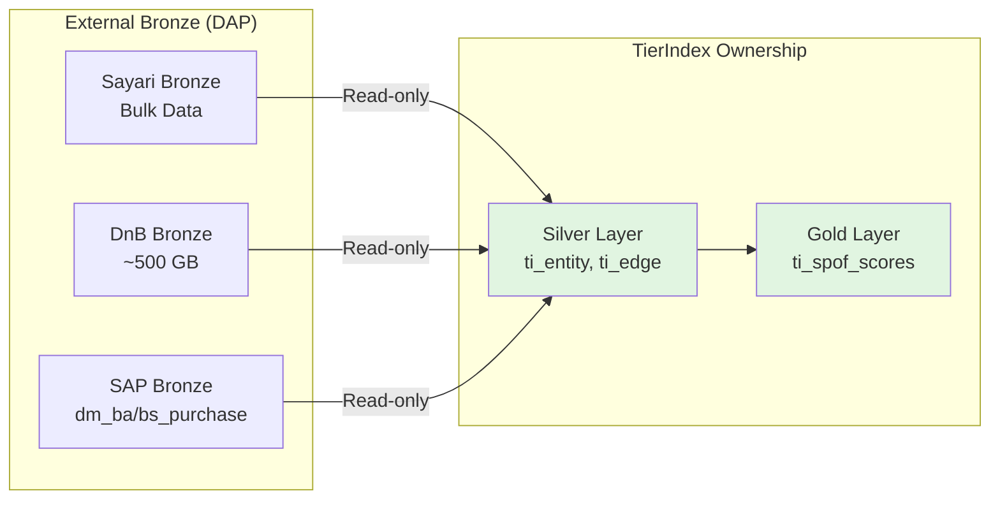
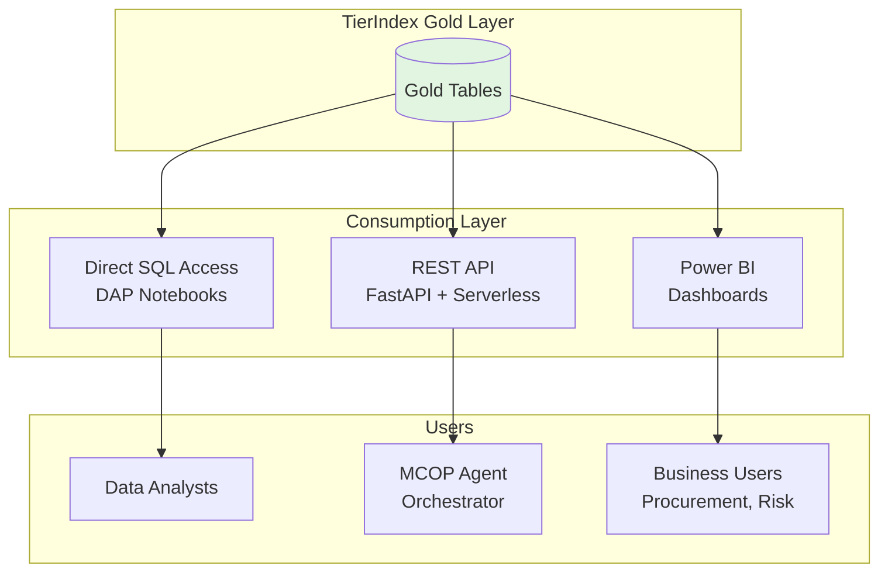

# Architektonická Rozhodnutí pro TierIndex

**Audience:** Deep Architects Workshop
**Focus:** Klíčová rozhodnutí s business rationale
**Level:** Strategic decisions, not implementation details

---

## 🎯 Scope: O čem rozhodujeme

TierIndex jako data platform vyžaduje rozhodnutí v 5 oblastech:

1. **Data Ownership** - Kdo vlastní a spravuje data?
2. **Update Strategy** - Jak často a jak refreshujeme?
3. **Storage Architecture** - Kde a jak ukládáme?
4. **Access Patterns** - Kdo a jak přistupuje k datům?
5. **Governance** - Jak zajistíme kvalitu a compliance?

---

## 1️⃣ Data Ownership: Bronze Layer Approach

### **Rozhodnutí:**
> **TierIndex vlastní transformace (Silver/Gold), ale NEvlastní raw data sources (Bronze).**

### **Rationale:**

#### **Proč NEvlastníme Bronze?**
```
Sayari Bulk Data: Velký objem dat
  ├─ Miliardy entit
  └─ Miliardy vztahů

Problém:
- Duplikace dat (Sayari má vlastní Bronze v DAP)
- Storage costs: Opakovaná replikace napříč prostředími
- Update complexity: Měsíční baseline refresh
```

#### **Řešení: Reference, Don't Copy**
```
TierIndex přístup:
  ✅ Reference existing Bronze (Sayari, DnB v DAP)
  ✅ Own transformations (Silver normalization)
  ✅ Own business logic (Gold aggregations)
  ❌ Don't duplicate raw data
```

### **Architecture Pattern:**


### **Implications:**

✅ **Pros:**
- No data duplication → cost savings
- Single source of truth (Sayari team maintains Bronze)
- Faster onboarding (no Bronze ingestion pipelines)

⚠️ **Cons:**
- Dependency on Sayari Bronze availability
- Can't control Bronze schema changes
- Need SLA agreements with data providers

### **Risk Mitigation:**
- **Fallback strategy:** Cache critical subsets in TierIndex Bronze if needed
- **SLA requirement:** Bronze uptime vysokou dostupnost
- **Change notifications:** Subscribe to schema evolution alerts

---

## 2️⃣ Update Strategy: Hybrid Refresh Pattern

### **Rozhodnutí:**
> **Měsíční baseline refresh (full) + denní incremental updates (deltas).**

### **Rationale:**

#### **Why Monthly Baseline?**
```
Sayari Bulk Data update frequency: Monthly
  → New snapshot každý měsíc
  → Delta exports NOT available (Sayari confirmed)

Options considered:
  ❌ Weekly full refresh → Sayari doesn't provide
  ❌ Delta-only updates → Risk of data drift
  ✅ Monthly baseline + daily deltas → Best of both worlds
```

#### **Why Daily Deltas?**
```
Use cases vyžadují freshness:
  - Early Warning: Denní monitoring supplier health
  - Sanctions screening: Real-time compliance checks
  - Crisis response: Up-to-date project mappings

Sources for deltas:
  ✅ Sayari Notifications API (risk changes)
  ✅ DnB API (daily credit score updates)
  ✅ DAP (SAP) Gold (daily ETL from dm_bs_purchase)
```

### **Implementation Pattern:**

```
TierIndex Update Cadence:

Month 1:
  Day 1:  Full baseline refresh
  Day 2:  Delta update (Sayari Notifications)
  Day 3:  Delta update
  ...
  Day 30: Delta update

Month 2:
  Day 1:  New baseline → replaces Month 1
  Day 2:  Delta update
  ...
```

### **Baseline Manifest Versioning (template):**
```json
{
  "manifest_id": "TierIndex_baseline_v<YYYY_MM>",
  "creation_date": "<timestamp>",
  "sources": {
    "sayari_bulk": "<snapshot_name>",
    "dnb_snapshot": "<yyy-mm-dd>",
    "sap_gold": "<table_version>"
  },
  "entity_count": <approx_supplier_count>,
  "edge_count": <approx_relationship_count>,
  "next_baseline": "<timestamp>"
}
```

### **Implications:**

✅ **Pros:**
- Fresh data for monitoring (daily deltas)
- Consistent baseline for analytics (monthly)
- Cost-effective (no continuous streaming)

⚠️ **Cons:**
- Eventual consistency (deltas lag ~1 day)
- Monthly compute spikes (baseline refresh)
- Complexity managing 2 update modes

---

## 3️⃣ Storage Architecture: DAP (Bronze/Silver/Gold)

### **Rozhodnutí:**
> **DAP Catalog on DAP platform (Bronze/Silver/Gold layers).**

### **Rationale:**

#### **Why DAP?**
```
Škoda Auto DAP standard:
  ✅ Already approved platform
  ✅ DAP Catalog governance
  ✅ Performance optimized (ACID, time travel)
  ✅ Compute + storage integrated

Alternative considered:
  ❌ Azure SQL - not designed for large-scale analytical workloads
  ❌ Neo4j - great for graphs, but not primary storage for ETL
  ❌ Synapse - DAP platform preference
```

#### **Layer Structure:**

```
DAP Catalog Hierarchy:

catalog: staging_wsp (TierIndex workspace)
├─ schema: tierindex_bronze
│  ├─ sayari_raw (external reference)
│  ├─ dnb_raw (external reference)
│  └─ sap_raw (external reference)
│
├─ schema: tierindex_silver
│  ├─ ti_entity (normalized suppliers)
│  ├─ ti_edge (relationships)
│  ├─ ti_entity_risk (risk attributes)
│  └─ ti_entity_matches (Sayari ↔ SAP mapping)
│
└─ schema: tierindex_gold
   ├─ ti_spof_scores (weekly refresh)
   ├─ ti_geographic_clusters (weekly)
   ├─ ti_commodity_exposure (weekly)
   └─ ti_manifest (baseline versions)
```

### **Delta Lake Benefits:**

| Feature               | Business Value                            |
| --------------------- | ----------------------------------------- |
| **ACID transactions** | No partial writes, data consistency       |
| **Time travel**       | Rollback bad transformations              |
| **Schema evolution**  | Add columns without breaking queries      |
| **Partitioning**      | Fast queries on subset (e.g., by country) |
| **Z-ordering**        | Optimized reads for common patterns       |

### **Partitioning Strategy:**

```pseudo
// ti_entity: Partition by country (for geographic queries)
CREATE TABLE ti_entity (
    supplier_id, duns, country, ...
) PARTITIONED BY (country)

// ti_edge: Partition by tier_level (for N-tier traversal)
CREATE TABLE ti_edge (
    source_id, target_id, tier_level, ...
    // tier_level: 1=Tier1→Tier2, 2=Tier2→Tier3
) PARTITIONED BY (tier_level)
```

### **Implications:**

✅ **Pros:**
- DAP compliance (no platform exceptions)
- Built-in governance (DAP Catalog)
- Cost-efficient (serverless compute)
- Developer-friendly (SQL + Python notebooks)

⚠️ **Cons:**
- Learning curve (DAP specifics)
- Vendor lock-in (but acceptable given DAP strategy)

---

## 4️⃣ Access Patterns: Multi-Layer Consumption

### **Rozhodnutí:**
> **3 consumption layers: Direct SQL, API, Power BI dashboards.**

### **Rationale:**

#### **Why Multiple Access Patterns?**
```
Different users → Different needs:

1. Data Analysts → SQL queries (ad-hoc exploration)
2. Applications → REST API (orchestration, alerts)
3. Business Users → Power BI (dashboards, reports)
```

### **Architecture:**



### **Access Pattern Details:**

#### **Pattern 1: Direct SQL (Analysts)**
```pseudo
// DAP notebook přístup
CONNECT TO TierIndex.Gold
QUERY:
  SELECT supplier_name, spof_score, tier1_dependent_count
  FROM ti_spof_scores
  WHERE spof_score > 70
  ORDER BY spof_score DESC
DISPLAY results
```

**Use cases:** Ad-hoc analytics, data exploration, debugging

---

#### **Pattern 2: REST API (Applications)**
```pseudo
// FastAPI endpoint (Azure Functions)
ENDPOINT: GET /api/v1/suppliers/{supplier_id}/risk

FUNCTION get_supplier_risk(supplier_id):
  CONNECT TO TierIndex.Gold

  QUERY:
    SELECT * FROM ti_spof_scores
    WHERE supplier_id = {supplier_id}

  result = FETCH_ONE()
  RETURN JSON: {supplier_id, risk_score, tier1_count, exposure}
END FUNCTION
```
```

**Use cases:** MCOP orchestration, alert pipelines, integrations

---

#### **Pattern 3: Power BI (Business Users)**
```
Power BI Desktop:
  → Data Source: DAP (DAP Catalog)
  → Tables: tierindex_gold.*
  → Refresh: Daily (scheduled)
  → Dashboards: SPOF Overview, Geographic Risk, Supplier Health
```

**Use cases:** Executive dashboards, KPI tracking, reports

### **Implications:**

✅ **Pros:**
- Flexibility (right tool for right job)
- No bottlenecks (direct access for analysts)
- Self-service BI (Power BI for business)

⚠️ **Cons:**
- Multiple integration points to maintain
- Access control complexity (3 layers)
- API performance tuning needed

---

## 5️⃣ Governance: DAP Catalog + Metadata

### **Rozhodnutí:**
> **DAP Catalog as single source of truth for metadata governance.**

### **Rationale:**

#### **Governance Requirements:**
```
DAP Compliance mandates:
  ✅ Data lineage tracking
  ✅ Access control (RBAC)
  ✅ Audit logs
  ✅ Data quality metrics
  ✅ Schema versioning
```

#### **DAP Catalog Features:**

| Capability     | TierIndex Implementation                       |
| -------------- | ---------------------------------------------- |
| **Lineage**    | Bronze → Silver → Gold tracked automatically   |
| **RBAC**       | Role: `tierindex_reader`, `tierindex_admin`    |
| **Audit**      | Query logs in DAP Catalog audit table          |
| **Quality**    | Data quality checks in Silver layer validation |
| **Versioning** | Time travel + manifest versions                |

### **Metadata Catalog Structure:**

```
DAP Catalog Metadata:

staging_wsp.tierindex_silver.ti_entity:
  - Description: "Normalized supplier entities (Tier 1-3)"
  - Owner: "tierindex-team"
  - Tags: ["procurement", "supplier", "pii"]
  - Lineage: bronze.sayari_raw → silver.ti_entity → gold.ti_spof_scores
  - Quality Metrics:
      - Completeness: Vysoká pokrytí (DUNS populated)
      - Freshness: <24h (last update)
      - Accuracy: Vysoká přesnost (data quality score)
```

### **Access Control Example:**

```pseudo
// DAP Catalog RBAC struktura

// Grant read access to procurement team
GRANT SELECT ON ti_spof_scores TO "procurement-readers"

// Grant admin access to TierIndex team
GRANT ALL_PRIVILEGES ON tierindex_silver TO "tierindex-admins"

// Deny direct Bronze access (use references only)
REVOKE ALL_PRIVILEGES ON tierindex_bronze FROM "all-users"
```

### **Implications:**

✅ **Pros:**
- DAP compliant (no exceptions needed)
- Centralized governance (one system)
- Automated lineage (no manual documentation)

⚠️ **Cons:**
- DAP Catalog learning curve
- Migration effort (if changing schemas)

---

## 🎯 Decision Summary Matrix

| Decision Area        | Choice                   | Alternative Considered | Why Chosen                 |
| -------------------- | ------------------------ | ---------------------- | -------------------------- |
| **Bronze Ownership** | Reference external       | Own Bronze copies      | Cost + avoid duplication   |
| **Update Strategy**  | Monthly + daily deltas   | Weekly full refresh    | Balance freshness vs cost  |
| **Storage**          | DAP (Bronze/Silver/Gold) | Azure SQL, Neo4j       | DAP standard + performance |
| **Access Patterns**  | SQL + API + Power BI     | API-only               | Flexibility for users      |
| **Governance**       | DAP Catalog              | Custom metadata        | DAP compliance             |

---

## 💡 Key Takeaways

### **1. Reference, Don't Duplicate**
Bronze layer ownership avoided → cost savings + simplicity

### **2. Hybrid Refresh = Best of Both Worlds**
Monthly baseline (consistency) + daily deltas (freshness)

### **3. Multi-Layer Access = Flexibility**
Analysts SQL, Apps API, Business Power BI → každý má co potřebuje

### **4. Governance from Day 1**
DAP Catalog není afterthought - built-in governance

### **5. DAP Alignment = No Exceptions**
Všechna rozhodnutí align s DAP standardy → rychlejší approval

---

## ❓ Open Discussion Points

### **For Workshop:**

1. **Bronze reference strategy:**
   - Comfortable s dependency na Sayari Bronze SLA?
   - Potřebujeme fallback cache pro critical queries?

2. **Update frequency:**
   - Je denní delta dostatečná pro Early Warning?
   - Nebo potřebujeme některé signals real-time (streaming)?

3. **Access control:**
   - Kdo má access k Silver (raw normalizovaná data)?
   - Jen Gold pro business users, nebo i Silver pro analysts?

4. **Cost optimization:**
   - Měsíční baseline refresh → jak estimovat compute costs?
   - Partition pruning strategy pro common queries?

5. **Future evolution:**
   - Máme plán pro škálování (30k+ suppliers)?
   - Jak migrovat, když Sayari změní schema?

---

**Next:** Executive summary a roadmap k proaktivnímu monitoringu
