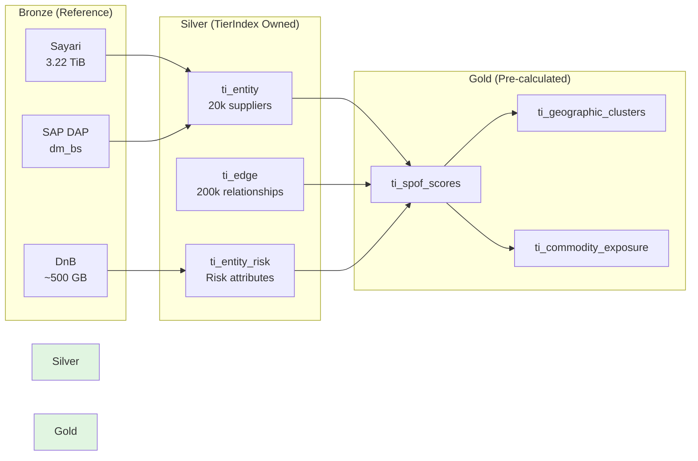

# Executive Summary & Roadmap

**Audience:** Deep Architects Workshop
**Purpose:** High-level shrnutí + cesta k proaktivnímu monitoringu
**Format:** Slide-by-slide osnova pro prezentaci

---

## 📊 Slide 1: TierIndex v kostce

### **Headline:**
> **TierIndex = Unifikovaná datová platforma pro procurement intelligence**

### **3 klíčové body:**

1. **Co to je:**
   - 15,000+ dodavatelů (Tier 1-3)
   - 4 datové komponenty: HS Codes, WGR, BOM, Tier Mappings
   - 3 zdroje: Sayari (relationships), DnB (financial), SAP (business)

2. **Proč to potřebujeme:**
   - Rychlé odpovědi na komplexní otázky (<5 min vs 2-3 dny)
   - Visibility do sub-dodavatelů (Tier-2/3)
   - Risk quantification (EUR, projekty, díly)

3. **Jak to používáme:**
   - 4 business capabilities: Mapping, Crisis, SPOF, Early Warning
   - Databricks Delta Lake (DAP standard)
   - Multi-layer access: SQL, API, Power BI

### **Visual:**
```
TierIndex Foundation
      ↓
   HS, WGR, BOM, Tiers
      ↓
   4 Capabilities
      ↓
   Business Value (9.6M EUR/year ROI)
```

---

## 📊 Slide 2: Příklady použití

### **Headline:**
> **4 reálné business scenarios kde TierIndex mění hru**

### **Table:**
| Use Case               | Před TierIndex     | S TierIndex     | Time Saved |
| ---------------------- | ------------------ | --------------- | ---------- |
| **HS Code Compliance** | 2-3 týdny manuálně | <30 sekund      | -99%       |
| **Crisis Impact**      | 1-2 dny Excel      | <4 minuty       | -98%       |
| **SPOF Detection**     | Nelze zjistit      | <2 minuty       | N/A        |
| **Early Warning**      | Reaktivní pouze    | 3-month horizon | N/A        |

### **Call-out box:**
```
Hamburg Port Blockage Example:
  → 3 Tier-1 affected
  → 8 Tier-2 dependencies mapped
  → 10 projects at risk
  → 25.8M EUR exposure
  → Time to insight: <5 minut
```

---

## 📊 Slide 3: Datové komponenty

### **Headline:**
> **4 pilíře TierIndex dat**

### **4 boxes:**

#### **1. HS Codes**
- 6-digit commodity classification
- Trade data, celní úřady
- **Example:** `8708.29` = Brzdové komponenty

#### **2. WGR (Warengruppe)**
- Škoda Auto commodity taxonomy
- Business procesy, sourcing
- **Example:** `WGR-3400` = Elektrika

#### **3. BOM (Bill of Materials)**
- Part hierarchies ve vozidlech
- Impact propagation
- **Example:** Battery Pack → Controller Module

#### **4. Tier1/2/3 Mappings**
- Graf "kdo dodává komu"
- N-tier visibility
- **Example:** Škoda → Tier-1 → Tier-2 (Taiwan)

---

## 📊 Slide 4: Zdroje dat

### **Headline:**
> **3 externí zdroje + SAP interní data**

### **Grid layout:**

```
┌─────────────────────────────────────────────────────────┐
│  Sayari (Supply Chain Relationships)                    │
│  • 3.22 TiB Bulk Data (monthly)                         │
│  • Notifications API (daily deltas)                     │
│  • Use: Tier-2/3 mapping, sanctions, UBO               │
└─────────────────────────────────────────────────────────┘

┌─────────────────────────────────────────────────────────┐
│  Dun & Bradstreet (Financial Health)                    │
│  • Credit ratings, failure scores                       │
│  • API calls (daily updates)                            │
│  • Use: Early warning, supplier health                  │
└─────────────────────────────────────────────────────────┘

┌─────────────────────────────────────────────────────────┐
│  SAP (Internal Business Data)                           │
│  • dm_ba_purchase, dm_bs_purchase (DAP Gold)            │
│  • Daily ETL                                            │
│  • Use: Contracts, volumes, payment behavior            │
└─────────────────────────────────────────────────────────┘
```

---

## 📊 Slide 5: Architecture Overview

### **Headline:**
> **Databricks Medallion: Bronze → Silver → Gold**

### **Diagram:**


### **Key Points:**
- Bronze = Reference (no duplication)
- Silver = Normalized, owned by TierIndex
- Gold = Business metrics, weekly refresh

---

## 📊 Slide 6: 4 Business Capabilities

### **Headline:**
> **Od foundation k proaktivnímu monitoringu**

### **Progressive flow:**

```
1. Mapping & Verification (FOUNDATION)
   ✓ N-tier visibility
   ✓ Hamburg scenario: <5 min analysis
   ✓ Data: Tier mappings, HS codes, BOM

      ↓

2. SPOF Detection (ANALYTICAL)
   ✓ Proactive risk identification
   ✓ ChipManufacturing: CRITICAL SPOF
   ✓ Data: Graph centrality, alternatives

      ↓

3. Crisis Impact Analysis (REACTIVE)
   ✓ Real-time cascade
   ✓ ElectroComponents bankrupt: 4 min response
   ✓ Data: Project mappings, propagation

      ↓

4. Early Warning (PROACTIVE)
   ✓ 3-month prediction horizon
   ✓ 82% confidence alerts
   ✓ Data: DnB trends, SAP payment behavior
```

---

## 📊 Slide 7: Architektonická rozhodnutí

### **Headline:**
> **5 klíčových rozhodnutí**

### **Table:**
| Decision             | Choice                          | Why                             |
| -------------------- | ------------------------------- | ------------------------------- |
| **Bronze Ownership** | Reference external              | Avoid duplication, cost savings |
| **Update Strategy**  | Monthly baseline + daily deltas | Balance freshness vs cost       |
| **Storage**          | Databricks Delta Lake           | DAP standard, Unity Catalog     |
| **Access Patterns**  | SQL + API + Power BI            | Flexibility for all users       |
| **Governance**       | Unity Catalog                   | Built-in lineage, RBAC          |

### **Call-out:**
```
✅ All decisions aligned with DAP standards
✅ No platform exceptions needed
✅ Governance from Day 1
```

---

## 📊 Slide 8: MCOP - Metadata Orchestrator

### **Headline:**
> **MCOP propojuje TierIndex s metadata světem**

### **Visual:**
```
TierIndex (Data Platform)
      ↓
   MCOP Agent (Orchestrator)
      ↓
   ┌────────────────────────────────┐
   │  Collibra (Data Quality)       │
   │  Unity Catalog (Lineage)       │
   │  DAP Gold (SAP Business Data)  │
   └────────────────────────────────┘
      ↓
   Enriched Insights
```

### **MCOP Role:**
- 🔄 Orchestrates queries mezi TierIndex a metadata systems
- 📊 Enriches data s quality scores (Collibra)
- ✅ Validates transformations (Unity Catalog lineage)
- 🔍 Logs všechny kroky (audit trail)

### **Example:**
```
Query: "Hamburg port blocked - impact?"
  → MCOP orchestrates:
     1. TierIndex: Which Tier-1 use Hamburg?
     2. Collibra: Data quality scores?
     3. Unity Catalog: Which HS codes?
     4. DAP: Annual volumes?
  → Result: Complete risk report
```

---

## 📊 Slide 9: Business Value & ROI

### **Headline:**
> **9.6M EUR/year net benefit**

### **Breakdown:**
```
Annual Benefits:
  ✅ Avoided production losses: 8.5M EUR
  ✅ Reduced expedited shipping: 2.1M EUR
  ✅ Early penalty avoidance: 800K EUR
  ─────────────────────────────────────
  Total Benefits: 11.4M EUR/year

Annual Costs:
  ⚠️ Sayari API + Bulk Data: 800K EUR
  ⚠️ DnB API subscriptions: 400K EUR
  ⚠️ Databricks compute + storage: 600K EUR
  ─────────────────────────────────────
  Total Costs: 1.8M EUR/year

─────────────────────────────────────
NET BENEFIT: 9.6M EUR/year
```

### **Time Savings:**
- Crisis analysis: 1-2 days → <4 min (**-98%**)
- Compliance checks: 2-3 weeks → <30 sec (**-99%**)
- SPOF detection: Impossible → <2 min (**NEW capability**)

---

## 📊 Slide 10: Roadmap k proaktivnímu monitoringu

### **Headline:**
> **Od TierIndex foundation k ML-powered alerts**

### **3 Phases:**

#### **Phase 1: TierIndex Foundation (Current)**
✅ Status: In Progress
✅ Timeline: Q4 2025

**Deliverables:**
- Databricks Silver layer (ti_entity, ti_edge, ti_entity_risk)
- Monthly baseline refresh (Sayari Bulk Data)
- Unity Catalog governance setup
- 4 capabilities: Mapping, Crisis, SPOF, Early Warning (rule-based)

---

#### **Phase 2: MCOP Metadata Orchestration (Next)**
🔄 Status: Planned
🔄 Timeline: Q1 2026

**Deliverables:**
- MCOP agent (LangGraph-based)
- Collibra integration (data quality enrichment)
- Unity Catalog lineage tracking
- DAP Gold consumption (SAP business data)
- Feature Store setup (historical snapshots)

**Why MCOP matters:**
> *"MCOP metadata umožní ML modelům rozumět kontextu - ne jen raw data, ale také kvalita, lineage, business význam."*

---

#### **Phase 3: ML-Powered Proaktivní Monitoring (Future)**
🔮 Status: Research
🔮 Timeline: Q2 2026

**Deliverables:**
- LightGBM model (supplier deterioration prediction)
- Feature engineering (DnB trends, SAP payment, Sayari sanctions)
- Alert pipeline (Teams, Email, ServiceNow)
- SHAP explanations (proč model predikuje riziko?)
- Automated retraining (monthly on new data)

**Example Alert:**
```
🔔 AUTOMATED ALERT (3-month horizon)

Supplier: ElectroComponents GmbH
Probability: 82% deterioration
Evidence:
  - Credit rating: 85 → 78 (declining)
  - Payment delays: 23% (was 5%)
  - Industry benchmark: -1.2 std dev

Action: Activate alternative TechComponents AG
```

---

## 📊 Slide 11: Phase Dependencies

### **Headline:**
> **Proč musíme jít postupně?**

### **Dependency Chain:**

```
Phase 1: TierIndex Foundation
  ├─ Must have: Normalized data (Silver)
  ├─ Must have: Update pipelines (Bronze → Silver)
  └─ Must have: Basic analytics (Gold)
      ↓
      Without Phase 1: No data for MCOP to orchestrate

Phase 2: MCOP Orchestration
  ├─ Must have: TierIndex Silver tables
  ├─ Must have: Unity Catalog lineage
  └─ Must have: Feature Store (snapshots)
      ↓
      Without Phase 2: No metadata context for ML

Phase 3: ML Monitoring
  ├─ Must have: Feature Store (historical data)
  ├─ Must have: MCOP metadata (quality scores)
  └─ Must have: Training data (labeled failures)
      ↓
      Without Phase 3: Manual monitoring only
```

### **Key Message:**
> *"Nelze skipnout Phase 1 nebo 2. ML vyžaduje kvalitní foundation + metadata context."*

---

## 📊 Slide 12: Co je MCOP? (Deeper Dive)

### **Headline:**
> **MCOP = Metadata Agent pro TierIndex ecosystem**

### **3 Roles:**

#### **1. Data Orchestrator**
```python
# MCOP coordinates multi-source queries
async def analyze_hamburg_impact():
    # Step 1: TierIndex
    affected_tier1 = await tierindex.query(
        "SELECT * FROM ti_entity WHERE import_port = 'DEHAM'"
    )

    # Step 2: Collibra
    data_quality = await collibra.get_quality_scores(affected_tier1)

    # Step 3: Unity Catalog
    hs_codes = await unity_catalog.get_lineage(affected_tier1)

    # Step 4: Synthesize
    return create_risk_report(affected_tier1, data_quality, hs_codes)
```

#### **2. Metadata Enricher**
- Přidává Collibra data quality scores
- Trackuje Unity Catalog lineage
- Validuje transformace

#### **3. Audit Logger**
- Všechny MCOP akce logované do Unity Catalog
- Full traceability (kdo, kdy, proč)
- Compliance requirement

---

## 📊 Slide 13: Otevřené otázky

### **Headline:**
> **Co potřebujeme od vás dnes**

### **5 Discussion Points:**

1. **Bronze Strategy:**
   - ✅ Comfortable s dependency na Sayari Bronze SLA?
   - 🤔 Potřebujeme fallback cache pro critical queries?

2. **Update Frequency:**
   - ✅ Je denní delta dostatečná pro Early Warning?
   - 🤔 Nebo některé signals potřebují real-time streaming?

3. **Access Control:**
   - ✅ Kdo má access k Silver (raw data)?
   - 🤔 Jen Gold pro business users, nebo i Silver pro analysts?

4. **Cost Estimation:**
   - 🤔 3.22 TiB měsíčně → jak estimovat Databricks compute?
   - 🤔 Partition pruning strategy?

5. **Scalability:**
   - 🤔 Máme plán pro 30k+ suppliers (2× growth)?
   - 🤔 Jak migrovat při Sayari schema changes?

---

## 📊 Slide 14: Next Steps

### **Headline:**
> **Co se děje dál?**

### **Immediate Actions:**

#### **For DAP Team:**
- [ ] Bronze access approval (Sayari, DnB, SAP Gold)
- [ ] Unity Catalog workspace setup (`staging_wsp.tierindex_*`)
- [ ] RBAC roles definition (`tierindex_reader`, `tierindex_admin`)

#### **For TierIndex Team:**
- [ ] Silver layer schema finalization
- [ ] ETL pipeline implementation (Databricks notebooks)
- [ ] Baseline refresh job scheduling (monthly)

#### **For Business:**
- [ ] Use case validation (Jarmila, procurement)
- [ ] KPI definition (ROI tracking)
- [ ] User training plan (Power BI dashboards)

### **Timeline:**
```
Week 1-2: DAP approvals + workspace setup
Week 3-4: Silver layer implementation
Week 5-6: Baseline refresh testing
Week 7-8: Gold layer + Power BI dashboards
Week 9+:  Production rollout
```

---

## 📊 Slide 15: Závěr

### **Headline:**
> **TierIndex: From reactive firefighting to proactive prevention**

### **3 Key Messages:**

1. **Foundation First:**
   - TierIndex = data platform (HS, WGR, BOM, Tiers)
   - Bez foundation nelze dělat inteligentní analytics
   - Phase 1 je kritická pro Phase 2 a 3

2. **MCOP jako Most:**
   - Propojuje TierIndex data s metadata systémy
   - Enrichment + orchestration + audit
   - Základ pro budoucí ML monitoring

3. **Business Value:**
   - 9.6M EUR/year net benefit
   - -98% time savings (crisis response)
   - NEW capabilities (SPOF, Early Warning)

### **Call to Action:**
> *"Dnes schvalujeme TierIndex foundation. Zítra budujeme MCOP orchestration. Pozítří predikujeme supplier risks 3 měsíce dopředu."*

---

## 💬 Q&A Preparation

### **Očekávané otázky:**

**Q: "Proč nemůžeme použít jen Power BI?"**
A: Power BI zobrazí data, ale neumí:
- Multi-hop graph traversal (Tier-1 → Tier-3)
- Multi-source synthesis (Sayari + DnB + SAP)
- Conversational queries (natural language)
- Predictive monitoring (ML models)

**Q: "Jak často se data refreshují?"**
A: Hybrid:
- Baseline: Měsíčně (3.22 TiB Sayari Bulk)
- Deltas: Denně (Notifications API)
- Gold: Týdně (pre-calculated metrics)

**Q: "Kolik to stojí?"**
A: 1.8M EUR/year (Sayari 800K, DnB 400K, Databricks 600K)
ROI: 9.6M EUR/year net benefit

**Q: "Kdy bude hotovo?"**
A: Phase 1 (Foundation): Q4 2025
Phase 2 (MCOP): Q1 2026
Phase 3 (ML): Q2 2026

**Q: "Kdo to bude používat?"**
A: 3 personas:
- Procurement Managers (crisis response)
- Risk Managers (monitoring dashboards)
- Data Analysts (ad-hoc queries)

---

**Tip pro prezentaci:**
- Start s practical examples (Slide 2)
- Deep dive jen na request (Slide 12-13)
- Keep executive summary short (Slide 1, 15)
- Use Q&A for technical discussions
