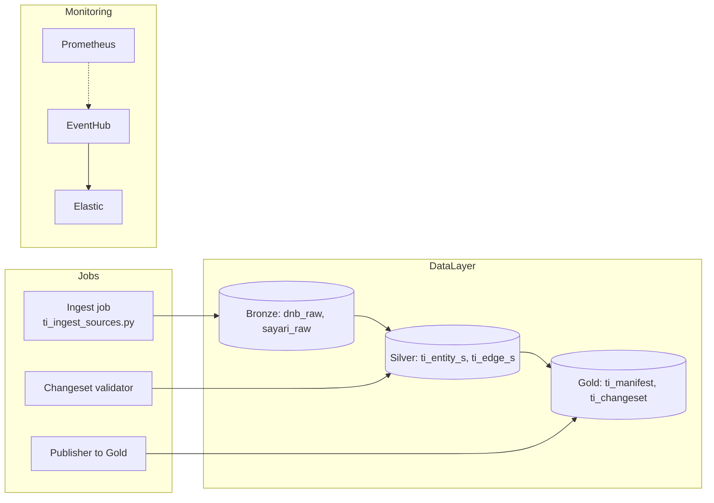

# Background Monitoring & Delta Cache – Konsolidovaná dokumentace

**Datum aktualizace:** 2025-09-30
**Status:** Konsolidovaný přehled (aktualizováno po revizi DAP dokumentace)
**Autoři:** AI agent + tým N-Tier

## 📚 Navigace v dokumentaci
- **Tento soubor**: Shrnutí architektury, DAP alignment, rozhodnutí a seznam úkolů.
- **Implementační detail**: `background_monitoring_implementation.md` (runtime, deployment, observabilita).
- **Datový slovník a taxonomie**: `background_monitoring_data_model.md` (edge typy, tier pravidla, kontrakty).

> ℹ️ **DAP Alignment:** Tento dokument reflektuje poznatky z `dap_docs` (AI-Performanceandhealthmonitoring, SKDAP-DataManagement, SKDAP-ArchitectureDetails). Všechny části označené jako „Legacy (před DAP)“ budou postupně nahrazeny novými návrhy.

---

## 1. Kontext a účel
- **TierIndex** slouží jako read-only dodavatelský graf (Tier1–Tier3) pro orchestrátor.
- **Background monitoring** zajišťuje periodickou aktualizaci grafu, kontrolu anomaly a synchronizaci s Delta Lake.
- Dokument vznikl před seznámením s DAP, proto obsahoval Azure/K8s specifika. Tato verze rozlišuje, co je stále platné a co se má nahradit DAP postupy.

### Scope
- **Zahrnuje:** Architekturu dodavatelského grafu, workflow ingestu, governance, monitoring.
- **Nezahrnuje:** API orchestraci runtime (`orchestrator-api`), detailní workflow Phase 1 (viz `synthesis-agent.md`).

---

## 2. Architektura (stav ➜ cílový stav)

| Oblast               | Původní návrh (Legacy)                                          | Cílový stav v DAP                                      | Poznámka                                      |
| -------------------- | --------------------------------------------------------------- | ------------------------------------------------------ | --------------------------------------------- |
| **Datové úložiště**  | Azure Blob + AFD (statické JSON)                                | Delta Lake (Bronze → Silver → Gold)                    | Bronze vrstva doplněna v `physical_model.md`. |
| **Ingest**           | Docker/FastAPI job, vlastní plánování                           | Databricks workflow (notebook `ti_ingest_sources.py`)  | Denní běh 02:00 UTC, retries + DLQ.           |
| **Observabilita**    | Prometheus + Application Insights                               | EventHub → Elastic/Kibana + Prometheus (dual shipping) | TODO B1.                                      |
| **Deployment**       | AKS / Docker Compose                                            | Databricks Jobs + Delta Live Tables                    | Týká se Phase 2.                              |
| **Governance**       | Interní metadata                                                | Unity Catalog + Datapedia + Metalog                    | TODO B3.                                      |
| **Change lifecycle** | JSON manifesty `TierIndex.baseline_v1`, `cs_YYYYMMDD_HHMM.json` | Zachováno; metadata ukládat do Unity Catalogu          | Převod formátu na Delta.                      |

---

## 3. DAP Alignment – přehled rozdílů

### Kritické body
1. **B1 EventHub/Elastic monitoring** – zjistit, zda je mandatory. Pokud ano, navrhnout dual-shipping (Prometheus → EventHub).
2. **B2 Azure DevOps** – preferovaný rytmus DAP; current state = GitHub Actions. Potřebujeme exception request.
3. **B3 Datapedia/Metalog** – TierIndex slovník zatím privátní (`tierindex_slovnik_pojmu.md`). Nutno zajistit registraci.

### Nízká priorita / vyřešeno
- **A1/A2/A3** – nejsou blokery (náš frontend/ETL zůstává na Azure, mimo scope DAP).
- **B4** – training workspace není potřeba v Phase 1 (TierIndex není ML model).
- **C1** – Bronze layer popsána v `physical_model.md`.
- **C3** – Monitoring SLA možno doplnit později.

---

## 4. Přehled komponent

- **Bronze**: Raw JSON odpovědi z DnB/Sayari (`bronze.dnb_raw`, `bronze.sayari_raw`).
- **Silver**: Normalizované entity/edges, odkazuje na metadata v Unity Catalogu.
- **Gold**: `TierIndex` + manifest (read-only pro API).
- **Monitoring**: Primární Prometheus; EventHub/Elastic jako povinný kanál (pokud DAP vyžaduje).

---

## 5. Governance & metadata
- **Unity Catalog**: Master registr pro tabulky + lineage. Zajistit `catalog: tierindex`, `schema: monitoring`.
- **Datapedia**: Business popisy (`tierindex_slovnik_pojmu.md` → sync).
- **Metalog**: Technické detaily tabulek (`bronze`, `silver`, `gold`).
- **Access Control**: Bronze read-only pro ETL, Gold read-only pro API.

### 5a. Parity validation (LLM vs. TierIndex)
- Při runtime dotazu orchestrátor porovnává LLM výstup (`analysis_type`, `tier_depth`) s hodnotami v Gold manifestu.
- **Parity alert** se loguje do Delta tabulky `tierindex.monitoring.parity_alerts`:
  - `timestamp`, `supplier_id`, `gold_analysis_type`, `llm_analysis_type`, `reason`, `alert_severity`
- Alert severity:
  - `INFO` – minor rozdíl (např. tier_depth 2 vs. 3)
  - `WARNING` – major rozdíl (ownership vs. risk_financial)
  - `ERROR` – LLM vrátil unsupported typ
- **Action**: Při >5 alertech/den pro stejný supplier → automatický ticket do backlog pro review TierIndex mapping.

---

## 6. Odkazy na detailní dokumentaci
- `background_monitoring_implementation.md` – obsahuje Python kód, deployment kroky, test plan.
  - **⚠️ Legacy sekce:** AKS/Azure Pipelines, storage selection matrix (Blob/Redis/Cosmos) → označeno TODO s DAP poznámkou.
- `background_monitoring_data_model.md` – taxonomie, JSON schema, canonical edges.
  - **⚠️ Legacy sekce:** Storage matrix (doplněn komentář „přesun na Delta/Unity Catalog“), odkazy na DAP requirements.

---

## 7. TODO a otevřené body
1. **EventHub/Elastic integrace** – připravit návrh dual-shipping (Prometheus exporter → EventHub).
2. **Azure DevOps/TFS** – zjistit povinnosti, připravit exception request (GitHub Enterprise security, audit).
3. **Datapedia/Metalog sync** – rozhodnout A/B varianta (manuální registr vs. automatizovaný ETL).
4. **Update implementation.md** – přepsat deployment kapitolu na Databricks jobs.
5. **Update data_model.md** – doplnit Unity Catalog metadata, odstranit staré reference na Cosmos/Redis.
6. **Monitoring SLA** – doplnit do `SLA.md` po potvrzení EventHub režimu.
7. **Versioning** – převést manifesty `TierIndex.baseline_v1` do Delta tabulek (Gold).

---

## 8. Historie verzí
- **2025-09-30:** Konsolidace po DAP revizi, přidány TODO (B1/B2/B3), přeuspořádány dokumenty do `background_monitoring/`.
- **2025-08-12:** Původní verze (pre-DAP, Azure-centric).

---

> Pokud najdeš další zastaralé části, vytvoř issue v `scrum/stories/` nebo dopiš TODO přímo sem. Všechny aktualizace prosím konzultovat s architektem (Honza) při příštím DAP syncu.
