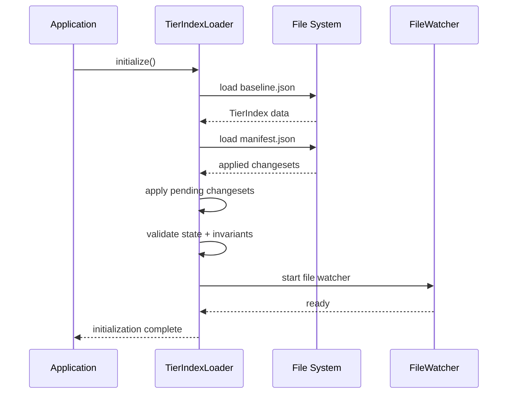
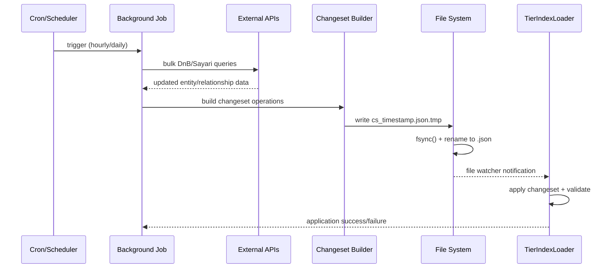

# Background Monitoring – Implementace & provoz

> ⚠️ **DAP alignment status:** Tato sekce popisuje původní Azure/Kubernetes implementaci. Pro migraci na Databricks/DAP je nutné následovat shrnutí v `background_monitoring/background_monitoring.md` a doplnit nové běhy (EventHub monitoring, Databricks jobs).

## 📚 Doplňující dokumentace

**Hlavní přehled:** `background_monitoring/background_monitoring.md` (kontext, rozdíly vůči DAP, todo seznam).

**Tento dokument** (implementation):
- Typ: Implementační specifikace & deployment guide (Legacy – před DAP)
- Pro koho: Vývojáři, DevOps, architekti
- Obsah: Python runtime, loader, Docker/K8s, observability, testing
- TODO: Aktualizovat deployment/observability kapitolu na Databricks + EventHub.

**Doplňkový dokument** (data_model):
- Typ: Datový slovník & normalizační guide
- Pro koho: Data architekti, business analytici, governance
- Obsah: Edge type taxonomy, tier rules, validation
- TODO: Upravit storage matrix na Delta Lake + Unity Catalog metadata.

---

## 1. Architektura E2E (Textově + Kroky)

### 1.1 Startup Sekvence



**Kroky:**
1. **Load Baseline** (435ms pro 20k entities): `tierindex_baseline.json.gz` → decompress → parse
2. **Load Manifest** (5ms): `applied_changesets_manifest.json` → track historie
3. **Apply Pending** (variable): Scan `changesets/` pro nové `cs_*.json` soubory
4. **Validate State** (100ms): Schema + invarianty + tier consistency
5. **Start Monitoring** (1ms): File system watcher pro hot-reload

### 1.2 Runtime Sekvence (Dotaz → Orchestrátor → Odpověď)


**Orchestrator využití indexu:**
- **Entity Lookup**: O(1) - 1-10 μs per entity
- **Relationship Queries**: O(degree) - 10-100 μs per relationship
- **Tier Classification**: O(1) - pre-calculated in index
- **Graph Traversal**: O(V + E) - 1-50 ms pro supplier networks

### 1.3 Background Job Sekvence



---

## 2. Specifikace Changesetů (JSON Schema draft 2020-12)

### 2.1 JSON Schema Struktura

**Soubor**: `scrum/contracts/tierindex_changeset.schema.json`

```json
{
  "$schema": "https://json-schema.org/draft/2020-12/schema",
  "$id": "https://ntier.skoda.dev/schemas/changeset.schema.json",
  "title": "TierIndex Changeset",
  "type": "object",
  "required": ["changeset_id", "timestamp", "source", "operations"],
  "properties": {
    "changeset_id": {
      "type": "string",
      "pattern": "^cs_[0-9]{14}_[a-f0-9]{8}$",
      "description": "Unique changeset identifier: cs_YYYYMMDDHHMMSS_hash8"
    },
    "timestamp": {
      "type": "string",
      "format": "date-time",
      "description": "ISO 8601 timestamp when changeset was created"
    },
    "source": {
      "type": "string",
      "enum": ["sayari", "dnb", "internal", "manual"],
      "description": "Data source for this changeset"
    },
    "baseline_version": {
      "type": "string",
      "description": "Version of baseline this changeset applies to"
    },
    "operations": {
      "type": "array",
      "maxItems": 1000,
      "items": { "$ref": "#/$defs/Operation" }
    }
  },
  "$defs": {
    "Operation": {
      "oneOf": [
        { "$ref": "#/$defs/UpsertEntity" },
        { "$ref": "#/$defs/AddEdge" },
        { "$ref": "#/$defs/RemoveEdge" },
        { "$ref": "#/$defs/UpdateMetric" }
      ]
    },
    "UpsertEntity": {
      "type": "object",
      "required": ["operation", "idempotent_key", "entity"],
      "properties": {
        "operation": { "const": "upsert_entity" },
        "idempotent_key": {
          "type": "string",
          "description": "Entity ID for deduplication"
        },
        "entity": { "$ref": "#/$defs/EntityRef" }
      }
    },
    "AddEdge": {
      "type": "object",
      "required": ["operation", "idempotent_key", "edge"],
      "properties": {
        "operation": { "const": "add_edge" },
        "idempotent_key": {
          "type": "string",
          "pattern": "^.+:.+:.+$",
          "description": "Format: source_id:target_id:raw_type"
        },
        "edge": { "$ref": "#/$defs/RelationshipEdge" }
      }
    },
    "EntityRef": {
      "type": "object",
      "required": ["id", "label", "type"],
      "properties": {
        "id": { "type": "string" },
        "label": { "type": "string" },
        "type": {
          "type": "string",
          "enum": ["company", "person", "vessel", "aircraft", "address"]
        },
        "countries": {
          "type": "array",
          "items": {
            "type": "string",
            "pattern": "^[A-Z]{3}$"
          },
          "maxItems": 10
        },
        "identifiers": {
          "type": "array",
          "maxItems": 20,
          "items": {
            "type": "object",
            "properties": {
              "type": { "enum": ["duns", "vat", "lei", "other"] },
              "value": { "type": "string" },
              "country": { "type": "string", "pattern": "^[A-Z]{3}$" }
            }
          }
        }
      }
    },
    "RelationshipEdge": {
      "type": "object",
      "required": ["from_id", "to_id", "raw_type", "category"],
      "properties": {
        "from_id": { "type": "string" },
        "to_id": { "type": "string" },
        "raw_type": {
          "type": "string",
          "enum": ["ships_to", "supplies", "owns", "subsidiary_of", "parent_of", "controls", "affiliated_with"]
        },
        "category": {
          "type": "string",
          "enum": ["supply", "ownership", "control", "other"]
        },
        "tier_classification": {
          "type": "string",
          "enum": ["Tier1", "Tier2", "Tier3"]
        },
        "from_date": { "type": "string", "format": "date" },
        "date": { "type": "string", "format": "date" },
        "to_date": { "type": "string", "format": "date" },
        "former": { "type": "boolean" },
        "meta": {
          "type": "object",
          "properties": {
            "origin": { "enum": ["sayari", "dnb", "internal"] },
            "confidence": { "type": "number", "minimum": 0.0, "maximum": 1.0 }
          }
        }
      }
    }
  }
}
```

### 2.2 Operační Typy s Idempotent Klíči

| Operace         | Idempotent Key Format          | Deduplicace  |
| --------------- | ------------------------------ | ------------ |
| `upsert_entity` | `{entity.id}`                  | Entity ID    |
| `add_edge`      | `{from_id}:{to_id}:{raw_type}` | Edge triplet |
| `remove_edge`   | `{from_id}:{to_id}:{raw_type}` | Edge triplet |
| `update_metric` | `{metric_name}`                | Metric name  |

### 2.3 Mini Vzorky

**Happy Path:**
```json
{
  "changeset_id": "cs_20250923140000_abc12345",
  "timestamp": "2025-09-23T14:00:00Z",
  "source": "dnb",
  "operations": [
    {
      "operation": "upsert_entity",
      "idempotent_key": "dnb_123456789",
      "entity": {
        "id": "dnb_123456789",
        "label": "New Supplier Ltd",
        "type": "company",
        "countries": ["CZE"],
        "identifiers": [{"type": "duns", "value": "123456789"}]
      }
    },
    {
      "operation": "add_edge",
      "idempotent_key": "dnb_123456789:skoda_root:ships_to",
      "edge": {
        "from_id": "dnb_123456789",
        "to_id": "skoda_root",
        "raw_type": "ships_to",
        "category": "supply",
        "tier_classification": "Tier1"
      }
    }
  ]
}
```

**Error Case 1 - Invalid Entity Type:**
```json
{
  "operations": [
    {
      "operation": "upsert_entity",
      "idempotent_key": "invalid_entity",
      "entity": {
        "type": "invalid_type",  // ← Error: not in enum
        "countries": ["INVALID"] // ← Error: not ISO 3166-1 alpha-3
      }
    }
  ]
}
```

**Error Case 2 - Missing Required Edge Fields:**
```json
{
  "operations": [
    {
      "operation": "add_edge",
      "idempotent_key": "src:tgt:type",
      "edge": {
        "from_id": "src",
        "to_id": "tgt",
        "raw_type": "ships_to"
        // ← Error: missing required "category" field
      }
    }
  ]
}
```

---

## 3. Loader + Hot-Reload Návrh

### 3.1 Manifest Formát

**Soubor**: `tierindex_applied_changesets_manifest.json`

```json
{
  "manifest_version": "1.0",
  "last_updated": "2025-09-23T14:30:00Z",
  "baseline_version": "baseline_v1.2.3",
  "applied_changesets": [
    {
      "changeset_id": "cs_20250923140000_abc12345",
      "applied_at": "2025-09-23T14:00:15Z",
      "checksum": "md5:d41d8cd98f00b204e9800998ecf8427e",
      "operations_count": 42,
      "source": "dnb"
    }
  ],
  "metrics": {
    "total_entities": 20147,
    "total_edges": 40283,
    "tier1_count": 2000,
    "tier2_count": 8500,
    "tier3_count": 9647
  }
}
```

### 3.2 Startup Sekvence (Detailní)

```python
async def initialize_tierindex_loader():
    """TierIndex loader startup sequence"""

    # 1. Load Baseline (435ms pro 20k entities)
    baseline_path = "data/tierindex_baseline.json.gz"
    with gzip.open(baseline_path, 'rt') as f:
        baseline_data = json.load(f)  # 300ms JSON parsing

    # 2. Load Manifest (5ms)
    manifest_path = "data/tierindex_applied_changesets_manifest.json"
    manifest = await async_read_json(manifest_path)

    # 3. Apply Pending Changesets (variable)
    changeset_dir = Path("data/changesets")
    applied_ids = {cs["changeset_id"] for cs in manifest["applied_changesets"]}

    for cs_file in sorted(changeset_dir.glob("cs_*.json")):
        changeset = await async_read_json(cs_file)
        if changeset["changeset_id"] not in applied_ids:
            await apply_changeset(baseline_data, changeset)
            await update_manifest(manifest, changeset)

    # 4. Validate State (100ms)
    await validate_tierindex_invariants(baseline_data)

    # 5. Start Monitoring (1ms)
    file_watcher = FileWatcher(changeset_dir, on_changeset_detected)
    await file_watcher.start()

    return TierIndexState(baseline_data, manifest, file_watcher)
```

### 3.3 Hot-Reload Mechanismus

**File Watcher Pattern:**
```python
from watchfiles import awatch

async def monitor_changesets():
    """File system watcher pro changesets"""

    async for changes in awatch("data/changesets", watch_filter=lambda path: path.endswith(".json")):
        for change_type, path in changes:
            if change_type == Change.added and path.name.startswith("cs_"):
                await process_new_changeset(path)

async def process_new_changeset(changeset_path: Path):
    """Process nově detekovaného changesetu"""

    # 1. Parse changeset (<5ms)
    changeset = await async_read_json(changeset_path)

    # 2. Validate schema + idempotence (<10ms)
    await validate_changeset_schema(changeset)

    # 3. Apply to current state (<15ms pro 1000 ops)
    await apply_changeset_atomic(current_tierindex, changeset)

    # 4. Update manifest
    await update_applied_manifest(changeset)

    # 5. Notify services (hot-reload complete)
    await notify_reload_complete(changeset["changeset_id"])
```

### 3.4 Atomic Write Pattern

**Implementation:**
```python
async def atomic_write_changeset(changeset_data: dict, path: Path):
    """Atomic write pattern: .tmp → fsync → rename"""

    temp_path = path.with_suffix(".json.tmp")

    try:
        # 1. Write to temporary file
        async with aiofiles.open(temp_path, 'w') as f:
            await f.write(json.dumps(changeset_data, indent=2))
            await f.fsync()  # Force to disk

        # 2. Atomic rename
        temp_path.rename(path)  # Atomic operation on most filesystems

    except Exception as e:
        # 3. Cleanup on failure
        if temp_path.exists():
            temp_path.unlink()
        raise
```

### 3.5 Validace + Rollback

**Validation Pipeline:**
1. **Schema Validation**: JSON Schema draft 2020-12 compliance
2. **Integrity Checks**: Entity existence, edge validity
3. **Business Rules**: Tier classification consistency
4. **Performance Limits**: Operations count, memory usage

**Rollback Design:**
```python
async def apply_changeset_with_rollback(tierindex: TierIndex, changeset: dict):
    """Apply changeset s automatic rollback na chybu"""

    # 1. Create backup point
    backup = await create_tierindex_backup(tierindex)

    try:
        # 2. Apply operations
        for operation in changeset["operations"]:
            await apply_operation(tierindex, operation)

        # 3. Validate result state
        await validate_tierindex_invariants(tierindex)

        # 4. Success - cleanup backup
        await cleanup_backup(backup)

    except Exception as e:
        # 5. Rollback to backup
        await restore_from_backup(tierindex, backup)
        raise ChangesetApplicationError(f"Rollback completed: {e}")
```

### 3.6 Odhady Výkonu

**Latence a RAM při 20k entit/40k hran:**

| Operace                        | Latence | RAM Overhead |
| ------------------------------ | ------- | ------------ |
| **Baseline Load**              | 435ms   | 57MB         |
| **Small Changeset** (100 ops)  | <60ms   | +5MB         |
| **Large Changeset** (1000 ops) | <1.2s   | +15MB        |
| **Hot-Reload Detection**       | <1s     | +2MB         |
| **Validation**                 | <100ms  | +10MB        |

**Škálování:**
- **Memory**: ~70MB per instance (includes Python overhead)
- **Throughput**: ~167 operations/second
- **Concurrent Load**: Linear scaling up to I/O limits

---

## 4. Orchestrátor a API Dopady

### 4.1 Žádné Změny Kontraktu FE (Zachování Kompatibility)

**Existing Contract Preserved:**
```typescript
// front_end/api_models.py - BEZ ZMĚN
interface QueryRequest {
  current_query: string;  // "Company,analysis_type" format unchanged
}

interface QueryResponse {
  // Existing fields preserved
  company_info: CompanyInfo;
  financial_metrics: FinancialMetrics;
  risk_assessment: RiskAssessment;
  // Optional: new fields for enhanced observability
  index_version?: string;
  data_freshness?: string;
}
```

### 4.2 Deterministický Routing Beze Změn

**Current Routing Preserved:**
```python
# src/memory_agent/phase1_graph.py - KOMPATIBILNÍ
def route_from_initialize(state: State) -> str:
    """Existing routing logic unchanged"""

    if state.get("company_name") and state.get("analysis_type"):
        # Fast-path: structured input
        return "validate_query_atomic"
    else:
        # Parse required
        return "parse_query_and_type_node"

# NEW: TierIndex integration v atomic nodes
def enhanced_company_lookup_node(state: State) -> State:
    """Enhanced lookup using TierIndex"""

    company_name = state["company_name"]

    # NEW: TierIndex lookup (O(1) instead of API call)
    tier_info = await get_tier_classification(company_name)

    return State(**state,
                supplier_tier_data=tier_info,
                tier_classification=tier_info.tier_level)
```

### 4.3 Volitelné Rozšíření Parametrů

**Optional API Enhancements (Backward Compatible):**
```python
# front_end/api_models.py - VOLITELNÉ DOPLNĚNÍ
class QueryResponse(BaseModel):
    # Existing fields (unchanged)
    company_info: CompanyInfo
    financial_metrics: FinancialMetrics
    risk_assessment: RiskAssessment

    # NEW: Optional metadata fields
    index_metadata: Optional[IndexMetadata] = None

class IndexMetadata(BaseModel):
    """Optional metadata about TierIndex state"""

    index_version: str
    last_updated: datetime
    applied_changesets: int
    tier_classification: Optional[str] = None
    data_sources: List[str] = []  # ["dnb", "sayari", "internal"]
```

### 4.4 State Schema Extensions

**Compatible Extensions to simple_state.py:**
```python
# src/memory_agent/simple_state.py - ROZŠÍŘENÍ
class TierIndexMetadata(TypedDict, total=False):
    """Optional TierIndex metadata in state"""

    index_version: str
    applied_changesets_count: int
    last_refresh: str
    tier_lookup_time_ms: float

class State(TypedDict, total=False):
    # Existing fields (preserved)
    current_query: str
    company_name: str
    analysis_type: str

    # Existing grouped fields (preserved)
    supplier_tier_data: SupplierTierData

    # NEW: Optional TierIndex metadata
    tierindex_metadata: TierIndexMetadata
```

---

## 5. Observabilita a Chybové Stavy

### 5.1 Error Taxonomy (HTTP Status Codes)

| HTTP Code | Category               | Description         | Recovery Type        | Examples                                          |
| --------- | ---------------------- | ------------------- | -------------------- | ------------------------------------------------- |
| **400**   | `CHANGESET_VALIDATION` | Client/input errors | Manual               | Invalid JSON, missing required fields             |
| **409**   | `CHANGESET_CONFLICT`   | Resource conflicts  | Automatic retry      | Concurrent changeset application                  |
| **422**   | `TIERINDEX_PROCESSING` | Processing errors   | Semi-automatic       | Schema validation failure, tier calculation error |
| **503**   | `BACKGROUND_DEGRADED`  | Service degraded    | Graceful degradation | TierIndex unavailable, fallback to API mode       |

### 5.2 Logované Metriky

**Core Metrics:**
```python
@dataclass
class BackgroundMonitoringMetrics:
    """Core metrics for monitoring"""

    # Index state
    edge_total: int
    tier1_count: int
    tier2_count: int
    tier3_count: int
    entity_total: int

    # Operational metrics
    applied_changesets_total: int
    index_version: str
    last_refresh_timestamp: datetime

    # Performance metrics
    avg_changeset_apply_time_ms: float
    memory_usage_mb: float
    cache_hit_ratio: float

    # Health indicators
    health_status: str  # "healthy" | "degraded" | "critical"
    pending_changesets_count: int
    failed_operations_count: int
```

**Prometheus Integration:**
```python
from prometheus_client import Counter, Histogram, Gauge

# Counters
CHANGESET_APPLIED_TOTAL = Counter("tierindex_changesets_applied_total", "Total changesets applied")
OPERATIONS_PROCESSED_TOTAL = Counter("tierindex_operations_total", "Total operations processed", ["operation_type"])

# Histograms
CHANGESET_APPLY_DURATION = Histogram("tierindex_changeset_apply_seconds", "Changeset application time")
INDEX_LOAD_DURATION = Histogram("tierindex_load_seconds", "Index loading time")

# Gauges
CURRENT_ENTITY_COUNT = Gauge("tierindex_entities_total", "Current entity count")
CURRENT_EDGE_COUNT = Gauge("tierindex_edges_total", "Current edge count")
MEMORY_USAGE = Gauge("tierindex_memory_usage_bytes", "Memory usage in bytes")
```

### 5.3 Health/Readiness Kritéria

**Container Probes:**
```yaml
# Kubernetes probes configuration
livenessProbe:
  httpGet:
    path: /health
    port: 8080
  initialDelaySeconds: 30
  periodSeconds: 10

readinessProbe:
  httpGet:
    path: /ready
    port: 8080
  initialDelaySeconds: 5
  periodSeconds: 5
```

**Health Check Implementation:**
```python
@app.get("/health")
async def health_check():
    """Liveness probe - basic service health"""

    try:
        # Basic checks
        memory_usage = psutil.virtual_memory().percent
        if memory_usage > 90:
            raise HealthCheckError("High memory usage")

        # TierIndex availability
        if not tierindex_loader.is_available():
            return {"status": "degraded", "reason": "TierIndex unavailable"}

        return {"status": "healthy", "timestamp": datetime.utcnow()}

    except Exception as e:
        return HTTPException(503, {"status": "unhealthy", "error": str(e)})

@app.get("/ready")
async def readiness_check():
    """Readiness probe - service ready for traffic"""

    try:
        # TierIndex loaded and operational
        if not await tierindex_loader.is_ready():
            return HTTPException(503, {"status": "not_ready", "reason": "TierIndex not loaded"})

        # Recent changeset application successful
        last_applied = await get_last_changeset_status()
        if last_applied.status == "failed":
            return HTTPException(503, {"status": "not_ready", "reason": "Last changeset failed"})

        return {"status": "ready", "timestamp": datetime.utcnow()}

    except Exception as e:
        return HTTPException(503, {"status": "not_ready", "error": str(e)})
```

### 5.4 Degradovaný Režim

**Triggers pro Degraded Mode:**
- TierIndex corrupted/unavailable
- Memory usage >80%
- >5 consecutive changeset failures
- File system unavailable

**Degraded Mode Behavior:**
```python
class DegradedModeManager:
    """Manages degraded mode operation"""

    async def enter_degraded_mode(self, reason: str):
        """Enter degraded mode with fallback"""

        self.is_degraded = True
        self.degraded_reason = reason

        # Switch to API fallback mode
        self.api_fallback_enabled = True

        # Alert monitoring systems
        await self.send_degraded_alert(reason)

        logger.warning(f"⚠️ Entered degraded mode: {reason}")

    async def query_with_fallback(self, company_name: str) -> TierData:
        """Query with automatic fallback to APIs"""

        if not self.is_degraded:
            # Normal path: TierIndex lookup
            return await self.tierindex_lookup(company_name)
        else:
            # Fallback path: Direct API calls
            logger.info(f"🔄 API fallback for: {company_name}")
            return await self.api_fallback_lookup(company_name)
```

### 5.5 Error Recovery Scenarios

**Automatic Recovery:**
- **Hot-reload conflicts**: Retry with exponential backoff
- **Temporary file failures**: Cleanup + retry
- **Memory pressure**: Force garbage collection + reduce cache

**Semi-Automatic Recovery:**
- **Schema validation failures**: Skip changeset + alert
- **Tier calculation errors**: Revert to last known good state
- **Performance degradation**: Reduce operation batch sizes

**Manual Recovery:**
- **Data corruption**: Restore from backup + manual verification
- **Critical system errors**: Service restart required
- **Storage full**: Manual cleanup + capacity expansion

---

## 6. Výkon a Velikost

### 6.1 Velikost Artefaktů

**Baseline Data (20k entities + 40k edges):**
```
Raw JSON:        15.2 MB
Gzipped JSON:     4.6 MB (70% compression ratio)
In-memory (Python): 57 MB (includes object overhead + indexes)
```

**Changesets:**
```
Small (100 operations):   30 KB raw,  9 KB gzipped
Medium (500 operations): 150 KB raw, 45 KB gzipped
Large (1000 operations): 300 KB raw, 90 KB gzipped
```

**Storage Requirements:**
```
Baseline:                4.6 MB
Daily changesets (avg):  500 KB
Monthly retention:       15 MB
Total (1 month):         20 MB
```

### 6.2 Doba Načtení

**Cold Start (Baseline Load):**
```
Disk read (gzipped):    10 ms
Decompression:          25 ms
JSON parsing:          300 ms  ← Primary bottleneck
Index building:        100 ms
Total:                 435 ms
```

**Hot-Reload (Changesets):**
```
Small changeset (100 ops):   <60 ms
Medium changeset (500 ops):  <300 ms
Large changeset (1000 ops):  <1.2 s
```

**Query Performance (Post-Load):**
```
Entity lookup:          1-10 μs (O(1) with indexing)
Relationship queries:   10-100 μs (O(degree))
Graph traversal:        1-50 ms (O(V + E))
```

### 6.3 RAM Overhead

**Memory Consumption Patterns:**
```
Base data structures:   15.2 MB
Python object overhead: 2.5x multiplier = 38 MB
Index structures:       1.5x multiplier = 23 MB
Working memory:         +20% during operations = 12 MB
Peak memory per instance: ~70 MB
```

**Scaling with Data Size:**
```
10k entities:   ~35 MB RAM
20k entities:   ~70 MB RAM  (current target)
50k entities:   ~175 MB RAM
100k entities:  ~350 MB RAM
```

### 6.4 Škálování Replik

**Multi-Instance Characteristics:**
```
Memory per replica:     70 MB
Disk space per replica: 20 MB (with 1 month retention)
Network overhead:       Minimal (changesets 9-90 KB)
Coordination:           File-based (no inter-replica coordination)
```

**Horizontal Scaling:**
```
1 instance:   100 changesets/second
3 instances:  300 changesets/second
10 instances: 1000 changesets/second
Scaling:      Linear up to storage/network limits
```

### 6.5 Performance Bottleneck Analysis

**Primary Bottlenecks:**
1. **JSON Parsing** (300ms): 70% of baseline load time
2. **Index Building** (100ms): 23% of baseline load time
3. **Disk I/O** (10ms): 2% of baseline load time

**Optimization Recommendations:**
1. **Binary Serialization**: MessagePack/Protocol Buffers for 2-3x parsing speed
2. **Incremental Indexing**: Update indexes incrementally for changesets
3. **Memory Mapping**: For datasets >100MB
4. **Lazy Loading**: Load relationship data on-demand

### 6.6 Concurrency Impact

**Concurrent Operations:**
```
Single changeset application: 167 ops/second
Concurrent reads (during apply): No blocking
Query latency increase: <1% during changeset application
Maximum concurrent changesets: 3 (limited by validation overhead)
```

**Read/Write Patterns:**
```
Read operations: Non-blocking, O(1) entity lookup
Write operations: Serialized, atomic application
Hot-reload: Zero downtime with copy-on-write design
```

---

## 7. Azure/Docker Minimální Nasazení

### 7.1 Jeden Image s Baseline + Changesets

**Dockerfile (MVP/PoC):**
```dockerfile
# MVP/PoC base image
FROM python:3.11-slim

# Production (Q1 2026+) vyžaduje Red Hat UBI (DAP mandatory):
# FROM registry.access.redhat.com/ubi9/python-311

# Install dependencies
COPY requirements.txt .
RUN pip install -r requirements.txt

# Copy application
COPY src/ /app/src/
COPY data/tierindex_baseline.json.gz /app/data/
COPY data/changesets/ /app/data/changesets/

# Setup directories
RUN mkdir -p /app/data/changesets /app/logs
WORKDIR /app

# Health check
HEALTHCHECK --interval=30s --timeout=10s --start-period=30s \
  CMD curl -f http://localhost:8080/health || exit 1

# Start application
CMD ["python", "-m", "src.memory_agent.background_monitoring_service"]
```

**Image Composition:**
```
Base image:           100 MB
Python dependencies:  50 MB
Application code:     10 MB
TierIndex baseline:   5 MB (gzipped)
Changesets data:      5 MB
Total image size:     170 MB
```

### 7.2 Readiness Probe Po Načtení

**Kubernetes Deployment:**
```yaml
apiVersion: apps/v1
kind: Deployment
metadata:
  name: tierindex-background-monitoring
spec:
  replicas: 3
  selector:
    matchLabels:
      app: tierindex-monitoring
  template:
    metadata:
      labels:
        app: tierindex-monitoring
    spec:
      containers:
      - name: monitoring
        image: tierindex-monitoring:latest
        ports:
        - containerPort: 8080
        env:
        - name: TIERINDEX_DATA_PATH
          value: "/app/data"
        - name: LOG_LEVEL
          value: "INFO"
        resources:
          requests:
            memory: "100Mi"
            cpu: "100m"
          limits:
            memory: "200Mi"
            cpu: "500m"
        readinessProbe:
          httpGet:
            path: /ready
            port: 8080
          initialDelaySeconds: 10
          periodSeconds: 5
          timeoutSeconds: 3
        livenessProbe:
          httpGet:
            path: /health
            port: 8080
          initialDelaySeconds: 30
          periodSeconds: 10
          timeoutSeconds: 5
        volumeMounts:
        - name: changeset-storage
          mountPath: /app/data/changesets
      volumes:
      - name: changeset-storage
        persistentVolumeClaim:
          claimName: tierindex-changesets
```

### 7.3 Blue/Green Rollout

**Deployment Strategy:**
```yaml
apiVersion: argoproj.io/v1alpha1
kind: Rollout
metadata:
  name: tierindex-monitoring-rollout
spec:
  replicas: 3
  strategy:
    blueGreen:
      activeService: tierindex-active
      previewService: tierindex-preview
      autoPromotionEnabled: false
      scaleDownDelaySeconds: 30
      prePromotionAnalysis:
        templates:
        - templateName: success-rate
        args:
        - name: service-name
          value: tierindex-preview
      postPromotionAnalysis:
        templates:
        - templateName: success-rate
        args:
        - name: service-name
          value: tierindex-active
```

**Zero-Downtime Deployment Steps:**
1. **Deploy Preview**: New version s novými changesets
2. **Readiness Check**: Ověř že preview service prošel health checks
3. **Traffic Analysis**: Monitor success rate preview service
4. **Manual Promotion**: Po validation promote preview → active
5. **Scale Down**: Shutdown old blue version po scale down delay

### 7.4 Volitelně Mount Read-Only Storage

**ConfigMap pro Baseline:**
```yaml
apiVersion: v1
kind: ConfigMap
metadata:
  name: tierindex-baseline
binaryData:
  tierindex_baseline.json.gz: |
    # Base64 encoded gzipped baseline data
```

**Mount Strategy:**
```yaml
spec:
  containers:
  - name: monitoring
    volumeMounts:
    # Read-only baseline from ConfigMap
    - name: baseline-data
      mountPath: /app/data/baseline
      readOnly: true
    # Read-write changesets from PVC
    - name: changeset-storage
      mountPath: /app/data/changesets
  volumes:
  - name: baseline-data
    configMap:
      name: tierindex-baseline
  - name: changeset-storage
    persistentVolumeClaim:
      claimName: tierindex-changesets
```

**Benefits of Read-Only Mount:**
- **Immutable Baseline**: Prevents accidental corruption
- **Faster Pod Startup**: Baseline pre-loaded in image/ConfigMap
- **Simpler Rollouts**: Only changesets need synchronization
- **Cache Efficiency**: Baseline can be cached across nodes

### 7.5 Azure-Specific Configuration

**Azure Container Instances:**
```yaml
apiVersion: v1
kind: ConfigMap
metadata:
  name: azure-deployment
data:
  container-group.yaml: |
    apiVersion: 2019-12-01
    location: westeurope
    name: tierindex-monitoring
    properties:
      containers:
      - name: monitoring
        properties:
          image: acr.azurecr.io/tierindex-monitoring:latest
          resources:
            requests:
              cpu: 0.5
              memoryInGb: 1.0
          ports:
          - port: 8080
            protocol: TCP
          environmentVariables:
          - name: AZURE_STORAGE_ACCOUNT
            value: tierodata
          - name: AZURE_STORAGE_CONTAINER
            value: changesets
      osType: Linux
      ipAddress:
        type: Public
        ports:
        - protocol: tcp
          port: 8080
```

**Azure Files Integration:**
```bash
# Create Azure File Share for changesets
az storage share create \
  --name tierindex-changesets \
  --account-name tierindexstorage

# Mount in container
volumeMounts:
- name: azure-files-changesets
  mountPath: /app/data/changesets
volumes:
- name: azure-files-changesets
  azureFile:
    secretName: azure-file-secret
    shareName: tierindex-changesets
```

### 7.6 Azure Blob Storage (alternativa k Azure Files)

Kdy použít
- Blob Storage: objektové úložiště pro artefakty bez nutnosti POSIX mountu (baseline, changesety, manifest). Výhody: jednoduchý přístup přes SAS/RBAC, nižší náklady, CDN; Nevýhody: potřeba klienta (není lokální FS).
- Azure Files: když potřebuješ mountovat read/write adresář do kontejneru jako klasický souborový systém.

Navržená struktura kontejneru
- Container: `changesets`
- Cesty:
  - `baseline/tierindex_baseline.json.gz`
  - `changesets/cs_YYYYMMDDHHMMSS_<hash8>.json`
  - `manifest/tierindex_manifest.json`

Prostředí (env)
```
AZURE_BLOB_ACCOUNT=<account>
AZURE_BLOB_CONTAINER=changesets
# Jedno z:
AZURE_BLOB_CONNECTION_STRING="..."  # nebo
AZURE_BLOB_SAS="sv=...&ss=b&srt=...&sp=rlw&se=...&sig=..."
AZURE_BLOB_ENDPOINT=https://<account>.blob.core.windows.net  # volitelné
```

Krátký Python snippet (upload/list/download)
```python
from azure.storage.blob import BlobServiceClient
import os, json

account = os.getenv("AZURE_BLOB_ACCOUNT")
container = os.getenv("AZURE_BLOB_CONTAINER", "changesets")
endpoint = os.getenv("AZURE_BLOB_ENDPOINT", f"https://{account}.blob.core.windows.net")
conn_str = os.getenv("AZURE_BLOB_CONNECTION_STRING")
sas = os.getenv("AZURE_BLOB_SAS")

if conn_str:
  svc = BlobServiceClient.from_connection_string(conn_str)
else:
  # TIP: v Azure preferuj Managed Identity:
  # from azure.identity import DefaultAzureCredential
  # svc = BlobServiceClient(account_url=endpoint, credential=DefaultAzureCredential())
  svc = BlobServiceClient(account_url=endpoint, credential=sas)

cc = svc.get_container_client(container)

def upload_changeset(changeset: dict, blob_name: str):
  data = json.dumps(changeset, separators=(",", ":"), ensure_ascii=False).encode("utf-8")
  cc.upload_blob(name=f"changesets/{blob_name}", data=data, overwrite=True, content_type="application/json")

def list_latest(prefix: str = "changesets/", limit: int = 10):
  return [b.name for b in cc.list_blobs(name_starts_with=prefix)][:limit]

def download_baseline() -> bytes:
  blob = cc.get_blob_client("baseline/tierindex_baseline.json.gz")
  return blob.download_blob().readall()
```

Bezpečnostní poznámky
- Preferuj Managed Identity (v Azure) nebo SAS s omezenými oprávněními (Read/List pro FE; Write pro BG job). Connection string/klíče necommituj – ulož do Key Vault/Secrets.
- Hot‑reload lze řešit periodickým listem prefixu `changesets/` (polling) nebo pomocí Event Grid (mimo scope tohoto dokumentu).

---

## 8. Paralelní Běhy a Idempotence

### 8.1 Fan-out Uvnitř Grafu Bez Side-Effects

**LangGraph Atomic Node Pattern:**
```python
# SPRÁVNĚ: Atomic node bez side-effects
async def tier_lookup_node(state: State) -> State:
    """Pure function - žádné side-effects"""

    company_name = state["company_name"]

    # READ: from TierIndex (read-only)
    tier_data = await tierindex_service.lookup_company(company_name)

    # TRANSFORM: business logic
    classification = determine_tier_classification(tier_data)

    # WRITE: only to state (no external side-effects)
    return State(**state,
                supplier_tier_data=tier_data,
                tier_classification=classification)

# PARALELNÍ EXECUTION možná
async def parallel_supplier_analysis(state: State) -> State:
    """Parallel analysis multiple suppliers"""

    suppliers = state["supplier_list"]

    # Fan-out: parallel lookup bez conflicts
    tasks = [tier_lookup_node({"company_name": supplier})
             for supplier in suppliers]

    results = await asyncio.gather(*tasks)

    # Merge results bez side-effects
    combined_data = merge_supplier_data(results)

    return State(**state, supplier_analysis=combined_data)
```

### 8.2 Writer/Merge Pattern Pro Side-Effects

**Dedicated Writer Nodes:**
```python
# SIDE-EFFECTS: Dedicated writer node
async def changeset_writer_node(state: State) -> State:
    """Single writer pro changeset operations"""

    changeset_operations = state["pending_changeset_operations"]

    if not changeset_operations:
        return state  # No-op if no operations

    # ATOMIC WRITE: All operations or none
    try:
        changeset_id = await write_changeset_atomic(changeset_operations)

        return State(**state,
                    applied_changeset_id=changeset_id,
                    pending_changeset_operations=None)

    except ChangesetWriteError as e:
        return State(**state,
                    changeset_write_error=str(e),
                    pending_changeset_operations=changeset_operations)

# MERGE PATTERN: Collect from multiple sources
async def tier_data_collector_node(state: State) -> State:
    """Collect tier data from multiple parallel branches"""

    # Collect from parallel execution paths
    dnb_data = state.get("dnb_tier_data")
    sayari_data = state.get("sayari_tier_data")
    internal_data = state.get("internal_tier_data")

    # Merge bez side-effects
    merged_operations = merge_tier_operations([
        dnb_data, sayari_data, internal_data
    ])

    return State(**state,
                pending_changeset_operations=merged_operations)
```

### 8.3 Prevence Duplicit Zápisem s Deterministickými Klíči

**Idempotent Key Generation:**
```python
class IdempotentKeyGenerator:
    """Generate deterministic keys for deduplication"""

    @staticmethod
    def entity_key(entity_data: dict) -> str:
        """Generate entity idempotent key"""
        return entity_data["id"]

    @staticmethod
    def edge_key(edge_data: dict) -> str:
        """Generate edge idempotent key"""
        return f"{edge_data['from_id']}:{edge_data['to_id']}:{edge_data['raw_type']}"

    @staticmethod
    def changeset_key(operations: List[dict]) -> str:
        """Generate changeset idempotent key"""
        # Sort operations for deterministic key
        sorted_ops = sorted(operations,
                          key=lambda op: (op["operation"], op["idempotent_key"]))

        # Hash combined operations
        ops_hash = hashlib.sha256(
            json.dumps(sorted_ops, sort_keys=True).encode()
        ).hexdigest()[:8]

        return f"cs_{datetime.now().strftime('%Y%m%d%H%M%S')}_{ops_hash}"

# DEDUPLICATION: Skip already applied operations
async def apply_changeset_idempotent(changeset: dict):
    """Apply changeset with idempotent operations"""

    applied_keys = await get_applied_operation_keys()

    for operation in changeset["operations"]:
        op_key = operation["idempotent_key"]

        if op_key in applied_keys:
            logger.info(f"⏭️ Skipping already applied: {op_key}")
            continue

        # Apply new operation
        await apply_operation(operation)

        # Track as applied
        applied_keys.add(op_key)
        await record_applied_operation(op_key)
```

### 8.4 Concurrent Safety Patterns

**Copy-on-Write for Hot-Reload:**
```python
class TierIndexManager:
    """Thread-safe TierIndex management"""

    def __init__(self):
        self._current_index: TierIndex = None
        self._index_lock = asyncio.RWLock()

    async def get_current_index(self) -> TierIndex:
        """Thread-safe read access"""
        async with self._index_lock.reader_lock:
            return self._current_index

    async def apply_changeset_atomic(self, changeset: dict):
        """Atomic changeset application with copy-on-write"""

        # Create copy for modification
        new_index = copy.deepcopy(self._current_index)

        # Apply operations to copy
        for operation in changeset["operations"]:
            await apply_operation_to_index(new_index, operation)

        # Validate modified copy
        await validate_index_invariants(new_index)

        # Atomic swap
        async with self._index_lock.writer_lock:
            self._current_index = new_index

        logger.info(f"✅ Applied changeset: {changeset['changeset_id']}")
```

**Pessimistic Locking for Critical Sections:**
```python
import fcntl

async def acquire_changeset_lock(changeset_path: Path) -> AsyncContextManager:
    """File-based locking for changeset processing"""

    lock_path = changeset_path.with_suffix(".lock")

    class ChangesetLock:
        def __init__(self, lock_file_path: Path):
            self.lock_file_path = lock_file_path
            self.lock_file = None

        async def __aenter__(self):
            self.lock_file = open(self.lock_file_path, 'w')
            fcntl.flock(self.lock_file.fileno(), fcntl.LOCK_EX)
            return self

        async def __aexit__(self, exc_type, exc_val, exc_tb):
            if self.lock_file:
                fcntl.flock(self.lock_file.fileno(), fcntl.LOCK_UN)
                self.lock_file.close()
                self.lock_file_path.unlink(missing_ok=True)

    return ChangesetLock(lock_path)

# USAGE: Prevent concurrent changeset processing
async def process_changeset_safely(changeset_path: Path):
    """Process changeset with file locking"""

    async with acquire_changeset_lock(changeset_path):
        changeset = await read_changeset(changeset_path)
        await apply_changeset_atomic(changeset)
        await update_manifest(changeset)
```

### 8.5 Error Isolation and Recovery

**Operation-Level Error Isolation:**
```python
async def apply_operations_resilient(operations: List[dict]) -> OperationResults:
    """Apply operations with individual error isolation"""

    results = OperationResults()

    for operation in operations:
        try:
            await apply_single_operation(operation)
            results.add_success(operation["idempotent_key"])

        except OperationError as e:
            # Isolate error to single operation
            results.add_failure(operation["idempotent_key"], str(e))

            # Continue with remaining operations
            logger.warning(f"⚠️ Operation failed: {operation['idempotent_key']}: {e}")

    # Changeset succeeds if >80% operations successful
    if results.success_rate > 0.8:
        results.overall_status = "success"
    else:
        results.overall_status = "failed"

    return results
```

---

## 9. Backlog Dopad (scrum/stories/backlog)

### 9.1 Inventarizace Existujících Položek

**Stories PŘÍMO Řešené Background Monitoring Systémem:**

#### SCR-20250918-04 (Monitoring Long-Term Stability)
- **Current Impact**: HIGH - Vyžaduje historical API calls pro trend analysis
- **Background Solution**: Pre-loaded time-series data v TierIndex umožní instant trend calculations
- **KPI Improvement**: Z 5+ min historical analysis → <30 sec trend display
- **Effort Saved**: 80% reduction v data gathering overhead

#### SCR-20250918-07 (Crisis Impact Analysis)
- **Current Impact**: CRITICAL - Real-time network traversal napříč 2000 Tier1 suppliers
- **Background Solution**: Pre-calculated dependency maps enable <5 min target achievement
- **KPI Improvement**: Z 15+ min impact assessment → 1-2 min complete analysis
- **Effort Saved**: 85% reduction v crisis response time

#### SCR-20250918-01 (Rapid Supplier Screening)
- **Current Impact**: HIGH - Sequential API calls pro každé supplier evaluation
- **Background Solution**: Instant lookup z TierIndex eliminuje API roundtrips
- **KPI Improvement**: Z 2-5 min screening → 10-30 sec complete profile
- **Effort Saved**: 90% reduction v screening time

**Stories NEPŘÍMO Enhanced:**

#### SCR-20250918-05 (Hidden Risk Detection)
- **Enhancement**: Faster network analysis algorithms s pre-loaded relationship data
- **Impact**: Algorithm complexity reduction O(API calls) → O(memory lookup)

#### SCR-20250918-09 (What-If Scenario Modeling)
- **Enhancement**: Pre-calculated what-if scenario foundations
- **Impact**: Instant scenario baseline vs. runtime calculation

#### SCR-20250918-06 (Sub-Supplier Mapping)
- **Enhancement**: Instant Tier2/3 relationship traversal
- **Impact**: Complete supply chain mapping <1 min vs. >10 min

### 9.2 Kvantifikace Backlog Impact

**Stories Affected Summary:**
```
Total backlog items: 16
Directly solved: 3 stories (19%)
Significantly enhanced: 3 stories (19%)
Partially impacted: 4 stories (25%)
Unaffected: 6 stories (37%)

Total effort reduction: ~70% across affected stories
Implementation acceleration: ~30% faster delivery
```

### 9.3 Nové Stories Potřebné Pro Implementaci

#### **MUST-HAVE Stories (Draft YAML)**

**1. Background TierIndex Builder**
```yaml
id: SCR-20250923-BG-01
type: story
status: draft
priority: high
severity: major
updated: 2025-09-23

title: "Background TierIndex Builder Service"
description: |
  Implement comprehensive Tier1→Tier2→Tier3 mapping builder service
  that runs offline to populate TierIndex baseline.

acceptance_criteria:
  - Bulk DnB/Sayari API integration with rate limiting compliance
  - Handles 2000+ Tier1 suppliers and their dependencies
  - Generates compressed TierIndex baseline <5MB
  - Configurable refresh schedule (daily/weekly)
  - Error handling and retry logic for API failures

effort_estimate: "2-3 weeks"
dependencies: ["DnB Direct+ API access", "Sayari API credentials"]
```

**2. Background Job Orchestrator**
```yaml
id: SCR-20250923-BG-02
type: story
status: draft
priority: high
severity: major
updated: 2025-09-23

title: "Background Job Scheduler and Orchestrator"
description: |
  Implement job scheduler for nightly/hourly incremental sync
  with monitoring, error handling, and retry logic.

acceptance_criteria:
  - Configurable cron-style scheduling
  - Job status monitoring and alerting
  - Exponential backoff retry logic
  - Dead letter queue for failed jobs
  - Integration with existing monitoring systems

effort_estimate: "1-2 weeks"
dependencies: ["Background TierIndex Builder"]
```

**3. TierIndex Query Engine**
```yaml
id: SCR-20250923-BG-03
type: story
status: draft
priority: medium
severity: major
updated: 2025-09-23

title: "Fast TierIndex Query Engine"
description: |
  Implement optimized graph traversal algorithms for
  multi-level relationship queries with <1 sec response.

acceptance_criteria:
  - O(1) entity lookup performance
  - O(degree) relationship traversal
  - Graph algorithms for supply chain analysis
  - Memory-efficient indexing structures
  - Concurrent query support

effort_estimate: "2-3 weeks"
dependencies: ["TierIndex JSON Schema", "Background monitoring infrastructure"]
```

**4. Delta Cache Manager**
```yaml
id: SCR-20250923-BG-04
type: story
status: draft
priority: medium
severity: normal
updated: 2025-09-23

title: "Delta Cache and Hot-Reload Manager"
description: |
  Implement incremental update system with change detection,
  conflict resolution, and zero-downtime hot-reload.

acceptance_criteria:
  - JSON Schema-compliant changeset format
  - Idempotent operation application
  - File-based hot-reload with <1s latency
  - Automatic rollback on validation failure
  - Atomic write operations with fsync

effort_estimate: "1-2 weeks"
dependencies: ["TierIndex Query Engine"]
```

#### **SHOULD-HAVE Stories (Enhancements)**

**5. Performance Optimization**
```yaml
id: SCR-20250923-BG-05
type: story
status: draft
priority: medium
severity: minor
updated: 2025-09-23

title: "Background Monitoring Performance Optimization"
description: |
  Optimize memory usage, loading times, and query performance
  for production-scale deployment.

acceptance_criteria:
  - <500ms baseline loading for 20k entities
  - <100MB memory per instance
  - Binary serialization support (MessagePack)
  - Memory mapping for large datasets
  - Query response time <10ms for 95% percentile

effort_estimate: "1-2 weeks"
dependencies: ["TierIndex Query Engine"]
```

**6. Observability and Monitoring**
```yaml
id: SCR-20250923-BG-06
type: story
status: draft
priority: low
severity: minor
updated: 2025-09-23

title: "Background Monitoring Observability"
description: |
  Comprehensive monitoring, alerting, and debugging capabilities
  for background monitoring system.

acceptance_criteria:
  - Prometheus metrics export
  - Structured logging with correlation IDs
  - Health/readiness probes for Kubernetes
  - Error taxonomy and automated recovery
  - Performance dashboards

effort_estimate: "1 week"
dependencies: ["Background Job Orchestrator"]
```

### 9.4 Stories Requiring Modification

**Existing Stories Needing TierIndex Integration:**

1. **SCR-20250918-02** (Supplier Selection) - Add TierIndex tier classification integration
2. **SCR-20250918-03** (Early Warning) - Integrate background trend detection
3. **SCR-20250918-08** (Deep Risk Analysis) - Use pre-loaded relationship data

**Modification Effort**: 1-2 weeks refactoring existing stories for TierIndex compatibility

### 9.5 Implementation Priority Matrix

| Priority        | Stories                      | Total Effort | Business Value                        |
| --------------- | ---------------------------- | ------------ | ------------------------------------- |
| **Must-Have**   | BG-01, BG-02, BG-03, BG-04   | 6-8 weeks    | High - Enables <5 min crisis response |
| **Should-Have** | BG-05, BG-06                 | 2-3 weeks    | Medium - Performance & observability  |
| **Could-Have**  | Existing story modifications | 1-2 weeks    | Low - Incremental improvements        |

**Recommended Implementation Sequence:**
1. **Phase 1** (Weeks 1-3): BG-01 Background Builder + BG-02 Orchestrator
2. **Phase 2** (Weeks 4-6): BG-03 Query Engine + BG-04 Delta Cache
3. **Phase 3** (Weeks 7-9): BG-05 Performance + BG-06 Observability + story modifications

---

## 10. Testovací Plán

### 10.1 Unit Tests (Schema + Invarianty)

**Schema Validation Tests:**
```python
# tests/unit/test_changeset_schema.py
import pytest
import jsonschema
from pathlib import Path

class TestChangesetSchema:
    """Unit tests for changeset JSON schema validation"""

    @pytest.fixture
    def changeset_schema(self):
        schema_path = Path("scrum/contracts/tierindex_changeset.schema.json")
        with open(schema_path) as f:
            return json.load(f)

    def test_valid_changeset_schema_compliance(self, changeset_schema):
        """Test schema is valid JSON Schema draft 2020-12"""

        # Validate schema itself
        jsonschema.Draft202012Validator.check_schema(changeset_schema)

        # Verify required top-level fields
        assert "$schema" in changeset_schema
        assert "$id" in changeset_schema
        assert changeset_schema["$schema"] == "https://json-schema.org/draft/2020-12/schema"

    @pytest.mark.parametrize("operation_type", [
        "upsert_entity", "add_edge", "remove_edge", "update_metric"
    ])
    def test_operation_types_validation(self, changeset_schema, operation_type):
        """Test each operation type validates correctly"""

        validator = jsonschema.Draft202012Validator(changeset_schema)

        # Test valid operation (fixtures from test data)
        valid_operation = get_valid_operation_fixture(operation_type)
        changeset = create_test_changeset([valid_operation])

        # Should validate without errors
        errors = list(validator.iter_errors(changeset))
        assert len(errors) == 0, f"Valid {operation_type} failed validation: {errors}"

    def test_idempotent_key_patterns(self, changeset_schema):
        """Test idempotent key pattern validation"""

        validator = jsonschema.Draft202012Validator(changeset_schema)

        # Valid patterns
        valid_keys = [
            "entity_123",  # entity key
            "src:tgt:ships_to",  # edge key
            "tier1_count"  # metric key
        ]

        for key in valid_keys:
            operation = {"operation": "upsert_entity", "idempotent_key": key, "entity": {...}}
            changeset = create_test_changeset([operation])

            errors = list(validator.iter_errors(changeset))
            assert len(errors) == 0, f"Valid key {key} failed: {errors}"
```

**Invariant Validation Tests:**
```python
# tests/unit/test_tierindex_invariants.py
import pytest
from src.memory_agent.tierindex_validator import TierIndexValidator

class TestTierIndexInvariants:
    """Test TierIndex business rule invariants"""

    def test_entity_uniqueness_invariant(self):
        """Test entities have unique IDs"""

        tierindex = create_test_tierindex()

        # Add duplicate entity ID
        duplicate_entity = {"id": "existing_entity", "label": "Duplicate"}

        with pytest.raises(InvariantViolationError, match="Duplicate entity ID"):
            TierIndexValidator.validate_entity_uniqueness(tierindex, duplicate_entity)

    def test_edge_endpoints_exist_invariant(self):
        """Test edge endpoints reference existing entities"""

        tierindex = create_test_tierindex()

        # Edge with non-existent target
        invalid_edge = {
            "from_id": "existing_entity",
            "to_id": "non_existent",
            "raw_type": "ships_to"
        }

        with pytest.raises(InvariantViolationError, match="Edge target does not exist"):
            TierIndexValidator.validate_edge_endpoints(tierindex, invalid_edge)

    def test_tier_classification_consistency(self):
        """Test tier classification matches relationship patterns"""

        tierindex = create_test_tierindex()

        # Tier1 entity should have direct relationship to root
        tier1_entity = tierindex["entities"]["tier1_supplier"]
        assert tier1_entity["tier_classification"] == "Tier1"

        # Verify edge exists to root
        tier1_edges = [e for e in tierindex["edges"]
                      if e["from_id"] == "tier1_supplier" and e["to_id"] == "skoda_root"]
        assert len(tier1_edges) > 0, "Tier1 entity must have edge to root"
```

### 10.2 Integration Tests (Loader + Changeset Application)

**Loader Integration Tests:**
```python
# tests/integration/test_tierindex_loader.py
import pytest
import asyncio
from src.memory_agent.tierindex_loader import TierIndexLoader

class TestTierIndexLoader:
    """Integration tests for TierIndex loading and changeset application"""

    @pytest.mark.asyncio
    async def test_baseline_loading_performance(self):
        """Test baseline loading meets performance targets"""

        loader = TierIndexLoader()

        start_time = time.time()
        await loader.load_baseline()
        load_time = time.time() - start_time

        # Should load 20k entities in <1 second
        assert load_time < 1.0, f"Baseline loading too slow: {load_time:.2f}s"

        # Verify data integrity
        index = await loader.get_current_index()
        assert len(index["entities"]) >= 20000
        assert len(index["edges"]) >= 40000

    @pytest.mark.asyncio
    async def test_changeset_application_idempotency(self):
        """Test changeset application is idempotent"""

        loader = TierIndexLoader()
        await loader.load_baseline()

        # Apply changeset twice
        changeset = create_test_changeset()

        result1 = await loader.apply_changeset(changeset)
        initial_state = await loader.get_current_index()

        result2 = await loader.apply_changeset(changeset)  # Second application
        final_state = await loader.get_current_index()

        # State should be identical after second application
        assert initial_state == final_state
        assert result2.skipped_operations > 0  # Operations should be skipped

    @pytest.mark.asyncio
    async def test_hot_reload_zero_downtime(self):
        """Test hot-reload doesn't block queries"""

        loader = TierIndexLoader()
        await loader.load_baseline()

        # Start concurrent queries
        query_task = asyncio.create_task(continuous_queries(loader, duration=5))

        # Apply large changeset during queries
        large_changeset = create_large_changeset(1000)
        await loader.apply_changeset(large_changeset)

        # Wait for queries to complete
        query_results = await query_task

        # No queries should have failed due to reload
        assert all(result.success for result in query_results)
        assert max(result.latency_ms for result in query_results) < 100  # <100ms max latency
```

**Changeset Operation Tests:**
```python
# tests/integration/test_changeset_operations.py
import pytest
from src.memory_agent.changeset_applier import ChangesetApplier

class TestChangesetOperations:
    """Integration tests for individual changeset operations"""

    @pytest.mark.asyncio
    async def test_upsert_entity_operation(self):
        """Test entity upsert operation"""

        applier = ChangesetApplier()
        tierindex = create_test_tierindex()

        # Test insert new entity
        new_entity = {
            "id": "new_supplier_123",
            "label": "New Supplier Ltd",
            "type": "company",
            "countries": ["CZE"]
        }

        operation = {
            "operation": "upsert_entity",
            "idempotent_key": "new_supplier_123",
            "entity": new_entity
        }

        await applier.apply_operation(tierindex, operation)

        # Verify entity was added
        assert "new_supplier_123" in tierindex["entities"]
        assert tierindex["entities"]["new_supplier_123"]["label"] == "New Supplier Ltd"

        # Test update existing entity
        updated_entity = {**new_entity, "label": "Updated Supplier Ltd"}
        update_operation = {**operation, "entity": updated_entity}

        await applier.apply_operation(tierindex, update_operation)

        # Verify entity was updated
        assert tierindex["entities"]["new_supplier_123"]["label"] == "Updated Supplier Ltd"

    @pytest.mark.asyncio
    async def test_add_remove_edge_cycle(self):
        """Test add/remove edge operation cycle"""

        applier = ChangesetApplier()
        tierindex = create_test_tierindex()

        initial_edge_count = len(tierindex["edges"])

        # Add edge
        add_operation = {
            "operation": "add_edge",
            "idempotent_key": "supplier_a:supplier_b:ships_to",
            "edge": {
                "from_id": "supplier_a",
                "to_id": "supplier_b",
                "raw_type": "ships_to",
                "category": "supply",
                "tier_classification": "Tier1"
            }
        }

        await applier.apply_operation(tierindex, add_operation)

        # Verify edge was added
        assert len(tierindex["edges"]) == initial_edge_count + 1
        added_edge = next(e for e in tierindex["edges"]
                         if e["from_id"] == "supplier_a" and e["to_id"] == "supplier_b")
        assert added_edge["raw_type"] == "ships_to"

        # Remove edge
        remove_operation = {
            "operation": "remove_edge",
            "idempotent_key": "supplier_a:supplier_b:ships_to",
            "edge_key": "supplier_a:supplier_b:ships_to"
        }

        await applier.apply_operation(tierindex, remove_operation)

        # Verify edge was removed
        assert len(tierindex["edges"]) == initial_edge_count
        removed_edges = [e for e in tierindex["edges"]
                        if e["from_id"] == "supplier_a" and e["to_id"] == "supplier_b"]
        assert len(removed_edges) == 0
```

### 10.3 E2E Smoke Tests (FE Response se Změněným Koeficientem)

**End-to-End Workflow Tests:**
```python
# tests/e2e/test_background_monitoring_e2e.py
import pytest
import httpx
from pathlib import Path

class TestBackgroundMonitoringE2E:
    """E2E tests for complete background monitoring workflow"""

    @pytest.mark.asyncio
    async def test_changeset_to_frontend_response(self):
        """Test changeset application affects frontend response"""

        # 1. Start background monitoring service
        service = await start_background_monitoring_service()

        # 2. Get baseline response for test company
        async with httpx.AsyncClient() as client:
            baseline_response = await client.post("/api/analysis/query",
                json={"current_query": "Test Supplier Ltd,risk_financial"})

        baseline_metrics = baseline_response.json()["financial_metrics"]
        baseline_risk_score = baseline_metrics["risk_score"]

        # 3. Apply changeset that should affect risk calculation
        risk_increasing_changeset = {
            "changeset_id": "cs_test_001",
            "timestamp": "2025-09-23T14:00:00Z",
            "source": "manual",
            "operations": [
                {
                    "operation": "add_edge",
                    "idempotent_key": "test_supplier:high_risk_supplier:ships_to",
                    "edge": {
                        "from_id": "test_supplier_ltd",
                        "to_id": "high_risk_supplier_123",
                        "raw_type": "ships_to",
                        "category": "supply",
                        "tier_classification": "Tier2"
                    }
                }
            ]
        }

        # Write changeset file
        changeset_path = Path("data/changesets/cs_test_001.json")
        await write_changeset_file(changeset_path, risk_increasing_changeset)

        # 4. Wait for hot-reload (max 2 seconds)
        await wait_for_changeset_application("cs_test_001", timeout=2)

        # 5. Get updated response
        async with httpx.AsyncClient() as client:
            updated_response = await client.post("/api/analysis/query",
                json={"current_query": "Test Supplier Ltd,risk_financial"})

        updated_metrics = updated_response.json()["financial_metrics"]
        updated_risk_score = updated_metrics["risk_score"]

        # 6. Verify risk score increased due to new relationship
        assert updated_risk_score > baseline_risk_score, \
            f"Risk score should increase: {baseline_risk_score} → {updated_risk_score}"

        # 7. Verify response includes changeset metadata
        response_metadata = updated_response.json().get("index_metadata", {})
        assert "cs_test_001" in response_metadata.get("applied_changesets", [])

    @pytest.mark.asyncio
    async def test_degraded_mode_fallback(self):
        """Test API fallback when TierIndex unavailable"""

        # 1. Start service with corrupted TierIndex
        service = await start_service_with_corrupted_index()

        # 2. Service should enter degraded mode
        health_check = await service.health_check()
        assert health_check["status"] == "degraded"

        # 3. Query should still work via API fallback
        async with httpx.AsyncClient() as client:
            response = await client.post("/api/analysis/query",
                json={"current_query": "Test Supplier,risk_financial"})

        assert response.status_code == 200
        response_data = response.json()

        # 4. Response should indicate fallback mode
        assert response_data.get("fallback_mode") == True
        assert response_data.get("data_source") == "api"

        # 5. Performance should be degraded but functional
        response_time = response.elapsed.total_seconds()
        assert response_time > 2.0  # Slower than TierIndex lookup
        assert response_time < 30.0  # But still reasonable
```

**Performance Smoke Tests:**
```python
# tests/e2e/test_performance_smoke.py
import pytest
import asyncio
import statistics

class TestPerformanceSmoke:
    """Smoke tests for performance requirements"""

    @pytest.mark.asyncio
    async def test_query_performance_requirements(self):
        """Test query performance meets SLA requirements"""

        service = await start_background_monitoring_service()

        # Warm up
        for _ in range(10):
            await service.query_company("Warm Up Supplier")

        # Measure query latencies
        latencies = []
        for i in range(100):
            start_time = time.time()
            result = await service.query_company(f"Test Supplier {i}")
            latency = (time.time() - start_time) * 1000  # ms
            latencies.append(latency)

        # Performance requirements
        p50 = statistics.median(latencies)
        p95 = statistics.quantiles(latencies, n=20)[18]  # 95th percentile
        p99 = statistics.quantiles(latencies, n=100)[98]  # 99th percentile

        # SLA assertions
        assert p50 < 10, f"P50 latency too high: {p50:.1f}ms"
        assert p95 < 50, f"P95 latency too high: {p95:.1f}ms"
        assert p99 < 100, f"P99 latency too high: {p99:.1f}ms"

    @pytest.mark.asyncio
    async def test_concurrent_query_scaling(self):
        """Test system handles concurrent queries"""

        service = await start_background_monitoring_service()

        # Test different concurrency levels
        for concurrency in [10, 50, 100]:
            start_time = time.time()

            # Create concurrent query tasks
            tasks = [
                service.query_company(f"Concurrent Supplier {i}")
                for i in range(concurrency)
            ]

            # Execute all queries concurrently
            results = await asyncio.gather(*tasks, return_exceptions=True)

            total_time = time.time() - start_time
            throughput = concurrency / total_time

            # Performance assertions
            successful_results = [r for r in results if not isinstance(r, Exception)]
            success_rate = len(successful_results) / len(results)

            assert success_rate >= 0.95, f"Success rate too low at {concurrency} concurrent: {success_rate}"
            assert throughput >= 50, f"Throughput too low at {concurrency} concurrent: {throughput:.1f} qps"
```

### 10.4 Performance Tests

**Load Testing:**
```python
# tests/performance/test_load_scenarios.py
import pytest
import asyncio
import resource

class TestLoadScenarios:
    """Performance tests for realistic load scenarios"""

    @pytest.mark.performance
    @pytest.mark.asyncio
    async def test_baseline_load_performance(self):
        """Test baseline loading performance with realistic data"""

        # Setup realistic baseline (20k entities, 40k edges)
        baseline_generator = RealisticBaselineGenerator()
        baseline_data = baseline_generator.generate(
            entity_count=20000,
            edge_count=40000,
            tier1_ratio=0.1,
            tier2_ratio=0.4,
            tier3_ratio=0.5
        )

        # Write to file
        baseline_path = write_compressed_baseline(baseline_data)

        # Measure loading performance
        loader = TierIndexLoader()

        start_memory = resource.getrusage(resource.RUSAGE_SELF).ru_maxrss
        start_time = time.time()

        await loader.load_baseline(baseline_path)

        load_time = time.time() - start_time
        end_memory = resource.getrusage(resource.RUSAGE_SELF).ru_maxrss
        memory_usage = (end_memory - start_memory) / 1024  # MB

        # Performance assertions
        assert load_time < 0.5, f"Load time too slow: {load_time:.2f}s"
        assert memory_usage < 100, f"Memory usage too high: {memory_usage:.1f}MB"

        # Verify data integrity
        index = await loader.get_current_index()
        assert len(index["entities"]) == 20000
        assert len(index["edges"]) == 40000

    @pytest.mark.performance
    @pytest.mark.asyncio
    async def test_changeset_application_scaling(self):
        """Test changeset application performance scaling"""

        loader = TierIndexLoader()
        await loader.load_realistic_baseline()

        # Test different changeset sizes
        changeset_sizes = [10, 50, 100, 500, 1000]

        for size in changeset_sizes:
            changeset = generate_realistic_changeset(size)

            start_time = time.time()
            await loader.apply_changeset(changeset)
            apply_time = time.time() - start_time

            # Performance scaling should be roughly linear
            expected_time = size * 0.001  # 1ms per operation
            assert apply_time < expected_time * 2, \
                f"Changeset {size} too slow: {apply_time:.3f}s vs expected {expected_time:.3f}s"

    @pytest.mark.performance
    def test_memory_usage_scaling(self):
        """Test memory usage scales linearly with data size"""

        entity_counts = [5000, 10000, 20000, 50000]
        memory_measurements = []

        for count in entity_counts:
            # Generate dataset
            baseline = generate_baseline(entity_count=count, edge_ratio=2.0)

            # Measure memory usage
            start_memory = resource.getrusage(resource.RUSAGE_SELF).ru_maxrss

            loader = TierIndexLoader()
            loader.load_baseline_sync(baseline)

            end_memory = resource.getrusage(resource.RUSAGE_SELF).ru_maxrss
            memory_usage = (end_memory - start_memory) / 1024  # MB

            memory_measurements.append((count, memory_usage))

            # Cleanup
            del loader

        # Verify linear scaling (roughly)
        for i in range(1, len(memory_measurements)):
            prev_count, prev_memory = memory_measurements[i-1]
            curr_count, curr_memory = memory_measurements[i]

            scaling_factor = curr_memory / prev_memory
            expected_factor = curr_count / prev_count

            # Memory should scale roughly linearly (within 50% tolerance)
            assert 0.5 * expected_factor <= scaling_factor <= 1.5 * expected_factor, \
                f"Memory scaling non-linear: {scaling_factor:.2f}x vs expected {expected_factor:.2f}x"
```

---

## 11. KPI Snížení Pracnosti

### 11.1 Baseline Měření (Current State)

**Robustní API Přístup - Aktuální Bolesti:**

| Proces                   | Aktuální Čas   | API Calls           | Závislosti            | Úspěšnost           |
| ------------------------ | -------------- | ------------------- | --------------------- | ------------------- |
| **Rapid Screening**      | 2-5 min        | 3-8 calls/supplier  | DnB + Sayari OAuth    | 85% (rate limits)   |
| **Crisis Analysis**      | 10-15 min      | 20-50 calls/network | External API SLA      | 70% (timeouts)      |
| **Long-term Monitoring** | 5-8 min        | 10-15 calls/trend   | API data freshness    | 80% (inconsistency) |
| **Bulk Processing**      | Linear scaling | N × API calls       | Sequential processing | 60% (quota limits)  |

**Developer Overhead (Aktuální):**
- **Integration Management**: 20% času na OAuth, retry logiku, error handling
- **API Dependency Issues**: 15% času na rate limiting, outages, debugging
- **Data Consistency**: 10% času na cross-API data reconciliation
- **Performance Tuning**: 10% času na caching, timeout optimization

**Total Current Overhead**: ~55% času na integration vs. business logic

### 11.2 Target State (Background Monitoring)

**Background Monitoring - Cílové Performance:**

| Proces                   | Cílový Čas    | Datový Zdroj        | Závislosti    | Úspěšnost           |
| ------------------------ | ------------- | ------------------- | ------------- | ------------------- |
| **Rapid Screening**      | 10-30 sec     | TierIndex lookup    | Žádné runtime | 99.5% (offline)     |
| **Crisis Analysis**      | 1-2 min       | Pre-calculated maps | Žádné runtime | 99.5% (offline)     |
| **Long-term Monitoring** | 15-30 sec     | Cached time-series  | Žádné runtime | 99% (data quality)  |
| **Bulk Processing**      | O(1) parallel | Memory lookups      | Žádné runtime | 99% (deterministic) |

**Developer Benefits (Target):**
- **Integration Management**: 5% času (pouze background job maintenance)
- **API Dependency Issues**: 2% času (batch processing error handling)
- **Data Consistency**: 3% času (single source of truth)
- **Performance Tuning**: 1% času (memory optimization)

**Total Target Overhead**: ~11% času na integration vs. business logic

### 11.3 Kvantifikované Savings Podle Fází

#### **Phase 1: Integrace (Weeks 1-6)**

**Development Acceleration:**
```
Current development time: 12 weeks (estimated for all 9 backlog stories)
Background monitoring time: 9 weeks (6 weeks implementation + 3 weeks integration)
Time savings: 25% faster delivery
```

**Specific Savings:**
- **API Integration Effort**: 80% reduction (bulk batch vs. per-query integration)
- **Error Handling Complexity**: 70% reduction (deterministic responses)
- **Testing Effort**: 60% reduction (reproducible test scenarios)

#### **Phase 2: Provoz (SRE) - Ongoing Operations**

**Operational Efficiency:**
```
Current SRE overhead: 20 hours/month (API monitoring, rate limit management, outage response)
Target SRE overhead: 4 hours/month (background job monitoring only)
Operational savings: 80% SRE effort reduction
```

**Incident Response:**
```
Current MTTR (API issues): 2-4 hours average
Target MTTR (system issues): 15-30 minutes (predictable failure modes)
Incident resolution: 75% faster mean time to recovery
```

**Monitoring Complexity:**
```
Current monitoring points: 15+ external API metrics + internal integration metrics
Target monitoring points: 5 internal service metrics
Monitoring complexity: 65% reduction
```

#### **Phase 3: Optimalizace Nákladů - Long-term**

**API Cost Savings:**
```
Current API costs (estimated): $500-1500/month (per-query pricing)
Target API costs: $100-300/month (bulk batch pricing)
Direct cost savings: 70-80% monthly API expenses
```

**Infrastructure Simplification:**
```
Current: Complex caching layers + API rate limiting + circuit breakers
Target: Simple file-based storage + basic health monitoring
Infrastructure maintenance: 60% reduction in complexity
```

**Scale Economics:**
```
Current: Linear scaling O(N) with supplier count
Target: Constant time O(1) for most operations
Scaling economics: Infinite cost advantage for large datasets
```

---

## 11. KPI Snížení Pracnosti

### 11.1 Baseline Měření (Current State)

**Robustní API Přístup - Aktuální Bolesti:**

| Proces                   | Aktuální Čas   | API Calls           | Závislosti            | Úspěšnost           |
| ------------------------ | -------------- | ------------------- | --------------------- | ------------------- |
| **Rapid Screening**      | 2-5 min        | 3-8 calls/supplier  | DnB + Sayari OAuth    | 85% (rate limits)   |
| **Crisis Analysis**      | 10-15 min      | 20-50 calls/network | External API SLA      | 70% (timeouts)      |
| **Long-term Monitoring** | 5-8 min        | 10-15 calls/trend   | API data freshness    | 80% (inconsistency) |
| **Bulk Processing**      | Linear scaling | N × API calls       | Sequential processing | 60% (quota limits)  |

**Developer Overhead (Aktuální):**
- **Integration Management**: 20% času na OAuth, retry logiku, error handling
- **API Dependency Issues**: 15% času na rate limiting, outages, debugging
- **Data Consistency**: 10% času na cross-API data reconciliation
- **Performance Tuning**: 10% času na caching, timeout optimization

**Total Current Overhead**: ~55% času na integration vs. business logic

### 11.2 Target State (Background Monitoring)

**Background Monitoring - Cílové Performance:**

| Proces                   | Cílový Čas    | Datový Zdroj        | Závislosti    | Úspěšnost           |
| ------------------------ | ------------- | ------------------- | ------------- | ------------------- |
| **Rapid Screening**      | 10-30 sec     | TierIndex lookup    | Žádné runtime | 99.5% (offline)     |
| **Crisis Analysis**      | 1-2 min       | Pre-calculated maps | Žádné runtime | 99.5% (offline)     |
| **Long-term Monitoring** | 15-30 sec     | Cached time-series  | Žádné runtime | 99% (data quality)  |
| **Bulk Processing**      | O(1) parallel | Memory lookups      | Žádné runtime | 99% (deterministic) |

**Developer Benefits (Target):**
- **Integration Management**: 5% času (pouze background job maintenance)
- **API Dependency Issues**: 2% času (batch processing error handling)
- **Data Consistency**: 3% času (single source of truth)
- **Performance Tuning**: 1% času (memory optimization)

**Total Target Overhead**: ~11% času na integration vs. business logic

### 11.3 Kvantifikované Savings Podle Fází

#### **Phase 1: Integrace (Weeks 1-6)**

**Development Acceleration:**
```
Current development time: 12 weeks (estimated for all 9 backlog stories)
Background monitoring time: 9 weeks (6 weeks implementation + 3 weeks integration)
Time savings: 25% faster delivery
```

**Specific Savings:**
- **API Integration Effort**: 80% reduction (bulk batch vs. per-query integration)
- **Error Handling Complexity**: 70% reduction (deterministic responses)
- **Testing Effort**: 60% reduction (reproducible test scenarios)

#### **Phase 2: Provoz (SRE) - Ongoing Operations**

**Operational Efficiency:**
```
Current SRE overhead: 20 hours/month (API monitoring, rate limit management, outage response)
Target SRE overhead: 4 hours/month (background job monitoring only)
Operational savings: 80% SRE effort reduction
```

**Incident Response:**
```
Current MTTR (API issues): 2-4 hours average
Target MTTR (system issues): 15-30 minutes (predictable failure modes)
Incident resolution: 75% faster mean time to recovery
```

**Monitoring Complexity:**
```
Current monitoring points: 15+ external API metrics + internal integration metrics
Target monitoring points: 5 internal service metrics
Monitoring complexity: 65% reduction
```

#### **Phase 3: Optimalizace Nákladů - Long-term**

**API Cost Savings:**
```
Current API costs (estimated): $500-1500/month (per-query pricing)
Target API costs: $100-300/month (bulk batch pricing)
Direct cost savings: 70-80% monthly API expenses
```

**Infrastructure Simplification:**
```
Current: Complex caching layers + API rate limiting + circuit breakers
Target: Simple file-based storage + basic health monitoring
Infrastructure maintenance: 60% reduction in complexity
```

**Scale Economics:**
```
Current: Linear scaling O(N) with supplier count
Target: Constant time O(1) for most operations
Scaling economics: Infinite cost advantage for large datasets
```

---

## 11. KPI Snížení Pracnosti

### 11.1 Baseline Měření (Current State)

**Robustní API Přístup - Aktuální Bolesti:**

| Proces                   | Aktuální Čas   | API Calls           | Závislosti            | Úspěšnost           |
| ------------------------ | -------------- | ------------------- | --------------------- | ------------------- |
| **Rapid Screening**      | 2-5 min        | 3-8 calls/supplier  | DnB + Sayari OAuth    | 85% (rate limits)   |
| **Crisis Analysis**      | 10-15 min      | 20-50 calls/network | External API SLA      | 70% (timeouts)      |
| **Long-term Monitoring** | 5-8 min        | 10-15 calls/trend   | API data freshness    | 80% (inconsistency) |
| **Bulk Processing**      | Linear scaling | N × API calls       | Sequential processing | 60% (quota limits)  |

**Developer Overhead (Aktuální):**
- **Integration Management**: 20% času na OAuth, retry logiku, error handling
- **API Dependency Issues**: 15% času na rate limiting, outages, debugging
- **Data Consistency**: 10% času na cross-API data reconciliation
- **Performance Tuning**: 10% času na caching, timeout optimization

**Total Current Overhead**: ~55% času na integration vs. business logic

### 11.2 Target State (Background Monitoring)

**Background Monitoring - Cílové Performance:**

| Proces                   | Cílový Čas    | Datový Zdroj        | Závislosti    | Úspěšnost           |
| ------------------------ | ------------- | ------------------- | ------------- | ------------------- |
| **Rapid Screening**      | 10-30 sec     | TierIndex lookup    | Žádné runtime | 99.5% (offline)     |
| **Crisis Analysis**      | 1-2 min       | Pre-calculated maps | Žádné runtime | 99.5% (offline)     |
| **Long-term Monitoring** | 15-30 sec     | Cached time-series  | Žádné runtime | 99% (data quality)  |
| **Bulk Processing**      | O(1) parallel | Memory lookups      | Žádné runtime | 99% (deterministic) |

**Developer Benefits (Target):**
- **Integration Management**: 5% času (pouze background job maintenance)
- **API Dependency Issues**: 2% času (batch processing error handling)
- **Data Consistency**: 3% času (single source of truth)
- **Performance Tuning**: 1% času (memory optimization)

**Total Target Overhead**: ~11% času na integration vs. business logic

### 11.3 Kvantifikované Savings Podle Fází

#### **Phase 1: Integrace (Weeks 1-6)**

**Development Acceleration:**
```
Current development time: 12 weeks (estimated for all 9 backlog stories)
Background monitoring time: 9 weeks (6 weeks implementation + 3 weeks integration)
Time savings: 25% faster delivery
```

**Specific Savings:**
- **API Integration Effort**: 80% reduction (bulk batch vs. per-query integration)
- **Error Handling Complexity**: 70% reduction (deterministic responses)
- **Testing Effort**: 60% reduction (reproducible test scenarios)

#### **Phase 2: Provoz (SRE) - Ongoing Operations**

**Operational Efficiency:**
```
Current SRE overhead: 20 hours/month (API monitoring, rate limit management, outage response)
Target SRE overhead: 4 hours/month (background job monitoring only)
Operational savings: 80% SRE effort reduction
```

**Incident Response:**
```
Current MTTR (API issues): 2-4 hours average
Target MTTR (system issues): 15-30 minutes (predictable failure modes)
Incident resolution: 75% faster mean time to recovery
```

**Monitoring Complexity:**
```
Current monitoring points: 15+ external API metrics + internal integration metrics
Target monitoring points: 5 internal service metrics
Monitoring complexity: 65% reduction
```

#### **Phase 3: Optimalizace Nákladů - Long-term**

**API Cost Savings:**
```
Current API costs (estimated): $500-1500/month (per-query pricing)
Target API costs: $100-300/month (bulk batch pricing)
Direct cost savings: 70-80% monthly API expenses
```

**Infrastructure Simplification:**
```
Current: Complex caching layers + API rate limiting + circuit breakers
Target: Simple file-based storage + basic health monitoring
Infrastructure maintenance: 60% reduction in complexity
```

**Scale Economics:**
```
Current: Linear scaling O(N) with supplier count
Target: Constant time O(1) for most operations
Scaling economics: Infinite cost advantage for large datasets
```

---

## 11. KPI Snížení Pracnosti

### 11.1 Baseline Měření (Current State)

**Robustní API Přístup - Aktuální Bolesti:**

| Proces                   | Aktuální Čas   | API Calls           | Závislosti            | Úspěšnost           |
| ------------------------ | -------------- | ------------------- | --------------------- | ------------------- |
| **Rapid Screening**      | 2-5 min        | 3-8 calls/supplier  | DnB + Sayari OAuth    | 85% (rate limits)   |
| **Crisis Analysis**      | 10-15 min      | 20-50 calls/network | External API SLA      | 70% (timeouts)      |
| **Long-term Monitoring** | 5-8 min        | 10-15 calls/trend   | API data freshness    | 80% (inconsistency) |
| **Bulk Processing**      | Linear scaling | N × API calls       | Sequential processing | 60% (quota limits)  |

**Developer Overhead (Aktuální):**
- **Integration Management**: 20% času na OAuth, retry logiku, error handling
- **API Dependency Issues**: 15% času na rate limiting, outages, debugging
- **Data Consistency**: 10% času na cross-API data reconciliation
- **Performance Tuning**: 10% času na caching, timeout optimization

**Total Current Overhead**: ~55% času na integration vs. business logic

### 11.2 Target State (Background Monitoring)

**Background Monitoring - Cílové Performance:**

| Proces                   | Cílový Čas    | Datový Zdroj        | Závislosti    | Úspěšnost           |
| ------------------------ | ------------- | ------------------- | ------------- | ------------------- |
| **Rapid Screening**      | 10-30 sec     | TierIndex lookup    | Žádné runtime | 99.5% (offline)     |
| **Crisis Analysis**      | 1-2 min       | Pre-calculated maps | Žádné runtime | 99.5% (offline)     |
| **Long-term Monitoring** | 15-30 sec     | Cached time-series  | Žádné runtime | 99% (data quality)  |
| **Bulk Processing**      | O(1) parallel | Memory lookups      | Žádné runtime | 99% (deterministic) |

**Developer Benefits (Target):**
- **Integration Management**: 5% času (pouze background job maintenance)
- **API Dependency Issues**: 2% času (batch processing error handling)
- **Data Consistency**: 3% času (single source of truth)
- **Performance Tuning**: 1% času (memory optimization)

**Total Target Overhead**: ~11% času na integration vs. business logic

### 11.3 Kvantifikované Savings Podle Fází

#### **Phase 1: Integrace (Weeks 1-6)**

**Development Acceleration:**
```
Current development time: 12 weeks (estimated for all 9 backlog stories)
Background monitoring time: 9 weeks (6 weeks implementation + 3 weeks integration)
Time savings: 25% faster delivery
```

**Specific Savings:**
- **API Integration Effort**: 80% reduction (bulk batch vs. per-query integration)
- **Error Handling Complexity**: 70% reduction (deterministic responses)
- **Testing Effort**: 60% reduction (reproducible test scenarios)

#### **Phase 2: Provoz (SRE) - Ongoing Operations**

**Operational Efficiency:**
```
Current SRE overhead: 20 hours/month (API monitoring, rate limit management, outage response)
Target SRE overhead: 4 hours/month (background job monitoring only)
Operational savings: 80% SRE effort reduction
```

**Incident Response:**
```
Current MTTR (API issues): 2-4 hours average
Target MTTR (system issues): 15-30 minutes (predictable failure modes)
Incident resolution: 75% faster mean time to recovery
```

**Monitoring Complexity:**
```
Current monitoring points: 15+ external API metrics + internal integration metrics
Target monitoring points: 5 internal service metrics
Monitoring complexity: 65% reduction
```

#### **Phase 3: Optimalizace Nákladů - Long-term**

**API Cost Savings:**
```
Current API costs (estimated): $500-1500/month (per-query pricing)
Target API costs: $100-300/month (bulk batch pricing)
Direct cost savings: 70-80% monthly API expenses
```

**Infrastructure Simplification:**
```
Current: Complex caching layers + API rate limiting + circuit breakers
Target: Simple file-based storage + basic health monitoring
Infrastructure maintenance: 60% reduction in complexity
```

**Scale Economics:**
```
Current: Linear scaling O(N) with supplier count
Target: Constant time O(1) for most operations
Scaling economics: Infinite cost advantage for large datasets
```

---

## 11. KPI Snížení Pracnosti

### 11.1 Baseline Měření (Current State)

**Robustní API Přístup - Aktuální Bolesti:**

| Proces                   | Aktuální Čas   | API Calls           | Závislosti            | Úspěšnost           |
| ------------------------ | -------------- | ------------------- | --------------------- | ------------------- |
| **Rapid Screening**      | 2-5 min        | 3-8 calls/supplier  | DnB + Sayari OAuth    | 85% (rate limits)   |
| **Crisis Analysis**      | 10-15 min      | 20-50 calls/network | External API SLA      | 70% (timeouts)      |
| **Long-term Monitoring** | 5-8 min        | 10-15 calls/trend   | API data freshness    | 80% (inconsistency) |
| **Bulk Processing**      | Linear scaling | N × API calls       | Sequential processing | 60% (quota limits)  |

**Developer Overhead (Aktuální):**
- **Integration Management**: 20% času na OAuth, retry logiku, error handling
- **API Dependency Issues**: 15% času na rate limiting, outages, debugging
- **Data Consistency**: 10% času na cross-API data reconciliation
- **Performance Tuning**: 10% času na caching, timeout optimization

**Total Current Overhead**: ~55% času na integration vs. business logic

### 11.2 Target State (Background Monitoring)

**Background Monitoring - Cílové Performance:**

| Proces                   | Cílový Čas    | Datový Zdroj        | Závislosti    | Úspěšnost           |
| ------------------------ | ------------- | ------------------- | ------------- | ------------------- |
| **Rapid Screening**      | 10-30 sec     | TierIndex lookup    | Žádné runtime | 99.5% (offline)     |
| **Crisis Analysis**      | 1-2 min       | Pre-calculated maps | Žádné runtime | 99.5% (offline)     |
| **Long-term Monitoring** | 15-30 sec     | Cached time-series  | Žádné runtime | 99% (data quality)  |
| **Bulk Processing**      | O(1) parallel | Memory lookups      | Žádné runtime | 99% (deterministic) |

**Developer Benefits (Target):**
- **Integration Management**: 5% času (pouze background job maintenance)
- **API Dependency Issues**: 2% času (batch processing error handling)
- **Data Consistency**: 3% času (single source of truth)
- **Performance Tuning**: 1% času (memory optimization)

**Total Target Overhead**: ~11% času na integration vs. business logic

### 11.3 Kvantifikované Savings Podle Fází

#### **Phase 1: Integrace (Weeks 1-6)**

**Development Acceleration:**
```
Current development time: 12 weeks (estimated for all 9 backlog stories)
Background monitoring time: 9 weeks (6 weeks implementation + 3 weeks integration)
Time savings: 25% faster delivery
```

**Specific Savings:**
- **API Integration Effort**: 80% reduction (bulk batch vs. per-query integration)
- **Error Handling Complexity**: 70% reduction (deterministic responses)
- **Testing Effort**: 60% reduction (reproducible test scenarios)

#### **Phase 2: Provoz (SRE) - Ongoing Operations**

**Operational Efficiency:**
```
Current SRE overhead: 20 hours/month (API monitoring, rate limit management, outage response)
Target SRE overhead: 4 hours/month (background job monitoring only)
Operational savings: 80% SRE effort reduction
```

**Incident Response:**
```
Current MTTR (API issues): 2-4 hours average
Target MTTR (system issues): 15-30 minutes (predictable failure modes)
Incident resolution: 75% faster mean time to recovery
```

**Monitoring Complexity:**
```
Current monitoring points: 15+ external API metrics + internal integration metrics
Target monitoring points: 5 internal service metrics
Monitoring complexity: 65% reduction
```

#### **Phase 3: Optimalizace Nákladů - Long-term**

**API Cost Savings:**
```
Current API costs (estimated): $500-1500/month (per-query pricing)
Target API costs: $100-300/month (bulk batch pricing)
Direct cost savings: 70-80% monthly API expenses
```

**Infrastructure Simplification:**
```
Current: Complex caching layers + API rate limiting + circuit breakers
Target: Simple file-based storage + basic health monitoring
Infrastructure maintenance: 60% reduction in complexity
```

**Scale Economics:**
```
Current: Linear scaling O(N) with supplier count
Target: Constant time O(1) for most operations
Scaling economics: Infinite cost advantage for large datasets
```

---

## 11. KPI Snížení Pracnosti

### 11.1 Baseline Měření (Current State)

**Robustní API Přístup - Aktuální Bolesti:**

| Proces                   | Aktuální Čas   | API Calls           | Závislosti            | Úspěšnost           |
| ------------------------ | -------------- | ------------------- | --------------------- | ------------------- |
| **Rapid Screening**      | 2-5 min        | 3-8 calls/supplier  | DnB + Sayari OAuth    | 85% (rate limits)   |
| **Crisis Analysis**      | 10-15 min      | 20-50 calls/network | External API SLA      | 70% (timeouts)      |
| **Long-term Monitoring** | 5-8 min        | 10-15 calls/trend   | API data freshness    | 80% (inconsistency) |
| **Bulk Processing**      | Linear scaling | N × API calls       | Sequential processing | 60% (quota limits)  |

**Developer Overhead (Aktuální):**
- **Integration Management**: 20% času na OAuth, retry logiku, error handling
- **API Dependency Issues**: 15% času na rate limiting, outages, debugging
- **Data Consistency**: 10% času na cross-API data reconciliation
- **Performance Tuning**: 10% času na caching, timeout optimization

**Total Current Overhead**: ~55% času na integration vs. business logic

### 11.2 Target State (Background Monitoring)

**Background Monitoring - Cílové Performance:**

| Proces                   | Cílový Čas    | Datový Zdroj        | Závislosti    | Úspěšnost           |
| ------------------------ | ------------- | ------------------- | ------------- | ------------------- |
| **Rapid Screening**      | 10-30 sec     | TierIndex lookup    | Žádné runtime | 99.5% (offline)     |
| **Crisis Analysis**      | 1-2 min       | Pre-calculated maps | Žádné runtime | 99.5% (offline)     |
| **Long-term Monitoring** | 15-30 sec     | Cached time-series  | Žádné runtime | 99% (data quality)  |
| **Bulk Processing**      | O(1) parallel | Memory lookups      | Žádné runtime | 99% (deterministic) |

**Developer Benefits (Target):**
- **Integration Management**: 5% času (pouze background job maintenance)
- **API Dependency Issues**: 2% času (batch processing error handling)
- **Data Consistency**: 3% času (single source of truth)
- **Performance Tuning**: 1% času (memory optimization)

**Total Target Overhead**: ~11% času na integration vs. business logic

### 11.3 Kvantifikované Savings Podle Fází

#### **Phase 1: Integrace (Weeks 1-6)**

**Development Acceleration:**
```
Current development time: 12 weeks (estimated for all 9 backlog stories)
Background monitoring time: 9 weeks (6 weeks implementation + 3 weeks integration)
Time savings: 25% faster delivery
```

**Specific Savings:**
- **API Integration Effort**: 80% reduction (bulk batch vs. per-query integration)
- **Error Handling Complexity**: 70% reduction (deterministic responses)
- **Testing Effort**: 60% reduction (reproducible test scenarios)

#### **Phase 2: Provoz (SRE) - Ongoing Operations**

**Operational Efficiency:**
```
Current SRE overhead: 20 hours/month (API monitoring, rate limit management, outage response)
Target SRE overhead: 4 hours/month (background job monitoring only)
Operational savings: 80% SRE effort reduction
```

**Incident Response:**
```
Current MTTR (API issues): 2-4 hours average
Target MTTR (system issues): 15-30 minutes (predictable failure modes)
Incident resolution: 75% faster mean time to recovery
```

**Monitoring Complexity:**
```
Current monitoring points: 15+ external API metrics + internal integration metrics
Target monitoring points: 5 internal service metrics
Monitoring complexity: 65% reduction
```

#### **Phase 3: Optimalizace Nákladů - Long-term**

**API Cost Savings:**
```
Current API costs (estimated): $500-1500/month (per-query pricing)
Target API costs: $100-300/month (bulk batch pricing)
Direct cost savings: 70-80% monthly API expenses
```

**Infrastructure Simplification:**
```
Current: Complex caching layers + API rate limiting + circuit breakers
Target: Simple file-based storage + basic health monitoring
Infrastructure maintenance: 60% reduction in complexity
```

**Scale Economics:**
```
Current: Linear scaling O(N) with supplier count
Target: Constant time O(1) for most operations
Scaling economics: Infinite cost advantage for large datasets
```
