# MCOP Implementation Plan

**Created:** 2025-11-29
**Target Repo:** `/Users/marekminarovic/archi-agent`
**Source Patterns:** AI-agent-PoC4

---

## 📋 Current State Summary

### ✅ DONE (Tools 0-3)

| Tool   | File                                         | Pattern                         | Output                             | Status       |
| ------ | -------------------------------------------- | ------------------------------- | ---------------------------------- | ------------ |
| Tool 0 | `src/tool0/parser.py`                        | LangChain                       | `data/tool0_samples/*.json`        | ✅ Production |
| Tool 1 | `notebooks/tool1_ingest_databricks.ipynb`    | Pydantic AI (2 agents parallel) | `data/tool1/filtered_dataset.json` | ✅ Production |
| Tool 2 | `notebooks/tool2_structure_databricks.ipynb` | Pydantic AI (single agent)      | `data/tool2/structure.json`        | ✅ Production |
| Tool 3 | `notebooks/tool3_quality_databricks.ipynb`   | Pydantic AI (single agent)      | `data/tool3/quality_report.json`   | ✅ Production |

### ⏳ MISSING

| Component              | Priority | Effort   | Description                  |
| ---------------------- | -------- | -------- | ---------------------------- |
| MVP Orchestrator       | 🔴 HIGH   | 2-3 days | Chain Tool 0→1→2→3           |
| Explorer Agent         | 🟡 MEDIUM | 3-5 days | Interactive Collibra editing |
| Session Persistence    | 🔴 HIGH   | 1-2 days | Redis/DB backend             |
| Frontend (Chat+Canvas) | 🟡 MEDIUM | 5-7 days | React app                    |

---

## 🎯 Target Architecture

### Component Diagram (PlantUML)


### System Context (C4 Style - Mermaid)


### Activity Diagram - Query Processing (Mermaid)

```mermaid
flowchart TD
    A[User sends query] --> B{Session exists?}
    B -->|No| C[Create new session]
    B -->|Yes| D[Load session from Redis]
    C --> E[Add message to history]
    D --> E

    E --> F[Inject context to Explorer Agent]
    F --> G{Classify intent}

    G -->|Read Query| H[query_assets tool]
    G -->|Update| I[update_asset tool]
    G -->|Add Rule| J[add_dq_rule tool]
    G -->|Link UC| K[link_unity_catalog tool]
    G -->|Full Pipeline| L[Run Tool 0→1→2→3]

    H --> M[Collibra API: GET]
    I --> N[Collibra API: PATCH]
    J --> O[Collibra API: POST]
    K --> P[Unity Catalog API]

    M --> Q[Update canvas state]
    N --> R[Record edit action]
    O --> R
    P --> R
    R --> Q

    L --> S[Tool 0: Parse]
    S --> T[Tool 1: Map]
    T --> U[Tool 2: Classify]
    U --> V[Tool 3: Validate]
    V --> Q

    Q --> W[Generate response message]
    W --> X[Save session to Redis]
    X --> Y[Return response + canvas]
    Y --> Z[Frontend updates UI]
```



### State Diagram - Session Lifecycle (Mermaid)


### Sequence Diagram - Explorer Agent Flow (Mermaid)


### Class Diagram - Core Models (Mermaid)


### Pipeline Flow - Activity Diagram (PlantUML)


### Canvas State Machine (Mermaid)


**Canvas View Details:**
| View            | Content                           |
| --------------- | --------------------------------- |
| **TableView**   | Columns: name, type, owner, score |
| **DiagramView** | Nodes: assets, Edges: lineage     |
| **MapView**     | Markers: geo_locations            |

---

## 📅 Implementation Steps

### Phase 1: MVP Orchestrator (2-3 days)

**Goal:** Chain existing Tools 0→1→2→3 into automated pipeline

#### Step 1.1: Create Orchestrator Module
**File:** `archi-agent/src/orchestrator/pipeline.py`

```python
from dataclasses import dataclass
from pydantic_ai import Agent, RunContext
from typing import Optional
import asyncio

@dataclass
class PipelineDeps:
    """Dependencies for orchestrator pipeline."""
    azure_client: AzureOpenAI
    collibra_client: CollibraAPI
    session_id: str

@dataclass
class PipelineState:
    """State passed between pipeline stages."""
    business_request: str
    tool0_output: Optional[dict] = None
    tool1_output: Optional[dict] = None
    tool2_output: Optional[dict] = None
    tool3_output: Optional[dict] = None
    errors: list[str] = None

    def __post_init__(self):
        if self.errors is None:
            self.errors = []

pipeline_agent = Agent(
    model='openai:gpt-5-mini',
    deps_type=PipelineDeps,
    output_type=PipelineState,
    system_prompt="""You are MCOP Pipeline Orchestrator.
    Execute tools in sequence: Tool 0 → Tool 1 → Tool 2 → Tool 3.
    Stop on first error and report clearly.
    """
)

@pipeline_agent.tool
async def run_tool0_parser(ctx: RunContext[PipelineDeps], document: str) -> dict:
    """Parse business request document."""
    from src.tool0.parser import parse_business_request
    result, _, _ = parse_business_request(document)
    return result

@pipeline_agent.tool
async def run_tool1_mapper(ctx: RunContext[PipelineDeps], parsed: dict) -> dict:
    """Map entities to Collibra candidates."""
    # Import Tool 1 functions from notebook
    ...

@pipeline_agent.tool
async def run_tool2_classifier(ctx: RunContext[PipelineDeps], mapped: dict) -> dict:
    """Classify FACT vs DIMENSION."""
    ...

@pipeline_agent.tool
async def run_tool3_validator(ctx: RunContext[PipelineDeps], classified: dict) -> dict:
    """Validate articulation quality."""
    ...
```

#### Step 1.2: Create Entry Point
**File:** `archi-agent/src/orchestrator/__init__.py`

```python
from .pipeline import pipeline_agent, PipelineDeps, PipelineState

async def run_pipeline(business_request: str, session_id: str) -> PipelineState:
    """Execute full MCOP pipeline."""
    deps = PipelineDeps(
        azure_client=get_azure_client(),
        collibra_client=get_collibra_client(),
        session_id=session_id
    )
    result = await pipeline_agent.run(
        f"Process this business request: {business_request}",
        deps=deps
    )
    return result.output
```

#### Step 1.3: Add Tests
**File:** `archi-agent/tests/test_orchestrator.py`

```python
import pytest
from src.orchestrator import run_pipeline

@pytest.mark.asyncio
async def test_pipeline_happy_path():
    """Test successful pipeline execution."""
    result = await run_pipeline(
        business_request="Analyze supplier data model",
        session_id="test-123"
    )
    assert result.tool0_output is not None
    assert result.tool1_output is not None
    assert result.tool2_output is not None
    assert result.tool3_output is not None
    assert len(result.errors) == 0

@pytest.mark.asyncio
async def test_pipeline_handles_invalid_input():
    """Test pipeline with invalid input."""
    result = await run_pipeline(
        business_request="",
        session_id="test-456"
    )
    assert len(result.errors) > 0
```

---

### Phase 2: Explorer Agent (3-5 days)

**Goal:** Interactive Collibra metadata editing via chat

#### Step 2.1: Create Explorer Agent
**File:** `archi-agent/src/explorer/agent.py`

```python
from dataclasses import dataclass
from pydantic_ai import Agent, RunContext
from pydantic import BaseModel
from typing import Optional, Literal

@dataclass
class ExplorerDeps:
    collibra_client: CollibraAPI
    session_state: SessionState
    unity_catalog: UnityCatalogClient

class ExplorerResponse(BaseModel):
    message: str
    action_taken: Optional[str] = None
    canvas_update: Optional[dict] = None
    canvas_trigger: Optional[Literal["table", "diagram", "map"]] = None

explorer_agent = Agent(
    model='openai:gpt-5-mini',
    deps_type=ExplorerDeps,
    output_type=ExplorerResponse
)

@explorer_agent.system_prompt
async def dynamic_context(ctx: RunContext[ExplorerDeps]) -> str:
    """Inject current context into system prompt."""
    assets = ctx.deps.session_state.current_assets
    history = ctx.deps.session_state.conversation_history[-3:]
    return f"""You are MCOP Explorer Agent for Collibra metadata management.

Current canvas: {len(assets)} assets loaded
Recent conversation: {history}

Available tools:
- update_asset_description: Edit asset metadata
- add_dq_rule: Add data quality rule
- set_asset_owner: Assign ownership
- link_to_unity_catalog: Connect to Databricks Unity Catalog
- query_assets: Search Collibra assets

Always confirm actions with the user before making changes.
"""

@explorer_agent.tool
async def update_asset_description(
    ctx: RunContext[ExplorerDeps],
    asset_id: str,
    new_description: str
) -> str:
    """Update Collibra asset description."""
    old_state = await ctx.deps.collibra_client.get_asset(asset_id)
    result = await ctx.deps.collibra_client.update_asset(
        asset_id=asset_id,
        description=new_description
    )
    # Record for undo
    ctx.deps.session_state.record_edit(
        action="update_description",
        asset_id=asset_id,
        before=old_state,
        after=result
    )
    return f"✅ Updated {asset_id}: {new_description[:50]}..."

@explorer_agent.tool
async def add_dq_rule(
    ctx: RunContext[ExplorerDeps],
    asset_id: str,
    rule_type: Literal["completeness", "uniqueness", "validity", "timeliness"],
    rule_config: dict
) -> str:
    """Add data quality rule to Collibra asset."""
    result = await ctx.deps.collibra_client.add_dq_rule(
        asset_id=asset_id,
        rule_type=rule_type,
        config=rule_config
    )
    ctx.deps.session_state.record_edit(
        action="add_dq_rule",
        asset_id=asset_id,
        before=None,
        after=result
    )
    return f"✅ Added {rule_type} rule to {asset_id}"

@explorer_agent.tool
async def query_assets(
    ctx: RunContext[ExplorerDeps],
    search_term: str,
    asset_type: Optional[str] = None,
    limit: int = 20
) -> list[dict]:
    """Search Collibra assets by name or description."""
    results = await ctx.deps.collibra_client.search_assets(
        term=search_term,
        type_filter=asset_type,
        limit=limit
    )
    # Update canvas state
    ctx.deps.session_state.update_canvas(results)
    return results

@explorer_agent.tool
async def link_to_unity_catalog(
    ctx: RunContext[ExplorerDeps],
    collibra_asset_id: str,
    unity_catalog_path: str
) -> str:
    """Link Collibra asset to Databricks Unity Catalog table."""
    # Get UC table metadata
    uc_metadata = await ctx.deps.unity_catalog.get_table(unity_catalog_path)

    # Update Collibra with UC reference
    result = await ctx.deps.collibra_client.update_asset(
        asset_id=collibra_asset_id,
        attributes={
            "unity_catalog_path": unity_catalog_path,
            "uc_schema": uc_metadata.schema,
            "uc_catalog": uc_metadata.catalog
        }
    )
    return f"✅ Linked {collibra_asset_id} → {unity_catalog_path}"
```

#### Step 2.2: Collibra API Client
**File:** `archi-agent/src/integrations/collibra.py`

```python
import httpx
from dataclasses import dataclass
from typing import Optional
import os

@dataclass
class CollibraAPI:
    base_url: str
    api_key: str

    @classmethod
    def from_env(cls) -> "CollibraAPI":
        return cls(
            base_url=os.getenv("COLLIBRA_BASE_URL"),
            api_key=os.getenv("COLLIBRA_API_KEY")
        )

    async def get_asset(self, asset_id: str) -> dict:
        async with httpx.AsyncClient() as client:
            response = await client.get(
                f"{self.base_url}/assets/{asset_id}",
                headers={"Authorization": f"Bearer {self.api_key}"}
            )
            response.raise_for_status()
            return response.json()

    async def update_asset(
        self,
        asset_id: str,
        description: Optional[str] = None,
        attributes: Optional[dict] = None
    ) -> dict:
        payload = {}
        if description:
            payload["description"] = description
        if attributes:
            payload["attributes"] = attributes

        async with httpx.AsyncClient() as client:
            response = await client.patch(
                f"{self.base_url}/assets/{asset_id}",
                headers={"Authorization": f"Bearer {self.api_key}"},
                json=payload
            )
            response.raise_for_status()
            return response.json()

    async def search_assets(
        self,
        term: str,
        type_filter: Optional[str] = None,
        limit: int = 20
    ) -> list[dict]:
        params = {"q": term, "limit": limit}
        if type_filter:
            params["type"] = type_filter

        async with httpx.AsyncClient() as client:
            response = await client.get(
                f"{self.base_url}/assets/search",
                headers={"Authorization": f"Bearer {self.api_key}"},
                params=params
            )
            response.raise_for_status()
            return response.json()["results"]

    async def add_dq_rule(
        self,
        asset_id: str,
        rule_type: str,
        config: dict
    ) -> dict:
        async with httpx.AsyncClient() as client:
            response = await client.post(
                f"{self.base_url}/assets/{asset_id}/dq-rules",
                headers={"Authorization": f"Bearer {self.api_key}"},
                json={"type": rule_type, "config": config}
            )
            response.raise_for_status()
            return response.json()
```

---

### Phase 3: Session Persistence (1-2 days)

**Goal:** Prevent work loss on page refresh

#### Step 3.1: Session State Model
**File:** `archi-agent/src/session/state.py`

```python
from dataclasses import dataclass, field
from datetime import datetime
from typing import Optional
import json
import redis
import uuid

@dataclass
class Message:
    role: str  # "user" | "assistant"
    content: str
    timestamp: datetime = field(default_factory=datetime.now)

@dataclass
class EditAction:
    action_type: str
    asset_id: str
    before_state: Optional[dict]
    after_state: dict
    timestamp: datetime = field(default_factory=datetime.now)

@dataclass
class CanvasState:
    assets: list[dict] = field(default_factory=list)
    view_type: str = "table"  # "table" | "diagram" | "map"
    version: int = 0

@dataclass
class SessionState:
    session_id: str
    conversation_history: list[Message] = field(default_factory=list)
    canvas_state: CanvasState = field(default_factory=CanvasState)
    edit_history: list[EditAction] = field(default_factory=list)
    created_at: datetime = field(default_factory=datetime.now)
    last_updated: datetime = field(default_factory=datetime.now)

    @property
    def current_assets(self) -> list[dict]:
        return self.canvas_state.assets

    def add_message(self, role: str, content: str):
        self.conversation_history.append(Message(role=role, content=content))
        self.last_updated = datetime.now()

    def update_canvas(self, assets: list[dict], view_type: Optional[str] = None):
        self.canvas_state.assets = assets
        if view_type:
            self.canvas_state.view_type = view_type
        self.canvas_state.version += 1
        self.last_updated = datetime.now()

    def record_edit(
        self,
        action: str,
        asset_id: str,
        before: Optional[dict],
        after: dict
    ):
        self.edit_history.append(EditAction(
            action_type=action,
            asset_id=asset_id,
            before_state=before,
            after_state=after
        ))
        self.last_updated = datetime.now()

    def to_json(self) -> str:
        return json.dumps({
            "session_id": self.session_id,
            "conversation_history": [
                {"role": m.role, "content": m.content, "timestamp": m.timestamp.isoformat()}
                for m in self.conversation_history
            ],
            "canvas_state": {
                "assets": self.canvas_state.assets,
                "view_type": self.canvas_state.view_type,
                "version": self.canvas_state.version
            },
            "edit_history": [
                {
                    "action_type": e.action_type,
                    "asset_id": e.asset_id,
                    "before_state": e.before_state,
                    "after_state": e.after_state,
                    "timestamp": e.timestamp.isoformat()
                }
                for e in self.edit_history
            ],
            "created_at": self.created_at.isoformat(),
            "last_updated": self.last_updated.isoformat()
        })

    @classmethod
    def from_json(cls, data: str) -> "SessionState":
        obj = json.loads(data)
        state = cls(session_id=obj["session_id"])
        state.conversation_history = [
            Message(role=m["role"], content=m["content"], timestamp=datetime.fromisoformat(m["timestamp"]))
            for m in obj["conversation_history"]
        ]
        state.canvas_state = CanvasState(
            assets=obj["canvas_state"]["assets"],
            view_type=obj["canvas_state"]["view_type"],
            version=obj["canvas_state"]["version"]
        )
        state.edit_history = [
            EditAction(
                action_type=e["action_type"],
                asset_id=e["asset_id"],
                before_state=e["before_state"],
                after_state=e["after_state"],
                timestamp=datetime.fromisoformat(e["timestamp"])
            )
            for e in obj["edit_history"]
        ]
        state.created_at = datetime.fromisoformat(obj["created_at"])
        state.last_updated = datetime.fromisoformat(obj["last_updated"])
        return state


class SessionManager:
    def __init__(self, redis_url: str = "redis://localhost:6379"):
        self.redis = redis.from_url(redis_url)
        self.ttl = 86400  # 24 hours

    def create_session(self) -> SessionState:
        session_id = str(uuid.uuid4())
        state = SessionState(session_id=session_id)
        self.save(state)
        return state

    def get(self, session_id: str) -> Optional[SessionState]:
        data = self.redis.get(f"session:{session_id}")
        if data:
            return SessionState.from_json(data.decode())
        return None

    def save(self, state: SessionState):
        self.redis.setex(
            f"session:{state.session_id}",
            self.ttl,
            state.to_json()
        )

    def delete(self, session_id: str):
        self.redis.delete(f"session:{session_id}")
```

---

### Phase 4: FastAPI Backend (2-3 days)

**Goal:** REST + WebSocket API for frontend

#### Step 4.1: Main API
**File:** `archi-agent/src/api/main.py`

```python
from fastapi import FastAPI, WebSocket, HTTPException
from fastapi.middleware.cors import CORSMiddleware
from pydantic import BaseModel
from typing import Optional

from src.orchestrator import run_pipeline
from src.explorer.agent import explorer_agent, ExplorerDeps
from src.session.state import SessionManager
from src.integrations.collibra import CollibraAPI

app = FastAPI(title="MCOP API", version="1.0.0")

app.add_middleware(
    CORSMiddleware,
    allow_origins=["*"],
    allow_methods=["*"],
    allow_headers=["*"],
)

session_manager = SessionManager()
collibra_client = CollibraAPI.from_env()

class QueryRequest(BaseModel):
    query: str
    session_id: Optional[str] = None

class QueryResponse(BaseModel):
    message: str
    session_id: str
    canvas_state: dict
    action_taken: Optional[str] = None

@app.post("/api/query", response_model=QueryResponse)
async def process_query(request: QueryRequest):
    """Process user query through Explorer Agent."""
    # Get or create session
    if request.session_id:
        session = session_manager.get(request.session_id)
        if not session:
            raise HTTPException(status_code=404, detail="Session not found")
    else:
        session = session_manager.create_session()

    # Add user message to history
    session.add_message("user", request.query)

    # Run explorer agent
    deps = ExplorerDeps(
        collibra_client=collibra_client,
        session_state=session,
        unity_catalog=None  # TODO: Add UC client
    )
    result = await explorer_agent.run(request.query, deps=deps)

    # Add assistant response to history
    session.add_message("assistant", result.output.message)

    # Handle canvas trigger
    if result.output.canvas_trigger:
        session.canvas_state.view_type = result.output.canvas_trigger
        session.canvas_state.version += 1

    # Save session
    session_manager.save(session)

    return QueryResponse(
        message=result.output.message,
        session_id=session.session_id,
        canvas_state={
            "assets": session.canvas_state.assets,
            "view_type": session.canvas_state.view_type,
            "version": session.canvas_state.version
        },
        action_taken=result.output.action_taken
    )

@app.get("/api/canvas/state/{session_id}")
async def get_canvas_state(session_id: str):
    """Get current canvas state for polling."""
    session = session_manager.get(session_id)
    if not session:
        raise HTTPException(status_code=404, detail="Session not found")

    return {
        "assets": session.canvas_state.assets,
        "view_type": session.canvas_state.view_type,
        "version": session.canvas_state.version
    }

@app.websocket("/ws/{session_id}")
async def websocket_endpoint(websocket: WebSocket, session_id: str):
    """WebSocket for real-time updates."""
    await websocket.accept()

    session = session_manager.get(session_id)
    if not session:
        await websocket.close(code=4004, reason="Session not found")
        return

    try:
        while True:
            data = await websocket.receive_json()
            query = data.get("query", "")

            # Process query
            deps = ExplorerDeps(
                collibra_client=collibra_client,
                session_state=session,
                unity_catalog=None
            )
            result = await explorer_agent.run(query, deps=deps)

            # Send response
            await websocket.send_json({
                "type": "response",
                "message": result.output.message,
                "canvas_state": {
                    "assets": session.canvas_state.assets,
                    "view_type": session.canvas_state.view_type,
                    "version": session.canvas_state.version
                }
            })

            # Save session
            session_manager.save(session)

    except Exception as e:
        await websocket.close(code=1011, reason=str(e))

@app.post("/api/pipeline/run")
async def run_full_pipeline(request: QueryRequest):
    """Run full Tool 0→1→2→3 pipeline."""
    result = await run_pipeline(
        business_request=request.query,
        session_id=request.session_id or "one-off"
    )
    return {
        "tool0": result.tool0_output,
        "tool1": result.tool1_output,
        "tool2": result.tool2_output,
        "tool3": result.tool3_output,
        "errors": result.errors
    }
```

---

## 📁 Final Directory Structure

```
archi-agent/
├── src/
│   ├── tool0/                      # ✅ EXISTS
│   │   └── parser.py
│   ├── orchestrator/               # 🆕 NEW
│   │   ├── __init__.py
│   │   └── pipeline.py
│   ├── explorer/                   # 🆕 NEW
│   │   ├── __init__.py
│   │   └── agent.py
│   ├── session/                    # 🆕 NEW
│   │   ├── __init__.py
│   │   └── state.py
│   ├── integrations/               # 🆕 NEW
│   │   ├── __init__.py
│   │   ├── collibra.py
│   │   └── unity_catalog.py
│   └── api/                        # 🆕 NEW
│       ├── __init__.py
│       └── main.py
├── notebooks/                      # ✅ EXISTS
│   ├── tool1_ingest_databricks.ipynb
│   ├── tool2_structure_databricks.ipynb
│   └── tool3_quality_databricks.ipynb
├── data/                           # ✅ EXISTS
│   ├── tool0_samples/
│   ├── tool1/filtered_dataset.json
│   ├── tool2/structure.json
│   └── tool3/quality_report.json
├── tests/                          # 🆕 NEW
│   ├── test_orchestrator.py
│   ├── test_explorer.py
│   └── test_session.py
├── scrum/
│   ├── backlog/
│   ├── done/
│   └── artifacts/
├── requirements.txt                # ⚠️ UPDATE
├── .env.example                    # ⚠️ UPDATE
└── README.md                       # ⚠️ UPDATE
```

---

## ✅ Checklist

### Phase 1: MVP Orchestrator
- [ ] Create `src/orchestrator/pipeline.py`
- [ ] Create `src/orchestrator/__init__.py`
- [ ] Add `tests/test_orchestrator.py`
- [ ] Update `requirements.txt` with pydantic-ai>=0.0.49
- [ ] Test locally with sample business request

### Phase 2: Explorer Agent
- [ ] Create `src/explorer/agent.py`
- [ ] Create `src/integrations/collibra.py`
- [ ] Create `src/integrations/unity_catalog.py`
- [ ] Add `tests/test_explorer.py`
- [ ] Add Collibra credentials to `.env.example`

### Phase 3: Session Persistence
- [ ] Create `src/session/state.py`
- [ ] Set up Redis (local or cloud)
- [ ] Add `tests/test_session.py`
- [ ] Add Redis URL to `.env.example`

### Phase 4: FastAPI Backend
- [ ] Create `src/api/main.py`
- [ ] Add FastAPI + uvicorn to `requirements.txt`
- [ ] Test endpoints with curl/Postman
- [ ] Add WebSocket support

### Phase 5: Frontend (Future)
- [ ] Create React app with chat + canvas panels
- [ ] Implement polling/WebSocket for real-time updates
- [ ] Add asset table/diagram/map views
- [ ] Deploy to Vercel

---

## 🔧 Requirements Update

Add to `archi-agent/requirements.txt`:

```
# Core
pydantic-ai>=0.0.49
pydantic>=2.8.0
fastapi>=0.104.0
uvicorn>=0.24.0
httpx>=0.25.0
redis>=5.0.0

# Existing
langchain
langchain-openai
# ... rest of existing requirements
```

---

## 🚀 Quick Start Commands

```bash
# 1. Install dependencies
cd /Users/marekminarovic/archi-agent
pip install -r requirements.txt

# 2. Set environment variables
cp .env.example .env
# Edit .env with Collibra, Azure OpenAI, Redis credentials

# 3. Start API server
uvicorn src.api.main:app --reload --port 8000

# 4. Test API
curl -X POST http://localhost:8000/api/query \
  -H "Content-Type: application/json" \
  -d '{"query": "Show me all Critical assets"}'

# 5. Run tests
pytest tests/ -v
```

---

**Last Updated:** 2025-11-29
**Author:** GitHub Copilot
**Status:** Ready for implementation
