# PoC4 → archi-agent Knowledge Transfer

**Created:** 2025-11-29
**Purpose:** Capture ideas, patterns, and implementation notes for transferring concepts from AI-agent-PoC4 to archi-agent (MCOP)

---

## 🎯 Transfer Direction

**FROM:** AI-agent-PoC4 (supply chain orchestration)
**TO:** archi-agent (MCOP - Metadata Copilot for Collibra)

---

## 📋 Current State

### archi-agent (MCOP) - DONE ✅
- **Tool 0:** Business document parser (LangChain) → structured JSON
- **Tool 1:** Entity mapping (2 parallel Pydantic AI agents) → 4 entities mapped, 0.85 avg confidence
- **Tool 2:** FACT/DIM classification → `data/tool2/structure.json`
- **Tool 3:** Articulation scoring → 45/100 scores, P0 recommendations

### AI-agent-PoC4 - REFERENCE SOURCE
- **Orchestrator:** 4 synthesis agents (~2000 LOC), @dataclass deps pattern
- **Explorer Agent:** 8 tools (~800 LOC), canvas triggers, dynamic system prompts
- **Models:** EntityRef (25+ fields), AnalysisResponse[T] generic
- **API:** Unified endpoint `/api/analysis/unified` with LLM routing

---

## 💡 Ideas & Patterns to Transfer

### 1. UX: Chat-Canvas Interaction

**Scenario A - Fresh Query:**
```
User: "Show me all Critical assets missing DQ rules"
→ Agent queries Collibra
→ Canvas displays asset table
→ Chat shows summary
```

**Scenario B - Follow-Up:**
```
User: "Add DQ rule 'completeness check' to dm_bs_purchase"
→ Agent calls Collibra API
→ Canvas refreshes with updated asset
→ Chat confirms: "✅ Added rule to dm_bs_purchase"
```

**Scenario C - Canvas Switch:**
```
User: "Show me the lineage diagram for this asset"
→ Agent detects "lineage" keyword
→ Canvas switches from table → diagram view
→ Chat explains lineage relationships
```

---

### 2. Explorer Agent Pattern for MCOP

**Core Concept:** Interactive Collibra metadata editing via natural language

```python
from pydantic_ai import Agent, RunContext
from dataclasses import dataclass

@dataclass
class CollibraDeps:
    api_client: CollibraAPI
    session_state: SessionState
    unity_catalog: UnityCatalogClient

explorer_agent = Agent(
    model='openai:gpt-5-mini',
    deps_type=CollibraDeps,
    output_type=ExplorerResponse
)

@explorer_agent.system_prompt
async def dynamic_context(ctx: RunContext[CollibraDeps]) -> str:
    current_assets = ctx.deps.session_state.get_current_canvas_assets()
    return f"""You are MCOP Explorer Agent.

Current canvas: {len(current_assets)} assets loaded
Available tools: update_asset, create_dq_rule, link_unity_catalog
Context: {ctx.deps.session_state.conversation_history[-3:]}
"""

@explorer_agent.tool
async def update_asset_description(
    ctx: RunContext[CollibraDeps],
    asset_id: str,
    new_description: str
) -> str:
    """Update Collibra asset description."""
    result = await ctx.deps.api_client.update_asset(
        asset_id=asset_id,
        description=new_description
    )
    return f"✅ Updated {asset_id}: {new_description[:50]}..."

@explorer_agent.tool
async def add_dq_rule(
    ctx: RunContext[CollibraDeps],
    asset_id: str,
    rule_type: str,
    rule_config: dict
) -> str:
    """Add data quality rule to Collibra asset."""
    # Implementation...
```

**Tools to Implement (~3-4 days):**
1. `update_asset_description()` - Edit asset metadata
2. `set_asset_owner()` - Assign ownership
3. `create_collibra_asset()` - New asset creation
4. `add_dq_rule()` - Attach DQ rules
5. `link_to_unity_catalog()` - Connect Databricks Unity Catalog

---

### 3. Session Persistence (CRITICAL)

**Problem:** User navigates away → loses conversation history + working state

**Solution Options:**

#### Option A: Session State (Backend Redis/DB)
```python
@dataclass
class SessionState:
    session_id: str
    conversation_history: list[Message]
    current_canvas_state: CanvasState
    pending_edits: list[EditAction]
    created_at: datetime
    last_updated: datetime

# Store in Redis with 24h TTL
await redis.setex(f"session:{session_id}", 86400, session_state.json())
```

#### Option B: Pydantic-AI Memory Pattern
```python
@dataclass
class ConversationMemory:
    messages: list[Message]
    canvas_state: CanvasState

@explorer_agent.system_prompt
async def inject_memory(ctx: RunContext[CollibraDeps]) -> str:
    memory = ctx.deps.session_state.get_memory()
    return f"""Previous conversation:
{format_messages(memory.messages[-5:])}

Current canvas: {memory.canvas_state.asset_count} assets
"""
```

**MVP Recommendation:** Session State + Pydantic-AI Memory (2 days implementation)

---

### 4. Canvas Refresh Mechanisms

**Option A: Polling (Simple, MVP)**
```typescript
// Frontend polling every 2s when agent is working
const pollCanvasUpdates = async () => {
  const response = await fetch(`/api/canvas/state/${sessionId}`)
  const newState = await response.json()
  if (newState.version > currentVersion) {
    updateCanvas(newState)
  }
}
```

**Option B: WebSocket (Production)**
```python
# Backend FastAPI WebSocket
@app.websocket("/ws/{session_id}")
async def websocket_endpoint(websocket: WebSocket, session_id: str):
    await websocket.accept()
    async for message in websocket.iter_text():
        # Process agent query
        result = await explorer_agent.run(message, deps=deps)
        # Push canvas update
        await websocket.send_json({
            "type": "canvas_update",
            "state": result.canvas_state
        })
```

---

### 5. Undo/Redo Stack (FUTURE)

**Pattern from PoC4:**
```python
@dataclass
class EditAction:
    action_type: str  # "update_description", "add_rule", "create_asset"
    asset_id: str
    before_state: dict
    after_state: dict
    timestamp: datetime

class EditHistory:
    def __init__(self):
        self.undo_stack: list[EditAction] = []
        self.redo_stack: list[EditAction] = []

    async def undo(self) -> bool:
        if not self.undo_stack:
            return False
        action = self.undo_stack.pop()
        await collibra_api.restore_state(action.before_state)
        self.redo_stack.append(action)
        return True
```

---

## 🚀 Implementation Priorities

### Phase 1: MVP (2-3 days) ⭐
1. Explorer Agent with 3 core tools:
   - `update_asset_description()`
   - `add_dq_rule()`
   - `link_to_unity_catalog()`
2. Session State backend (Redis or FastAPI session middleware)
3. Canvas polling refresh (2s interval)

### Phase 2: Production (3-5 days)
4. WebSocket for real-time canvas updates
5. Remaining tools (`create_asset()`, `set_owner()`, etc.)
6. Error handling + retry logic for Collibra API
7. Audit logging for all edits

### Phase 3: Power Features (optional)
8. Undo/Redo stack with EditAction tracking
9. Multi-asset batch operations
10. AI-suggested improvements (P0 recommendations → auto-apply)

---

## 🔧 Technical Decisions

### Model: Azure OpenAI gpt-5-mini
- **Current:** `gpt-5-mini-2025-08-07` in Sweden Central
- **Keep:** Already configured, cost-effective
- **Transfer:** PoC4's @tool decorator patterns (model-agnostic)

### Dependencies Management
- **Current:** Databricks notebooks with pip installs
- **Consider:** requirements.txt for reproducibility (PoC4 pattern)

### API Rate Limits
- **Collibra:** Check rate limits for bulk operations
- **Azure OpenAI:** Monitor token usage (Tool 1 used 18K tokens for 4 entities)

---

## 📝 Notes & Questions

**Q1:** Does Collibra API support transactional rollback for undo?
**Q2:** What's the authentication flow for Collibra API in Databricks?
**Q3:** Should canvas state be stored in backend or frontend localStorage?
**Q4:** Unity Catalog sync - pull only or bidirectional?

---

## 🎨 UX Inspiration from PoC4

**Canvas Triggers:** Auto-detect keywords to switch views
```python
CANVAS_KEYWORDS = {
    "lineage": "diagram",
    "table": "table",
    "map": "geographic",
    "timeline": "timeline"
}
```

**Error Messages:** Business logic (422) vs Technical (500)
```python
if asset_not_found:
    raise ValueError("Asset dm_bs_purchase not found in Collibra")  # → 422
if api_timeout:
    raise RuntimeError("Collibra API timeout after 30s")  # → 500
```

---

## 🔗 References

- PoC4 Explorer Agent: `src/pydantic_poc/explorer_agent.py` (~800 LOC)
- PoC4 Models: `src/pydantic_poc/models.py` (~600 LOC)
- Pydantic-AI Docs: https://ai.pydantic.dev/tools/
- Collibra REST API: [Internal docs TBD]

---

## 📊 State Diagrams

### Chat-Canvas Interaction Flow


### Session Lifecycle


### Explorer Agent Tool Flow

```mermaid
stateDiagram-v2
    [*] --> ReceiveQuery: User message

    ReceiveQuery --> IntentClassification: LLM analyzes

    IntentClassification --> update_asset: "change description"
    IntentClassification --> add_dq_rule: "add rule"
    IntentClassification --> link_unity_catalog: "connect to UC"
    IntentClassification --> set_owner: "assign owner"
    IntentClassification --> create_asset: "create new"

    update_asset --> ValidateAsset: Check exists
    add_dq_rule --> ValidateAsset
    link_unity_catalog --> ValidateAsset
    set_owner --> ValidateAsset

    ValidateAsset --> ExecuteTool: Asset found
    ValidateAsset --> Error422: Asset not found

    create_asset --> ExecuteTool: Direct creation

    ExecuteTool --> CollibraAPI: Call API
    CollibraAPI --> Success: 2xx response
    CollibraAPI --> Error500: API timeout/error

    Success --> RecordEdit: Save to undo stack
    RecordEdit --> UpdateCanvas: Refresh view
    UpdateCanvas --> GenerateResponse: "✅ Updated..."

    Error422 --> GenerateResponse: "Asset not found"
    Error500 --> RetryLogic: Attempt retry
    RetryLogic --> CollibraAPI: Retry (max 3)
    RetryLogic --> GenerateResponse: "API error after retries"

    GenerateResponse --> [*]: Return to user
```



### Undo/Redo Stack


### Canvas View States


---

**Last Updated:** 2025-11-29
**Status:** Active brainstorming - awaiting user decision on Phase 1 implementation
