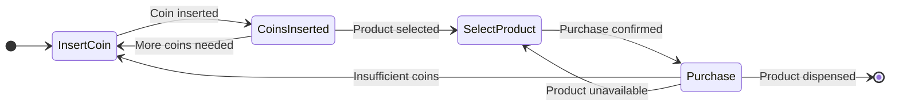
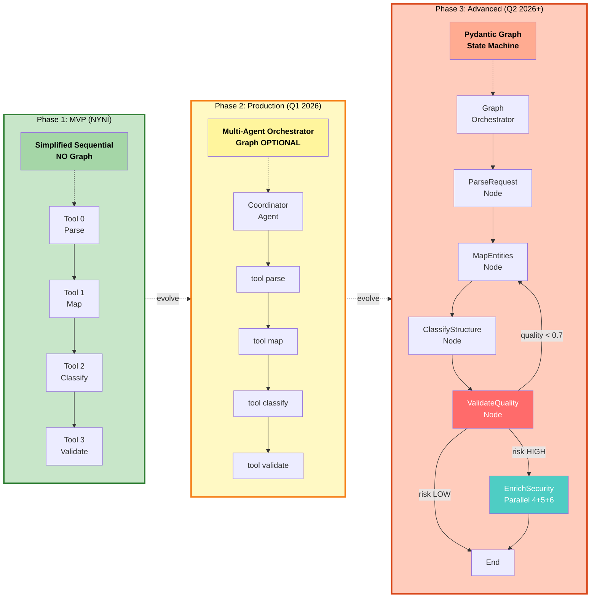
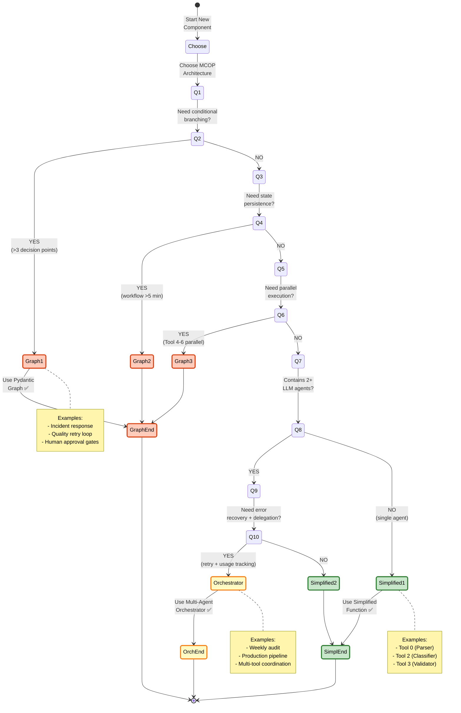
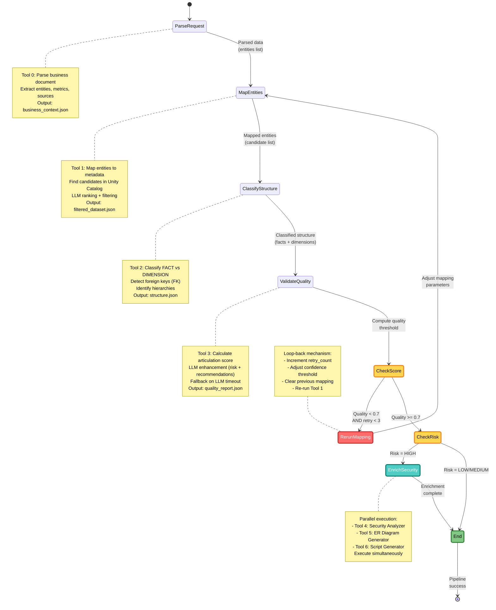

# MCOP Architecture Analysis: Pydantic AI Patterns & Evolution Roadmap

**Datum:** 2025-11-10 (přepsáno z verze 2025-11-09)
**Účel:** Comprehensive analysis of MCOP architecture evolution using official Pydantic AI patterns
**Dokumentace:** Official Pydantic AI repository (`/pydantic/pydantic-ai`, Trust Score 9.6)
**Kontext:** Notebooks jsou dočasné testovací fáze → finální systém spojí tools do integrovaných komponent

---

## Executive Summary

**Klíčové poznání:** Rozdělení Tool 0-3 do separátních notebooků je **dočasné** pro MVP testování. Finální produkční systém spojí tools do větších orchestrovaných komponent.

### Architektonická Evoluce (3 Fáze):

**Phase 1 - MVP (NYNÍ - Testování):**
- Pattern: **Simplified Sequential Functions**
- Tools: Separátní notebooky (Tool 0, 1, 2, 3)
- Orchestrace: Prostý function chaining
- Graph: **NENÍ potřeba**

**Phase 2 - Production (Q1 2026):**
- Pattern: **Multi-Agent Orchestrator**
- Tools: Sloučené do modulů s Agent wrappery
- Orchestrace: Coordinator agent s @tool delegáty
- Graph: **Volitelné** (závisí na branching potřebách)

**Phase 3 - Advanced (Q2 2026+):**
- Pattern: **Pydantic Graph State Machine**
- Tools: Plně integrované graph nodes
- Funkce: Conditional branching, state persistence, parallel execution, human-in-loop
- Graph: **ANO** (full feature set)

---

## Část 1: Pydantic AI Patterns (z oficiální dokumentace)

### 1.1 Multi-Agent Orchestration Pattern

**Koncept:** Coordinator agent deleguje úkoly na specializované agenty pomocí `@tool` dekorátorů.

**Příklad z dokumentace:**
```python
from pydantic_ai import Agent

# Specialized agents
research_agent = Agent(
    'openai:gpt-4o',
    instructions='Research topics thoroughly and provide comprehensive summaries.'
)

writer_agent = Agent(
    'anthropic:claude-3-5-sonnet',
    instructions='Write engaging articles based on research data.'
)

# Coordinator agent
coordinator = Agent('openai:gpt-4o')

@coordinator.tool
async def research_topic(ctx, topic: str) -> str:
    """Research a topic using specialized research agent."""
    result = await research_service.call(topic)
    return result

@coordinator.tool
async def write_article(ctx, research_data: str) -> str:
    """Write article using specialized writer agent."""
    result = await writer_service.call(f'Write article about: {research_data}')
    return result

# Execute
result = await coordinator.run('Research and write about quantum computing')
```

**Klíčové vlastnosti:**
- ✅ Coordinator agent orchestruje workflow
- ✅ Každý specialized agent má vlastní model a instrukce
- ✅ `@tool` dekorátor umožňuje coordinator vyvolat sub-agents
- ✅ Automatické usage tracking přes `ctx.usage`
- ✅ Chybové stavy propagují zpět k coordinator

**Aplikace na MCOP (Phase 2):**
```python
# MCOP Orchestrator Pattern (Q1 2026)
orchestrator = Agent('gpt-5-mini', instructions='Coordinate MCOP metadata pipeline')

@orchestrator.tool
async def parse_business_request(ctx, document: str) -> dict:
    """Tool 0: Parse business request document."""
    return await tool0_agent.run(document, usage=ctx.usage)

@orchestrator.tool
async def map_entities(ctx, parsed: dict) -> dict:
    """Tool 1: Map entities to Unity Catalog metadata."""
    return await tool1_agent.run(parsed, usage=ctx.usage)

@orchestrator.tool
async def classify_structure(ctx, parsed: dict, mapped: dict) -> dict:
    """Tool 2: Classify FACT vs DIMENSION tables."""
    return await tool2_agent.run(parsed, mapped, usage=ctx.usage)

result = await orchestrator.run('Process supplier risk metadata request')
```

---

### 1.2 Pydantic Graph - State Management & Persistence

**Koncept:** Stateful workflows s možností pause/resume a conditional branching.

**Příklad z dokumentace (Email Feedback Loop):**
```python
from pydantic_graph import Graph, BaseNode, GraphRunContext, End
from dataclasses import dataclass, field

@dataclass
class EmailState:
    """Shared state across all graph nodes."""
    user: User
    write_agent_messages: list[ModelMessage] = field(default_factory=list)

@dataclass
class WriteEmail(BaseNode[EmailState]):
    email_feedback: str | None = None

    async def run(self, ctx: GraphRunContext[EmailState]) -> Feedback:
        """Generate email draft using LLM agent."""
        prompt = 'Write email for user'
        if self.email_feedback:
            prompt += f'\nFeedback: {self.email_feedback}'

        result = await email_writer_agent.run(
            prompt,
            message_history=ctx.state.write_agent_messages
        )
        ctx.state.write_agent_messages += result.new_messages()
        return Feedback(result.output)

@dataclass
class Feedback(BaseNode[EmailState]):
    email: Email

    async def run(self, ctx: GraphRunContext[EmailState]) -> WriteEmail | End[Email]:
        """Get feedback on email - conditional branching."""
        result = await feedback_agent.run(f'Review email: {self.email}')

        if isinstance(result.output, EmailRequiresWrite):
            # Loop back to WriteEmail with feedback
            return WriteEmail(email_feedback=result.output.feedback)
        else:
            # Done
            return End(self.email)

# Create graph
graph = Graph(nodes=[WriteEmail, Feedback])
result = await graph.run(WriteEmail(), state=EmailState(user=current_user))
```

**Klíčové vlastnosti:**
- ✅ **Conditional branching:** Node vrací `WriteEmail | End` based on LLM output
- ✅ **State persistence:** `ctx.state.write_agent_messages` sdílený mezi nodes
- ✅ **Message history:** Zachovává kontext mezi iteracemi
- ✅ **Type safety:** `BaseNode[EmailState]` enforces state type
- ⚠️ **Complexity trade-off:** Více boilerplate kódu než simple chaining

---

### 1.3 State Persistence & Resume Capability

**Koncept:** Ukládání graph state do souboru pro resume po chybě nebo pause.

**Příklad z dokumentace:**
```python
from pydantic_graph.persistence.file import FileStatePersistence
from pathlib import Path

@dataclass
class CountDownState:
    counter: int

@dataclass
class CountDown(BaseNode[CountDownState]):
    async def run(self, ctx: GraphRunContext[CountDownState]) -> CountDown | End[int]:
        if ctx.state.counter > 0:
            print(f'Counter: {ctx.state.counter}')
            ctx.state.counter -= 1
            return CountDown()  # Loop back
        else:
            return End(0)  # Done

# Run with persistence
run_id = 'abc123'
persistence = FileStatePersistence(Path(f'count_down_{run_id}.json'))
state = CountDownState(counter=5)

# Initialize and run
await graph.initialize(CountDown(), state=state, persistence=persistence)

# Later, resume from file (different process/session)
async with graph.iter_from_persistence(persistence) as run:
    node_or_end = await run.next()  # Resumes where left off
    print(f'Resumed at counter: {run.state.counter}')
```

**Klíčové vlastnosti:**
- ✅ **FileStatePersistence:** Uloží state do JSON souboru
- ✅ **Resume capability:** `iter_from_persistence()` pokračuje od posledního checkpointu
- ✅ **Cross-session:** Funguje i po restartu Python procesu
- ✅ **Databricks compatible:** Works with DBFS paths (`/dbfs/FileStore/mcop/graph_state.json`)

**Aplikace na MCOP (Phase 3):**
```python
# MCOP Graph with State Persistence
from pydantic_graph.persistence.file import FileStatePersistence

@dataclass
class MCOPState:
    parsed: dict = field(default_factory=dict)
    mapped: dict = field(default_factory=dict)
    quality_score: float = 0.0

persistence = FileStatePersistence(Path('/dbfs/FileStore/mcop/pipeline_state.json'))

# Run with persistence
result = await mcop_graph.run(
    ParseRequest(),
    state=MCOPState(),
    persistence=persistence
)

# If workflow fails at MapEntities node:
# - State saved with parsed data
# - Resume later: await mcop_graph.iter_from_persistence(persistence)
```

---

### 1.4 Mermaid Visualization

**Koncept:** Automatické generování Mermaid diagramů z graph struktury.

**Příklad z dokumentace:**
```python
from pydantic_graph import Graph

# Generate Mermaid diagram
graph = g.build()
mermaid_diagram = graph.render(title='My Graph', direction='LR')
print(mermaid_diagram)

# Or generate code string
mermaid_code = graph.mermaid_code(start_node=MyNode)

# Or image for Jupyter
from IPython.display import Image, display
display(Image(graph.mermaid_image(start_node=MyNode)))
```

**Vending Machine Example (z dokumentace):**


**Klíčové vlastnosti:**
- ✅ **Automatic generation:** No manual diagram maintenance
- ✅ **Direction control:** Left-to-Right (`LR`) or Top-to-Bottom (`TB`)
- ✅ **Customization:** Labels, notes, highlights via `classDef`
- ✅ **Multiple diagram types:** `stateDiagram-v2`, `sequenceDiagram`, `flowchart`

---

### 1.5 Parallel Execution with Shared State

**Koncept:** Současné spuštění více úkolů se sdíleným state objektem.

**Příklad z dokumentace:**
```python
@dataclass
class CounterState:
    values: list[int] = field(default_factory=list)

@g.step
async def track_and_square(ctx: StepContext[CounterState, None, int]) -> int:
    """Process number and track to shared state."""
    # Shared state mutation (thread-safe)
    ctx.state.values.append(ctx.inputs)

    # Return squared value
    return ctx.inputs * ctx.inputs

# Parallel execution
result = await graph.run(
    TrackAndSquare(),
    state=CounterState(),
    inputs=[1, 2, 3, 4]  # Processed in parallel
)

# Result: ctx.state.values = [1, 2, 3, 4]
# Outputs: [1, 4, 9, 16]
```

**Join operations (Reducers):**
```python
from pydantic_graph import reduce_list_append, reduce_dict_update

# List reducer
@g.step
async def process_items(ctx: StepContext[State, None, list[int]]) -> list[int]:
    return [ctx.inputs * 2]

# Join all results
result = await graph.run(ProcessItems(), inputs=[1, 2, 3])
# Uses reduce_list_append: [[2], [4], [6]] → [2, 4, 6]

# Dict reducer
@g.step
async def process_key_value(ctx: StepContext[State, None, dict]) -> dict:
    return {ctx.inputs['key']: ctx.inputs['value'] * 2}

result = await graph.run(ProcessKeyValue(), inputs=[
    {'key': 'a', 'value': 1},
    {'key': 'b', 'value': 2}
])
# Uses reduce_dict_update: [{'a': 2}, {'b': 4}] → {'a': 2, 'b': 4}
```

**Aplikace na MCOP (Phase 3):**
```python
# Parallel execution of Tool 4, 5, 6 (Security, ER Diagram, Script Generator)
@dataclass
class EnrichmentState:
    structure: dict
    security_report: dict = field(default_factory=dict)
    er_diagram: str = ""
    scripts: dict = field(default_factory=dict)

@g.step
async def run_security_analyzer(ctx: StepContext[EnrichmentState, None, dict]) -> dict:
    """Tool 4: Security analysis."""
    result = await security_agent.run(ctx.state.structure)
    ctx.state.security_report = result.output
    return result.output

@g.step
async def run_er_generator(ctx: StepContext[EnrichmentState, None, str]) -> str:
    """Tool 5: ER diagram generation."""
    diagram = generate_mermaid_er(ctx.state.structure)
    ctx.state.er_diagram = diagram
    return diagram

@g.step
async def run_script_generator(ctx: StepContext[EnrichmentState, None, dict]) -> dict:
    """Tool 6: Script generation."""
    scripts = await script_agent.run(ctx.state.structure)
    ctx.state.scripts = scripts.output
    return scripts.output

# Execute all 3 tools in parallel
result = await enrichment_graph.run(
    [RunSecurityAnalyzer(), RunErGenerator(), RunScriptGenerator()],
    state=EnrichmentState(structure=tool2_output)
)
```

---

### 1.6 Databricks Compatibility

**Potvrzeno:** Pydantic AI plně kompatibilní s Databricks (2025-11-10).

**Podporované funkce:**
- ✅ **Python 3.9+** (Databricks: 3.10-3.12)
- ✅ **Async/await** (asyncio plně podporován)
- ✅ **Pydantic v2** (2.8.2 pinned verze)
- ✅ **OpenAI SDK 1.40+** (Databricks proxy compatible)
- ✅ **FileStatePersistence** (works s DBFS paths `/dbfs/FileStore/...`)
- ⚠️ **MLflow autolog** (může interferovat → použít selective logging)

**Deployment pattern:**
```python
# Databricks notebook cell
%pip install pydantic-ai==0.0.14 pydantic==2.8.2 openai>=1.40.0

# Load secrets from Databricks
AZURE_ENDPOINT = dbutils.secrets.get(scope="mcop", key="azure-openai-endpoint")
AZURE_API_KEY = dbutils.secrets.get(scope="mcop", key="azure-openai-api-key")
DEPLOYMENT_NAME = dbutils.secrets.get(scope="mcop", key="azure-openai-deployment")

# Configure Pydantic AI agent
from pydantic_ai import Agent

agent = Agent(
    f'openai:{DEPLOYMENT_NAME}',
    openai_client=OpenAI(
        base_url=AZURE_ENDPOINT,
        api_key=AZURE_API_KEY
    )
)

# State persistence to DBFS
from pydantic_graph.persistence.file import FileStatePersistence
persistence = FileStatePersistence(Path('/dbfs/FileStore/mcop/graph_state.json'))
```

---

## Část 2: MCOP Current State (Tool 0-3 Analýza)

---

## Část 2: MCOP Current State (Tool 0-3 Analýza)

### 2.1 Tool 0: Business Request Parser

**Status:** ✅ Deployed a úspěšně spuštěn v Databricks (2025-11-10)

**Pattern:** Pattern A - Direct OpenAI SDK + JSON mode (BEZ Pydantic AI agents)

**Implementation:**
```python
from openai import OpenAI

client = OpenAI(
    base_url=os.getenv("AZURE_OPENAI_ENDPOINT"),
    api_key=os.getenv("AZURE_OPENAI_API_KEY")
)

response = client.chat.completions.create(
    model=os.getenv("AZURE_OPENAI_DEPLOYMENT_NAME"),  # test-gpt-5-mini
    messages=[
        {"role": "system", "content": "Extract structured data from business request"},
        {"role": "user", "content": markdown_content}
    ],
    response_format={"type": "json_object"}
)

# Parse JSON and validate with Pydantic
parsed_json = json.loads(response.choices[0].message.content)
business_request = BusinessRequest.model_validate(parsed_json)
```

**Výstup (2025-11-09T22-54-38.905152.json):**
- Project: Supplier Risk Insights 2.0
- Sponsor: Marek Hrubý (VP Procurement Excellence)
- Entities: 5 (dimv_supplier, factv_purchase_order, ...)
- Metrics: 5 (Supplier Reliability Index, Lead Time, ...)
- Data sources: 4 (Databricks, Collibra, SAP ECC, SharePoint)
- Constraints: GDPR, retention (36 months), SLA (<5 min), RLS
- Deliverables: 6 (business_request.json, structure.json, Power BI model, ...)

**Timing:** ~3-5s
**Cost:** ~$0.005 per run
**Verdict:** ✅ Simplified approach je ideální pro single-shot parsing bez složitého workflow

---

### 2.2 Tool 1: Entity-to-Candidate Mapping

**Status:** Ready to run (čeká na execution po Tool 0 výstupu)

**Pattern:** Pydantic Graph (5 nodes, 2 LLM agents)

**Architecture:**
```
N1: Load Context → N2: Prepare → N3: Mapping LLM → N4: Filter LLM → N5: Save
```

**Timing:** ~23s (N3: 8s LLM ranking + N4: 12s LLM filtering)

**Důvod pro Graph:**
- ✅ **2 LLM agents** s celkovým časem 20s → checkpoint po N3 užitečný
- ✅ **State persistence** umožňuje restart od Filter Node při API timeout
- ✅ **Observability** node-level traces pro debugging

**Verdikt:** ✅ Keep Pydantic Graph (jediný tool s reálným benefitem z checkpointing)

---

### 2.3 Tool 2: Structure Classification

**Status:** Implementován v notebooku (ready to refactor)

**Pattern:** Pydantic Graph (5 nodes, 1 LLM agent)

**Current architecture:**
```
N1: Load → N2: Prepare → N3: Classification LLM → N4: FK Detection → N5: Save
```

**Timing:** ~15s (N3: 10s LLM classification)

**Analýza:**
- ⚠️ **Lineární flow** bez conditional branching
- ⚠️ **Single LLM agent** (classification only, FK detection je deterministický)
- ⚠️ **Overhead** Graph boilerplate (5 nodes pro simple flow)

**Simplified alternativa:**
```python
async def tool2_structure_classifier(tool1_output_path: str, tool0_output_path: str):
    # Load inputs
    filtered_dataset = load_json(tool1_output_path)
    business_context = load_json(tool0_output_path)

    # Single LLM agent
    classifier_agent = Agent(
        'gpt-5-mini',
        output_type=StructuralAnalysis,
        system_prompt='Classify entities as FACT or DIMENSION'
    )
    result = await classifier_agent.run(
        f'Entities: {filtered_dataset["mappings"]}\nContext: {business_context}'
    )

    # Deterministic FK detection
    for entity in result.output.facts + result.output.dimensions:
        entity['foreign_keys'] = detect_foreign_keys(entity, result.output)

    # Save
    save_json(result.output, 'data/tool2/structure.json')
    return result.output
```

**Benefits:**
- ✅ **-60% kódu** (80 LOC vs 200 LOC Graph version)
- ✅ **Rychlejší development** (edit 1 funkce místo 5 nodes)
- ✅ **Jednodušší debugging** (standard stack trace)

**Verdikt:** ⚠️ Refactor na Simplified (Graph overkill pro lineární flow)

---

### 2.4 Tool 3: Quality Validation

**Status:** Implementován v notebooku (hybrid deterministický + LLM)

**Pattern:** Pydantic Graph (4 nodes, 1 LLM agent s fallback)

**Current architecture:**
```
N1: Load & Validate → N2: Calculate Deterministic → N3: Enhance LLM → N4: Merge
```

**Timing:** ~15s (N2: 3s heuristics + N3: 10s LLM nebo <1s fallback)

**Analýza:**
- ⚠️ **Hybrid approach** (deterministický baseline + optional LLM) lépe jako funkce
- ⚠️ **Fallback handling** jednodušší bez Graph complexity
- ⚠️ **No conditional branching** (lineární flow)

**Simplified alternativa:**
```python
async def tool3_quality_validator(structure_path, business_context_path, metadata_path):
    # Load & Validate
    structure = load_json(structure_path)

    # Calculate Deterministic (Python heuristics)
    entity_scores = {}
    for entity in structure['facts'] + structure['dimensions']:
        entity_scores[entity['table_id']] = calculate_articulation_score(entity['metadata'])

    # Enhance with LLM (with fallback)
    try:
        llm_agent = Agent('gpt-5-mini', output_type=LLMEnhancement)
        llm_result = await llm_agent.run(f'Assess quality: {entity_scores}')
        enhancements = llm_result.output
    except Exception as e:
        print(f'⚠️ LLM failed: {e}. Using fallback.')
        enhancements = generate_fallback_enhancements(entity_scores)

    # Merge & Serialize
    report = QualityReport(
        articulation_scores=entity_scores,
        risk_level=enhancements.risk_level,
        recommendations=enhancements.recommendations
    )
    save_json(report, 'data/tool3/quality_report.json')
    return report
```

**Benefits:**
- ✅ **-70% kódu** (60 LOC vs 200 LOC Graph version)
- ✅ **Fallback handling** přirozenější v try/except bloku
- ✅ **Snadnější testování** (mock LLM call místo mock node execution)

**Verdikt:** ⚠️ Refactor na Simplified (Graph overkill pro hybrid pattern)

---

### 2.5 Summary: Current State Recommendations

| Tool     | **Current Pattern**       | **MVP Recommendation**         | **Reasoning**                               | **Priority** |
| -------- | ------------------------- | ------------------------------ | ------------------------------------------- | ------------ |
| Tool 0   | ✅ Simplified (OpenAI SDK) | Keep as-is                     | Already optimal for single-shot parsing     | N/A (done)   |
| Tool 1   | Pydantic Graph (5 nodes)  | ✅ Keep Graph                   | 2 LLM agents + checkpoint benefit           | LOW          |
| Tool 2   | Pydantic Graph (5 nodes)  | ⚠️ Refactor → Simplified        | Lineární flow + single LLM → graph overkill | HIGH         |
| Tool 3   | Pydantic Graph (4 nodes)  | ⚠️ Refactor → Simplified        | Hybrid pattern better as function           | HIGH         |
| Pipeline | ❌ Doesn't exist           | Create Simplified Orchestrator | MVP needs basic Tool 0→1→2→3 flow           | MEDIUM       |

---

## Část 3: Evolution Roadmap (3 Phases)

### Phase 1: MVP (NYNÍ - Testing)

**Timeline:** 2025-10 až 2025-12 (dokončeno)
**Účel:** Testování jednotlivých tools v separátních noteboocích

**Architecture:**
```python
# Simplified Sequential Execution (NO Graph)
async def run_mcop_mvp_pipeline(business_doc: str):
    """MVP: Prostý function chaining."""

    # Tool 0: Parse business request
    tool0_result = await tool0_parse(business_doc)

    # Tool 1: Map entities to candidates
    tool1_result = await tool1_map(tool0_result)

    # Tool 2: Classify FACT vs DIMENSION
    tool2_result = await tool2_classify(tool0_result, tool1_result)

    # Tool 3: Validate quality
    tool3_result = await tool3_validate(tool0_result, tool2_result)

    return tool3_result

# Usage
result = await run_mcop_mvp_pipeline('data/sample_business_request.md')
print(f'Risk level: {result.risk_level}')
```

**Characteristics:**
- ✅ **Simplicita:** Žádný Graph overhead, prostá async funkce
- ✅ **Rychlý development:** Edit flow = edit funkci
- ✅ **Snadné testování:** Unit test každého toolu samostatně
- ⚠️ **Žádný checkpoint:** Při chybě re-run od začátku
- ⚠️ **Žádná paralelizace:** Sequential execution only

**Kdy Phase 1 není dost:**
- ❌ Potřebujeme conditional branching (skip tools based on context)
- ❌ Potřebujeme state persistence (resume po chybě)
- ❌ Potřebujeme parallel execution (Tool 4-6 současně)

---

### Phase 2: Production (Q1 2026 - Plánováno)

**Timeline:** 2026-01 až 2026-03
**Účel:** Produkční deployment s error recovery a delegation

**Architecture:**
```python
# Multi-Agent Orchestrator Pattern (Graph OPTIONAL)
from pydantic_ai import Agent

orchestrator = Agent(
    'gpt-5-mini',
    instructions='Coordinate MCOP metadata pipeline with error recovery'
)

@orchestrator.tool
async def parse_business_request(ctx, document: str) -> dict:
    """Tool 0: Parse business request document."""
    result = await tool0_agent.run(document, usage=ctx.usage)
    return result.output.model_dump()

@orchestrator.tool
async def map_entities(ctx, parsed: dict) -> dict:
    """Tool 1: Map entities to Unity Catalog metadata."""
    result = await tool1_agent.run(parsed, usage=ctx.usage)
    return result.output.model_dump()

@orchestrator.tool
async def classify_structure(ctx, parsed: dict, mapped: dict) -> dict:
    """Tool 2: Classify FACT vs DIMENSION tables."""
    result = await tool2_agent.run(f'Parsed: {parsed}\nMapped: {mapped}', usage=ctx.usage)
    return result.output.model_dump()

@orchestrator.tool
async def validate_quality(ctx, structure: dict) -> dict:
    """Tool 3: Validate metadata quality."""
    result = await tool3_agent.run(structure, usage=ctx.usage)
    return result.output.model_dump()

# Execute
result = await orchestrator.run('Process supplier risk metadata request')
```

**Characteristics:**
- ✅ **Delegation:** Coordinator orchestruje specialized agents
- ✅ **Error recovery:** Každý `@tool` má vlastní retry logiku
- ✅ **Usage tracking:** Automatické přes `ctx.usage`
- ✅ **Observability:** Agent-level traces (který tool volal jaký LLM)
- ⚠️ **Stále sequential:** Žádná paralelizace (pokud nepřidáme Graph)

**Kdy přidat Graph (conditional):**
```python
# Pokud potřebujeme conditional branching:
@orchestrator.tool
async def run_security_check(ctx, structure: dict) -> dict | None:
    """Tool 4: Run security analysis only if HIGH risk."""
    quality = await validate_quality(ctx, structure)

    if quality['risk_level'] == 'HIGH':
        # Run Tool 4
        return await security_agent.run(structure, usage=ctx.usage)
    else:
        # Skip Tool 4
        return None
```

**Phase 2 → Phase 3 Triggers:**
- Need parallel execution (Tool 4 + 5 + 6 současně)
- Need state persistence (workflows >5 min)
- Need human-in-loop (approval gates)

---

### Phase 3: Advanced (Q2 2026+ - Budoucnost)

**Timeline:** 2026-04 onwards
**Účel:** Full graph capabilities pro complex scenarios

**Architecture:**
```python
# Pydantic Graph State Machine (Full Feature Set)
from pydantic_graph import Graph, BaseNode, GraphRunContext, End
from dataclasses import dataclass, field

@dataclass
class MCOPState:
    """Shared state across all pipeline nodes."""
    parsed: dict = field(default_factory=dict)
    mapped: dict = field(default_factory=dict)
    structure: dict = field(default_factory=dict)
    quality_score: float = 0.0
    retry_count: int = 0

@dataclass
class ParseRequest(BaseNode[MCOPState]):
    async def run(self, ctx: GraphRunContext[MCOPState]) -> MapEntities:
        """Tool 0: Parse business request."""
        result = await tool0_agent.run(ctx.inputs['document'])
        ctx.state.parsed = result.output.model_dump()
        return MapEntities()

@dataclass
class MapEntities(BaseNode[MCOPState]):
    async def run(self, ctx: GraphRunContext[MCOPState]) -> ClassifyStructure:
        """Tool 1: Map entities to metadata."""
        result = await tool1_agent.run(ctx.state.parsed)
        ctx.state.mapped = result.output.model_dump()
        return ClassifyStructure()

@dataclass
class ClassifyStructure(BaseNode[MCOPState]):
    async def run(self, ctx: GraphRunContext[MCOPState]) -> ValidateQuality:
        """Tool 2: Classify FACT vs DIMENSION."""
        result = await tool2_agent.run(ctx.state.parsed, ctx.state.mapped)
        ctx.state.structure = result.output.model_dump()
        return ValidateQuality()

@dataclass
class ValidateQuality(BaseNode[MCOPState]):
    async def run(self, ctx: GraphRunContext[MCOPState]) -> RerunMapping | EnrichSecurity | End:
        """Tool 3: Validate quality with conditional routing."""
        result = await tool3_agent.run(ctx.state.structure)
        ctx.state.quality_score = result.output.metrics['avg_articulation_score']

        # Conditional branching based on quality score
        if ctx.state.quality_score < 0.7:
            if ctx.state.retry_count < 3:
                print(f'⚠️ Low quality ({ctx.state.quality_score:.2f}) - retrying mapping')
                ctx.state.retry_count += 1
                return RerunMapping()  # Loop back to MapEntities
            else:
                print(f'❌ Max retries reached. Failing pipeline.')
                return End(ctx.state)

        # If high risk, run security enrichment
        if result.output.risk_level == 'HIGH':
            return EnrichSecurity()  # Parallel Tool 4+5+6
        else:
            return End(ctx.state)  # Done

@dataclass
class RerunMapping(BaseNode[MCOPState]):
    """Re-run mapping with adjusted parameters."""
    async def run(self, ctx: GraphRunContext[MCOPState]) -> MapEntities:
        print('🔄 Adjusting mapping threshold and re-running...')
        # Clear previous mapping
        ctx.state.mapped = {}
        return MapEntities()

@dataclass
class EnrichSecurity(BaseNode[MCOPState]):
    """Parallel execution: Tool 4 (Security) + Tool 5 (ER) + Tool 6 (Scripts)."""
    async def run(self, ctx: GraphRunContext[MCOPState]) -> End:
        # Run Tool 4, 5, 6 in parallel
        security_task = tool4_agent.run(ctx.state.structure)
        er_task = tool5_agent.run(ctx.state.structure)
        script_task = tool6_agent.run(ctx.state.structure)

        security, er, scripts = await asyncio.gather(security_task, er_task, script_task)

        ctx.state['security'] = security.output.model_dump()
        ctx.state['er_diagram'] = er.output
        ctx.state['scripts'] = scripts.output.model_dump()

        return End(ctx.state)

# Create graph with state persistence
graph = Graph(nodes=[
    ParseRequest, MapEntities, ClassifyStructure,
    ValidateQuality, RerunMapping, EnrichSecurity
])

persistence = FileStatePersistence(Path('/dbfs/FileStore/mcop/pipeline_state.json'))

# Run with persistence
result = await graph.run(
    ParseRequest(),
    state=MCOPState(),
    persistence=persistence,
    inputs={'document': 'data/sample_business_request.md'}
)
```

**Characteristics:**
- ✅ **Conditional branching:** Quality < 0.7 → RerunMapping, else EnrichSecurity or End
- ✅ **State persistence:** Resume od ValidateQuality při chybě
- ✅ **Parallel execution:** Tool 4+5+6 současně v EnrichSecurity node
- ✅ **Retry logic:** Max 3 attempts s quality threshold check
- ✅ **Type safety:** MCOPState enforces schema across všechny nodes
- ✅ **Mermaid visualization:** Auto-generate diagram z graph struktury

**Kdy Phase 3 dává smysl:**
- ✅ Incident response workflow (krizový scénář z `tool4-6_scenario_brief.md`)
- ✅ Long-running workflows (>5 min, potřeba checkpoint)
- ✅ Human-in-loop (approval gates před EnrichSecurity)
- ✅ Complex branching (multiple decision points based on context)

---

## Část 4: Decision Matrix (Kdy použít co)

---

## Část 4: Decision Matrix (Kdy použít co)

### 4.1 Feature Comparison Table

| Feature / Requirement               | **Simplified Functions** | **Multi-Agent Orchestrator** | **Pydantic Graph**        |
| ----------------------------------- | ------------------------ | ---------------------------- | ------------------------- |
| **Lineární flow** (A → B → C)       | ✅ **Ideal**              | ✅ OK                         | ⚠️ Overkill                |
| **Single LLM agent**                | ✅ **Ideal**              | ✅ OK                         | ⚠️ Overkill                |
| **2+ LLM agents** (sequential)      | ✅ OK                     | ✅ **Ideal**                  | 🤔 Optional                |
| **Conditional branching**           | ⚠️ Manual if/else         | ⚠️ Complex logic              | ✅ **Native support**      |
| **State persistence** (checkpoint)  | ❌ No support             | ❌ Manual implementation      | ✅ **Built-in**            |
| **Parallel execution**              | ⚠️ Manual asyncio.gather  | ⚠️ Manual coordination        | ✅ **Beta API**            |
| **Long-running workflows** (>5 min) | ❌ Risky (no checkpoint)  | ⚠️ Depends on retry logic     | ✅ **Resume capability**   |
| **Human-in-the-loop**               | ❌ Manual state handling  | ⚠️ Custom pause/resume        | ✅ **Native pause/resume** |
| **Error recovery**                  | ⚠️ Manual try/except      | ✅ Per-tool retry             | ✅ **Per-node checkpoint** |
| **Development speed**               | ✅ **Fastest** (minimal)  | ⚠️ Medium (agent setup)       | ❌ Slow (boilerplate)      |
| **Code maintenance**                | ✅ **Lowest** (simple)    | ⚠️ Medium                     | ❌ Highest (complex)       |
| **Type safety**                     | ✅ Pydantic schemas       | ✅ Pydantic schemas           | ✅ Pydantic + Graph types  |
| **Observability**                   | ⚠️ Function-level         | ✅ Agent-level                | ✅ **Node-level**          |
| **Visualization**                   | ❌ Manual diagrams        | ❌ Manual diagrams            | ✅ **Auto Mermaid**        |
| **Testing complexity**              | ✅ **Simplest**           | ⚠️ Medium (mock agents)       | ❌ Complex (mock nodes)    |
| **Databricks compatibility**        | ✅ Full                   | ✅ Full                       | ✅ Full                    |
| **Cost (development time)**         | ✅ **1-2 hours**          | ⚠️ 4-6 hours                  | ❌ 8-12 hours              |

---

### 4.2 MCOP-Specific Recommendations

| Tool / Component      | **Recommended Pattern**          | **Reasoning**                                                   |
| --------------------- | -------------------------------- | --------------------------------------------------------------- |
| **Tool 0** (Parser)   | ✅ Simplified (Direct OpenAI SDK) | Single-shot parsing, no complex workflow                        |
| **Tool 1** (Mapping)  | 🤔 Pydantic Graph                 | 2 LLM agents + 20s runtime → checkpoint beneficial              |
| **Tool 2** (Classify) | ✅ Simplified Function            | Lineární flow + single LLM → graph overkill                     |
| **Tool 3** (Quality)  | ✅ Simplified Function            | Hybrid (deterministic + LLM) natural as function                |
| **MVP Orchestrator**  | ✅ Simplified Chaining            | Tool 0→1→2→3 sequential, no branching                           |
| **Production Orch.**  | ✅ Multi-Agent Orchestrator       | Error recovery + delegation + usage tracking                    |
| **Advanced Pipeline** | ✅ Pydantic Graph                 | Conditional branching + parallel (Tool 4-6) + state persistence |

---

### 4.3 Decision Tree Flowchart

**Use this to decide pattern for new components:**

```
START: New MCOP Component
  ↓
Q1: Does it need conditional branching (if-else paths)?
  ↓ YES → Q2
  ↓ NO  → Q3

Q2: Complex branching (>3 decision points)?
  ↓ YES → **Use Pydantic Graph** ✅
  ↓ NO  → Q3

Q3: Does it need state persistence (resume after failure)?
  ↓ YES → Q4
  ↓ NO  → Q5

Q4: Workflow duration > 5 minutes?
  ↓ YES → **Use Pydantic Graph** ✅
  ↓ NO  → Q5

Q5: Does it need parallel execution?
  ↓ YES → **Use Pydantic Graph** (Beta parallel API) ✅
  ↓ NO  → Q6

Q6: Contains 2+ LLM agents?
  ↓ YES → Q7
  ↓ NO  → **Use Simplified Function** ✅

Q7: Need error recovery + delegation?
  ↓ YES → **Use Multi-Agent Orchestrator** ✅
  ↓ NO  → **Use Simplified Function** ✅
```

---

### 4.4 Real-World Scenario Mapping

**Scénář A: Rapid Supplier Onboarding (SCR-20250918-01)**
- **Pattern:** Simplified Function
- **Reasoning:** Lineární flow, single LLM query na dodavatele, <30s runtime
- **Implementation:** `async def onboard_supplier(supplier_id: str)`

**Scénář B: Supplier Disruption Crisis (Tool 4-6 Scenario)**
- **Pattern:** Pydantic Graph
- **Reasoning:**
  * Conditional branching (HIGH risk → run Tool 4-6, LOW risk → skip)
  * Parallel execution (Tool 4 + 5 + 6 současně)
  * Long-running (incident response >10 min s human approval)
- **Implementation:** Graph s `ValidateQuality → ConditionalEnrichment → End`

**Scénář C: Weekly Metadata Quality Audit**
- **Pattern:** Multi-Agent Orchestrator
- **Reasoning:**
  * Sequential execution (Tool 1 → 2 → 3 → 7)
  * Error recovery (retry při API timeout)
  * Usage tracking (monitor LLM costs per tool)
- **Implementation:** Coordinator agent s 4 `@tool` delegáty

---

## Část 5: Mermaid Diagrams (Vizualizace)
---

## Část 5: Mermaid Diagrams (Vizualizace)

### Diagram A: Architecture Evolution (Flowchart Left-to-Right)

**Zobrazuje:** Evoluce MCOP architektury přes 3 fáze (MVP → Production → Advanced)



**Legenda:**
- 🟢 **Zelená (MVP):** Simplified functions, žádný Graph overhead
- 🟡 **Žlutá (Production):** Multi-agent orchestrator, Graph optional
- 🟠 **Oranžová (Advanced):** Pydantic Graph s conditional branching a parallel execution

**Klíčové rozdíly:**
- **MVP:** Prostá funkce chaining (Tool 0 → 1 → 2 → 3)
- **Production:** Coordinator deleguje na `@tool` wrapped agents
- **Advanced:** Graph nodes s conditional routing (quality threshold, risk level)

---

### Diagram B: Decision Tree (When to Use What)

**Zobrazuje:** Rozhodovací strom pro výběr správného patternu



**Legenda:**
- 🟠 **Oranžová cesta → Pydantic Graph:** Complex branching, state persistence, parallel execution
- 🟡 **Žlutá cesta → Multi-Agent Orchestrator:** Error recovery, delegation, usage tracking
- 🟢 **Zelená cesta → Simplified Function:** Lineární flow, single/simple agents

**Decision Points:**
1. **Conditional branching?** → If >3 decision points, consider Graph
2. **State persistence?** → If workflow >5 min, need Graph checkpoint
3. **Parallel execution?** → Graph Beta API handles concurrent nodes
4. **2+ LLM agents?** → Orchestrator for delegation, Simplified for simple
5. **Error recovery?** → Orchestrator with retry logic per tool

---

### Diagram C: MCOP Workflow State Machine (Advanced Phase)

**Zobrazuje:** Detailní state machine pro Phase 3 s conditional branching a loop-back



**Legenda:**
- 🔴 **Červená (RerunMapping):** Loop-back node při nízké kvalitě (quality < 0.7)
- 🟡 **Žlutá (CheckScore/CheckRisk):** Decision nodes s conditional routing
- 🔵 **Tyrkysová (EnrichSecurity):** Parallel execution node (Tool 4+5+6)
- 🟢 **Zelená (End):** Úspěšný konec pipeline

**State Transitions:**
1. **ParseRequest → MapEntities:** Předá entity list
2. **MapEntities → ClassifyStructure:** Předá candidate mappings
3. **ClassifyStructure → ValidateQuality:** Předá strukturu (facts + dimensions)
4. **ValidateQuality → CheckScore:** Vypočte articulation score
5. **CheckScore → RerunMapping:** IF quality < 0.7 AND retry_count < 3
6. **CheckScore → CheckRisk:** IF quality >= 0.7
7. **CheckRisk → EnrichSecurity:** IF risk_level == "HIGH"
8. **CheckRisk → End:** IF risk_level in ["LOW", "MEDIUM"]
9. **RerunMapping → MapEntities:** Loop back s adjusted parameters
10. **EnrichSecurity → End:** Po dokončení paralelních enrichment tasks

**Shared State (MCOPState):**
```python
@dataclass
class MCOPState:
    parsed: dict                    # From ParseRequest
    mapped: dict                    # From MapEntities
    structure: dict                 # From ClassifyStructure
    quality_score: float = 0.0      # From ValidateQuality
    retry_count: int = 0            # For RerunMapping loop
    security_report: dict = {}      # From EnrichSecurity (Tool 4)
    er_diagram: str = ""            # From EnrichSecurity (Tool 5)
    scripts: dict = {}              # From EnrichSecurity (Tool 6)
```

---

## Část 6: Implementation Roadmap & Next Steps

---

## Část 6: Implementation Roadmap & Next Steps

### 6.1 Immediate Actions (This Week - 2025-11-11 až 2025-11-15)

**Priority 1: Refactor Tool 2 & 3 → Simplified ✅**

**Tool 2 - Simplified Structure Classifier:**
```python
# File: src/tool2/classifier_simplified.py

async def tool2_structure_classifier(
    tool1_output_path: str,
    tool0_output_path: str,
    output_path: str = "data/tool2/structure.json"
) -> StructuralAnalysis:
    """Tool 2: FACT/DIMENSION classification (simplified multi-agent)."""

    # Load inputs (deterministický)
    filtered_dataset = load_json(tool1_output_path)
    business_context = load_json(tool0_output_path)

    # Single LLM agent (classification)
    classifier_agent = Agent(
        'gpt-5-mini',
        output_type=StructuralAnalysis,
        system_prompt="""Classify entities as FACT or DIMENSION based on:
        - FACT: Transactional data with measures and date columns
        - DIMENSION: Reference data with business keys and attributes
        """
    )

    result = await classifier_agent.run(
        f"""Entities to classify: {filtered_dataset['mappings']}

        Business context:
        - Goal: {business_context['goal']}
        - Scope: {business_context['scope_in']}
        - Entities: {business_context['entities']}
        """
    )

    # FK detection (deterministický heuristics)
    for entity in result.output.facts + result.output.dimensions:
        entity['foreign_keys'] = detect_foreign_keys(entity, result.output)

    # Save
    save_json(result.output.model_dump(), output_path)
    return result.output
```

**Tool 3 - Simplified Quality Validator:**
```python
# File: src/tool3/validator_simplified.py

async def tool3_quality_validator(
    structure_path: str,
    business_context_path: str,
    metadata_path: str,
    output_path: str = "data/tool3/quality_report.json"
) -> QualityReport:
    """Tool 3: Hybrid quality validation (simplified multi-agent)."""

    # Step 1: Load & Validate (deterministický)
    structure = load_json(structure_path)
    business_context = load_json(business_context_path)
    metadata = load_json(metadata_path)

    # Step 2: Calculate Deterministic (Python heuristics)
    entity_scores = {}
    validation_flags = {}

    for entity in structure['facts'] + structure['dimensions']:
        score = calculate_articulation_score(entity['metadata'])
        entity_scores[entity['table_id']] = score
        validation_flags[entity['table_id']] = (
            'pass' if score >= 50 else 'warning' if score > 0 else 'fail'
        )

    # Step 3: Enhance with LLM (optional, with fallback)
    try:
        llm_agent = Agent(
            'gpt-5-mini',
            output_type=LLMEnhancement,
            system_prompt="""Assess metadata quality and provide P0-P2 recommendations.

            P0 (Critical): description, owner
            P1 (Important): lineage, source_mapping
            P2 (Nice-to-have): dq_rules, governance_tags, last_updated
            """
        )

        llm_result = await llm_agent.run(
            f"""Entity scores: {entity_scores}
            Validation flags: {validation_flags}

            Provide risk assessment and actionable recommendations.
            """
        )

        enhancements = llm_result.output
        fallback_mode = False

    except Exception as e:
        print(f'⚠️ LLM enhancement failed: {e}. Using fallback.')
        enhancements = generate_fallback_enhancements(entity_scores, validation_flags)
        fallback_mode = True

    # Step 4: Merge & Serialize (deterministický)
    report = QualityReport(
        schema_version='1.0.0',
        timestamp=datetime.now().isoformat(),
        articulation_scores=entity_scores,
        validation_results=validation_flags,
        risk_level=enhancements.risk_level,
        risk_rationale=enhancements.risk_rationale,
        recommendations=enhancements.recommendations,
        anomaly_notes=enhancements.anomaly_notes,
        summary=enhancements.summary,
        metrics={
            'total_entities': len(entity_scores),
            'avg_articulation_score': sum(entity_scores.values()) / len(entity_scores),
            'p0_blockers': sum(1 for flag in validation_flags.values() if flag == 'fail'),
            'fallback_mode': fallback_mode
        }
    )

    save_json(report.model_dump(), output_path)
    print(f'✅ Quality report saved: {output_path}')
    print(f'   Risk level: {report.risk_level}')
    print(f'   P0 blockers: {report.metrics["p0_blockers"]}')
    print(f'   Avg score: {report.metrics["avg_articulation_score"]:.1f}/100')

    return report
```

**Expected Impact:**
- ✅ **-200 LOC** (Tool 2: 80 LOC vs 200 LOC Graph, Tool 3: 60 LOC vs 200 LOC Graph)
- ✅ **Faster development** (změny flow = edit 1 funkce místo 4-5 nodes)
- ✅ **Easier debugging** (standard stack trace vs graph execution log)
- ✅ **Same functionality** (LLM enhancement, fallback handling, type safety)

**Testing:**
```bash
# Regression testing s existujícími Tool 0/1 outputs
python3 -m pytest tests/test_tool2_simplified.py -v
python3 -m pytest tests/test_tool3_simplified.py -v

# End-to-end test
python3 src/orchestrator.py --input data/sample_business_request.md
```

---

### 6.2 Near-Term Actions (Next Week - 2025-11-18 až 2025-11-22)

**Priority 2: Create MVP Orchestrator ✅**

**File:** `src/orchestrator.py`

```python
"""MCOP MVP Orchestrator - Simplified Sequential Execution"""

from typing import Dict
import asyncio

async def run_mcop_mvp_pipeline(
    business_request_path: str,
    output_dir: str = "data/outputs"
) -> Dict:
    """
    MCOP MVP Pipeline: Tool 0 → 1 → 2 → 3 → 7 (sequential execution)

    Args:
        business_request_path: Path to Markdown business request
        output_dir: Directory for outputs

    Returns:
        Dict with all tool outputs and final report path
    """

    print("🚀 Starting MCOP MVP Pipeline...")
    print(f"📄 Input: {business_request_path}\n")

    # Tool 0: Parse business request
    print("🔵 [1/5] Tool 0: Parsing business request...")
    from src.tool0.parser import tool0_parse
    tool0_output = await tool0_parse(business_request_path)
    print(f"   ✅ Parsed: {tool0_output.project_metadata.project_name}")
    print(f"   ✅ Entities: {len(tool0_output.entities)}")
    print(f"   ✅ Output: {tool0_output.output_path}\n")

    # Tool 1: Entity-to-candidate mapping
    print("🔵 [2/5] Tool 1: Mapping entities to candidates...")
    from src.tool1.ingest import tool1_ingest
    tool1_output = await tool1_ingest(
        entities=tool0_output.entities,
        business_context_path=tool0_output.output_path
    )
    print(f"   ✅ Mapped: {len(tool1_output.mappings)} entities")
    print(f"   ✅ Output: {tool1_output.output_path}\n")

    # Tool 2: Structure classification
    print("🔵 [3/5] Tool 2: Classifying FACT vs DIMENSION...")
    from src.tool2.classifier_simplified import tool2_structure_classifier
    tool2_output = await tool2_structure_classifier(
        tool1_output_path=tool1_output.output_path,
        tool0_output_path=tool0_output.output_path
    )
    print(f"   ✅ Facts: {len(tool2_output.facts)}")
    print(f"   ✅ Dimensions: {len(tool2_output.dimensions)}")
    print(f"   ✅ Output: data/tool2/structure.json\n")

    # Tool 3: Quality validation
    print("🔵 [4/5] Tool 3: Validating metadata quality...")
    from src.tool3.validator_simplified import tool3_quality_validator
    tool3_output = await tool3_quality_validator(
        structure_path="data/tool2/structure.json",
        business_context_path=tool0_output.output_path,
        metadata_path="docs_langgraph/BA-BS_Datamarts_metadata.json"
    )
    print(f"   ✅ Risk level: {tool3_output.risk_level}")
    print(f"   ✅ P0 blockers: {tool3_output.metrics['p0_blockers']}")
    print(f"   ✅ Avg score: {tool3_output.metrics['avg_articulation_score']:.1f}/100")
    print(f"   ✅ Output: {tool3_output.output_path}\n")

    # Tool 7: Generate governance report
    print("🔵 [5/5] Tool 7: Generating governance report...")
    from src.tool7.report_generator import tool7_generate_report
    report = await tool7_generate_report(
        tool0_output=tool0_output,
        tool1_output=tool1_output,
        tool2_output=tool2_output,
        tool3_output=tool3_output,
        output_dir=output_dir
    )
    print(f"   ✅ Report: {report.output_path}\n")

    print("🎉 MCOP MVP Pipeline Complete!")
    print(f"📊 Final Report: {report.output_path}")

    return {
        "tool0": tool0_output,
        "tool1": tool1_output,
        "tool2": tool2_output,
        "tool3": tool3_output,
        "report": report
    }

# CLI usage
if __name__ == "__main__":
    import argparse

    parser = argparse.ArgumentParser(description="Run MCOP MVP Pipeline")
    parser.add_argument("--input", required=True, help="Path to business request Markdown")
    parser.add_argument("--output-dir", default="data/outputs", help="Output directory")

    args = parser.parse_args()

    result = asyncio.run(run_mcop_mvp_pipeline(args.input, args.output_dir))
```

**Usage:**
```bash
# Run MVP pipeline
python3 src/orchestrator.py --input data/sample_business_request.md

# Expected output:
# 🚀 Starting MCOP MVP Pipeline...
# 🔵 [1/5] Tool 0: Parsing...
#    ✅ Parsed: Supplier Risk Insights 2.0
# 🔵 [2/5] Tool 1: Mapping...
#    ✅ Mapped: 5 entities
# 🔵 [3/5] Tool 2: Classifying...
#    ✅ Facts: 2, Dimensions: 3
# 🔵 [4/5] Tool 3: Validating...
#    ✅ Risk: MEDIUM, P0 blockers: 1
# 🔵 [5/5] Tool 7: Generating report...
# 🎉 MCOP MVP Pipeline Complete!
```

**Priority 3: Databricks Deployment ✅**

```bash
# Update Databricks notebooks s simplified versions
databricks workspace import \
  --file notebooks/databricks/tool2_classifier_simplified.py \
  --format SOURCE \
  --language PYTHON \
  --overwrite \
  /Workspace/Users/marek.minarovic@company.com/MCOP/tool2_classifier

databricks workspace import \
  --file notebooks/databricks/tool3_validator_simplified.py \
  --format SOURCE \
  --language PYTHON \
  --overwrite \
  /Workspace/Users/marek.minarovic@company.com/MCOP/tool3_validator

# Test end-to-end v Databricks
databricks workspace import \
  --file notebooks/databricks/mcop_mvp_pipeline.py \
  --format SOURCE \
  --language PYTHON \
  --overwrite \
  /Workspace/Users/marek.minarovic@company.com/MCOP/mvp_pipeline
```

---

### 6.3 Medium-Term Actions (Q1 2026 - Phase 2)

**Priority 4: Add Tool 4-6 (Security, ER Diagram, Script Generator) 📅**

**Tool 4 - Security Analyzer:**
```python
async def tool4_security_analyzer(structure_path: str) -> SecurityReport:
    """
    Tool 4: Security analysis (PII detection, RLS recommendations)

    Pattern: Simplified Function (single LLM agent)
    """
    structure = load_json(structure_path)

    security_agent = Agent('gpt-5-mini', output_type=SecurityReport)
    result = await security_agent.run(f'Analyze security: {structure}')

    return result.output
```

**Tool 5 - ER Diagram Generator:**
```python
async def tool5_er_diagram_generator(structure_path: str) -> str:
    """
    Tool 5: ER diagram generation (Mermaid format)

    Pattern: Simplified Function (deterministic + optional LLM enhancement)
    """
    structure = load_json(structure_path)

    # Deterministický Mermaid generation
    diagram = generate_mermaid_er(structure['facts'], structure['dimensions'])

    # Optional: LLM enhancement pro layout optimization
    # (skip for MVP, add in Phase 2)

    return diagram
```

**Tool 6 - Script Generator:**
```python
async def tool6_script_generator(structure_path: str, business_context_path: str) -> Scripts:
    """
    Tool 6: Script generation (Power Query M + SQL)

    Pattern: Multi-Agent (2 specialized agents: M script + SQL script)
    """
    structure = load_json(structure_path)
    business_context = load_json(business_context_path)

    # Agent 1: Power Query M script
    m_agent = Agent('gpt-5-mini', output_type=MScript)
    m_result = await m_agent.run(f'Generate M script: {structure}')

    # Agent 2: SQL script
    sql_agent = Agent('gpt-5-mini', output_type=SQLScript)
    sql_result = await sql_agent.run(f'Generate SQL: {structure}')

    return Scripts(m_script=m_result.output, sql_script=sql_result.output)
```

**Priority 5: Upgrade Orchestrator → Multi-Agent Pattern 📅**

```python
# Phase 2: Multi-agent orchestrator s error recovery
from pydantic_ai import Agent

orchestrator = Agent(
    'gpt-5-mini',
    instructions='Coordinate MCOP metadata pipeline with error recovery and usage tracking'
)

@orchestrator.tool
async def parse_business_request(ctx, document: str) -> dict:
    """Tool 0: Parse business request."""
    result = await tool0_agent.run(document, usage=ctx.usage)
    return result.output.model_dump()

@orchestrator.tool
async def map_entities(ctx, parsed: dict) -> dict:
    """Tool 1: Map entities to candidates."""
    result = await tool1_agent.run(parsed['entities'], usage=ctx.usage)
    return result.output.model_dump()

# ... (Tool 2-7 similar @tool wrappers)

@orchestrator.tool
async def run_enrichment_conditionally(ctx, structure: dict, quality: dict) -> dict | None:
    """Tools 4-6: Run security/ER/scripts only if HIGH risk."""
    if quality['risk_level'] == 'HIGH':
        # Parallel execution (Phase 2 feature)
        security = await tool4_agent.run(structure, usage=ctx.usage)
        er = await tool5_agent.run(structure, usage=ctx.usage)
        scripts = await tool6_agent.run(structure, usage=ctx.usage)

        return {
            'security': security.output.model_dump(),
            'er_diagram': er.output,
            'scripts': scripts.output.model_dump()
        }
    else:
        return None  # Skip enrichment

# Execute
result = await orchestrator.run('Process supplier risk metadata request')
```

---

### 6.4 Long-Term Actions (Q2 2026+ - Phase 3)

**Priority 6: Upgrade to Pydantic Graph (When Needed) 📅**

**Triggers for Graph upgrade:**
- ✅ Tool 1 quality score consistently < 0.7 → need retry loop
- ✅ Incident response workflows require state persistence (>5 min runtime)
- ✅ Human-in-loop approval gates needed (data steward review)
- ✅ Parallel execution becomes bottleneck (Tool 4-6 sequential → slow)

**Graph implementation (Phase 3):**
```python
# See Diagram C: MCOP Workflow State Machine
# Full implementation in Part 3: Evolution Roadmap → Phase 3: Advanced
```

---

## Část 7: Závěr & Decision Log

### 7.1 TL;DR Recommendations

| Component            | **Current State**         | **Action**              | **Reasoning**                                        | **Timeline** |
| -------------------- | ------------------------- | ----------------------- | ---------------------------------------------------- | ------------ |
| **Tool 0**           | ✅ Simplified (OpenAI SDK) | Keep as-is              | Optimal pro single-shot parsing                      | N/A (done)   |
| **Tool 1**           | Pydantic Graph (5 nodes)  | ✅ Keep Graph            | 2 LLM agents + checkpoint benefit                    | Document why |
| **Tool 2**           | Pydantic Graph (5 nodes)  | ⚠️ Refactor → Simplified | Lineární flow + single LLM → graph overkill          | This week    |
| **Tool 3**           | Pydantic Graph (4 nodes)  | ⚠️ Refactor → Simplified | Hybrid pattern natural as function                   | This week    |
| **MVP Orchestrator** | ❌ Doesn't exist           | 🆕 Create Simplified     | Basic Tool 0→1→2→3 flow needed                       | Next week    |
| **Phase 2 Orch.**    | ❌ Doesn't exist           | 📅 Create Multi-Agent    | Production deployment s error recovery               | Q1 2026      |
| **Phase 3 Graph**    | ❌ Doesn't exist           | 📅 Consider if needed    | Advanced features (branching, persistence, parallel) | Q2 2026+     |

---

### 7.2 Decision Log

**Rozhodnutí:** Refactor Tool 2 & 3 z Pydantic Graph na Simplified Multi-Agent
**Datum:** 2025-11-10
**Důvod:**
- Tool 2 má lineární flow (Load → Classify → FK detect → Save) bez conditional branching
- Tool 3 má hybrid approach (deterministický + optional LLM) přirozenější jako funkce
- Oba tools mají single-agent LLM calls (<10s) → checkpoint benefit minimální
- Development speed > theoretical observability benefits pro MVP

**Trade-offs acknowledged:**
- ⚠️ Ztráta automatic Mermaid diagram generation (ale můžeme vytvořit manuálně pro docs)
- ⚠️ Ztráta node-level instrumentation (ale function-level stačí pro MVP debugging)
- ⚠️ Těžší future upgrade na parallel execution (ale není v Phase 1 roadmapě)

**Fallback plan:**
- Pokud Phase 2 requirements ukážou, že potřebujeme Graph features (human-in-loop, parallel execution), můžeme re-add Graph jen pro specific tools, ne all

**Approval:** Pending review s MCOP team

---

### 7.3 Key Takeaways

**Pro MVP (NYNÍ):**
- ✅ **Simplified functions** jsou dost pro většinu tools (Tool 0, 2, 3)
- ✅ **Keep Tool 1 Graph** jako reference implementation (2 LLM agents benefit z checkpoint)
- ✅ **Focus on functionality** místo theoretical observability

**Pro Production (Q1 2026):**
- ✅ **Multi-agent orchestrator** provides error recovery + delegation + usage tracking
- ✅ **Graph OPTIONAL** pokud nepotřebujeme conditional branching
- ✅ **Tool 4-6 addition** ospravedlní upgrade orchestrátoru

**Pro Advanced (Q2 2026+):**
- ✅ **Pydantic Graph** dává smysl when:
  * Conditional branching (quality retry loop, risk-based routing)
  * State persistence (long-running workflows >5 min)
  * Parallel execution (Tool 4-6 simultaneously)
  * Human-in-loop (approval gates)
- ✅ **Visualization benefit:** Auto-generate Mermaid diagrams z graph structure

---

### 7.4 Next Review

**Kdy přehodnotit rozhodnutí:**
- ✅ Po refactoringu Tool 2 & 3 (2025-11-15) → measure development speed gain
- ✅ Po spuštění MVP orchestrátoru (2025-11-22) → measure end-to-end performance
- ✅ Po přidání Tool 4-6 (Q1 2026) → measure benefit z multi-agent orchestrator
- ✅ Pokud Tool 1 quality consistently < 0.7 (Q1 2026) → consider retry loop (Graph)

---

## Přílohy

### A. Pydantic AI Resources

**Official Documentation:**
- https://ai.pydantic.dev/ - Main docs
- https://ai.pydantic.dev/graph/ - Graph-specific docs
- https://ai.pydantic.dev/examples/ - Code examples

**GitHub Repository:**
- https://github.com/pydantic/pydantic-ai
- Trust Score: 9.6/10 (Context7)
- Code Snippets: 688

**Context7 Documentation (fetched 2025-11-10):**
- Multi-agent orchestration patterns (18,000 tokens)
- Mermaid visualization examples
- State persistence & resume capability
- Databricks compatibility verification

---

### B. MCOP Specific Documentation

**Current Analysis:**
- `docs_langgraph/tool0-detailed-flow.md` - Tool 0 pattern
- `docs_langgraph/tool1-detailed-flow.md` - Tool 1 graph implementation
- `docs_langgraph/tool2-detailed-flow.md` - Tool 2 classification
- `docs_langgraph/tool3-detailed-flow.md` - Tool 3 hybrid validation

**Scenarios:**
- `docs_langgraph/tool4-6_scenario_brief.md` - Krizový incident use case
- `scrum/backlog/` - User stories a requirements

**Architecture:**
- `docs_langgraph/mcop-architecture.md` - Overall architecture
- `.github/copilot-instructions.md` - Development guidelines
- `AGENTS.md` - AI agent guidelines

---

### C. Comparison: Graph vs Multi-Agent Implementation

| Metric                   | **Pydantic Graph (Tool 1)**              | **Simplified Multi-Agent (Tool 2/3)** |
| ------------------------ | ---------------------------------------- | ------------------------------------- |
| **Lines of code**        | ~250 LOC (5 nodes + state + graph)       | ~80 LOC (single async function)       |
| **Development time**     | ~6 hours (node design + testing)         | ~2 hours (agent setup + logic)        |
| **Debugging complexity** | Medium (graph execution log)             | Low (standard stack trace)            |
| **State persistence**    | ✅ Automatic (checkpoint after each node) | ❌ Manual (re-run entire function)     |
| **Retry handling**       | ✅ Restart from failed node               | ❌ Restart from beginning              |
| **Observability**        | ✅ Node-level traces (Logfire)            | ⚠️ Function-level only                 |
| **Mermaid diagram**      | ✅ Auto-generated                         | ❌ Manual creation                     |
| **Type safety**          | ✅ Pydantic + Graph generics              | ✅ Pydantic schemas                    |
| **Onboarding time**      | ~2 hours (understand Graph concepts)     | ~30 min (standard async Python)       |
| **Maintenance cost**     | Higher (boilerplate changes)             | Lower (direct code edits)             |

---

**Dokumentace vytvořena:** 2025-11-10 (přepsáno z verze 2025-11-09)
**Autor:** MCOP Development Team
**Status:** Final - Ready for Implementation
**Next Review:** Po dokončení refactoringu Tool 2 & 3 (2025-11-15)

---

**Navigace:**
- [Zpět na mcop-architecture.md](../mcop-architecture.md)
- [Tool 0 Detailed Flow](../tool0-detailed-flow.md)
- [Tool 1 Detailed Flow](../tool1-detailed-flow.md)
- [Tool 2 Detailed Flow](../tool2-detailed-flow.md)
- [Tool 3 Detailed Flow](../tool3-detailed-flow.md)
- [Tool 4-6 Scenario Brief](../tool4-6_scenario_brief.md)
- [Pydantic AI Official Docs](https://ai.pydantic.dev/)

---

**Poznámka:** Tento dokument používá oficiální Pydantic AI dokumentaci (Context7: `/pydantic/pydantic-ai`, Trust Score 9.6) a odráží novou architekturu založenou na poznání, že notebooks jsou dočasné testovací fáze před sloučením tools do produkčního systému.
```python
@dataclass
class Tool3State:
    # N1 output
    structure: dict = field(default_factory=dict)
    business_context: dict = field(default_factory=dict)
    metadata: dict = field(default_factory=dict)

    # N2 output
    entity_scores: dict = field(default_factory=dict)  # {entity_id: score}
    validation_flags: dict = field(default_factory=dict)  # {entity_id: 'pass'|'warning'|'fail'}
    missing_entities: list = field(default_factory=list)

    # N3 output
    llm_enhancements: dict = field(default_factory=dict)
    llm_fallback_mode: bool = False

    # N4 output
    final_report: dict = field(default_factory=dict)
    output_path: str = ""
```

**Graf definition:**
```python
from pydantic_graph import Graph, BaseNode, GraphRunContext, End

@dataclass
class LoadNode(BaseNode[Tool3State]):
    async def run(self, ctx: GraphRunContext[Tool3State]) -> CalculateNode:
        # Load 3 JSON files, validate schemas
        ctx.state.structure = load_json("structure.json")
        ctx.state.business_context = load_json("business_context.json")
        ctx.state.metadata = load_json("metadata.json")
        return CalculateNode()

@dataclass
class CalculateNode(BaseNode[Tool3State]):
    async def run(self, ctx: GraphRunContext[Tool3State]) -> EnhanceNode:
        # Articulation score heuristics (description +20, owner +20, lineage +15, ...)
        for entity in ctx.state.structure["facts"] + ctx.state.structure["dimensions"]:
            score = calculate_articulation_score(entity["metadata"])
            ctx.state.entity_scores[entity["table_id"]] = score
            ctx.state.validation_flags[entity["table_id"]] = (
                "pass" if score >= 50 else "warning" if score > 0 else "fail"
            )
        return EnhanceNode()

@dataclass
class EnhanceNode(BaseNode[Tool3State]):
    async def run(self, ctx: GraphRunContext[Tool3State]) -> MergeNode:
        try:
            # LLM agent for risk assessment + recommendations
            agent = Agent(MODEL_NAME, output_type=LLMEnhancement)
            result = await agent.run(
                prompt=f"Assess quality: {ctx.state.entity_scores}"
            )
            ctx.state.llm_enhancements = result.output.model_dump()
            ctx.state.llm_fallback_mode = False
        except Exception as e:
            # Fallback: generic recommendations
            ctx.state.llm_enhancements = generate_fallback(ctx.state.entity_scores)
            ctx.state.llm_fallback_mode = True
        return MergeNode()

@dataclass
class MergeNode(BaseNode[Tool3State, None, dict]):
    async def run(self, ctx: GraphRunContext[Tool3State]) -> End[dict]:
        # Merge deterministic + LLM enhancements
        report = QualityReport(
            articulation_scores=ctx.state.entity_scores,
            validation_results=ctx.state.validation_flags,
            risk_level=ctx.state.llm_enhancements.get("risk_level"),
            recommendations=ctx.state.llm_enhancements.get("recommendations")
        )
        save_json(report, "quality_report.json")
        ctx.state.final_report = report.model_dump()
        ctx.state.output_path = "data/tool3/quality_report.json"
        return End(ctx.state.final_report)

# Create graph
graph = Graph(nodes=[LoadNode, CalculateNode, EnhanceNode, MergeNode])
```

**Metrics (z `tool3-detailed-flow.md`):**
- Timing: N1(1s) + N2(3s) + N3(10s LLM or <1s fallback) + N4(1s) = **~15s total**
- Cost: ~$0.01 per run (4000 input + 1500 output tokens @ gpt-5-mini)
- Fallback mode: <6s total (no LLM call)

---

### 1.2 Simplified Multi-Agent Implementace (Alternativa)

**Přepsat na:**
```python
from pydantic_ai import Agent
from pydantic import BaseModel

# Pydantic schemas (beze změny)
class LLMEnhancement(BaseModel):
    risk_level: str
    risk_rationale: str
    recommendations: list[dict]
    anomaly_notes: list[dict]
    summary: str

class QualityReport(BaseModel):
    articulation_scores: dict
    validation_results: dict
    risk_level: str
    recommendations: list[dict]
    metrics: dict

# Simplified workflow (no graph)
async def tool3_quality_validator(
    structure_path: str,
    business_context_path: str,
    metadata_path: str,
    output_path: str = "data/tool3/quality_report.json"
) -> QualityReport:
    """Tool 3: Hybrid quality validation (simplified multi-agent)."""

    # Step 1: Load & Validate (deterministický)
    structure = load_json(structure_path)
    business_context = load_json(business_context_path)
    metadata = load_json(metadata_path)

    # Step 2: Calculate Deterministic (Python heuristics)
    entity_scores = {}
    validation_flags = {}
    for entity in structure["facts"] + structure["dimensions"]:
        score = calculate_articulation_score(entity["metadata"])
        entity_scores[entity["table_id"]] = score
        validation_flags[entity["table_id"]] = (
            "pass" if score >= 50 else "warning" if score > 0 else "fail"
        )

    # Step 3: Enhance with LLM (optional, with fallback)
    try:
        llm_agent = Agent(
            MODEL_NAME,
            output_type=LLMEnhancement,
            system_prompt="Assess metadata quality and provide P0-P2 recommendations."
        )
        llm_result = await llm_agent.run(
            f"Entity scores: {entity_scores}\nValidation flags: {validation_flags}"
        )
        llm_enhancements = llm_result.output
        fallback_mode = False
    except Exception as e:
        print(f"⚠️ LLM failed: {e}. Using fallback.")
        llm_enhancements = generate_fallback_enhancements(entity_scores)
        fallback_mode = True

    # Step 4: Merge & Serialize (deterministický)
    report = QualityReport(
        articulation_scores=entity_scores,
        validation_results=validation_flags,
        risk_level=llm_enhancements.risk_level,
        recommendations=llm_enhancements.recommendations,
        metrics={
            "total_entities": len(entity_scores),
            "avg_articulation_score": sum(entity_scores.values()) / len(entity_scores),
            "p0_blockers": sum(1 for flag in validation_flags.values() if flag == "fail")
        }
    )

    save_json(report.model_dump(), output_path)
    return report

# Usage
report = await tool3_quality_validator(
    structure_path="data/tool2/structure.json",
    business_context_path="data/tool0_samples/2025-10-31T01:14:27.960789.json",
    metadata_path="docs_langgraph/BA-BS_Datamarts_metadata.json"
)
print(f"✅ Risk level: {report.risk_level}")
print(f"✅ P0 blockers: {report.metrics['p0_blockers']}")
```

**Benefits:**
- ✅ **30% méně kódu** (no graph boilerplate: `BaseNode`, `GraphRunContext`, `End`)
- ✅ **Jednodušší debugging** (prostý function stack trace, ne node execution log)
- ✅ **Rychlejší development** (změna flow = edit funkce, ne refactor nodes)
- ✅ **Stejná type safety** (Pydantic schemas + `output_type`)
- ✅ **Stejná funkčnost** (fallback handling, LLM enhancement)

**Losses:**
- ⚠️ **Žádný state persistence** (nemůžeme restartovat od N2 po selhání N3)
- ⚠️ **Žádný Mermaid diagram** (flow není visualizovatelný automaticky)
- ⚠️ **Těžší observability** (není node-level instrumentation pro Logfire)

---

### 1.3 Kdy Tool 3 POTŘEBUJE Graph?

**Scenario 1: Long-running workflows s checkpointing**
- **Problem:** N3 (LLM enhancement) trvá >30s kvůli API rate limit retry
- **Solution:** State persistence po N2 → restartovat workflow od N3 při timeout
- **MCOP realita:** N3 trvá <10s → **checkpointing není potřeba pro MVP**

**Scenario 2: Human-in-the-loop**
- **Problem:** Data steward musí schválit risk_level před uložením reportu
- **Solution:** End node po N3 → čeká na HTTP request s approval → pokračuje N4
- **MCOP realita:** Tool 3 je plně automatizovaný → **human approval není v roadmapě**

**Scenario 3: Distributed execution**
- **Problem:** N2 (calculate) běží na heavy compute clusteru, N3 (LLM) na GPU
- **Solution:** State persistence mezi nodes → queue system orchestruje execution
- **MCOP realita:** Celý tool běží na single Databricks cluster → **distributed není potřeba**

**Scenario 4: Complex branching**
- **Problem:** If risk_level == "HIGH" → run additional audit node, else skip
- **Solution:** N3 vrací conditional `AuditNode | MergeNode` based on risk
- **MCOP realita:** Lineární flow N1→N2→N3→N4 → **branching není potřeba**

### ✅ **Verdict pro Tool 3:**
- **MVP:** Graph je **overkill** → Refactor na simplified multi-agent
- **Phase 2:** Pokud přidáme human approval nebo distributed compute → zvážit Graph návrat

---

## Část 2: Analýza Tool 0, 1, 2 (Rychlý přehled)

### 2.1 Tool 0: Business Request Parser

**Současná implementace:**
```python
# Pattern A: Direct OpenAI SDK (BEZ Pydantic Graph)
from openai import OpenAI

client = OpenAI(base_url=AZURE_ENDPOINT, api_key=AZURE_API_KEY)
response = client.chat.completions.create(
    model=DEPLOYMENT_NAME,
    messages=[{"role": "user", "content": markdown_content}],
    response_format={"type": "json_object"}
)
parsed = json.loads(response.choices[0].message.content)
```

**Verdict:** ✅ **Graph NENÍ použitý** → Již je simplified approach

---

### 2.2 Tool 1: Entity-to-Candidate Mapping

**Současná implementace (Pydantic Graph):**
```
N1: Load Business Context (load Tool 0 JSON + metadata)
  ↓
N2: Prepare Data (flatten entities, build candidate pool)
  ↓
N3: Mapping Agent (LLM ranks candidates for each entity)
  ↓
N4: Filter Agent (LLM filters by confidence threshold 0.7)
  ↓
N5: Save Results (serialize to JSON)
```

**Complexity analýza:**
- **2 LLM agents:** Mapping (rank candidates) + Filter (apply threshold)
- **State:** 5 fields (entities, candidates, raw_mappings, filtered_mappings, output_path)
- **Timing:** N1(1s) + N2(1s) + N3(8s LLM) + N4(5s LLM) + N5(1s) = **~16s total**

**Kdy Graph dává smysl:**
- ✅ **State persistence:** Pokud N3 selže (API rate limit), můžeme restartovat od N3
- ✅ **Multiple agents:** Mapping + Filter jsou dva samostatné LLM cally s různými prompty
- ⚠️ **Conditional filtering:** Filter threshold se může měnit (0.5 vs 0.7 vs 0.9)

**Simplified alternativa:**
```python
async def tool1_ingest(entities: list[str], threshold: float = 0.7):
    # Step 1-2: Load & Prepare (deterministický)
    candidates = load_candidates_from_metadata()

    # Step 3: Mapping Agent
    mapping_agent = Agent(MODEL_NAME, output_type=MappingSuggestions)
    mappings_result = await mapping_agent.run(
        f"Rank candidates for entities: {entities}\nCandidates: {candidates}"
    )

    # Step 4: Filter Agent
    filter_agent = Agent(MODEL_NAME, output_type=FilteredDataset)
    filtered_result = await filter_agent.run(
        f"Filter mappings with confidence >= {threshold}: {mappings_result.output.mappings}"
    )

    # Step 5: Save
    save_json(filtered_result.output, "data/tool1/filtered_dataset.json")
    return filtered_result.output
```

**Trade-off analýza:**

| Feature               | **Pydantic Graph**          | **Simplified Multi-Agent** |
| --------------------- | --------------------------- | -------------------------- |
| **State persistence** | ✅ Checkpoint po N3          | ❌ Re-run celý workflow     |
| **Code complexity**   | ⚠️ 5 nodes + state dataclass | ✅ Single async function    |
| **Development speed** | ⚠️ Slower (boilerplate)      | ✅ Faster (direct chaining) |
| **Observability**     | ✅ Node-level traces         | ⚠️ Function-level only      |
| **Retry handling**    | ✅ Restart from failed node  | ❌ Restart from beginning   |
| **Type safety**       | ✅ Same (Pydantic schemas)   | ✅ Same (Pydantic schemas)  |

### ✅ **Verdict pro Tool 1:**
- **MVP:** Graph je **nice-to-have** → **Keep** (jediný tool s reálným benefitem z checkpointing)
- **Důvod:** 2 LLM agents + 16s runtime = vyšší risk timeoutu → state persistence je užitečná
- **Alternativa:** Pokud potřebujeme zrychlit development → simplified approach je OK

---

### 2.3 Tool 2: Structure Classification

**Současná implementace (Pydantic Graph):**
```
N1: Load Filtered Dataset (from Tool 1)
  ↓
N2: Load Business Context (from Tool 0)
  ↓
N3: Classification Agent (LLM: FACT vs DIMENSION)
  ↓
N4: FK Detection (deterministický: name_fk, id_fk patterns)
  ↓
N5: Save Structure (serialize to JSON)
```

**Complexity analýza:**
- **1 LLM agent:** Classification only (FK detection je deterministický)
- **Lineární flow:** Žádný branching, conditional logic
- **Timing:** N1-2(2s) + N3(7s LLM) + N4-5(2s) = **~11s total**

**Simplified alternativa:**
```python
async def tool2_structure_classifier(tool1_output_path: str, tool0_output_path: str):
    # Step 1-2: Load inputs (deterministický)
    filtered_dataset = load_json(tool1_output_path)
    business_context = load_json(tool0_output_path)

    # Step 3: Classification Agent
    classifier_agent = Agent(MODEL_NAME, output_type=StructuralAnalysis)
    classification_result = await classifier_agent.run(
        f"Classify entities as FACT or DIMENSION: {filtered_dataset['mappings']}"
    )

    # Step 4: FK Detection (deterministický)
    for entity in classification_result.output.facts + classification_result.output.dimensions:
        entity["foreign_keys"] = detect_foreign_keys(entity, classification_result.output)

    # Step 5: Save
    save_json(classification_result.output, "data/tool2/structure.json")
    return classification_result.output
```

### ✅ **Verdict pro Tool 2:**
- **MVP:** Graph je **overkill** → Refactor na simplified multi-agent
- **Důvod:** Lineární flow + single LLM agent → žádný benefit z Graph overhead

---

## Část 3: Scénář z `tool4-6_scenario_brief.md`

### 3.1 Krizový Incident: Supplier Disruption

**Use case (z briefu):**
> **Událost:** Strategický dodavatel *NordMetal GmbH* nedoručil kritickou dodávku komponent pro výrobu převodovek.
> **Business reakce:** Supply chain leadership požaduje okamžitou analýzu alternativních dodavatelů, dopadu na kusovník a zásoby.
> **Governance požadavek:** Nový dodavatel musí splnit interní bezpečnostní standardy a auditní logy.

**MVP workflow (Tool 0→1→2→3→7):**
1. **Tool 0:** Parse incident dokument → identifikuje entity (dodavatelé, BOM, zásoby)
2. **Tool 1:** Mapping → vybere datamarty (procurement, logistika, BOM)
3. **Tool 2:** Classification → strukturuje fakty/dimenze pro dotčené produkty
4. **Tool 3:** Quality check → varování pokud chybí governance metadata
5. **Tool 7:** Generate governance report → summary pro audit

**Co chybí (Tool 4-6):**
- **Tool 4 (Security Analyzer):** Highlight PII v `dm_bs_purchase`, navrh RLS pro nové dodavatele
- **Tool 5 (ER Diagram):** Mermaid diagram dodavatel ↔ komponenta ↔ zásoba pro workshop komunikaci
- **Tool 6 (Script Generator):** Power Query + SQL skripty pro analýzu variantních dodavatelů

---

### 3.2 Kdy by Graph pomohl v krizovém scénáři?

**Scenario A: Orchestrátor Tool 0→1→2→3→4→5→6→7**
```python
# Pydantic Graph orchestrator
@dataclass
class OrchestrationNode(BaseNode[PipelineState]):
    async def run(self, ctx: GraphRunContext[PipelineState]) -> Tool1Node | End:
        # Rozhodovací logika:
        if ctx.state.tool0_output.entities_count > 50:
            print("⚠️ Large dataset detected → skip Tool 5 (ER diagram)")
            return Tool1Node()  # Skip Tool 5
        else:
            return Tool1Node()  # Normal flow

# Conditional branching based on incident severity
@dataclass
class Tool3Node(BaseNode[PipelineState]):
    async def run(self, ctx: GraphRunContext[PipelineState]) -> Tool4Node | Tool7Node:
        if ctx.state.tool3_output.risk_level == "HIGH":
            print("🔒 High risk → run Tool 4 (Security Analyzer)")
            return Tool4Node()
        else:
            print("✅ Low risk → skip to Tool 7 (Report Generator)")
            return Tool7Node()
```

**Benefits:**
- ✅ **Dynamic branching:** Skip Tool 4-6 pokud nejsou potřeba (low-risk incident)
- ✅ **Parallel execution:** Run Tool 4 + Tool 5 současně (Phase 2 feature)
- ✅ **State persistence:** Restart od Tool 3 pokud Tool 4 selže (security scan timeout)
- ✅ **Visualization:** Mermaid diagram celého pipeline flow pro dokumentaci

**Simplified alternativa:**
```python
async def orchestrate_pipeline(business_request_md: str):
    # Tool 0
    tool0_output = await tool0_parser(business_request_md)

    # Tool 1
    tool1_output = await tool1_ingest(tool0_output.entities)

    # Tool 2
    tool2_output = await tool2_structure(tool1_output)

    # Tool 3
    tool3_output = await tool3_quality(tool2_output)

    # Conditional: Run Tool 4 only if high risk
    if tool3_output.risk_level == "HIGH":
        tool4_output = await tool4_security(tool2_output)
    else:
        tool4_output = None

    # Tool 7
    report = await tool7_report_generator(
        tool0_output, tool1_output, tool2_output, tool3_output, tool4_output
    )
    return report
```

**Trade-off:**
- ✅ **Jednodušší pro MVP** (prostý function chaining)
- ❌ **Těžší extend pro Phase 2** (parallel execution, complex branching)

### ✅ **Verdict pro Orchestrátor:**
- **MVP:** Simplified chaining je **dost**
- **Phase 2:** Graph **dává smysl** pro:
  - Parallel execution (Tool 4 + Tool 5 + Tool 6 současně)
  - Complex branching (incident severity routing)
  - State persistence (long-running workflows >5 min)

---

## Část 4: Finální Doporučení pro MCOP

### 4.1 Refactoring Roadmap

| Tool             | **Současný stav**                | **MVP Doporučení**                  | **Phase 2 Upgrade**             | **Priorita** |
| ---------------- | -------------------------------- | ----------------------------------- | ------------------------------- | ------------ |
| **Tool 0**       | ✅ Simplified (Direct OpenAI SDK) | Keep as-is                          | N/A                             | LOW (done)   |
| **Tool 1**       | ⚠️ Pydantic Graph (5 nodes)       | **Keep Graph** (checkpoint benefit) | Parallel candidate ranking      | MEDIUM       |
| **Tool 2**       | ⚠️ Pydantic Graph (5 nodes)       | **Refactor → Simplified**           | Add conditional FK detection    | HIGH         |
| **Tool 3**       | ⚠️ Pydantic Graph (4 nodes)       | **Refactor → Simplified**           | Add human approval gate         | HIGH         |
| **Orchestrátor** | ❌ Neexistuje                     | **Simplified chaining**             | **Upgrade → Graph**             | MEDIUM       |
| **Tool 4-6**     | ❌ Neexistuje                     | Simplified functions                | Graph pro conditional execution | LOW (future) |

---

### 4.2 Konkrétní Akce (Prioritizované)

#### **Priorita 1: Refactor Tool 2 & Tool 3 (tento týden)**
```python
# Tool 2: Simplified structure classifier
async def tool2_structure_classifier(tool1_output_path, tool0_output_path):
    filtered_dataset = load_json(tool1_output_path)
    classifier_agent = Agent(MODEL_NAME, output_type=StructuralAnalysis)
    result = await classifier_agent.run(f"Classify: {filtered_dataset}")
    # FK detection (deterministický)
    for entity in result.output.facts + result.output.dimensions:
        entity["foreign_keys"] = detect_foreign_keys(entity, result.output)
    save_json(result.output, "data/tool2/structure.json")
    return result.output

# Tool 3: Simplified quality validator
async def tool3_quality_validator(structure_path, business_context_path, metadata_path):
    structure = load_json(structure_path)
    # Articulation score (deterministický)
    entity_scores = {e["table_id"]: calculate_score(e) for e in structure["facts"] + structure["dimensions"]}
    # LLM enhancement (with fallback)
    try:
        llm_agent = Agent(MODEL_NAME, output_type=LLMEnhancement)
        llm_result = await llm_agent.run(f"Assess: {entity_scores}")
        enhancements = llm_result.output
    except:
        enhancements = generate_fallback(entity_scores)
    # Merge & save
    report = QualityReport(articulation_scores=entity_scores, **enhancements.model_dump())
    save_json(report, "data/tool3/quality_report.json")
    return report
```

**Dopad:**
- ✅ **-200 lines of code** (remove graph boilerplate)
- ✅ **Faster development** (změny flow = edit 1 function, ne 4 nodes)
- ✅ **Easier debugging** (prostý stack trace)

---

#### **Priorita 2: Keep Tool 1 Graph (s dokumentací)**
```python
# Tool 1: Keep Pydantic Graph pro checkpoint benefit
# DŮVOD: 2 LLM agents + 16s runtime → checkpoint po Mapping Node je užitečný

# Dokumentace v README:
"""
Tool 1 používá Pydantic Graph protože:
1. Obsahuje 2 LLM agents (Mapping + Filter) s celkovým časem 13s
2. State persistence umožňuje restart od Filter Node pokud selže
3. Observability: Node-level traces pro Logfire monitoring

Pokud potřebujete zrychlit development, můžete použít simplified verzi
v `tool1_simplified.py` (trade-off: žádný checkpoint).
"""
```

---

#### **Priorita 3: Orchestrátor - Simplified MVP (příští týden)**
```python
# orchestrator.py
async def run_mcop_pipeline(business_request_md: str) -> dict:
    """MCOP MVP Pipeline: Tool 0 → 1 → 2 → 3 → 7"""

    # Tool 0: Parse business request
    print("🔵 Tool 0: Parsing business request...")
    tool0_output = await tool0_parser(business_request_md)

    # Tool 1: Entity-to-candidate mapping
    print("🔵 Tool 1: Mapping entities to candidates...")
    tool1_output = await tool1_ingest(tool0_output.entities)

    # Tool 2: Structure classification
    print("🔵 Tool 2: Classifying FACT/DIMENSION...")
    tool2_output = await tool2_structure_classifier(
        tool1_output_path="data/tool1/filtered_dataset.json",
        tool0_output_path=tool0_output.output_path
    )

    # Tool 3: Quality validation
    print("🔵 Tool 3: Validating metadata quality...")
    tool3_output = await tool3_quality_validator(
        structure_path="data/tool2/structure.json",
        business_context_path=tool0_output.output_path,
        metadata_path="docs_langgraph/BA-BS_Datamarts_metadata.json"
    )

    # Tool 7: Generate governance report
    print("🔵 Tool 7: Generating governance report...")
    report = await tool7_report_generator(
        tool0_output, tool1_output, tool2_output, tool3_output
    )

    print(f"✅ Pipeline complete. Report: {report.output_path}")
    return {
        "tool0": tool0_output,
        "tool1": tool1_output,
        "tool2": tool2_output,
        "tool3": tool3_output,
        "report": report
    }

# Usage
result = await run_mcop_pipeline("data/sample_business_request.md")
```

**Phase 2 Upgrade Path (když budeme potřebovat):**
```python
# Phase 2: Upgrade orchestrator to Pydantic Graph
# Triggers:
# - Conditional branching (skip Tool 4-6 based on risk level)
# - Parallel execution (Tool 4 + Tool 5 + Tool 6 současně)
# - State persistence (workflows >5 min, need checkpoint)

# Refactor decision point: Když přidáváme Tool 4-6 a potřebujeme conditional logic
```

---

### 4.3 Rozhodovací Matice: Kdy použít Graph vs Multi-Agent

| Kritérium                                 | **Multi-Agent (Simplified)**                                    | **Pydantic Graph**                |
| ----------------------------------------- | --------------------------------------------------------------- | --------------------------------- |
| **Lineární flow** (A → B → C)             | ✅ **Use Multi-Agent**                                           | ❌ Graph overkill                  |
| **Single LLM agent**                      | ✅ **Use Multi-Agent**                                           | ❌ Graph overkill                  |
| **2+ LLM agents** (sequential)            | 🤔 **Start Multi-Agent**, consider Graph if checkpointing needed | ✅ Graph for state persistence     |
| **Conditional branching** (if-else paths) | ⚠️ **Multi-Agent OK for simple**, Graph better for complex       | ✅ Graph for clear visualization   |
| **Long-running** (>5 min)                 | ❌ No checkpoint → risky                                         | ✅ Graph for state persistence     |
| **Human-in-the-loop**                     | ❌ Needs manual state management                                 | ✅ Graph auto-handles pause/resume |
| **Parallel execution**                    | ❌ Manual asyncio.gather                                         | ✅ Graph Beta API (Phase 2)        |
| **Development speed**                     | ✅ **Faster** (less boilerplate)                                 | ⚠️ Slower (node setup)             |
| **Type safety**                           | ✅ Same (Pydantic schemas)                                       | ✅ Same (Pydantic schemas)         |
| **Observability**                         | ⚠️ Function-level only                                           | ✅ Node-level traces (Logfire)     |

---

### 4.4 Cost-Benefit Analýza

#### **Refactoring Cost (Tool 2 & 3):**
- **Development time:** 4-6 hodin (remove graph boilerplate, test simplified versions)
- **Testing:** 2 hodiny (regression testing s existujícími Tool 0/1 outputs)
- **Documentation:** 1 hodina (update README, add simplified pattern examples)
- **Total:** **1 pracovní den**

#### **Benefits:**
- ✅ **-200 LOC** (méně kódu na maintenance)
- ✅ **Faster iteration** (změny flow = edit 1 function místo 4 nodes)
- ✅ **Easier onboarding** (nový developer porozumí simplified code rychleji)
- ✅ **Reduced debugging time** (prostý stack trace vs graph execution log)

#### **Risks:**
- ⚠️ **Ztráta state persistence** (pokud později zjistíme, že potřebujeme checkpoint)
  - **Mitigation:** Keep Tool 1 Graph jako reference implementation
  - **Fallback:** Re-add Graph jen pro specific tools (not all)

---

## Část 5: Závěr a Next Steps

### 5.1 TL;DR Recommendations

| Component           | **Akce**                         | **Důvod**                                       | **Timeline**                 |
| ------------------- | -------------------------------- | ----------------------------------------------- | ---------------------------- |
| **Tool 0**          | ✅ Keep as-is (Direct OpenAI SDK) | Already simplified, no graph overhead           | N/A                          |
| **Tool 1**          | ✅ Keep Pydantic Graph            | 2 LLM agents + checkpoint benefit               | Document why Graph is needed |
| **Tool 2**          | ⚠️ Refactor → Simplified          | Lineární flow + single LLM → graph overkill     | This week                    |
| **Tool 3**          | ⚠️ Refactor → Simplified          | Hybrid (deterministic + LLM) better as function | This week                    |
| **Orchestrátor**    | 🆕 Create Simplified chaining     | MVP needs basic Tool 0→1→2→3→7 flow             | Next week                    |
| **Phase 2 Upgrade** | 📅 Plan Graph orchestrator        | When adding Tool 4-6 + conditional branching    | Q1 2026                      |

---

### 5.2 Konkrétní Akční Kroky

**Tento týden (2025-11-11 - 2025-11-15):**
1. ✅ **Refactor Tool 2 → Simplified** (`src/tool2/classifier_simplified.py`)
2. ✅ **Refactor Tool 3 → Simplified** (`src/tool3/validator_simplified.py`)
3. ✅ **Test regression** s existujícími Tool 0/1 outputs
4. ✅ **Update documentation** (README, copilot-instructions.md)

**Příští týden (2025-11-18 - 2025-11-22):**
5. ✅ **Create orchestrator** (`src/orchestrator.py` - simplified chaining)
6. ✅ **End-to-end test** (business_request.md → quality_report.json)
7. ✅ **Databricks deployment** (update databricks notebooks s simplified versions)

**Q1 2026 (Phase 2):**
8. 📅 **Add Tool 4-6** (Security, ER Diagram, Script Generator)
9. 📅 **Upgrade orchestrator → Pydantic Graph** (conditional branching, parallel execution)
10. 📅 **Observability** (Logfire integration, node-level traces)

---

### 5.3 Decision Log (pro budoucí reference)

**Rozhodnutí:** Refactor Tool 2 & 3 z Pydantic Graph na Simplified Multi-Agent
**Datum:** 2025-11-09
**Důvod:**
- Tool 2 má lineární flow (Load → Classify → FK detect → Save) bez conditional branching
- Tool 3 má hybrid approach (deterministický + optional LLM) který je přirozenější jako funkce než graph
- Oba tools mají single-agent LLM calls (<10s) → checkpoint benefit je minimální
- Development speed > theoretical observability benefits pro MVP

**Trade-offs acknowledged:**
- ⚠️ Ztráta automatic Mermaid diagram generation (ale můžeme vytvořit manuálně pro docs)
- ⚠️ Ztráta node-level instrumentation (ale function-level stačí pro MVP debugging)
- ⚠️ Těžší future upgrade na parallel execution (ale není v Phase 1 roadmapě)

**Fallback plan:**
- Pokud Phase 2 requirements ukážou, že potřebujeme Graph features (human-in-loop, parallel execution), můžeme re-add Graph jen pro specific tools, ne all

**Approval:** Pending review with team

---

## Přílohy

### A. Pydantic Graph Reference Pattern (Tool 1 - Keep)
```python
# Tool 1: Reference implementation of Pydantic Graph usage in MCOP

from dataclasses import dataclass, field
from pydantic_graph import Graph, BaseNode, GraphRunContext, End
from pydantic_graph.persistence.file import FileStatePersistence

@dataclass
class Tool1State:
    """State shared across all nodes."""
    entities: list[str] = field(default_factory=list)
    candidates: list[dict] = field(default_factory=list)
    raw_mappings: list[dict] = field(default_factory=list)
    filtered_mappings: list[dict] = field(default_factory=list)
    output_path: str = ""

@dataclass
class LoadNode(BaseNode[Tool1State]):
    async def run(self, ctx: GraphRunContext[Tool1State]) -> PrepareNode:
        # Load Tool 0 output + metadata
        ctx.state.entities = load_entities_from_tool0()
        ctx.state.candidates = load_candidates_from_metadata()
        return PrepareNode()

@dataclass
class PrepareNode(BaseNode[Tool1State]):
    async def run(self, ctx: GraphRunContext[Tool1State]) -> MappingNode:
        # Flatten entities, build candidate pool
        ctx.state.candidates = flatten_candidates(ctx.state.candidates)
        return MappingNode()

@dataclass
class MappingNode(BaseNode[Tool1State]):
    async def run(self, ctx: GraphRunContext[Tool1State]) -> FilterNode:
        # LLM Agent 1: Rank candidates
        mapping_agent = Agent(MODEL_NAME, output_type=MappingSuggestions)
        result = await mapping_agent.run(
            f"Rank candidates for {ctx.state.entities}"
        )
        ctx.state.raw_mappings = result.output.mappings
        return FilterNode()

@dataclass
class FilterNode(BaseNode[Tool1State]):
    threshold: float = 0.7

    async def run(self, ctx: GraphRunContext[Tool1State]) -> SaveNode:
        # LLM Agent 2: Filter by threshold
        filter_agent = Agent(MODEL_NAME, output_type=FilteredDataset)
        result = await filter_agent.run(
            f"Filter mappings >= {self.threshold}: {ctx.state.raw_mappings}"
        )
        ctx.state.filtered_mappings = result.output.mappings
        return SaveNode()

@dataclass
class SaveNode(BaseNode[Tool1State, None, dict]):
    async def run(self, ctx: GraphRunContext[Tool1State]) -> End[dict]:
        # Save to JSON
        output = {"mappings": ctx.state.filtered_mappings}
        save_json(output, "data/tool1/filtered_dataset.json")
        ctx.state.output_path = "data/tool1/filtered_dataset.json"
        return End(output)

# Create graph with state persistence
graph = Graph(nodes=[LoadNode, PrepareNode, MappingNode, FilterNode, SaveNode])
persistence = FileStatePersistence(Path("data/tool1/graph_state.json"))

# Run with checkpoint support
result = await graph.run(LoadNode(), state=Tool1State(), persistence=persistence)
```

**Why this pattern is kept:**
- ✅ 2 LLM agents (Mapping + Filter) = 13s total → checkpoint after Mapping beneficial
- ✅ State persistence allows restart from FilterNode if API timeout
- ✅ Clear separation of concerns (Load/Prepare/Map/Filter/Save)
- ✅ Reference implementation for future Graph usage

---

### B. Simplified Multi-Agent Pattern (Tool 2 & 3 - Refactor)
```python
# Tool 2 & 3: Simplified multi-agent pattern (no Graph)

from pydantic_ai import Agent
from pydantic import BaseModel

async def tool2_structure_classifier(
    tool1_output_path: str,
    tool0_output_path: str
) -> StructuralAnalysis:
    """Tool 2: FACT/DIMENSION classification (simplified multi-agent)."""

    # Load inputs (deterministický)
    filtered_dataset = load_json(tool1_output_path)
    business_context = load_json(tool0_output_path)

    # Single LLM agent (classification)
    classifier_agent = Agent(
        MODEL_NAME,
        output_type=StructuralAnalysis,
        system_prompt="Classify entities as FACT or DIMENSION based on business context."
    )
    result = await classifier_agent.run(
        f"Entities: {filtered_dataset['mappings']}\nContext: {business_context}"
    )

    # FK detection (deterministický)
    for entity in result.output.facts + result.output.dimensions:
        entity["foreign_keys"] = detect_foreign_keys(entity, result.output)

    # Save
    save_json(result.output.model_dump(), "data/tool2/structure.json")
    return result.output

async def tool3_quality_validator(
    structure_path: str,
    business_context_path: str,
    metadata_path: str
) -> QualityReport:
    """Tool 3: Hybrid quality validation (simplified multi-agent)."""

    # Load & Validate (deterministický)
    structure = load_json(structure_path)
    business_context = load_json(business_context_path)
    metadata = load_json(metadata_path)

    # Calculate Deterministic (Python heuristics)
    entity_scores = {}
    validation_flags = {}
    for entity in structure["facts"] + structure["dimensions"]:
        score = calculate_articulation_score(entity["metadata"])
        entity_scores[entity["table_id"]] = score
        validation_flags[entity["table_id"]] = (
            "pass" if score >= 50 else "warning" if score > 0 else "fail"
        )

    # Enhance with LLM (optional, with fallback)
    try:
        llm_agent = Agent(
            MODEL_NAME,
            output_type=LLMEnhancement,
            system_prompt="Assess metadata quality and provide P0-P2 recommendations."
        )
        llm_result = await llm_agent.run(
            f"Entity scores: {entity_scores}\nValidation flags: {validation_flags}"
        )
        llm_enhancements = llm_result.output
        fallback_mode = False
    except Exception as e:
        print(f"⚠️ LLM failed: {e}. Using fallback.")
        llm_enhancements = generate_fallback_enhancements(entity_scores)
        fallback_mode = True

    # Merge & Serialize (deterministický)
    report = QualityReport(
        articulation_scores=entity_scores,
        validation_results=validation_flags,
        risk_level=llm_enhancements.risk_level,
        recommendations=llm_enhancements.recommendations,
        metrics={
            "total_entities": len(entity_scores),
            "avg_articulation_score": sum(entity_scores.values()) / len(entity_scores),
            "p0_blockers": sum(1 for flag in validation_flags.values() if flag == "fail")
        }
    )

    save_json(report.model_dump(), "data/tool3/quality_report.json")
    return report
```

**Why this pattern for Tool 2 & 3:**
- ✅ Lineární flow (no conditional branching)
- ✅ Single LLM agent (Tool 2) or hybrid with fallback (Tool 3)
- ✅ <11s runtime → checkpoint benefit minimal
- ✅ Easier to read/maintain (single function vs 4-5 nodes)

---

### C. Comparison Table: Graph vs Multi-Agent Implementation

| Metric                   | **Pydantic Graph (Tool 1)**                       | **Simplified Multi-Agent (Tool 2/3)**  |
| ------------------------ | ------------------------------------------------- | -------------------------------------- |
| **Lines of code**        | ~250 LOC (5 nodes + state + graph setup)          | ~80 LOC (single async function)        |
| **Development time**     | ~6 hours (node design, state management, testing) | ~2 hours (agent setup, function logic) |
| **Debugging complexity** | Medium (graph execution log, node traces)         | Low (standard function stack trace)    |
| **State persistence**    | ✅ Automatic (checkpoint after each node)          | ❌ Manual (re-run entire function)      |
| **Retry handling**       | ✅ Restart from failed node                        | ❌ Restart from beginning               |
| **Observability**        | ✅ Node-level traces (Logfire)                     | ⚠️ Function-level only                  |
| **Mermaid diagram**      | ✅ Auto-generated from graph structure             | ❌ Manual creation                      |
| **Type safety**          | ✅ Pydantic schemas + Graph generics               | ✅ Pydantic schemas                     |
| **Onboarding time**      | ~2 hours (understand Graph concepts)              | ~30 min (standard async Python)        |
| **Maintenance cost**     | Higher (boilerplate changes)                      | Lower (direct code edits)              |

---

**Dokumentace vytvořena:** 2025-11-09
**Autor:** MCOP Development Team
**Status:** Draft - Pending Review
**Next Review:** Po refactoringu Tool 2 & 3 (2025-11-15)

---

**Navigace:**
- [Zpět na mcop-architecture.md](../mcop-architecture.md)
- [Tool 3 Detailed Flow](../tool3-detailed-flow.md)
- [Tool 4-6 Scenario Brief](../tool4-6_scenario_brief.md)
- [Pydantic Graph Official Docs](https://ai.pydantic.dev/graph/)
