# Tool 1 - Data Ingest & Filtering - Detailní Flow Diagram

**Účel:** Dokumentuje detailní 5-node pipeline pro Tool 1 včetně LLM nodes a state transformací.

---

## Hlavní Flow Diagram

```mermaid
graph TB
    START([START Tool1State = empty]) --> N1_START[Node 1: Load]

    subgraph N1["Node 1: Load Context (Deterministický)"]
        N1_START --> N1_READ1[Read business_context.json]
        N1_READ1 --> N1_READ2[Read BA-BS_Datamarts_metadata.json]
        N1_READ2 --> N1_EXTRACT[Extract entities list]
        N1_EXTRACT --> N1_FILTER[Filter candidates by scope_in]
        N1_FILTER --> N1_STATE[Update state:<br/>business_context<br/>metadata_export<br/>entities<br/>candidates]
    end

    N1_STATE --> N2_START[Node 2: Prepare LLM]

    subgraph N2["Node 2: Prepare - LLM Ranking (AzureChatOpenAI)"]
        N2_START --> N2_PROMPT[Build system prompt:<br/>Rank by relevance]
        N2_PROMPT --> N2_CONTEXT[Build user message:<br/>entities + candidates]
        N2_CONTEXT --> N2_AGENT[create_agent<br/>ToolStrategy CandidateRanking]
        N2_AGENT --> N2_INVOKE[agent.invoke messages]
        N2_INVOKE --> N2_EXTRACT[Extract structured_response]
        N2_EXTRACT --> N2_STATE[Update state:<br/>ranked_candidates<br/>relevance_score 0-1<br/>rationale]
    end

    N2_STATE --> N3_START[Node 3: Mapping LLM]

    subgraph N3["Node 3: Mapping - LLM Matching (AzureChatOpenAI)"]
        N3_START --> N3_PROMPT[Build system prompt:<br/>Map entities to candidates]
        N3_PROMPT --> N3_CONTEXT[Build user message:<br/>entities + ranked_candidates]
        N3_CONTEXT --> N3_AGENT[create_agent<br/>ToolStrategy MappingSuggestions]
        N3_AGENT --> N3_INVOKE[agent.invoke messages]
        N3_INVOKE --> N3_EXTRACT[Extract structured_response]
        N3_EXTRACT --> N3_STATE[Update state:<br/>mappings<br/>entity → candidate_id<br/>confidence + rationale]
    end

    N3_STATE --> N4_START[Node 4: Filter]

    subgraph N4["Node 4: Filter - Scope Out (Deterministický)"]
        N4_START --> N4_LOAD[Load scope_out blacklist]
        N4_LOAD --> N4_LOOP[For each mapping]
        N4_LOOP --> N4_CHECK{candidate_id matches<br/>blacklist?}
        N4_CHECK -->|Yes| N4_REMOVE[Remove from list]
        N4_CHECK -->|No| N4_KEEP[Keep mapping]
        N4_REMOVE --> N4_LOOP
        N4_KEEP --> N4_LOOP
        N4_LOOP --> N4_STATE[Update state:<br/>filtered_mappings]
    end

    N4_STATE --> N5_START[Node 5: Save]

    subgraph N5["Node 5: Save Outputs (Deterministický)"]
        N5_START --> N5_JSON[Save filtered_dataset.json<br/>data/tool1/]
        N5_JSON --> N5_AUDIT[Save audit summary<br/>scrum/artifacts/<br/>YYYY-MM-DD_tool1-mapping.json]
        N5_AUDIT --> N5_STATE[Update state:<br/>output_json_path<br/>output_artifact_path]
    end

    N5_STATE --> END([END Return Tool1State])

    style N1 fill:#c8e6c9,color:#000,stroke:#333,stroke-width:2px
    style N2 fill:#ffccbc,color:#000,stroke:#333,stroke-width:2px
    style N3 fill:#ffccbc,color:#000,stroke:#333,stroke-width:2px
    style N4 fill:#c8e6c9,color:#000,stroke:#333,stroke-width:2px
    style N5 fill:#fff9c4,color:#000,stroke:#333,stroke-width:2px
    style START fill:#e1f5fe,color:#000,stroke:#333,stroke-width:2px
    style END fill:#e1f5fe,color:#000,stroke:#333,stroke-width:2px
```



---

## Legenda

- 🟢 **Zelená** (N1, N4): Deterministické nodes (file I/O, filtering)
- 🟠 **Oranžová** (N2, N3): LLM nodes (AzureChatOpenAI s ToolStrategy)
- 🟡 **Žlutá** (N5): Output node (save JSON + audit)

---

## State Flow

```
START → {}
  ↓ N1: Load
  → {business_context, metadata_export, entities[], candidates[]}
  ↓ N2: Prepare (LLM)
  → {ranked_candidates[] + relevance_score}
  ↓ N3: Mapping (LLM)
  → {mappings[] + confidence + rationale}
  ↓ N4: Filter
  → {filtered_mappings[]}
  ↓ N5: Save
  → {output_json_path, output_artifact_path}
END → Complete Tool1State
```

---

## Timing (průměr)

- N1 Load: ~1s (file read)
- N2 Prepare: ~8s (LLM ranking)
- N3 Mapping: ~12s (LLM matching)
- N4 Filter: ~1s (deterministic)
- N5 Save: ~1s (file write)
- **Total: ~23s** (target: <40s ✅)

---

**Návrat na hlavní dokumentaci:** [mcop-architecture.md](./mcop-architecture.md#47-detailní-flow-diagram-tool-1)
