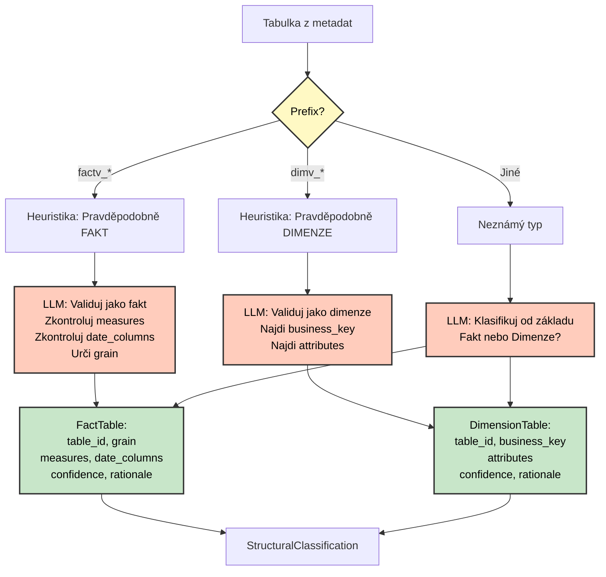

# Tool 2 - Structural Analysis - Detailní Flow Diagram

**Účel:** Dokumentuje detailní 5-node pipeline pro Tool 2 včetně hybrid nodes (heuristics + LLM) a classification decision tree.

---

## Hlavní Flow Diagram

```mermaid
graph TB
    START([START Tool2State = empty]) --> N1_START[Node 1: Load Context]

    subgraph N1["Node 1: Load Context (Deterministický)"]
        N1_START --> N1_READ1[Read filtered_dataset.json<br/>from Tool 1]
        N1_READ1 --> N1_READ2[Read BA-BS_Datamarts_metadata.json<br/>full metadata]
        N1_READ2 --> N1_EXTRACT[Extract business_context<br/>entities, scope_out]
        N1_EXTRACT --> N1_EXPAND[Expand candidate details<br/>Match IDs from Tool 1<br/>to full metadata]
        N1_EXPAND --> N1_STATE[Update state:<br/>tool1_mappings<br/>full_metadata<br/>business_context<br/>candidates_detail]
    end

    N1_STATE --> N2_START[Node 2: Classify Entities]

    subgraph N2["Node 2: Classify - LLM Classification (AzureChatOpenAI)"]
        N2_START --> N2_HEUR[Apply heuristics:<br/>factv_* → likely fact<br/>dimv_* → likely dimension]
        N2_HEUR --> N2_PROMPT[Build system prompt:<br/>Classification rules<br/>Fact vs Dimension<br/>Grain/Business Key<br/>Scope_out blacklist]
        N2_PROMPT --> N2_EXAMPLES[Add examples:<br/>factv_purchase_order_item<br/>dimv_supplier]
        N2_EXAMPLES --> N2_CONTEXT[Build user message:<br/>Mappings summary<br/>Candidates summary]
        N2_CONTEXT --> N2_AGENT[create_agent<br/>ToolStrategy<br/>StructuralClassification]
        N2_AGENT --> N2_INVOKE[agent.invoke messages]
        N2_INVOKE --> N2_EXTRACT[Extract structured_response:<br/>facts + dimensions]
        N2_EXTRACT --> N2_VALIDATE[Validate:<br/>grain present in facts<br/>business_key in dimensions]
        N2_VALIDATE --> N2_STATE[Update state:<br/>classified_entities<br/>FactTable + DimensionTable]
    end

    N2_STATE --> N3_START[Node 3: Identify Relationships]

    subgraph N3["Node 3: Relationships - Heuristics + Optional LLM"]
        N3_START --> N3_FK_DETECT[FK Detection:<br/>Column suffix *_id, *_fk, *_key]
        N3_FK_DETECT --> N3_FK_MATCH[Match column name<br/>to dimension table name<br/>supplier_id → dimv_supplier]
        N3_FK_MATCH --> N3_HIER_DETECT[Hierarchy Detection:<br/>Check 'Hierarcy Relation' field<br/>note: typo in metadata!]
        N3_HIER_DETECT --> N3_PATTERN[Parent-child patterns<br/>in descriptions]
        N3_PATTERN --> N3_CONFIDENCE[Assign confidence scores<br/>based on match strength]
        N3_CONFIDENCE --> N3_STATE[Update state:<br/>relationships<br/>hierarchies]
    end

    N3_STATE --> N4_START[Node 4: Assemble Structure]

    subgraph N4["Node 4: Assemble - Calculate Metrics (Deterministický)"]
        N4_START --> N4_COUNT[Count totals:<br/>facts, dimensions<br/>hierarchies, relationships]
        N4_COUNT --> N4_COVERAGE[Calculate coverage:<br/>mapped / total entities]
        N4_COVERAGE --> N4_UNRESOLVED[Identify unresolved:<br/>entities without classification]
        N4_UNRESOLVED --> N4_BUILD[Build StructuralAnalysis:<br/>timestamp + business_context<br/>+ all results + metrics]
        N4_BUILD --> N4_STATE[Update state:<br/>final_structure<br/>StructuralAnalysis]
    end

    N4_STATE --> N5_START[Node 5: Save Outputs]

    subgraph N5["Node 5: Save Outputs (Deterministický)"]
        N5_START --> N5_JSON[Save structure.json<br/>data/tool2/<br/>Main output]
        N5_JSON --> N5_AUDIT[Save audit summary<br/>scrum/artifacts/<br/>YYYY-MM-DD_tool2-structure-summary.json]
        N5_AUDIT --> N5_METRICS[Log metrics:<br/>coverage, unresolved<br/>avg confidence]
        N5_METRICS --> N5_STATE[Update state:<br/>output paths]
    end

    N5_STATE --> END([END Return Tool2State])

    style N1 fill:#c8e6c9,color:#000,stroke:#333,stroke-width:2px
    style N2 fill:#ffccbc,color:#000,stroke:#333,stroke-width:2px
    style N3 fill:#fff3e0,color:#000,stroke:#333,stroke-width:2px
    style N4 fill:#c8e6c9,color:#000,stroke:#333,stroke-width:2px
    style N5 fill:#fff9c4,color:#000,stroke:#333,stroke-width:2px
    style START fill:#e1f5fe,color:#000,stroke:#333,stroke-width:2px
    style END fill:#e1f5fe,color:#000,stroke:#333,stroke-width:2px
```



---

## Legenda

- 🟢 **Zelená** (N1, N4): Deterministické nodes (load, calculate)
- 🟠 **Oranžová** (N2): LLM node (classify fact/dimension s ToolStrategy)
- 🟡 **Béžová** (N3): Hybrid node (heuristics + optional LLM validation)
- 🟡 **Žlutá** (N5): Output node (save JSON + audit)

---

## Classification Decision Tree



---

## State Flow

```
START → {}
  ↓ N1: Load Context
  → {tool1_mappings, full_metadata, business_context, candidates_detail[]}
  ↓ N2: Classify (LLM + Heuristics)
  → {classified_entities: {facts[], dimensions[]} + confidence + rationale}
  ↓ N3: Relationships (Heuristics)
  → {relationships[] + hierarchies[] + FK detection}
  ↓ N4: Assemble
  → {final_structure: StructuralAnalysis + metrics + coverage}
  ↓ N5: Save
  → {output paths}
END → Complete Tool2State
```

---

## Timing (průměr)

- N1 Load: ~1s (file read + expand)
- N2 Classify: ~10s (LLM classification)
- N3 Relationships: ~2s (heuristics)
- N4 Assemble: ~1s (calculate metrics)
- N5 Save: ~1s (file write)
- **Total: ~15s** (target: <20s ✅)

---

## Key Features

- ✅ **Hybrid approach:** Heuristics (prefix patterns) + LLM validation
- ✅ **Structured output:** ToolStrategy(StructuralClassification)
- ✅ **Confidence scoring:** Each classification has 0.0-1.0 score + rationale
- ✅ **Coverage tracking:** Identifies unresolved entities
- ✅ **FK detection:** Column name matching (supplier_id → dimv_supplier)
- ⚠️ **Known limitation:** Hardcoded relationship examples (future: dynamic column parsing)

---

**Návrat na hlavní dokumentaci:** [mcop-architecture.md](./mcop-architecture.md#57-detailní-flow-diagram-tool-2)
