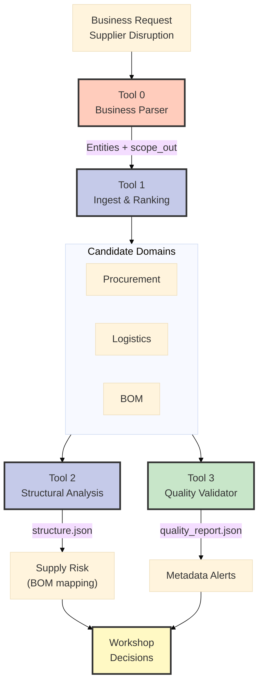

# Deep Architects Presentation Outline – SCR‑06

**Prezentační Strategie:** Od konkrétního (incidents) k abstraktnímu (architektura) → postupné budování pochopení

---

## Fáze 1: ENGAGE (10 min) – Zaujmout pozornost

### Slide 1 – Why Should You Care?
**Hook:** "Co kdyby vám v pátek ráno volali, že 28% produkce je ohroženo?"

- **Real incidents:** NordMetal (Supplier Disruption), Bremerhaven (Port Strike)
- **Business čísla:** €2.5M/den ztráta, 6 dní zásoby, 250 service tickets v backlogu
- **Current pain:** Řešení trvá 30+ minut, napříč 5 systémy, bez visibility do Tier 2/3

**Vizuální intro:**
- Diagram z `tierindex_visual.md` (Core Concept) – anonymní Tier0→Tier2
- Zvýraznit "slepé skvrny" (Tier 2/3 nejsou viditelné)

**Key Message:** "Potřebujeme N-tier transparentnost. To je SCR-06."

---

## Fáze 2: EDUCATE (15 min) – Vysvětlit řešení

### Slide 2 – What is SCR‑06?

**Definice:** Mapping & Verification of Sub-Supplier Chains

**Business Value:**
- ⚡ Response time: 30+ min → <5 min
- 🔍 Visibility: Tier 1 only → Tier 1-2-3
- 🎯 Accuracy: Ad-hoc guessing → Validated data
- 📊 Proaktivita: Reactive → Predictive (SPOF detection via SCR-05)

### Slide 3 – Data Flow Overview (Technical Foundation)
**Bronze → Silver → Gold pattern**

- Diagram Bronze (SAP BOM CSV) → Silver (ti_bom_usage_s) → Gold (domain views)
- Zvýraznit chybějící část (Bronze ingest) a plán ETL jobu

### MCOP Pipeline Context (Incident A)

**Klíčový point:** Tool 2 potřebuje `ti_bom_usage_s` (Silver layer) → SCR-06 deliverable
- Doplnit, že existující Bronze ingest (DnB/Sayari) viz `physical_model.md` – BOM bude přidáno stejným patternem

## Slide 3 – Architecture Decisions Needed
1. Multi-Gold vs Shared Gold
2. Cascade vs Parallel update
3. Graph persistence (SQL only vs Graph service)
4. Ownership & RLS (kdo drží které vrstvy)

## Slide 4 – Validation & Monitoring
- Baseline/changeset pattern
- Quality metriky: cycle detection, missing parent, coverage per product class
- Logging/Audit (Unity Catalog history, EventHub)
- Commodity roadmap slide (WGR→HS) – ukázat mapu (score 3, 495 shod) z `wgr_hs_mapping_analysis.md`

## Slide 5 – Downstream Impact
- Jak SCR‑05/07/09 staví na ověřeném N-tier grafu
- Metadata agent (MCOP) = pouze konzument (Tool 0–3), nepřebírá řízení
- Přehled exportních views (`vw_bom_tier_path`, `vw_bom_coverage`)
- Mention: HS enrichment = dalším krokem podporuje TierIndex risk analytiku

## Slide 6 – Next Steps & Owners
- Ingest Bronze (owner: TierIndex ETL) + timeline
- Decide Gold architecture (workshop vote)
- Připravit QA check-list (Data Steward)
- Příprava incident demo (MCOP) – jen pokud zbude čas
