# TierIndex Background Monitoring: HS Kódy + BOM Integration

**Datum:** 28. října 2025
**Status:** Konsolidovaná architektonická dokumentace
**Účel:** Propojení Background Monitoring, WGR-HS mapování a BOM struktury pro TierIndex

---

## 📚 Navigace v dokumentaci

### Tento dokument obsahuje:
- **Sekce I**: Background Monitoring architektura a data flow
- **Sekce II**: WGR → HS Kódy mapování pro filtrování událostí
- **Sekce III**: BOM integrace s TierIndex (Tier ≠ BOM Level)
- **Sekce IV**: Integrace všech tří komponent do jednotného workflow
- **Sekce V**: Implementační doporučení a příklady

### Souvisejí dokumenty:
- `background_monitoring.md` - Základní architektura Background Monitoring
- `background_monitoring_data_model.md` - Edge taxonomy a tier classification
- `background_monitoring_implementation.md` - Runtime a deployment detaily
- `../bom/bom_structure.md` - TI-Syncro BOM struktura (VSS, P-SSL)
- `../../semantic_vision/wgr_hs_mapping_analysis.md` - WGR-HS mapping detaily
- `../../semantic_vision/semantic_vision.md` - Semantic Vision API a data flow

---

## I. Background Monitoring: Architektonický základ

### 1.1 Kontext a účel

**TierIndex** funguje jako read-only dodavatelský graf (Tier 1→2→3) pro N-Tier orchestrátor. **Background Monitoring** zajišťuje:
- ✅ Periodickou aktualizaci grafu z externích zdrojů (DnB, Sayari, SAP)
- ✅ Detekci anomálií a změn v dodavatelských vztazích
- ✅ Synchronizaci s Delta Lake (Bronze → Silver → Gold)
- ✅ Monitoring parity mezi LLM runtime rozhodnutími a TierIndex Golden Data

### 1.2 Data Flow: Bronze → Silver → Gold


### 1.3 Baseline + Changeset Pattern

**Weekly Baseline Rebuild (Sobota 23:00 UTC, 4-6 hodin):**
```python
# Úplná rekonstrukce grafu z Bronze layer
baseline_v2 = rebuild_graph(
    sources=['dnb_raw', 'sayari_raw', 'sap_bom_structure'],
    snapshot_date='2025-10-26',
    tier_classification='rules_v1.2'
)
# Output: staging_wsp.tierindex_gold.ti_manifest (baseline_v2)
```

**Daily Changeset Application (Denně 02:00 UTC, 30 minut):**
```python
# Inkrementální změny aplikované na baseline
changeset = apply_daily_updates(
    baseline='baseline_v2',
    changeset_id='cs_20251028_0200',
    operations=['add_edge', 'remove_edge', 'update_tier']
)
# Output: staging_wsp.tierindex_gold.ti_changeset (cs_20251028_0200.json)
```

**Kritické pravidlo:** ❌ Nikdy nemodifikovat baseline přímo. ✅ Vždy aplikovat changesets pomocí `MERGE` operací s rollback na failure.

---

## II. WGR → HS Kódy: Mapování pro Semantic Vision filtrování

### 2.1 Kontext: Proč potřebujeme WGR-HS mapping?

**Semantic Vision** monitoruje 1.9M globálních mediálních zdrojů a reportuje události relevantní pro dodavatelský řetězec. **Problém:** Události často obsahují:
- HS kódy (harmonizované celní kódy: 7007, 8708, atd.)
- Komodity (glass, steel, exhaust systems)
- Dodavatele (AGC Automotive, Bosch, Continental)

**WGR klasifikace** (Warengruppe) v Škoda Auto má 531 Material Groups organizovaných do 7 Level 1 Commodities (Metal, Powertrain, Exterior, Interior, Connectivity, Glass, Fasteners).

**Řešení:** M:N mapování mezi WGR Material Groups a HS kódy → efektivní filtrování relevantních událostí.

### 2.2 WGR-HS Mapping Dataset

**Datový soubor:** `wgr_hs_matches.csv` (495 řádků)

**Match Score klasifikace:**
- **Score 3 (High Confidence):** Přímá shoda HS kódu + keywords (Glass → 7007, Fasteners → 7616)
- **Score 2 (Medium Confidence):** Sémantické keyword matching (Metal materials → 7208)
- **Score 1 (Low Confidence):** Slabá nebo generická shoda (není doporučeno použít)

**TOP shody podle WGR Level 1 Commodity:**

| WGR Commodity | HS Code Examples             | Match Score | Use Case                            |
| ------------- | ---------------------------- | ----------- | ----------------------------------- |
| **Glass**     | 7007, 7007110000, 7007210000 | 3           | Laminated safety glass, windshields |
| **Fasteners** | 7616, 7318                   | 3           | Aluminum fasteners, bolts, nuts     |
| **Exhaust**   | 8708920000                   | 3           | Exhaust systems                     |
| **Metal**     | 7208, 7606, 7326             | 2-3         | Steel, aluminum, metal stampings    |
| **Lighting**  | 8512200000                   | 2           | Automotive lighting                 |
| **Bumpers**   | 8708100000                   | 3           | Bumper assemblies                   |

**Pokrytí:**
- Metal: 304 matches (61% všech mapování)
- Powertrain: 75 matches (15%)
- Exterior: 57 matches (11%)
- Interior: 32 matches (6%)
- Connectivity: 27 matches (5%)

### 2.3 Semantic Vision Filtering Logic

**Vstup:** News článek z Semantic Vision API
```json
{
  "event_id": "evt_2025102801",
  "title": "AGC Automotive announces production halt at Czech plant",
  "content": "...laminated glass quality issues. HS code 7007110000 affected...",
  "entities": ["AGC Automotive"],
  "hs_codes": ["7007110000"],
  "keywords": ["laminated glass", "quality issues", "production halt"],
  "timestamp": "2025-10-28T08:30:00Z"
}
```

**Zpracování:**
```python
# 1. HS Code matching
if "7007110000" in wgr_hs_mapping:
    material_group = 250  # Glass / VSG laminated safety glass
    confidence = "HIGH"  # Direct HS code match

# 2. Keyword matching (fallback)
if any(keyword in ["laminated glass", "safety glass"] for keyword in event['keywords']):
    material_group = 250
    confidence = "HIGH"  # Keyword match

# 3. Tier filtering (připojení k TierIndex)
affected_suppliers = get_suppliers_by_wgr(material_group=250, tier_level=[1, 2])
# Query: ti_supplier_metrics WHERE material_group = 250 AND tier_level IN (1, 2)
```

**Výstup:** Alert pro procurement team
```json
{
  "alert": true,
  "event_id": "evt_2025102801",
  "material_group": 250,
  "wgr_category": "Glass / VSG laminated safety glass",
  "relevance_score": 0.95,
  "reason": "HS code match + keyword match",
  "affected_suppliers": [
    {"duns": "123456789", "name": "AGC Automotive Czech", "tier_level": 1},
    {"duns": "987654321", "name": "Saint-Gobain Sekurit", "tier_level": 1}
  ],
  "action": "Notify procurement team - Tier 1 glass suppliers"
}
```

### 2.4 Workflow: Semantic Vision → TierIndex → Alert

```mermaid
sequenceDiagram
    participant SV as Semantic Vision API
    participant BM as Background Monitoring
    participant TI as TierIndex Gold
    participant ALERT as Alert System

    SV->>BM: Event: AGC plant halt (HS 7007)
    BM->>BM: Match HS 7007 → WGR 250 (Glass)
    BM->>TI: Query suppliers (WGR 250, Tier 1-2)
    TI-->>BM: [AGC, Saint-Gobain, Guardian]
    BM->>ALERT: Severity: HIGH (Tier 1 affected)
    ALERT-->>User: Notify procurement team
```



---

## III. BOM Integration s TierIndex: Kritická clarifikace

### 3.1 Tier ≠ BOM Level (ortogonální koncepty!)

**Častá chyba:** Předpoklad, že Tier 1 dodává do BOM Level 1.

**Realita:**
- **Tier Level** = Commercial supplier distance (kdo komu prodává)
  - Tier 0: Škoda Auto (root entity)
  - Tier 1: Direct suppliers (Bosch, Lear, Continental)
  - Tier 2: Suppliers to Tier 1 (sub-suppliers)
  - Tier 3: Suppliers to Tier 2

- **BOM Level** = Technical product hierarchy (kde je součástka v produktu)
  - Level 0: Vehicle root (3V0 = Škoda Superb)
  - Level 1: Main assemblies (engine, chassis, body)
  - Level 2-5: Sub-assemblies and components

**Příklad konfuze:**
```
❌ WRONG ASSUMPTION:
"Bosch je Tier 1 → dodává Level 1 komponenty"

✅ CORRECT:
"Bosch je Tier 1 (přímý dodavatel) → dodává šrouby na Level 5 v BOM"
```

### 3.2 BOM Struktura v SAP TI-Syncro

**Varianty BOM v projektu:**
- **HS11** (91.5K řádků): Standardní BOM s 141 sloupci, má `nameid` (GUID)
- **HS11WK** (133K řádků): Work center varianta, **NEMÁ** `nameid`, má `tree_path_aennr`
- **HS12** (100K řádků): Hierarchická struktura uzlů (Level 0-5)
- **MARA** (12.8K materiálů): Material master

**Node Types v BOM:**
```sql
-- TI-Syncro VSS (Variant Structural BOM)
SELECT node_type, COUNT(*) as count
FROM tierindex_silver.ti_bom_nodes
GROUP BY node_type;

-- Output:
-- VSTUP (Entry): 1 node (3V0 = Škoda Superb)
-- MIO (Millionen-Varianten): ~1000 nodes (high-variance usage locations)
-- S (Structural): ~5000 nodes (decomposable assemblies)
-- PBE (Produkt-Basis-Ebene): ~8000 nodes (leaf-level parts)
-- MK (Montage block): ~500 nodes (fastener collections)
```

### 3.3 Integrace: Supplier → Material → BOM Node → Level

**Join chain pro propojení Tier a BOM:**
```sql
-- 1. Supplier Master → SAP Vendor
SELECT s.duns, s.name, v.lifnr as sap_vendor_id
FROM tierindex_gold.ti_entity s
JOIN sap.vendor_master v ON s.sap_vendor_code = v.lifnr
WHERE s.tier_level = 1;

-- 2. SAP Vendor → Material (via purchasing)
SELECT v.lifnr, p.matnr, p.ekorg as purchasing_org
FROM sap.vendor_master v
JOIN sap.purchasing_info p ON v.lifnr = p.lifnr
WHERE p.ekorg = '3700';  -- Werk 3700 (Mladá Boleslav)

-- 3. Material → BOM Node (HS11)
SELECT m.matnr, b.nameid as bom_node_id, b.posnr as position
FROM sap.mara m
JOIN sap.hs11 b ON m.matnr = b.idnrk
WHERE b.werks = '3700';

-- 4. BOM Node → BOM Level (HS12)
SELECT b.nameid as node_id, h.pnguid, h.level_depth
FROM sap.hs11 b
JOIN sap.hs12 h ON b.nameid = h.pnguid
WHERE h.level_depth BETWEEN 1 AND 5;

-- FULL QUERY: Který Tier 1 dodává materiál na BOM Level X?
WITH supplier_materials AS (
    SELECT s.duns, s.name, s.tier_level, v.lifnr, p.matnr
    FROM tierindex_gold.ti_entity s
    JOIN sap.vendor_master v ON s.sap_vendor_code = v.lifnr
    JOIN sap.purchasing_info p ON v.lifnr = p.lifnr
),
bom_usage AS (
    SELECT b.matnr, b.nameid, h.level_depth
    FROM sap.hs11 b
    JOIN sap.hs12 h ON b.nameid = h.pnguid
)
SELECT
    sm.duns,
    sm.name AS supplier_name,
    sm.tier_level,
    bu.matnr AS material_number,
    bu.level_depth AS bom_level
FROM supplier_materials sm
JOIN bom_usage bu ON sm.matnr = bu.matnr
WHERE sm.tier_level = 1 AND bu.level_depth = 5
ORDER BY supplier_name, bom_level;
```

### 3.4 Silver Layer: ti_bom_usage_s

**Nová tabulka pro BOM integration:**
```sql
CREATE TABLE staging_wsp.tierindex_silver.ti_bom_usage_s (
    usage_id STRING NOT NULL,                -- PK: GUID
    supplier_duns STRING NOT NULL,           -- FK: ti_entity_s.duns
    material_number STRING NOT NULL,         -- SAP material (matnr)
    bom_node_id STRING,                      -- HS11.nameid (optional for HS11WK)
    bom_level INT,                           -- HS12.level_depth (0-5)
    product_class STRING,                    -- 3V0, 3J0, 3P0
    werk STRING,                             -- Plant code (3700)
    material_group STRING,                   -- WGR Material Group
    quantity DECIMAL(10,3),                  -- Usage quantity
    confidence_score DECIMAL(3,2),           -- Join confidence (0.0-1.0)
    snapshot_date DATE NOT NULL,             -- Partition key
    meta STRUCT<
        source: STRING,                      -- 'sap_hs11', 'sap_hs11wk'
        validation_status: STRING,           -- 'validated', 'pending', 'conflict'
        last_updated: TIMESTAMP
    >
)
USING DELTA
PARTITIONED BY (snapshot_date)
LOCATION 's3://tierindex-silver/ti_bom_usage_s';

-- Z-ORDER optimization
OPTIMIZE staging_wsp.tierindex_silver.ti_bom_usage_s
ZORDER BY (supplier_duns, material_group, bom_level);
```

**Příklad dat:**
```json
{
  "usage_id": "bom_usage_001",
  "supplier_duns": "314421931",
  "material_number": "3V0955665",
  "bom_node_id": "GUID_12345678",
  "bom_level": 5,
  "product_class": "3V0",
  "werk": "3700",
  "material_group": "250",
  "quantity": 2.0,
  "confidence_score": 0.95,
  "snapshot_date": "2025-10-28",
  "meta": {
    "source": "sap_hs11",
    "validation_status": "validated",
    "last_updated": "2025-10-28T02:00:00Z"
  }
}
```

---

## IV. Integrace všech tří komponent: End-to-End Workflow

### 4.1 Use Case: "Který Tier 2 dodavatel ovlivní výrobu Škoda Superb při problému s laminated glass?"

**Scénář:**
1. Semantic Vision detekuje událost: "AGC plant halt, HS 7007 (laminated glass)"
2. Background Monitoring filtruje pomocí WGR-HS mapping: HS 7007 → WGR 250 (Glass)
3. TierIndex query: Najdi všechny Tier 1/2 dodavatele s WGR 250 pro produkt 3V0
4. BOM usage query: Najdi konkrétní materiály a BOM Level pro 3V0
5. Alert: Identifikuj kritické Tier 2 dodavatele (SPOF detection)

**Implementace:**
```python
# Step 1: Semantic Vision event
event = {
    "event_id": "evt_2025102801",
    "hs_codes": ["7007110000"],
    "keywords": ["laminated glass", "production halt"],
    "entities": ["AGC Automotive"]
}

# Step 2: WGR-HS mapping
wgr_match = filter_wgr_hs(hs_codes=event['hs_codes'])
# Output: material_group = 250, confidence = "HIGH"

# Step 3: TierIndex query (Gold layer)
affected_suppliers = spark.sql(f"""
    SELECT
        e.duns,
        e.name,
        e.tier_level,
        sm.combined_risk_score,
        sm.spof_flag
    FROM staging_wsp.tierindex_gold.ti_entity e
    JOIN staging_wsp.tierindex_gold.ti_supplier_metrics sm ON e.duns = sm.duns
    WHERE e.material_group = '250'
      AND e.tier_level IN (1, 2)
      AND e.product_class = '3V0'
    ORDER BY sm.combined_risk_score DESC
""")

# Step 4: BOM usage query (Silver layer)
bom_usage = spark.sql(f"""
    SELECT
        bu.supplier_duns,
        bu.material_number,
        bu.bom_level,
        bu.quantity,
        m.description_long
    FROM staging_wsp.tierindex_silver.ti_bom_usage_s bu
    JOIN sap.mara m ON bu.material_number = m.matnr
    WHERE bu.material_group = '250'
      AND bu.product_class = '3V0'
      AND bu.snapshot_date = CURRENT_DATE()
""")

# Step 5: SPOF detection + Alert generation
spof_suppliers = affected_suppliers.filter(col("spof_flag") == True)
if spof_suppliers.count() > 0:
    alert = {
        "severity": "CRITICAL",
        "event_id": event['event_id'],
        "alert_type": "SPOF_DETECTED",
        "affected_suppliers": spof_suppliers.collect(),
        "bom_impact": bom_usage.collect(),
        "recommendation": "Immediate procurement team escalation - Tier 2 glass supplier critical"
    }
    send_alert(alert, channel="slack_procurement")
```

### 4.2 Data Flow Diagram: Semantic Vision → TierIndex → BOM → Alert


### 4.3 Parity Validation: LLM vs TierIndex Golden Data

**Scénář:** LLM orchestrátor v runtime rozhoduje o tier klasifikaci dodavatele. Background Monitoring validuje proti TierIndex.

**Parity Alert Logging:**
```sql
CREATE TABLE staging_wsp.tierindex_gold.ti_parity_alerts (
    alert_id STRING NOT NULL,                -- PK: GUID
    timestamp TIMESTAMP NOT NULL,
    supplier_duns STRING NOT NULL,           -- FK: ti_entity.duns
    gold_tier_level INT,                     -- TierIndex Golden Data
    llm_tier_level INT,                      -- LLM runtime prediction
    gold_material_group STRING,              -- TierIndex WGR
    llm_material_group STRING,               -- LLM WGR prediction
    discrepancy_reason STRING,               -- "tier_mismatch", "wgr_mismatch", "missing_entity"
    alert_severity STRING,                   -- "INFO", "WARNING", "ERROR"
    resolution_status STRING,                -- "open", "in_review", "resolved", "false_positive"
    meta STRUCT<
        llm_model: STRING,                   -- "gpt-4", "claude-3"
        llm_confidence: DECIMAL(3,2),
        bom_context: STRING,
        resolution_notes: STRING
    >
)
USING DELTA
PARTITIONED BY (DATE(timestamp))
LOCATION 's3://tierindex-gold/ti_parity_alerts';
```

**Příklad parity alert:**
```json
{
  "alert_id": "parity_alert_001",
  "timestamp": "2025-10-28T14:30:00Z",
  "supplier_duns": "314421931",
  "gold_tier_level": 2,
  "llm_tier_level": 1,
  "gold_material_group": "250",
  "llm_material_group": "250",
  "discrepancy_reason": "tier_mismatch",
  "alert_severity": "WARNING",
  "resolution_status": "in_review",
  "meta": {
    "llm_model": "gpt-4",
    "llm_confidence": 0.87,
    "bom_context": "LLM classified as Tier 1 due to direct shipment, but TierIndex shows Tier 2 via intermediary",
    "resolution_notes": "Review supply chain structure for DUNS 314421931"
  }
}
```

**Action Trigger:**
```sql
-- Automatický ticket do backlog při >5 alertech/den pro stejný supplier
SELECT
    supplier_duns,
    COUNT(*) as alert_count,
    MAX(alert_severity) as max_severity
FROM staging_wsp.tierindex_gold.ti_parity_alerts
WHERE DATE(timestamp) = CURRENT_DATE()
  AND resolution_status = 'open'
GROUP BY supplier_duns
HAVING alert_count > 5
ORDER BY alert_count DESC;
```

---

## V. Implementační doporučení a příklady

### 5.1 Bronze Layer: Data Ingestion

**Databricks Workflow:** `ti_ingest_sources.py` (Denní běh 02:00 UTC)

```python
# Notebook: ti_ingest_sources.py
from pyspark.sql import SparkSession
from datetime import datetime

spark = SparkSession.builder.appName("TierIndex_Bronze_Ingest").getOrCreate()

# 1. DnB API ingestion
dnb_data = fetch_dnb_api(
    endpoint="FamilyTreeFull",
    duns_list=get_tier1_suppliers(),
    batch_size=100
)
spark.createDataFrame(dnb_data).write.format("delta") \
    .mode("append") \
    .partitionBy("ingestion_date") \
    .save("s3://tierindex-bronze/dnb_raw")

# 2. Sayari API ingestion (bulk + notifications)
sayari_data = fetch_sayari_api(
    bulk_file="sayari_bulk_20251028.json.gz",
    notifications=True
)
spark.createDataFrame(sayari_data).write.format("delta") \
    .mode("append") \
    .partitionBy("ingestion_date") \
    .save("s3://tierindex-bronze/sayari_raw")

# 3. SAP BOM extraction
sap_bom = extract_sap_bom(
    tables=['HS11', 'HS12', 'MARA'],
    werk='3700',
    product_class=['3V0', '3J0', '3P0']
)
spark.createDataFrame(sap_bom).write.format("delta") \
    .mode("overwrite") \
    .partitionBy("snapshot_date") \
    .save("s3://tierindex-bronze/sap_bom_structure")

# 4. Semantic Vision events
sv_events = fetch_semantic_vision_events(
    hs_codes=get_automotive_hs_codes(),
    since=datetime.now() - timedelta(days=1)
)
spark.createDataFrame(sv_events).write.format("delta") \
    .mode("append") \
    .partitionBy("event_date") \
    .save("s3://tierindex-bronze/semantic_vision_events")
```

### 5.2 Silver Layer: Normalization + BOM Integration

**Notebook:** `ti_silver_normalization.py`

```python
# Bronze → Silver: Entity normalization
bronze_dnb = spark.read.format("delta").load("s3://tierindex-bronze/dnb_raw")
bronze_sayari = spark.read.format("delta").load("s3://tierindex-bronze/sayari_raw")

# Entity deduplication + enrichment
entities = normalize_entities(bronze_dnb, bronze_sayari) \
    .withColumn("tier_level", classify_tier_udf(col("relationships"))) \
    .withColumn("material_group", extract_wgr_udf(col("products")))

entities.write.format("delta") \
    .mode("overwrite") \
    .partitionBy("snapshot_date") \
    .save("s3://tierindex-silver/ti_entity_s")

# BOM integration: SAP → TierIndex
bronze_bom = spark.read.format("delta").load("s3://tierindex-bronze/sap_bom_structure")

bom_usage = bronze_bom.alias("b") \
    .join(entities.alias("e"), col("b.lifnr") == col("e.sap_vendor_code")) \
    .select(
        expr("uuid()").alias("usage_id"),
        col("e.duns").alias("supplier_duns"),
        col("b.matnr").alias("material_number"),
        col("b.nameid").alias("bom_node_id"),
        col("b.level_depth").alias("bom_level"),
        col("b.pr_description"),
        col("e.material_group"),
        col("b.quantity"),
        lit(0.95).alias("confidence_score")
    )

bom_usage.write.format("delta") \
    .mode("overwrite") \
    .partitionBy("snapshot_date") \
    .save("s3://tierindex-silver/ti_bom_usage_s")
```

### 5.3 Gold Layer: Aggregation + Manifest

**Notebook:** `ti_gold_metrics.py`

```python
# Silver → Gold: Supplier metrics + SPOF detection
entities = spark.read.format("delta").load("s3://tierindex-silver/ti_entity_s")
edges = spark.read.format("delta").load("s3://tierindex-silver/ti_edge_s")
bom_usage = spark.read.format("delta").load("s3://tierindex-silver/ti_bom_usage_s")

# SPOF detection: Tier 2/3 supplier supporting 78%+ of Tier 1 suppliers
tier1_count = entities.filter(col("tier_level") == 1).count()
spof_threshold = tier1_count * 0.78

spof_suppliers = edges.filter(col("raw_type") == "supplies_to") \
    .groupBy("source_duns") \
    .agg(countDistinct("target_duns").alias("tier1_coverage")) \
    .filter(col("tier1_coverage") >= spof_threshold) \
    .withColumn("spof_flag", lit(True))

# Supplier metrics aggregation
metrics = entities.alias("e") \
    .join(spof_suppliers.alias("s"), col("e.duns") == col("s.source_duns"), "left") \
    .join(bom_usage.alias("b"), col("e.duns") == col("b.supplier_duns"), "left") \
    .groupBy("e.duns", "e.name", "e.tier_level") \
    .agg(
        avg("e.risk_score").alias("combined_risk_score"),
        max("s.spof_flag").alias("spof_flag"),
        countDistinct("b.material_number").alias("material_count"),
        countDistinct("b.product_class").alias("product_coverage")
    )

metrics.write.format("delta") \
    .mode("overwrite") \
    .save("s3://tierindex-gold/ti_supplier_metrics")

# Manifest update
manifest = {
    "manifest_id": "manifest_v2.1",
    "baseline_version": "baseline_v2",
    "applied_changesets": ["cs_20251027_0200", "cs_20251028_0200"],
    "snapshot_date": "2025-10-28",
    "entity_count": entities.count(),
    "edge_count": edges.count(),
    "bom_usage_count": bom_usage.count(),
    "spof_count": spof_suppliers.count(),
    "validation_status": "passed"
}

spark.createDataFrame([manifest]).write.format("delta") \
    .mode("append") \
    .save("s3://tierindex-gold/ti_manifest")
```

### 5.4 Semantic Vision Event Processing

**Notebook:** `ti_semantic_vision_processor.py`

```python
from pyspark.sql.functions import explode, col, when, lit

# Load WGR-HS mapping
wgr_hs_mapping = spark.read.format("csv") \
    .option("header", "true") \
    .load("s3://tierindex-reference/wgr_hs_matches.csv")

# Load Semantic Vision events
sv_events = spark.read.format("delta") \
    .load("s3://tierindex-bronze/semantic_vision_events") \
    .filter(col("event_date") == current_date())

# Explode HS codes from events
events_with_hs = sv_events.withColumn("hs_code", explode(col("hs_codes")))

# Join with WGR-HS mapping
filtered_events = events_with_hs.alias("e") \
    .join(
        wgr_hs_mapping.alias("m"),
        col("e.hs_code") == col("m.HS Code"),
        "inner"
    ) \
    .filter(col("m.Match Score") >= 2) \
    .select(
        col("e.event_id"),
        col("e.title"),
        col("e.entities"),
        col("e.hs_code"),
        col("m.Material Group").alias("material_group"),
        col("m.Match Score").alias("match_score")
    )

# Join with TierIndex Gold to identify affected suppliers
affected_suppliers = filtered_events.alias("f") \
    .join(
        spark.read.format("delta").load("s3://tierindex-gold/ti_supplier_metrics").alias("s"),
        col("f.material_group") == col("s.material_group"),
        "inner"
    ) \
    .select(
        col("f.event_id"),
        col("f.title"),
        col("s.duns"),
        col("s.name").alias("supplier_name"),
        col("s.tier_level"),
        col("s.combined_risk_score"),
        col("s.spof_flag"),
        col("f.material_group")
    )

# Generate alerts for SPOF suppliers
alerts = affected_suppliers.filter(col("spof_flag") == True) \
    .withColumn("alert_severity", lit("CRITICAL")) \
    .withColumn("alert_type", lit("SPOF_SEMANTIC_VISION")) \
    .withColumn("timestamp", current_timestamp())

# Write alerts to Gold layer
alerts.write.format("delta") \
    .mode("append") \
    .partitionBy("timestamp") \
    .save("s3://tierindex-gold/ti_semantic_vision_alerts")
```

### 5.5 Parity Validation Workflow

**Notebook:** `ti_parity_validation.py`

```python
# LLM runtime tier classification (simulated)
llm_predictions = spark.read.format("json") \
    .load("s3://orchestrator-runtime/llm_tier_classifications.json")

# TierIndex Golden Data
gold_entities = spark.read.format("delta") \
    .load("s3://tierindex-gold/ti_entity")

# Compare LLM vs Gold
parity_check = llm_predictions.alias("l") \
    .join(
        gold_entities.alias("g"),
        col("l.duns") == col("g.duns"),
        "inner"
    ) \
    .withColumn(
        "tier_mismatch",
        when(col("l.tier_level") != col("g.tier_level"), True).otherwise(False)
    ) \
    .withColumn(
        "wgr_mismatch",
        when(col("l.material_group") != col("g.material_group"), True).otherwise(False)
    ) \
    .withColumn(
        "alert_severity",
        when(col("tier_mismatch") & (abs(col("l.tier_level") - col("g.tier_level")) > 1), "ERROR")
        .when(col("tier_mismatch"), "WARNING")
        .when(col("wgr_mismatch"), "INFO")
        .otherwise("NO_ALERT")
    )

# Filter and log parity alerts
parity_alerts = parity_check.filter(col("alert_severity").isin(["WARNING", "ERROR"])) \
    .select(
        expr("uuid()").alias("alert_id"),
        current_timestamp().alias("timestamp"),
        col("l.duns").alias("supplier_duns"),
        col("g.tier_level").alias("gold_tier_level"),
        col("l.tier_level").alias("llm_tier_level"),
        col("g.material_group").alias("gold_material_group"),
        col("l.material_group").alias("llm_material_group"),
        when(col("tier_mismatch"), lit("tier_mismatch"))
            .otherwise(lit("wgr_mismatch")).alias("discrepancy_reason"),
        col("alert_severity"),
        lit("open").alias("resolution_status"),
        struct(
            col("l.llm_model"),
            col("l.llm_confidence"),
            col("l.bom_context")
        ).alias("meta")
    )

# Write to parity alerts table
parity_alerts.write.format("delta") \
    .mode("append") \
    .partitionBy("DATE(timestamp)") \
    .save("s3://tierindex-gold/ti_parity_alerts")

# Trigger ticket creation for high-frequency alerts
high_frequency_suppliers = parity_alerts \
    .filter(col("timestamp") >= current_date()) \
    .groupBy("supplier_duns") \
    .agg(count("alert_id").alias("alert_count")) \
    .filter(col("alert_count") > 5)

if high_frequency_suppliers.count() > 0:
    create_jira_tickets(high_frequency_suppliers.collect())
```

---

## VI. Monitoring a Observability

### 6.1 EventHub → Elastic → Kibana Dashboard

**Dual-Shipping Pattern** (Prometheus + EventHub):
```python
# Prometheus metrics export
from prometheus_client import Counter, Gauge, Histogram

# Counters
ingestion_total = Counter('tierindex_ingestion_total', 'Total ingestions', ['source'])
changeset_applied = Counter('tierindex_changeset_applied', 'Changesets applied')
parity_alerts = Counter('tierindex_parity_alerts', 'Parity alerts', ['severity'])

# Gauges
entity_count = Gauge('tierindex_entity_count', 'Total entities')
edge_count = Gauge('tierindex_edge_count', 'Total edges')
spof_count = Gauge('tierindex_spof_count', 'SPOF suppliers')

# Histogram
query_latency = Histogram('tierindex_query_latency_seconds', 'Query latency')

# EventHub shipping (DAP mandatory)
from azure.eventhub import EventHubProducerClient, EventData

producer = EventHubProducerClient.from_connection_string(
    conn_str=os.getenv("EVENTHUB_CONNECTION_STRING"),
    eventhub_name="tierindex-metrics"
)

def ship_metrics_to_eventhub():
    metrics = {
        "timestamp": datetime.now().isoformat(),
        "entity_count": entity_count._value.get(),
        "edge_count": edge_count._value.get(),
        "spof_count": spof_count._value.get(),
        "parity_alerts_total": parity_alerts._metrics['WARNING']._value.get() + parity_alerts._metrics['ERROR']._value.get()
    }
    event_data = EventData(json.dumps(metrics))
    producer.send_batch([event_data])
```

### 6.2 Kibana Dashboard KPIs

**TierIndex Health Dashboard:**
- **Entity Count Trend:** Line chart (entity_count over time)
- **Changeset Application Rate:** Bar chart (changesets applied per day)
- **Parity Alert Severity:** Pie chart (INFO / WARNING / ERROR)
- **SPOF Supplier Heatmap:** Geo map (SPOF suppliers by country)
- **BOM Usage Coverage:** Gauge (% of materials with BOM mapping)
- **Query Latency P95:** Line chart (95th percentile query time)

---

## VII. DAP Compliance a Production Readiness

### 7.1 DAP Requirements Checklist

**✅ COMPLETED:**
- [x] Unity Catalog governance (catalog: `tierindex`, schema: `monitoring`)
- [x] Delta Lake ACID transactions (Bronze/Silver/Gold)
- [x] Databricks Workflows for scheduling (ti_ingest_sources.py)
- [x] Z-ORDER optimization on hot columns (duns, material_group)
- [x] Partitioning strategy (snapshot_date, event_date)

**🔄 IN PROGRESS:**
- [ ] EventHub → Elastic monitoring (dual-shipping from Prometheus)
- [ ] Azure DevOps pipeline (migration from GitHub Actions)
- [ ] Datapedia registration (tierindex_slovnik_pojmu.md sync)

**📋 TODO:**
- [ ] Metalog technical metadata (Bronze/Silver/Gold table specs)
- [ ] Access Control policies (Gold read-only for API, Bronze read-only for ETL)
- [ ] Rollback mechanism (changeset reversal workflow)
- [ ] SLA monitoring (query latency <100ms for Gold layer)

### 7.2 Production Deployment Timeline

**Q4 2025 (PoC → MVP):**
- Week 44-45: Bronze layer ingestion stabilization
- Week 46-47: Silver normalization + BOM integration testing
- Week 48-49: Gold metrics + SPOF detection validation
- Week 50-51: Semantic Vision filtering integration
- Week 52: Holiday freeze

**Q1 2026 (MVP → Production):**
- Week 1-2: Parity validation stress testing
- Week 3-4: EventHub monitoring setup
- Week 5-6: Azure DevOps migration
- Week 7-8: Datapedia/Metalog registration
- Week 9-10: Load testing (1M+ suppliers, 10M+ edges)
- Week 11-12: Production soft launch (limited users)
- Week 13: **PRODUCTION GO-LIVE** 🚀

---

## VIII. Klíčové závěry a best practices

### 8.1 Architektonické principy

1. **TierIndex-First Pattern:** Vždy dotazuj Gold layer, nikdy přímé API calls (SLA <100ms)
2. **Baseline + Changeset:** Weekly full rebuild + daily incrementals, atomické aplikace s rollback
3. **Tier ≠ BOM Level:** Komerční vzdálenost (Tier) ≠ technická pozice (BOM Level)
4. **M:N WGR-HS Mapping:** Jeden WGR → více HS kódů, Match Score >= 2 doporučeno
5. **Parity Validation:** LLM runtime vs TierIndex Golden Data, logging parity alerts
6. **SPOF Detection:** Tier 2/3 supplier supporting 78%+ Tier 1 → critical risk
7. **DAP Compliance:** Unity Catalog + Delta Lake + EventHub monitoring mandatory

### 8.2 Common Pitfalls (❌ vs ✅)

```python
# ❌ WRONG: Bypass Gold layer
def get_supplier_risk(duns: str):
    return dnb_api.get_financial_profile(duns)  # Slow, not cached

# ✅ CORRECT: Query Gold layer
def get_supplier_risk(duns: str):
    return spark.sql(f"""
        SELECT combined_risk_score, spof_flag
        FROM tierindex_gold.ti_supplier_metrics
        WHERE duns = '{duns}'
    """)

# ❌ WRONG: Assume Tier 1 → BOM Level 1
# ✅ CORRECT: Join supplier → material → BOM to find actual level

# ❌ WRONG: 1:1 WGR-HS mapping
# ✅ CORRECT: M:N mapping with confidence scores (Match Score)

# ❌ WRONG: Modify baseline directly
# ✅ CORRECT: Apply changesets via MERGE operations
```

### 8.3 Další kroky

**Pro business uživatele:**
1. Review WGR-HS mapping s procurement týmem (jsou kategorie správně?)
2. Pilot test na 5-10 Material Groups s nejvyšším Match Score
3. Feedback loop - ruční validace prvních Semantic Vision alertů

**Pro vývojáře:**
1. Implement Bronze layer ingestion (Databricks Workflows)
2. Create Silver normalization + BOM integration (ti_bom_usage_s)
3. Build Gold metrics + SPOF detection (ti_supplier_metrics)
4. Setup parity validation logging (ti_parity_alerts)
5. Integrate Semantic Vision filtering (wgr_hs_matches.csv)
6. Configure EventHub monitoring (dual-shipping)

**Pro architekty:**
1. Validate Unity Catalog permissions (DAP team)
2. Design rollback mechanism (changeset reversal)
3. Define SLA targets (query latency, refresh frequency)
4. Plan Azure DevOps migration (GitHub → ADO)
5. Register Datapedia metadata (tierindex_slovnik_pojmu.md)

---

## IX. Reference a související dokumentace

### 9.1 TierIndex Core
- `background_monitoring.md` - Background Monitoring konsolidovaná dokumentace
- `background_monitoring_data_model.md` - Edge taxonomy, tier rules, JSON schemas
- `background_monitoring_implementation.md` - Runtime, deployment, testing
- `physical_model.md` - Bronze/Silver/Gold layer architektura
- `tierindex_slovnik_pojmu.md` - Glossary (baseline, changeset, manifest, Unity Catalog)
- `SLA.md` - Performance targets (<100ms Gold query, 4-6hr baseline rebuild)

### 9.2 BOM Integration
- `bom/bom_structure.md` - TI-Syncro VSS/P-SSL struktura, node types
- `bom/WORKSHOP_STATUS.md` - Workshop requirements, open questions
- `bom/tierindex_visual.md` - Visual BOM hierarchy

### 9.3 Semantic Vision + WGR-HS
- `semantic_vision/semantic_vision.md` - Semantic Vision API, data flow
- `semantic_vision/wgr_hs_mapping_analysis.md` - WGR-HS mapping detaily (495 pairs)
- `semantic_vision/wgr_hs_mapping.ipynb` - Jupyter notebook pro mapping exploration
- `hs_codes/wgr_hs_matches.csv` - Dataset (495 řádků, Match Score 1-3)

### 9.4 DAP Platform
- `dap-integration/` - Databricks platform docs, Unity Catalog governance
- `supervisor_architecture/` - LLM orchestrator design, LangGraph patterns

---

**Dokument vytvořen:** 28. října 2025
**Autor:** AI Agent (GitHub Copilot)
**Status:** Konsolidovaná architektonická dokumentace v1.0
**Příští review:** Po DAP sync (Week 45, 2025)
