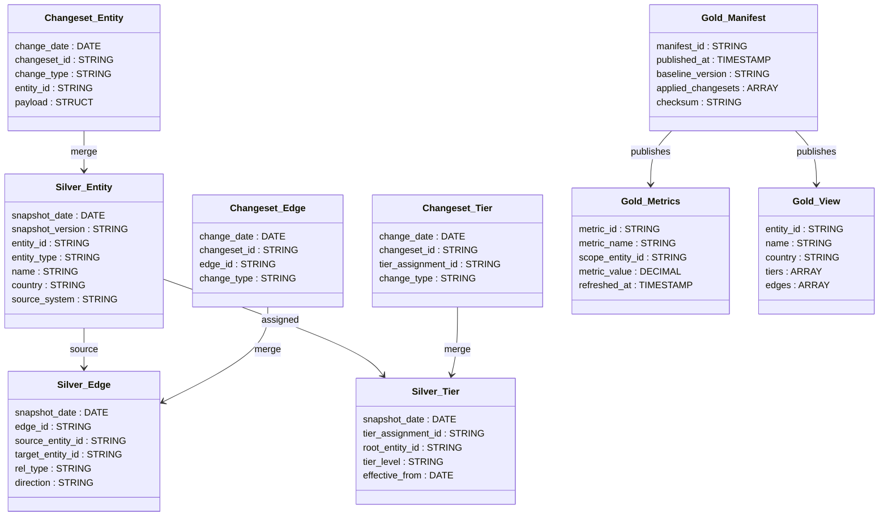

# TierIndex – fyzický model (Delta Lake)

**Audience:** 📊 Data Architect, 👨‍💻 Developer  
**Priority:** 🔴 Critical - core architecture  
**Last updated:** 2025-10-04  
**Related docs:** [TierIndex slovník pojmů](./tierindex_slovnik_pojmu.md), [SLA](./SLA.md), [Governance](./governance_lineage.md), [ER diagram](./er_diagram.md)

---

## Kontext
- Navazuje na logický ERD (`scrum/architecture/er_diagram.md`) a drží stejné mantinely (TierIndex-first, runtime mimo Databricks).
- Databricks slouží jako datová platforma: **Bronze** = raw ingest (DAP standard), **Silver** = normalizované tabulky baseline/changeset, **Gold** = metriky a view pro API.
- Dokument je příprava pro prezentaci architektovi/DAP – zaměřujeme se na přehled a vizualizace, skripty doplníme později.

---

## Bronze vrstva – raw ingest (DAP standard)

**Účel:** Zachování původních dat bez transformací. Odpovídá DAP "Integration" fázi (viz `dap_docs/SKDAP-DAPArchitectureDetails-280925-2209-102.pdf`): _"Goal of the integration step is to transfer data from the original location to the central data storage in it's original format; without any transformations."_

### Ingest mechanismus
Podle DAP dokumentace existuje několik standardních přístupů:
- **Cloud services:** Azure Data Factory, Event Hub
- **OP services:** Kafka streaming, SAP Data Services, Offloader
- **Typy:** Static data (db-based, file extracts), Streaming data (real-time), API-based approach (remote web services)

**Náš přístup:** API-based – periodický batch ingest z DnB Direct+ a Sayari API přes Python/Databricks job.

### Bronze tabulky

#### `bronze.dnb_raw`
Surové odpovědi z DnB API (FamilyTreeFull, CMPBOL).
- **Schema:** `request_id STRING`, `endpoint STRING`, `duns STRING`, `response_payload STRING` (JSON blob), `http_status INT`, `ingested_at TIMESTAMP`, `source_batch_id STRING`
- **Partitioning:** `PARTITIONED BY (endpoint, date(ingested_at))`
- **Retention:** 90 dní (audit trail)

#### `bronze.sayari_raw`
Surové odpovědi ze Sayari API (entity search, relationships, UBO).
- **Schema:** `request_id STRING`, `endpoint STRING`, `entity_id STRING`, `response_payload STRING` (JSON blob), `http_status INT`, `ingested_at TIMESTAMP`, `source_batch_id STRING`
- **Partitioning:** `PARTITIONED BY (endpoint, date(ingested_at))`
- **Retention:** 90 dní (audit trail)

### Ingest job
**Notebook/job:** `notebooks/ti_ingest_sources.py`
**Frekvence:** 1× denně (02:00 UTC)
**Logika:**
1. Načti seznam DUNS/entit k aktualizaci (z watch listu nebo Tier1 baseline)
2. Pro každou entitu: volej DnB + Sayari API endpoints
3. Zapiš surové odpovědi do `bronze.*_raw` tabulek (append mode)
4. Zaloguj `batch_id` + timestamp pro lineage tracking
5. V případě chyby: retry 3×, pak DLQ (dead letter queue)

**Monitoring:** Azure Monitor + Databricks job metrics (success rate, latency, error count)

### Governance Bronze vrstvy
- **Přístup:** Read-only pro silver ETL job; write pouze přes ingest job.
- **Lineage:** Unity Catalog automatická lineage (bronze → silver).
- **Data Quality:** Validace HTTP status 200, JSON parse check; nevalidní záznamy do `bronze.errors` tabulky.

---

## Silver vrstva – normalizované tabulky
- **`silver.ti_entity_s`** – aktuální stav entit v baseline (partition `snapshot_date`, Z-ORDER `entity_id`).
- **`silver.ti_edge_s`** – hrany mezi entitami (partition `snapshot_date`, Z-ORDER `source_entity_id`, `target_entity_id`).
- **`silver.ti_tier_assignment_s`** – přiřazení tierů k rootům (partition `snapshot_date`).
- **Changesety**: `silver.ti_changeset_entity`, `silver.ti_changeset_edge`, `silver.ti_changeset_tier` (`change_date` partition, atribut `change_type`).

## Gold vrstva – konzumace API
- **`gold.ti_manifest`** – auditovaný seznam publikovaných kombinací baseline + changesetů.
- **`gold.ti_metrics`** – metriky a agregáty pro frontend/chat (cluster na `scope_entity_id`).
- **`gold.vw_entity_graph`** – view s nested edges/tiers pro rychlé čtení API (kontrakt pro SLA < 200 ms).

## Governance a provoz
- **Práva**: role `ntier_reader` (read-only gold), `ntier_admin` (správa silver/gold + manifest).
- **Údržba**: týdenní `OPTIMIZE ... ZORDER BY (entity_id)` pro silver, `VACUUM RETAIN 7 DAYS`.
- **Lineage**: automaticky přes Unity Catalog; manifest vždy odkazuje na verzi baseline a seznam changesetů.
- **Fallback**: poslední manifest + export gold tabulek uložený mimo Databricks (degraded mode).

## Naming a konvence
- Katalogy: `skoda_tierindex_dev`, `skoda_tierindex_test`, `skoda_tierindex_prod`.
- Schémata: `silver` (normalizované tabulky), `gold` (metriky + view), `governance` (manifest).
- Prefixy tabulek: `ti_` pro hlavní entity, `ti_changeset_` pro inkrementy, `vw_` pro view.
- Sloupce auditní stopy: `snapshot_version`, `snapshot_date`, `changeset_id`, `published_at`.

## API kontrakt
- API čte výhradně `gold.vw_entity_graph` a `gold.ti_metrics`; změny jsou přidávané jako nové sloupce/fields.
- Backward kompatibilitu držíme přes výchozí hodnoty a verzi manifestu (hlavička odpovědi).
- Deaktivace metrik probíhá označením `is_deprecated = true` a odstraněním až po dvou release cyklech.
- Frontend využívá caching; SLA/RPO/RTO viz `scrum/architecture/SLA.md`.

## Navrhované skripty / notebooky (po schválení modelu)
| Artefakt                          | Typ                      | Hlavní úloha                                                               | Trigger / plán                |
| --------------------------------- | ------------------------ | -------------------------------------------------------------------------- | ----------------------------- |
| `notebooks/ti_ingest_sources`     | Notebook (PySpark)       | Stáhne Sayari/DnB dávku, uloží do bronze/silver staging                    | Databricks Workflow 02:00 CET |
| `jobs/ti_build_baseline.py`       | Job skript               | Normalizace do `silver.ti_*_s`, verze snapshotu, checksumy                 | Po ingestu, denně             |
| `jobs/ti_apply_changeset.py`      | Job skript               | Zápis changesetu a `MERGE` do silver baseline, příprava QA datasetu        | Každá hodina / on-demand      |
| `notebooks/ti_validate_publish`   | Notebook (SQL + PySpark) | QA testy (počty, checksumy, smoke metriky) a publish do `gold.ti_manifest` | Spouští orchestrátor po MERGE |
| `sql/gold_metrics_refresh.sql`    | SQL skript               | Rebuild `gold.ti_metrics`, aktualizace `vw_entity_graph`                   | Trigger z manifestu           |
| `scripts/export_gold_snapshot.py` | Python CLI               | Export posledního manifestu + gold tabulek pro fallback cache              | Po úspěšném manifestu         |

## Mermaid – přehled tabulek

## Další kroky pro prezentaci
- Připravit ukázkové SQL dotazy/dashboard snapshoty pro gold view a metriky.
- Doplnit checklist QA do `scrum/architecture/governance_lineage.md` o detailní validation testy.
- Odsouhlasit SLA hodnoty s DAP a promítnout je do Unity Catalogu.
