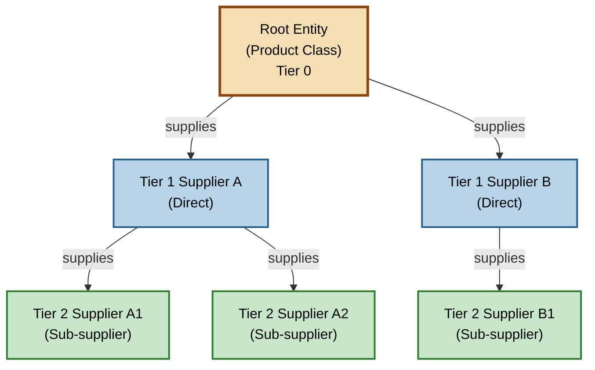
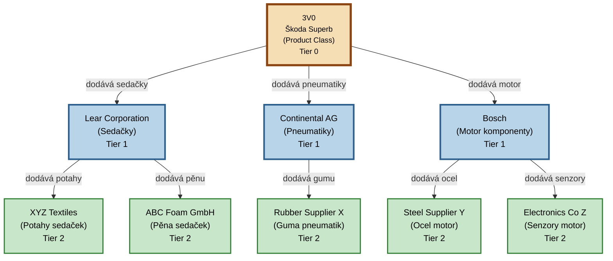
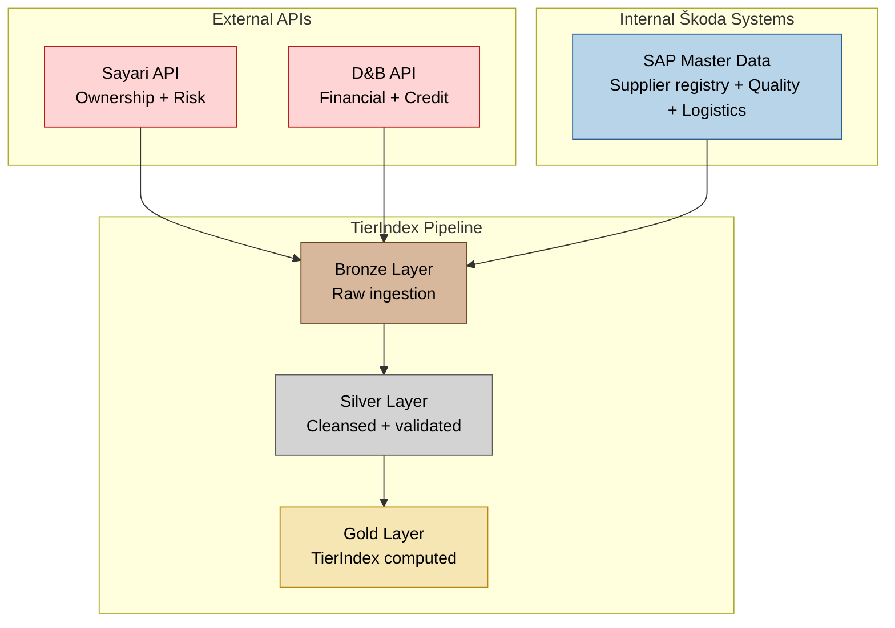
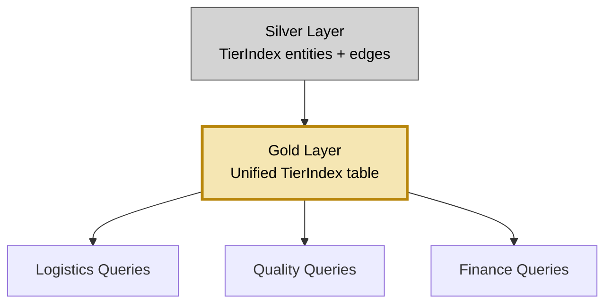
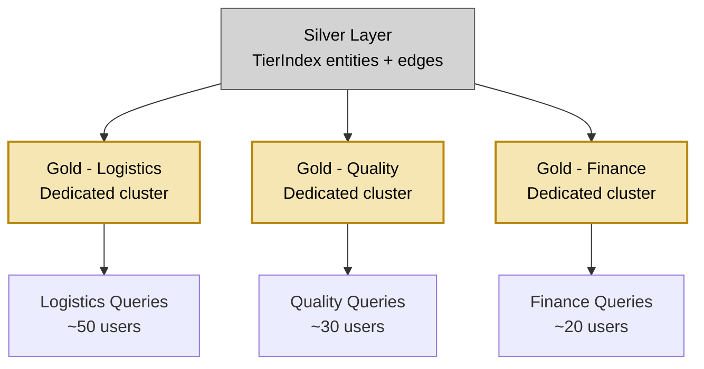

# TierIndex Visual Reference - Workshop AICC

**Účel:** Vizualizace TierIndex konceptu pro architektonický workshop
**Audience:** AICC architekti, Honza, Marek
**Last Updated:** 2025-10-25

---

## Přehled

TierIndex je **předpočítaný supplier graph**, který klasifikuje dodavatele podle jejich vzdálenosti od root entity (product_class). Tento dokument obsahuje Mermaid diagramy pro workshop prezentaci.

---

## 1. Core Concept - TierIndex Základy

**Co diagram ukazuje:**
- Entity = Suppliers nebo Product Classes
- Edges = Supply relationships (dodavatelské vztahy)
- Tiers = Vzdálenost od root entity (0 = root, 1 = přímý dodavatel, 2 = sub-supplier, ...)

**Legenda:**
- � **Béžová** = Root Entity (Product Class, Tier 0)
- 🔵 **Světle modrá** = Tier 1 Suppliers (přímí dodavatelé)
- 🟢 **Světle zelená** = Tier 2 Suppliers (sub-suppliers)

---

## 2. Reálný Příklad - Škoda Superb (3V0)

**Scénář:** Product Class `3V0` (Škoda Superb) s 3 Tier 1 suppliers a 5 Tier 2 suppliers.

**Klíčové Vlastnosti:**
- **Root**: `3V0` (product_class) = Škoda Superb
- **Tier 1 (3 suppliers)**: Lear, Continental, Bosch - dodávají **přímo** do 3V0 BOM
- **Tier 2 (5 suppliers)**: Dodávají Tier 1 suppliers (nepřímí dodavatelé pro 3V0)
- **15,000 total suppliers** v plném TierIndex (toto je zjednodušený vzorek)

---

## 3. Update Pattern - Baseline vs Changeset

**Dva režimy aktualizace TierIndex:**

### A) Baseline Rebuild (Weekly)
- Kompletní přepočítání celého grafu (15k suppliers)
- Trvá: **4-6 hodin** (DAP cluster)
- Výstup: Nový snapshot `TierIndex.baseline_v{N}` (Delta table)

### B) Changeset Update (Daily - nice-to-have, Q1 2026)
- Pouze delta změny (100-500 suppliers changed)
- Trvá: **<30 minut**
- Výstup: `changeset_YYYYMMDD_HHMM.json` + incremental Delta

```mermaid
graph LR
    BASE["Baseline<br/>v1<br/>(Neděle)"]
    CS1["Changeset<br/>Mon"]
    CS2["Changeset<br/>Tue"]
    CS3["Changeset<br/>Wed"]
    CS4["Changeset<br/>Thu"]
    CS5["Changeset<br/>Fri"]
    BASE_NEW["Baseline<br/>v2<br/>(Neděle)"]

    BASE -->|apply| CS1
    CS1 -->|apply| CS2
    CS2 -->|apply| CS3
    CS3 -->|apply| CS4
    CS4 -->|apply| CS5
    CS5 --> BASE_NEW

    style BASE fill:#F5DEB3,stroke:#8B4513,stroke-width:3px,color:#000
    style BASE_NEW fill:#F5DEB3,stroke:#8B4513,stroke-width:3px,color:#000
    style CS1 fill:#E8E8E8,stroke:#5A5A5A,stroke-width:2px,color:#000
    style CS2 fill:#E8E8E8,stroke:#5A5A5A,stroke-width:2px,color:#000
    style CS3 fill:#E8E8E8,stroke:#5A5A5A,stroke-width:2px,color:#000
    style CS4 fill:#E8E8E8,stroke:#5A5A5A,stroke-width:2px,color:#000
    style CS5 fill:#E8E8E8,stroke:#5A5A5A,stroke-width:2px,color:#000
```

**Současný Stav (MVP Q4 2025):**
- ✅ **Weekly baseline** - implementováno
- ⏸️ **Daily changesets** - nice-to-have, Q1 2026 (závisí na DAP capacity)

---

## 4. Data Sources Integration

**Odkud TierIndex získává data:**

**Data Flow:**
1. **External APIs** (Sayari, D&B) → Ownership, Risk, Financial data
2. **Internal Systems** (SAP) → Master data, Supplier registry, Quality, Logistics
3. **Bronze** → Raw data ingestion
4. **Silver** → Cleansed (validace, deduplikace, normalizace)
5. **Gold** → **TierIndex computed** (Entity, Edges, Tiers)

---

## 5. Gold Layer Options (Workshop Decision)

**🔴 KRITICKÉ ROZHODNUTÍ PRO WORKSHOP:**

### Option A: Centralized Gold (One table)

**Pro:**
- ✅ Jednodušší správa (jedna tabulka)
- ✅ Konzistentní data napříč odděleními
- ✅ Menší infrastruktura

**Proti:**
- ❌ Performance risk při 50+ concurrent users
- ❌ Vzájemné ovlivňování dotazů (contention)
- ❌ Těžší škálování

---

### Option B: Parallel Gold Layers (Per Department)

**Pro:**
- ✅ Izolace výkonu (dedicated resources)
- ✅ Oddělení mohou přidat vlastní data a upravovat svůj Gold layer
- ✅ Škálovatelnost (přidat další Gold layer = snadné)

**Proti:**
- ❌ Vyšší správa (3 tabulky místo 1)
- ❌ Duplicita dat (3x storage)
- ❌ Synchronizační riziko (consistency)

---

**N-Tier Doporučení:** ✅ **Option B (Parallel Gold Layers)** (nice-to-have)

**Důvod:**
- Umožňuje oddělením přidávat vlastní data a dělat co uznají za vhodné
- Izolace výkonu (dedicated resources)
- Trade-off: Vyšší správa **vs** flexibilita a výkon
- Architekti rozhodnou na workshopu

---

## 6. Related Documentation

**Pro workshop přípravu:**
- `scrum/architecture/bom/bom_structure.md` - BOM kontext, product_class definice
- `scrum/architecture/communication/deep_workshop_architects/workshop_architect_focus.md` - Hlavní workshop brief (350 řádků)
- `scrum/architecture/communication/deep_workshop_architects/tierindex_update_workflow.md` - Update scénáře (weekly/monthly)
- `scrum/architecture/physical_model.md` - Silver/Gold/API technická architektura

**Use cases:**
- `prezentace6.10/N_TIER_REQUIRED_USE_CASES.md` - Business case analýza
