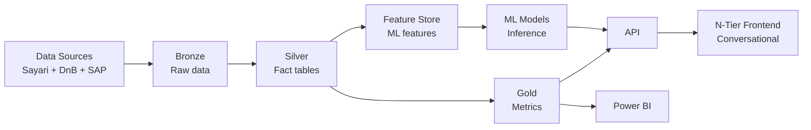

# N-Tier TierIndex - Executive Overview

**Audience:** 🏢 C-Level, Business Stakeholders
**Purpose:** High-level introduction to N-Tier platform and TierIndex data foundation
**Date:** October 9, 2025

---

## What is N-Tier TierIndex?

**Pre-computed supplier graph** covering 15k suppliers (Tier 1 → Tier 2 → Tier 3 → Tier 4+) enabling rapid risk assessments and proactive monitoring.

### Key Value Proposition:

- **Pre-calculated metrics** in Gold layer (Delta Lake on DAP) enabling rapid queries
- **15k supplier coverage** - From Škoda's direct suppliers (Tier 1) to sub-suppliers (Tier 3/4+)
- **Hybrid refresh strategy** - Monthly baseline (3.22 TiB Bulk Data) + daily incremental updates (Notifications API)
- **Multi-source integration** - Sayari (relationships, UBOs, sanctions) + DnB (financial health) + SAP (contracts, orders)

### What N-Tier Enables:

**Complex use cases requiring orchestration:**
- **Multi-hop graph traversal** with conditions at each level (e.g., "Tier-3 suppliers on sanctions blacklist with financial risk")
- **Multi-source synthesis** combining Sayari + DnB + SAP + BeON → unified risk assessment
- **Crisis cascade analysis** real-time impact propagation for upstream/downstream disruptions
- **Predictive monitoring** early warning system detecting supplier deterioration before crisis
- **Conversational interface** LLM orchestration for exploratory analysis

**Note:** TierIndex is the **data platform** (pre-computed metrics), N-Tier orchestrator manages complex queries over this platform.

---

## Architecture High-Level

**3-layer architecture (Medallion pattern on DAP):**

1. **Bronze** - Immutable audit trail (raw JSON/Parquet)
2. **Silver** - Fact tables (`ti_entity`, `ti_edge`, `ti_entity_matches`) + Feature Store (ML features for SCR-06/07)
3. **Gold** - Pre-calculated metrics (`ti_supplier_metrics`, `ti_tier_summary`) + ML predictions (supplier deterioration scores)

**Fact tables = Silver layer** (define relationships between suppliers)

---

## Key Tables (Silver Layer)

| Table               | Purpose                | Primary Key                               | Rows (Q4 2025) |
| ------------------- | ---------------------- | ----------------------------------------- | -------------- |
| `ti_entity`         | Supplier master data   | `duns`                                    | ~20k           |
| `ti_entity_matches` | Sayari match mappings  | (`project_entity_id`, `sayari_entity_id`) | ~45k           |
| `ti_edge`           | Supplier relationships | `edge_id`                                 | ~200k          |
| `ti_entity_risk`    | Risk attributes        | `duns`                                    | ~15k           |

**Unity Catalog paths:** `staging_wsp.tierindex_silver.*`

---

## Data Sources

### Sayari (supplier relationships)
- **API** - Real-time entity search
- **Bulk Data** - 3.22 TiB monthly snapshot (3.75B entities, 5.47B relationships)
- **Notifications API** - Daily polling for risk changes

### DnB (financial health)
- **API** - Company profiles, credit scores
- **DataBlocks** - Standardized financial metrics

### SAP (internal data)
- **Master data** - DUNS list, contracts
- **Orders & invoices** - From `dm_ba_purchase` and `dm_bs_purchase` datamarts (DAP Gold layer)
- **Experience data** - Order history, quality ratings, payment behavior

**DAP Integration:** N-Tier leverages existing DAP Gold datamarts for SAP-sourced metrics (see `BA-BS_Datamarts_scanned_metadata_extraction.json` for full schema).

---

## Tier Identification (3 methods)

**How do we determine supplier connections?**

### ✅ Method 1: SAP Master Data
- Supplier has contract with Škoda → Tier 1
- Supplier marked "important" in SAP → Tier 2
- **Confidence:** 100% (verified contract)

### ✅ Method 2.1: Sayari API + HS Code Match
- Query Sayari: "What are T1's suppliers?"
- Sayari returns relationships with **4-digit HS codes** (commodity codes)
- Match against expected categories (automotive parts)
- **Confidence:** 70-90% (depends on HS code overlap)

### ⏸️ Method 2.2: Web Scraping + AI Agent + HS Code description Inference
- Web scraping for unknown suppliers
- NLP inference of HS code from text
- **Status:** Detailed validation method - verifies if supplier fits into expected production process T3→T2→T1

**Data:** `ti_edge.identification_method` (enum: `sap_master_data` | `sayari_hs_match` | `web_scraping`)

---

## Business Value - Proactive Monitoring

**2 core use cases (see `02_use_cases_proaktivni_monitoring.md` for details):**

### **SCR-06: Supplier Deterioration Prediction**
Early warning system detecting supplier health deterioration before crisis:
- ML model predicting credit rating downgrade (3-month horizon)
- Features: DnB credit score trends + SAP payment behavior + industry benchmarks
- Alert delivery: Email, Slack, BeON notifications
- SLA: <4 hours response time for critical alerts

### **SCR-07: Crisis Impact Analysis**
Real-time cascade assessment for upstream/downstream disruptions:
- Graph traversal identifying all affected suppliers (Tier 1 → Tier 4)
- Impact scoring based on criticality, revenue exposure, geographic concentration
- Alternative supplier recommendations from TierIndex Gold

---

## Comparison: Power BI vs N-Tier

**Why not just Power BI?**

| Capability                    | Power BI | N-Tier TierIndex |
| ----------------------------- | -------- | ---------------- |
| **Multi-hop graph traversal** | ❌ No     | ✅ Yes            |
| **Multi-source synthesis**    | ⚠️ Basic  | ✅ Advanced       |
| **Conversational interface**  | ❌ No     | ✅ Yes (LLM)      |
| **Predictive monitoring**     | ⚠️ Basic  | ✅ ML-powered     |
| **Static reporting**          | ✅ Yes    | ✅ Yes            |
| **Self-service dashboards**   | ✅ Yes    | ⚠️ Basic          |

**Note:** Predictive monitoring currently covers 2 ML use cases (SCR-06: supplier deterioration, SCR-07: crisis cascade).

---

---
