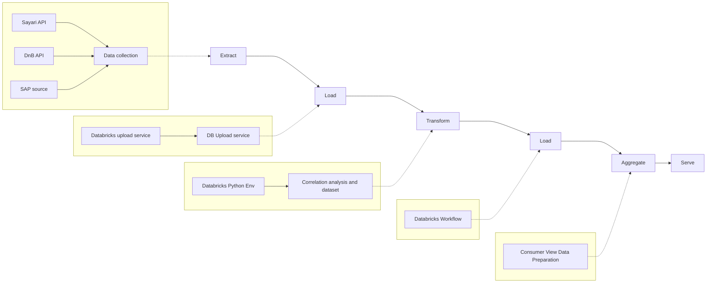

# N-Tier Proactive Monitoring - Overview

**Audience:** 🏗️ Architect, 💼 Business
**Purpose:** Co je N-Tier runtime aplikace pro proaktivní monitoring
**Priority:** 🔴 HIGH (Jarmila priority)
**Date:** October 9, 2025

---

## What Is N-Tier Proactive Monitoring?

**Runtime AI/LLM application** that **predicts** supplier risks BEFORE they become problems, and **automatically notifies** relevant stakeholders.

### Key Difference: TierIndex vs N-Tier Monitoring

| Aspect             | TierIndex (Gold Layer)           | N-Tier Monitoring (Runtime)       |
| ------------------ | -------------------------------- | --------------------------------- |
| **Purpose**        | Pre-computed supplier graph      | Continuous monitoring + alerts    |
| **Frequency**      | Monthly baseline + daily updates | Monitoring                        |
| **Output**         | Static metrics (risk scores)     | Predictions + notifications       |
| **Databricks**     | Gold layer Delta tables          | Feature Store + ML inference      |
| **User interface** | Power BI dashboards              | Conversational + proactive alerts |

**Analogy:**
- ✅ **TierIndex** = road map (static data)
- ✅ **N-Tier Monitoring** = GPS navigation with traffic updates (runtime predictions)

---


### Translation To Use Cases:

1. **Risk prediction:** "Supplier X has 82% probability of credit rating downgrade in 3 months" → **SCR-06**
2. **Automatic notifications:** Teams/Email alerts when risk detected → **Alert Pipeline**
3. **Signals:** Invoices past due, management change, M&A events → **Multi-source monitoring**

---

## 2 Core Use Cases

### **1. SCR-06: Supplier Deterioration Prediction**
**Problem:** Automatic alerts when supplier health deteriorates

**Příklad:**
```
"Alert: SUPPLIER_X má 82% pravděpodobnost credit rating downgrade za 3 měsíce"
→ Continuous monitoring (DnB ratings, Sayari sanctions, negative news)
→ Trend detection (CUSUM algorithm + ML models)
→ Configurable thresholds + notification delivery
```

**Dokumentace:** [02_use_cases_proaktivni_monitoring.md](./02_use_cases_proaktivni_monitoring.md#scr-06)

---

### **2. SCR-07: Crisis Impact Analysis**
**Problem:** Real-time cascade analysis during crisis

**Příklad:**
```
"SUPPLIER_X právě vyhlásil insolvenci - kteří dodavatelé jsou impactovaní?"
→ Graph traversal upstream/downstream
→ Project mapping + quantified exposure
→ Alternative supplier matching
→ Time: <5 minutes
```

**Dokumentace:** [02_use_cases_proaktivni_monitoring.md](./02_use_cases_proaktivni_monitoring.md#scr-07)

---

## Architecture High-Level

### **ETL Pipeline (Sergiu Diagram)**



**Key Phases:**
1. **Extract:** Sayari + DnB + SAP source → Raw data collection
2. **Load:** Databricks upload service → Bronze layer
3. **Transform:** Python correlation analysis → Silver layer
4. **Load:** Databricks Workflow → Gold layer
5. **Aggregate:** Consumer view preparation → Feature Store
5. **Gold:** Pre-aggregované metriky pro Power BI (týdenní refresh)
6. **Serve:** API + Power BI

---

---

### **Monitoring-Specific Components**

```mermaid
graph TD
    A["🔄 Continuous Monitoring"]
    B["📊 Feature Store"]
    C["⚠️ Alert Engine"]
    D["🤖 ML Models"]
    E["🔮 Predictive Alerts"]

**Components:**

1. **Feature Store** (Databricks)
   - Historical supplier metrics (6-12 months)
   - Rolling windows (7d, 30d, 90d averages)
   - Derived features (trend slopes, volatility)

2. **Monitoring Pipeline**
   - Hourly / Daily checks (configurable)
   - Multi-source signal aggregation
   - Threshold evaluation

3. **Alert Engine**
   - Rule-based → "If credit_rating drop >2 levels → alert"
   - ML-enhanced → "82% probability downgrade → alert"
   - Deduplication (no alert spam)

4. **Notification Delivery**
   - Teams webhooks
   - Email (SendGrid / Azure Communication Services)
   - ServiceNow tickets (future)

---

## Data Flow (Runtime)

### **Step 1: Continuous Monitoring**
```
TierIndex Gold Layer (static baseline)
  → Feature Store (time-series snapshots)
  → Monitoring Pipeline (hourly checks)
```

**Example Features:**
```json
{
  "supplier_id": "FLIDR_PLAST_495185217",
  "snapshot_date": "2025-10-09",
  "credit_rating_current": 78,
  "credit_rating_7d_avg": 80,
  "credit_rating_30d_trend": -0.15,
  "sanctions_count": 0,
  "adverse_media_count": 2,
  "payment_late_pct_3m": 0.23,
  "credit_note_ratio_3m": 0.04,
  "std_price_volatility_3m": 0.12,
  "data_source_sap": "dap_gold_prod.dm_bs_purchase.factv_bs_purchase_ekl_metric_current"
}
```

---

### **Step 2: Anomaly Detection**

**Rule-Based Approach:**
```python
# Pseudo-code
def check_deterioration(supplier):
    if supplier.credit_rating_30d_trend < -0.10:
        return Alert("Credit rating declining 10% monthly")

    if supplier.sanctions_count > 0:
        return Alert("New sanctions detected")

    if supplier.adverse_media_count > 5:
        return Alert("Negative news spike")
```

**ML-Enhanced Approach:**
```python
# Pseudo-code
def predict_deterioration(supplier):
    features = extract_ml_features(supplier)
    probability = lightgbm_model.predict_proba(features)

    if probability > 0.80:
        return Alert("82% probability credit downgrade in 3 months")
```

---

### **Step 3: Alert Delivery**

```python
# Pseudo-code
def deliver_alert(alert, supplier):
    # Format message
    message = f"""
    🚨 SUPPLIER RISK ALERT

    Supplier: {supplier.name}
    DUNS: {supplier.duns}
    Risk Level: {alert.severity}

    Evidence:
    - {alert.evidence_1}
    - {alert.evidence_2}

    Recommended Actions:
    - {alert.recommendation_1}

    View details: https://ntier.skoda/supplier/{supplier.duns}
    """

    # Deliver to configured channels
    teams_webhook.send(message)
    email_service.send(to=procurement_manager, body=message)

    # Log for audit
    alert_log.insert(alert_id, timestamp, supplier_id, message)
```

---

## SLA Targets (Proaktivní Monitoring)

| Metric                  | Target    | Notes                          |
| ----------------------- | --------- | ------------------------------ |
| **Detection Latency**   | <15 min   | From data refresh to detection |
| **False Positive Rate** | <5%       | Verified alerts only           |
| **Alert Delivery Time** | <1 minute | From detection to notification |
| **Monitoring Coverage** | ~1500     | All Tier 1 suppliers           |
| **Prediction Accuracy** | AUC >0.80 | ML models (3-month forecast)   |

---

## Technology Stack

### **Data Layer:**
- **TierIndex Gold Layer:** Static baseline (monthly refresh)
- **Feature Store:** Time-series snapshots (Databricks)
- **Unity Catalog:** Permissions + lineage

### **Monitoring Layer:**
- **Databricks Workflows:** Scheduled monitoring jobs
- **Python:** Monitoring scripts (CUSUM algorithm)
- **MLflow:** Model registry

### **Alert Layer:**
- **Azure Functions:** Alert delivery orchestration
- **Teams Webhooks:** Primary notification channel
- **SendGrid / Azure Communication:** Email delivery

### **Observability:**
- **Azure Monitor:** Monitoring pipeline metrics
- **Log Analytics:** Alert audit trail
- **Application Insights:** Performance tracking

---

## Next Steps

### **For Business (Jarmila):**
1. Review use cases: [02_use_cases_proaktivni_monitoring.md](./02_use_cases_proaktivni_monitoring.md)
2. Define alert thresholds: Which signals are critical for you?
3. Configure notification channels: Who should receive which alerts?

### **For Architects:**
1. Review data flows: [03_data_model_proaktivni_monitoring.md](./03_data_model_proaktivni_monitoring.md)
2. Review ETL diagram: [04_diagrams_proaktivni_monitoring.md](./04_diagrams_proaktivni_monitoring.md)
3. Design Feature Store schema

### **For Developers:**
1. Review ML approach: [ML_deterioration_prediction.md](./ML_deterioration_prediction.md)
2. Review orchestration patterns: [LLM_orchestration_patterns.md](./LLM_orchestration_patterns.md)
3. Prototype monitoring pipeline

---

**Related Docs:**
- `scrum/architecture/physical_model.md` - TierIndex Silver/Gold architecture
- `scrum/architecture/supervisor_architecture/` - Supervisor pattern
- `scrum/architecture/communication/sergiu/` - Sergiu onboarding (TierIndex focus)

---

**Last Updated:** October 9, 2025
**Status:** Draft - ready for review
