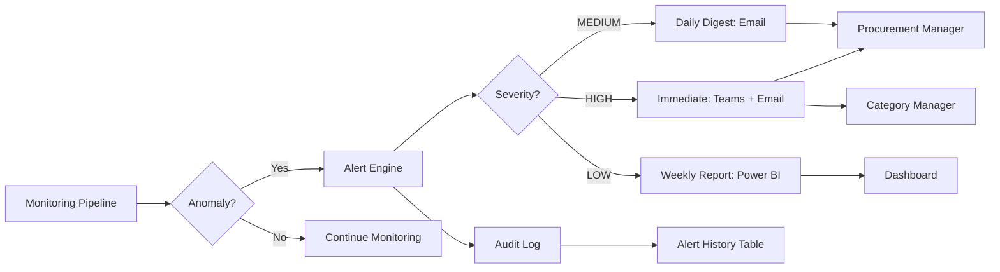

# Proactive Monitoring - Use Cases


**Date:** October 9, 2025

---

## Use Cases Overview

**2 core use cases for N-Tier proactive monitoring:**


1. **SCR-06: Supplier Deterioration Prediction** - Early warning system
2. **SCR-07: Crisis Impact Analysis** - Real-time cascade assessment


---

## 🔴 SCR-06: Supplier Deterioration Prediction

### **Problem:**
Risk manager wants **automatic alerts** when supplier health deteriorates BEFORE it's too late.


### **Typical Scenarios:**

#### **Scenario 1: Financial Deterioration**
```
Alert: SUPPLIER_X has 82% probability of credit rating downgrade in 3 months

Evidence:
- Credit rating declining for 3 months (85 → 82 → 78) [DnB]
- Revenue trend: -15% quarterly [DnB]
- Payment behavior: 23% invoices past due (was 5%) [SAP source: dm_bs_purchase]
- Credit note ratio: 4.2% (increased from 1.5%) [SAP source: dm_bs_purchase]
- Industry benchmark: SUPPLIER_X is 1.2 std dev below average

Recommended Actions:
- Increase safety stock (+20%)
- Request financial statements
- Activate alternative supplier (SUPPLIER_Y)
- SLA: Respond within 4 hours
```

#### **Scenario 2: Ownership Change**
```
Alert: SUPPLIER_X changed ultimate beneficial owner (UBO)

Evidence:
- Sayari API detected ownership transfer (2025-10-08)
- New owner: COMPANY_Z (unknown entity, no credit history)
- Previous owner: COMPANY_ABC (stable, 10-year history)
- UBO complexity increased from 2 to 5 layers

Recommended Actions:
- Request updated contracts
- Verify new ownership structure
- Assess COMPANY_Z financial health
- Consider backup supplier activation
```

#### **Scenario 3: Sanctions / Compliance**
```
Alert: SUPPLIER_X has new adverse media mention

Evidence:
- Source: Reuters article (2025-10-07)
- Topic: Environmental compliance violation (€2M fine)
- Severity: MEDIUM (not on blacklist yet, but under investigation)
- Related entities: 3 subsidiaries also mentioned

Recommended Actions:
- Monitor for official sanctions
- ESG review required
- Consider contract clauses (ethics compliance)
```

---

### **Architecture Approach:**

**Hybrid Rule-Based + ML Monitoring:**

```python
# Pseudo-code (continuous monitoring)

def monitor_suppliers():
    suppliers = get_tier1_suppliers() # ~1500 suppliers

    for supplier in suppliers:
        # Fetch current snapshot
        current = feature_store.get_latest(supplier.duns)
        historical = feature_store.get_history(supplier.duns, days=90)

        # Rule-based checks
        alerts = []

        # Check 1: Credit rating trend
        if current.credit_rating < historical.avg - 10:
            alerts.append(Alert("Credit rating dropped 10+ points"))

        # Check 2: Payment behavior (SAP source: dm_bs_purchase in DAP)
        # Source: dap_gold_prod.dm_bs_purchase.factv_bs_purchase_ekl_metric_current
        if current.payment_late_pct > 0.20:
            alerts.append(Alert("20%+ invoices past due (SAP source metric)"))

        # Check 3: Sanctions
        if current.sanctions_count > historical.sanctions_count:
            alerts.append(Alert("New sanctions detected"))

        # Check 4: UBO changes
        if current.ubo_hash != historical.ubo_hash:
            alerts.append(Alert("Ownership structure changed"))

        # Deliver alerts
        for alert in alerts:
            deliver_alert(alert, supplier)
```

**Predictive ML Approach:**

```python
# Pseudo-code (ML-enhanced prediction)

def predict_deterioration(supplier):
    # Extract features (12 dimensions)
    features = {
        "credit_rating_6m": [85, 84, 83, 81, 80, 78],
        "revenue_trend_slope": -0.15, # regression over 6 months
        "sanctions_count": 2,
        "ubo_changes": 1,
        "negative_news_count": 5,
        "industry_benchmark_zscore": -1.2,
        "payment_late_pct": 0.23,
        "defect_rate_ppm": 250,
        "otd_score": 0.87,
        "employee_count_change": -50, # layoffs
        "capex_trend": -0.30, # declining investments
        "peer_group_volatility": 0.45
    }

    # LightGBM inference
    probability = lightgbm_model.predict_proba(features)
    shap_values = lightgbm_model.explain(features)

    # Alert if high probability
    if probability > 0.80:
        return Alert(
            message=f"{probability*100:.0f}% probability credit downgrade in 3 months",
            top_factors=shap_values.top3,
            confidence=probability
        )
```

**Advantages:**
- ✅ Predictive (forecasts 3 months ahead)
- ✅ Lower false positive rate (<5%)
- ✅ SHAP explanations (interpretable)
- ✅ Continuous learning (model retraining weekly)

**Requirements:**
- Training data: 100+ labeled deterioration events (2020-2024)
- Feature engineering: 6-12 months historical snapshots
- MLflow Model Registry: versioning + A/B testing

**Documentation:** [ML_deterioration_prediction.md](./ML_deterioration_prediction.md)

---

### **Alert Delivery Workflow:**



**Notification Channels:**

| Severity   | Channel              | SLA       | Recipients                 |
| ---------- | -------------------- | --------- | -------------------------- |
| **HIGH**   | Teams + Email        | <5 min    | Procurement Manager, Buyer |
| **MEDIUM** | Email (daily digest) | <24 hours | Buyer, Risk Manager        |
| **LOW**    | Power BI dashboard   | Weekly    | All users                  |

---

### **Configurable Thresholds (User-Defined):**

```yaml
# alert_config.yaml (per user or team)

thresholds:
  credit_rating_drop:
    enabled: true
    threshold: 10 # points drop triggers alert
    lookback_days: 90

  payment_late_pct:
    enabled: true
    threshold: 0.20 # 20%

  sanctions:
    enabled: true
    immediate: true # no threshold, alert on any new sanction

  ubo_changes:
    enabled: true
    immediate: true

  ml_prediction:
    enabled: true
    probability_threshold: 0.80 # 80%
    forecast_horizon_days: 90

notification_channels:
  teams:
    enabled: true
    webhook_url: "https://..."
  email:
    enabled: true
    recipients: ["procurement@skoda.cz", "risk@skoda.cz"]
  servicenow:
    enabled: false # future
```

**User Interface:** Web UI for configuration

---

## 🔴 SCR-07: Crisis Impact Analysis

### **Problem:**
Real-time cascade analysis: "SUPPLIER_X just declared insolvency - which suppliers are impacted?"

### **Typical Query:**
```
"SUPPLIER_X just declared insolvency - analyze impact"
```

1. Open Excel spreadsheets, find SUPPLIER_X
2. Manually review all Tier-1 suppliers (who buys from X?)
3. Map downstream cascade (who buys from affected Tier-1?)
4. Query SAP source data - which projects are affected?
5. Find alternatives (Google search + manual calls)
6. **Time: 2-4 hours** (critical!)

---

### **N-Tier Solution:**

#### **Step 1: Graph Traversal (Upstream + Downstream)**

```python
# Pseudo-code
def analyze_crisis_impact(bankrupt_supplier_duns):
    # Upstream: Who buys from SUPPLIER_X?
    upstream = graph_traversal(
        start=bankrupt_supplier_duns,
        direction="incoming_edges",
        max_depth=2 # Tier-1, Tier-2
    )

    # Downstream: Which sub-suppliers are affected?
    downstream = graph_traversal(
        start=bankrupt_supplier_duns,
        direction="outgoing_edges",
        max_depth=2
    )

    return {
        "directly_affected": upstream.tier1, # 12 suppliers
        "cascade_affected": upstream.tier2, # 6 suppliers
        "downstream_impact": downstream # 28 suppliers
    }
```

#### **Step 2: Project Mapping**

```python
# Pseudo-code
def map_to_projects(affected_suppliers):
    projects = []

    for supplier in affected_suppliers:
        # Query SAP source: which projects use this supplier?
        supplier_projects = sap_api.get_projects(supplier.duns)

        for project in supplier_projects:
            # Check criticality
            buffer = project.inventory_buffer_days
            lead_time = project.supplier_lead_time_days

            if buffer < lead_time:
                criticality = "HIGH" # no time buffer
            elif buffer < 2 * lead_time:
                criticality = "MEDIUM"
            else:
                criticality = "LOW"

            projects.append({
                "project_id": project.id,
                "project_name": project.name,
                "criticality": criticality,
                "days_until_shortage": buffer
            })

    return projects
```

#### **Step 3: Alternative Supplier Matching**

```python
# Pseudo-code
def find_alternatives(bankrupt_supplier):
    # Get commodity codes (HS codes)
    hs_codes = bankrupt_supplier.hs_codes

    # Semantic search for similar suppliers
    candidates = semantic_search(
        query=f"Alternative suppliers for {hs_codes}",
        exclude=[bankrupt_supplier.duns],
        k=10
    )

    # Rank by similarity + capacity
    alternatives = []
    for candidate in candidates:
        similarity = cosine_similarity(
            bankrupt_supplier.capability_embedding,
            candidate.capability_embedding
        )

        capacity_score = candidate.available_capacity / bankrupt_supplier.volume

        combined_score = 0.6 * similarity + 0.4 * capacity_score

        alternatives.append({
            "supplier": candidate,
            "match_score": similarity,
            "capacity_score": capacity_score,
            "combined_score": combined_score,
            "lead_time_days": candidate.lead_time
        })

    return sorted(alternatives, key=lambda x: x["combined_score"], reverse=True)
```

#### **Step 4: Quantified Exposure**

```python
# Pseudo-code
def quantify_exposure(affected_suppliers, projects):
    total_volume_eur = sum(s.annual_volume for s in affected_suppliers)
    total_projects = len(projects)
    critical_projects = [p for p in projects if p.criticality == "HIGH"]

    return {
        "total_exposure_eur": total_volume_eur,
        "affected_projects_count": total_projects,
        "critical_projects": critical_projects,
        "estimated_downtime_days": max(p.days_until_shortage for p in critical_projects),
        "risk_level": "HIGH" if len(critical_projects) > 0 else "MEDIUM"
    }
```

---

### **Complete Output Example:**

```
Crisis Impact Report (generated in 4 minutes):

🚨 SUPPLIER_X Insolvency Impact

Impacted Suppliers:
- Direct customers: 12 Tier-1 suppliers (buy directly from SUPPLIER_X)
- Indirect: 6 Tier-2 suppliers (depend on affected Tier-1)
- Downstream cascade: 28 additional suppliers impacted

Impacted Projects:
- Critical: 3 projects (PROJECT_Y requires parts within 2 weeks, no buffer)
  * PROJECT_Y: Assembly line stoppage in 14 days
  * PROJECT_Z: Reduced output (-30%) in 21 days
- Medium: 8 projects (1-2 months buffer)
- Low: 5 projects (>3 months buffer)

Quantified Exposure:
- Annual volume at risk: 52M EUR
- Estimated downtime: 14-21 days (if no action)
- Production impact: 1,200 vehicles (based on assembly schedule)

Alternative Suppliers (Top 3):
1. SUPPLIER_Y (Match: 92%, Capacity: 80%, Lead time: 6 weeks)
2. SUPPLIER_Z (Match: 87%, Capacity: 100%, Lead time: 8 weeks)
3. SUPPLIER_W (Match: 85%, Capacity: 60%, Lead time: 4 weeks)

Recommended Actions (Priority Order):
1. Immediate: Contact SUPPLIER_Y (highest match + capacity)
2. Short-term: Increase safety stock from buffer inventory
3. Medium-term: Dual-source strategy for critical parts
4. Long-term: Geographic diversification (reduce single-country risk)

Timeline:
- Day 0: Crisis detected
- Day 1-3: Negotiate with SUPPLIER_Y
- Day 4-7: Contract signed + PO issued
- Week 2-6: First delivery from SUPPLIER_Y
- Week 6+: Stabilized supply chain
```


---
