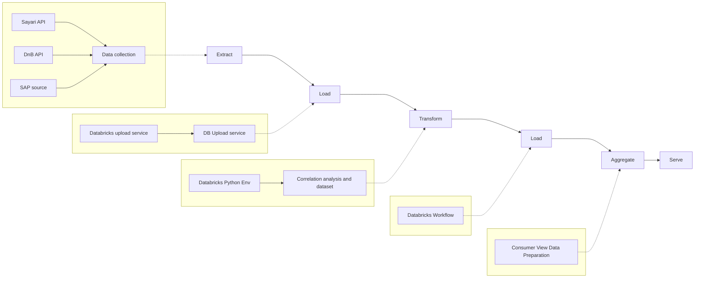
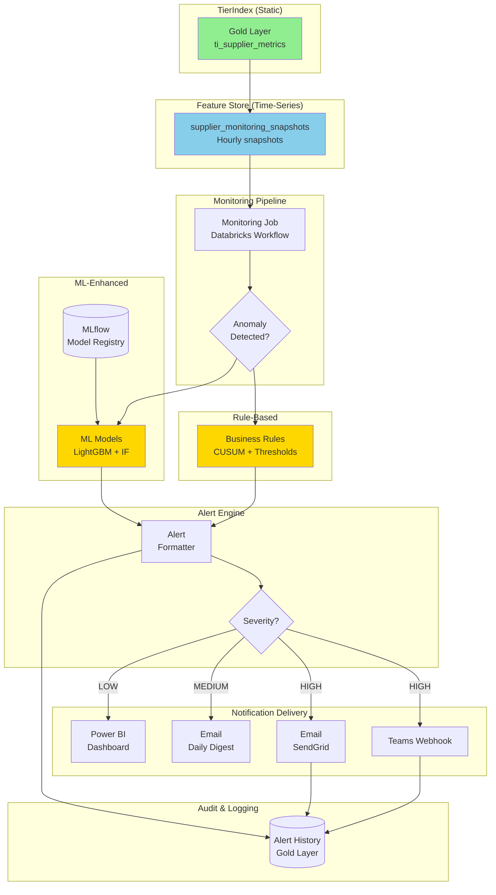
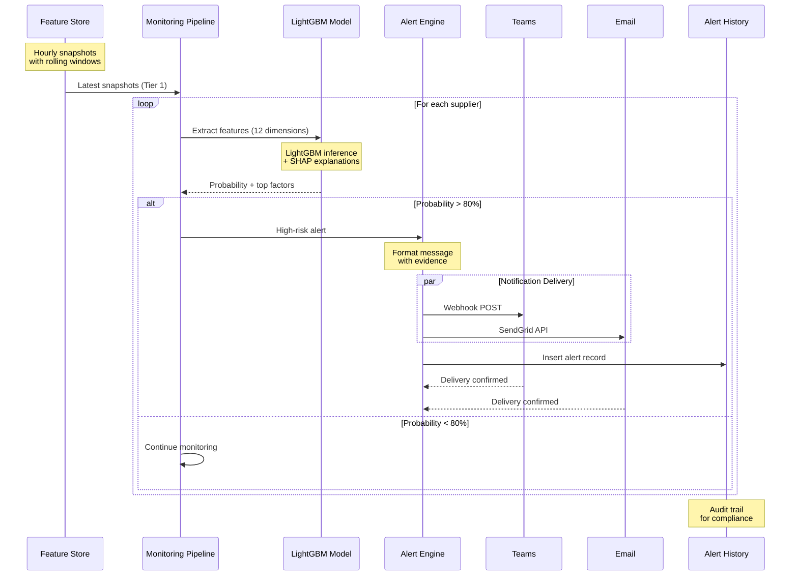
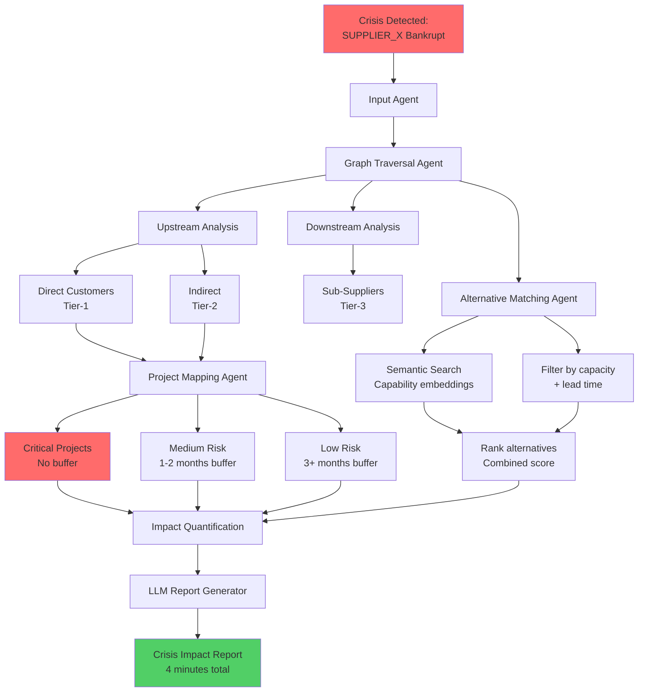
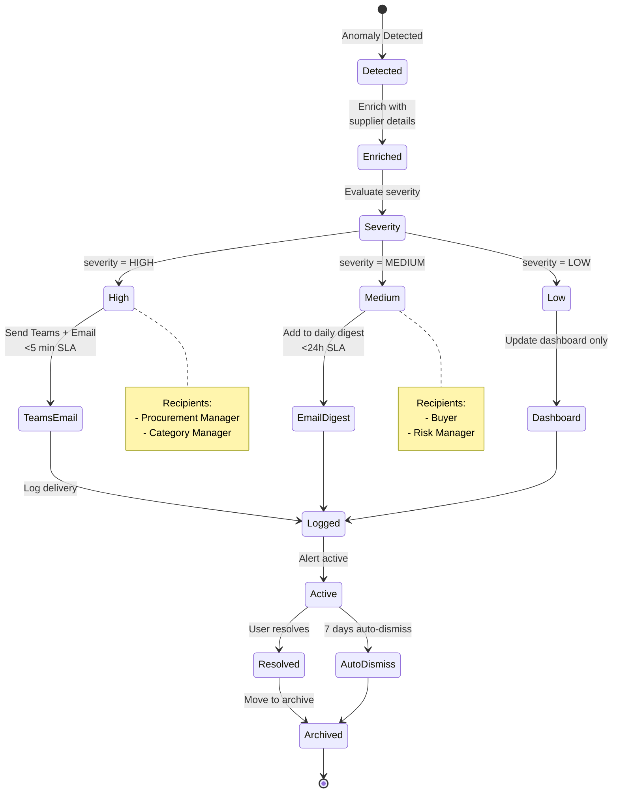
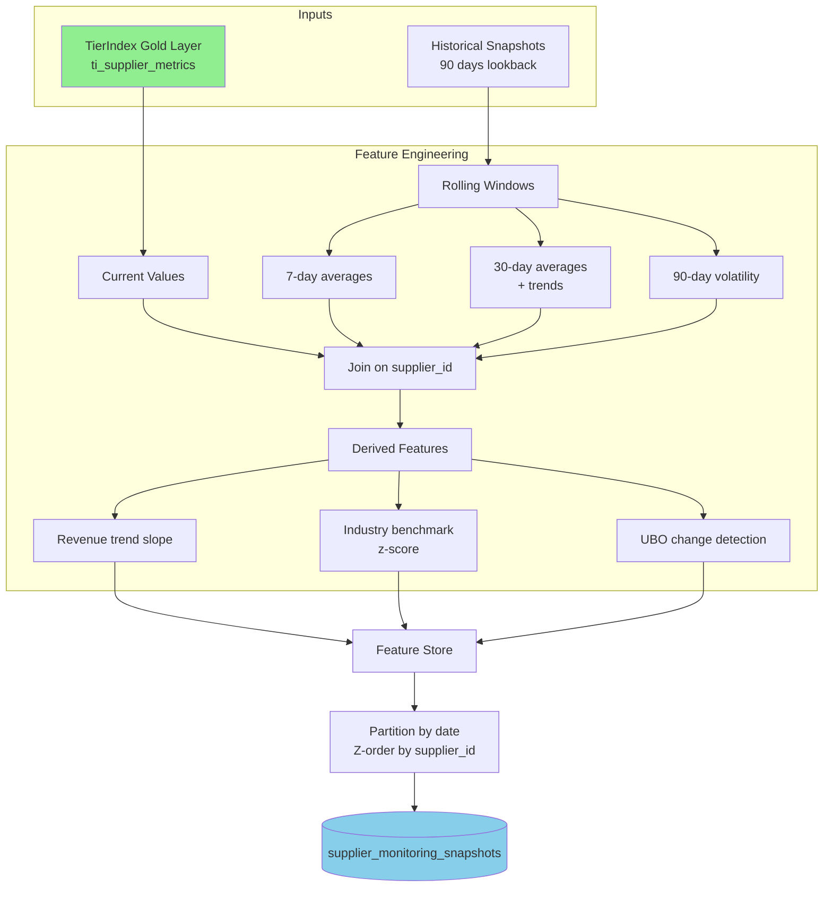

# Proactive Monitoring - Diagrams

**Date:** October 9, 2025

---

## 1. ETL Pipeline

**Key Phases:**
1. **Extract:** Sayari + DnB + SAP source → Data collection
2. **Load:** Databricks upload → Bronze layer
3. **Transform:** Python correlation analysis → Silver layer
4. **Load:** Databricks Workflow → Gold layer
5. **Aggregate:** Consumer view preparation → Feature Store
6. **Serve:** API + Power BI + N-Tier runtime

---

## 2. Monitoring Pipeline Architecture

---

## 3. SCR-06: Deterioration Prediction Flow (ML-Enhanced)

---

## 4. SCR-07: Crisis Impact Analysis Flow

---

## 6. Alert Delivery Workflow

---

## 6. Feature Engineering Pipeline

---
