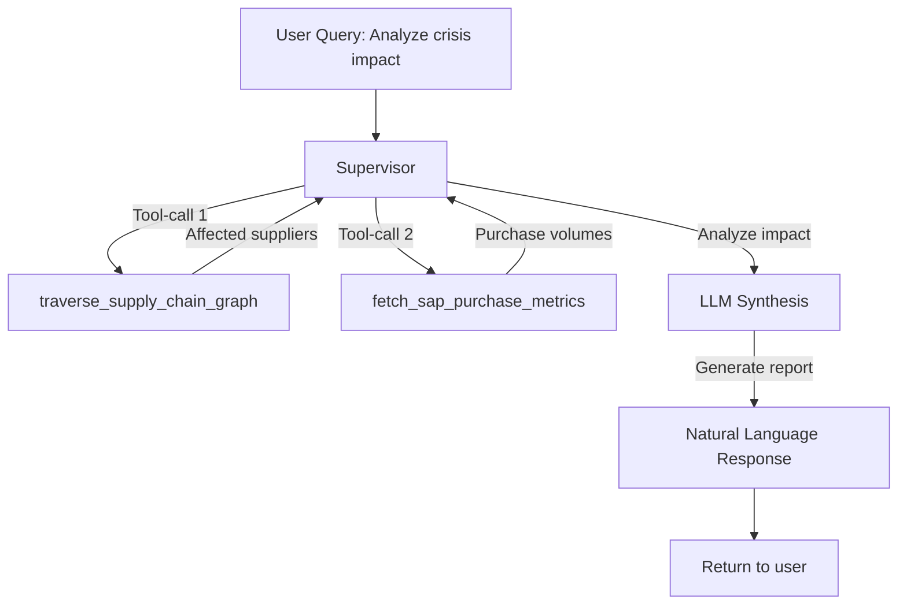

# LLM Orchestration Patterns for Proaktivní Monitoring

**Audience:** �️ Architect, 👨‍💻 Developer
**Purpose:** Gate rules, tool-call interfaces, format contracts
**Priority:** 🟡 MEDIUM
**Date:** October 9, 2025

---

## 1. Overview

**LLM Orchestration in proactive monitoring** = structured use of LLM for:
1. **Gate rules** - decision logic (when to send alert, what severity)
2. **Tool-call interfaces** - JSON schemas for ML/Graph/SAP source tools
3. **Format contracts** - standardized outputs (alert messages, reports)

---

## 2. Gate Rules (YAML Configuration)

### 2.1 Risk Alert Gates

**Purpose:** Decide whether to send alert based on risk score + context.

**YAML Configuration:**

```yaml
# File: config/risk_alert_gates.yaml

gates:
  deterioration_prediction:
    enabled: true
    triggers:
      - condition: "probability >= 0.80"
        severity: HIGH
        channels: ["teams", "email"]
        recipients:
          - role: "category_manager"
          - role: "procurement_manager"

      - condition: "probability >= 0.50 AND probability < 0.80"
        severity: MEDIUM
        channels: ["email_digest"]
        recipients:
          - role: "buyer"

      - condition: "probability < 0.50"
        severity: LOW
        channels: ["dashboard_only"]
        recipients: []

    suppression:
      # Don't send if alert already sent within last 7 days
      window_hours: 168  # 7 days
      max_alerts_per_supplier: 1

    escalation:
      # Escalate if not acknowledged within 24h
      timeout_hours: 24
      escalate_to:
        - role: "head_of_procurement"

  combined_risk_comparison:
    enabled: true
    triggers:
      - condition: "score_difference >= 0.30 AND confidence_level == 'HIGH'"
        severity: MEDIUM
        channels: ["teams"]
        recipients:
          - role: "sourcing_manager"

      - condition: "score_difference >= 0.50"
        severity: HIGH
        channels: ["teams", "email"]
        recipients:
          - role: "sourcing_manager"
          - role: "category_manager"

  sanctions_detected:
    enabled: true
    triggers:
      - condition: "sanctions_count > 0"
        severity: CRITICAL
        channels: ["teams", "email", "sms"]
        recipients:
          - role: "compliance_officer"
          - role: "head_of_procurement"

    suppression:
      # Immediate alert, no suppression
      window_hours: 0

# User-configurable thresholds (overrides)
user_thresholds:
  payment_late_pct:
    default: 30.0  # %
    automotive: 20.0  # Stricter for automotive
    general_purchase: 40.0

  credit_rating_drop:
    default: 2  # levels
    critical_suppliers: 1  # Alert on any drop

  ubo_change:
    default: true  # Always alert on UBO change
    low_risk_suppliers: false  # Skip for low-risk
```

**Loading & evaluation:**

```python
# Pseudo-code: Gate rule evaluation

import yaml

def load_gate_rules(config_path: str = "config/risk_alert_gates.yaml"):
    with open(config_path, 'r') as f:
        return yaml.safe_load(f)

def evaluate_gate(gate_name: str, context: dict) -> dict:
    rules = load_gate_rules()
    gate_config = rules["gates"][gate_name]

    if not gate_config["enabled"]:
        return None  # Gate disabled

    # Step 1: Check suppression window
    if gate_config.get("suppression"):
        window_hours = gate_config["suppression"]["window_hours"]
        recent_alert = check_recent_alert(
            supplier_id=context["supplier_id"],
            gate_name=gate_name,
            lookback_hours=window_hours
        )

        if recent_alert:
            return {
                "action": "SUPPRESS",
                "reason": f"Alert already sent within last {window_hours}h"
            }

    # Step 2: Evaluate trigger conditions
    for trigger in gate_config["triggers"]:
        condition_str = trigger["condition"]

        # Parse condition (simple eval for demo - use proper parser in production)
        if eval_condition(condition_str, context):
            return {
                "action": "SEND_ALERT",
                "severity": trigger["severity"],
                "channels": trigger["channels"],
                "recipients": resolve_recipients(trigger["recipients"]),
                "escalation": gate_config.get("escalation"),
                "trigger_condition": condition_str
            }

    # No trigger matched
    return {
        "action": "NO_ACTION",
        "reason": "No trigger condition met"
    }

def eval_condition(condition_str: str, context: dict) -> bool:
    # Simple condition evaluator
    # Example: "probability >= 0.80 AND confidence_level == 'HIGH'"

    # Replace context variables
    for key, value in context.items():
        if isinstance(value, str):
            condition_str = condition_str.replace(key, f"'{value}'")
        else:
            condition_str = condition_str.replace(key, str(value))

    # Evaluate (use safe eval in production!)
    try:
        return eval(condition_str)
    except:
        return False
```

---

## 3. Tool-Call Interfaces (JSON Schemas)

### 3.1 ML Prediction Tool

**Purpose:** Invoke deterioration prediction model.

**JSON Schema:**

```json
{
  "tool_name": "predict_deterioration",
  "description": "Predict supplier deterioration probability using LightGBM model",
  "input_schema": {
    "type": "object",
    "properties": {
      "supplier_id": {
        "type": "string",
        "description": "Unique supplier identifier (SAP source LIFNR)"
      },
      "as_of_date": {
        "type": "string",
        "format": "date",
        "description": "Optional: prediction date (default: today)"
      },
      "return_shap": {
        "type": "boolean",
        "default": true,
        "description": "Include SHAP explanations"
      }
    },
    "required": ["supplier_id"]
  },
  "output_schema": {
    "type": "object",
    "properties": {
      "supplier_id": {"type": "string"},
      "deterioration_probability": {
        "type": "number",
        "minimum": 0.0,
        "maximum": 1.0
      },
      "risk_level": {
        "type": "string",
        "enum": ["LOW", "MEDIUM", "HIGH"]
      },
      "top_factors": {
        "type": "array",
        "items": {
          "type": "object",
          "properties": {
            "feature": {"type": "string"},
            "shap_value": {"type": "number"},
            "feature_value": {"type": "number"}
          }
        }
      },
      "model_version": {"type": "string"},
      "prediction_timestamp": {
        "type": "string",
        "format": "date-time"
      }
    }
  }
}
```

**Python implementation:**

```python
# Pseudo-code: predict_deterioration tool

def predict_deterioration(
    supplier_id: str,
    as_of_date: str = None,
    return_shap: bool = True
) -> dict:
    """
    Tool-call implementation for deterioration prediction.

    Returns JSON matching output_schema.
    """
    if as_of_date is None:
        as_of_date = datetime.now().date()

    # Call ML inference (see ML_deterioration_prediction.md)
    prediction = predict_deterioration_probability(supplier_id)

    return prediction  # Already matches output_schema
```

---

### 3.2 Combined Risk Scoring Tool

**JSON Schema:**

```json
{
  "tool_name": "calculate_combined_risk",
  "description": "Calculate multi-source combined risk score for supplier",
  "input_schema": {
    "type": "object",
    "properties": {
      "supplier_id": {
        "type": "string",
        "description": "Unique supplier identifier"
      },
      "profile_id": {
        "type": "string",
        "default": "default",
        "description": "Weight profile (default, automotive, regulated)"
      }
    },
    "required": ["supplier_id"]
  },
  "output_schema": {
    "type": "object",
    "properties": {
      "supplier_id": {"type": "string"},
      "combined_risk_score": {
        "type": "number",
        "minimum": 0.0,
        "maximum": 1.0
      },
      "risk_level": {
        "type": "string",
        "enum": ["LOW", "MEDIUM", "HIGH"]
      },
      "confidence": {
        "type": "object",
        "properties": {
          "completeness_ratio": {"type": "number"},
          "confidence_level": {
            "type": "string",
            "enum": ["LOW", "MEDIUM", "HIGH"]
          }
        }
      },
      "breakdown": {
        "type": "object",
        "properties": {
          "financial": {"type": "number"},
          "compliance": {"type": "number"},
          "operational": {"type": "number"},
          "quality": {"type": "number"}
        }
      },
      "top_risk_factors": {
        "type": "array",
        "maxItems": 3
      }
    }
  }
}
```

---

### 3.3 Graph Traversal Tool (SCR-07)

**JSON Schema:**

```json
{
  "tool_name": "traverse_supply_chain_graph",
  "description": "Traverse TierIndex graph upstream/downstream from supplier",
  "input_schema": {
    "type": "object",
    "properties": {
      "supplier_id": {
        "type": "string",
        "description": "Starting supplier node"
      },
      "direction": {
        "type": "string",
        "enum": ["upstream", "downstream", "both"],
        "description": "Traversal direction"
      },
      "max_depth": {
        "type": "integer",
        "default": 3,
        "description": "Maximum tier depth to traverse"
      },
      "filter_active_only": {
        "type": "boolean",
        "default": true
      }
    },
    "required": ["supplier_id", "direction"]
  },
  "output_schema": {
    "type": "object",
    "properties": {
      "supplier_id": {"type": "string"},
      "direction": {"type": "string"},
      "nodes": {
        "type": "array",
        "items": {
          "type": "object",
          "properties": {
            "node_id": {"type": "string"},
            "tier_level": {"type": "integer"},
            "entity_type": {
              "type": "string",
              "enum": ["supplier", "customer", "project"]
            },
            "is_critical": {"type": "boolean"}
          }
        }
      },
      "edges": {
        "type": "array",
        "items": {
          "type": "object",
          "properties": {
            "source_id": {"type": "string"},
            "target_id": {"type": "string"},
            "relationship_type": {"type": "string"},
            "weight": {"type": "number"}
          }
        }
      },
      "total_nodes": {"type": "integer"},
      "total_edges": {"type": "integer"}
    }
  }
}
```

---

### 3.4 SAP Data Fetch Tool

**JSON Schema:**

```json
{
  "tool_name": "fetch_sap_purchase_metrics",
  "description": "Fetch supplier purchase metrics from SAP BS datamart",
  "input_schema": {
    "type": "object",
    "properties": {
      "supplier_id": {
        "type": "string",
        "description": "SAP source LIFNR supplier number"
      },
      "metrics": {
        "type": "array",
        "items": {
          "type": "string",
          "enum": [
            "payment_late_pct",
            "credit_note_amount",
            "std_price",
            "purchase_volume",
            "menge"
          ]
        },
        "description": "List of metrics to fetch"
      },
      "lookback_days": {
        "type": "integer",
        "default": 90,
        "description": "Historical window (days)"
      }
    },
    "required": ["supplier_id", "metrics"]
  },
  "output_schema": {
    "type": "object",
    "properties": {
      "supplier_id": {"type": "string"},
      "metrics": {
        "type": "object",
        "additionalProperties": {
          "type": "object",
          "properties": {
            "current_value": {"type": "number"},
            "avg_3m": {"type": "number"},
            "trend_6m": {"type": "number"},
            "data_source": {
              "type": "string",
              "const": "dap_gold_prod.dm_bs_purchase"
            }
          }
        }
      },
      "query_timestamp": {
        "type": "string",
        "format": "date-time"
      }
    }
  }
}
```

**Python implementation:**

```python
# Pseudo-code: SAP data fetch tool

def fetch_sap_purchase_metrics(
    supplier_id: str,
    metrics: list,
    lookback_days: int = 90
) -> dict:
    """
    Tool-call implementation for SAP BS datamart queries.
    """
    result = {
        "supplier_id": supplier_id,
        "metrics": {},
        "query_timestamp": datetime.now().isoformat()
    }

    for metric_name in metrics:
        # Query dm_bs_purchase for each metric
        metric_data = query_sap_metric(
            supplier_id=supplier_id,
            metric=metric_name,
            lookback_days=lookback_days
        )

        result["metrics"][metric_name] = {
            "current_value": metric_data["current"],
            "avg_3m": metric_data["avg_3m"],
            "trend_6m": metric_data["trend_6m"],
            "data_source": "dap_gold_prod.dm_bs_purchase"
        }

    return result
```

---

## 4. Format Contracts (Alert Schemas)

### 4.1 Alert Message Format (v1)

**Unified alert schema** for all monitoring types.

**JSON Schema:**

```json
{
  "alert_schema_version": "v1",
  "alert_message": {
    "type": "object",
    "properties": {
      "alert_id": {
        "type": "string",
        "pattern": "^[A-Z]+_[A-Z0-9]+_[0-9]{12}$",
        "description": "Format: {TYPE}_{SUPPLIER_ID}_{TIMESTAMP}"
      },
      "alert_type": {
        "type": "string",
        "enum": [
          "DETERIORATION_PREDICTION",
          "COMBINED_RISK_HIGH",
          "SANCTIONS_DETECTED",
          "UBO_CHANGE_DETECTED",
          "PAYMENT_LATE_SPIKE"
        ]
      },
      "severity": {
        "type": "string",
        "enum": ["LOW", "MEDIUM", "HIGH", "CRITICAL"]
      },
      "supplier": {
        "type": "object",
        "properties": {
          "supplier_id": {"type": "string"},
          "supplier_name": {"type": "string"},
          "tier_level": {"type": "integer"},
          "category": {"type": "string"}
        },
        "required": ["supplier_id", "supplier_name"]
      },
      "evidence": {
        "type": "array",
        "items": {
          "type": "object",
          "properties": {
            "source": {
              "type": "string",
              "enum": ["DnB", "Sayari", "SAP_source", "BeON", "TierIndex", "ML_Model"]
            },
            "metric": {"type": "string"},
            "current_value": {},
            "baseline_value": {},
            "threshold_breached": {"type": "boolean"}
          }
        }
      },
      "probability": {
        "type": "number",
        "minimum": 0.0,
        "maximum": 1.0,
        "description": "Optional: ML model probability (for DETERIORATION_PREDICTION)"
      },
      "recommended_actions": {
        "type": "array",
        "items": {"type": "string"}
      },
      "links": {
        "type": "object",
        "properties": {
          "supplier_profile": {"type": "string", "format": "uri"},
          "power_bi_dashboard": {"type": "string", "format": "uri"},
          "sap_details": {"type": "string", "format": "uri"}
        }
      },
      "created_at": {
        "type": "string",
        "format": "date-time"
      },
      "expires_at": {
        "type": "string",
        "format": "date-time",
        "description": "Auto-dismiss if not acknowledged by this time"
      },
      "acknowledged": {
        "type": "boolean",
        "default": false
      },
      "acknowledged_by": {
        "type": "string",
        "description": "User ID who acknowledged"
      },
      "acknowledged_at": {
        "type": "string",
        "format": "date-time"
      }
    },
    "required": [
      "alert_id",
      "alert_type",
      "severity",
      "supplier",
      "evidence",
      "recommended_actions",
      "created_at",
      "expires_at"
    ]
  }
}
```

**Example alert message:**

```json
{
  "alert_id": "DET_SUPPLIER_12345_202510091430",
  "alert_type": "DETERIORATION_PREDICTION",
  "severity": "HIGH",
  "supplier": {
    "supplier_id": "SUPPLIER_12345",
    "supplier_name": "ABC Manufacturing GmbH",
    "tier_level": 1,
    "category": "Automotive Components"
  },
  "evidence": [
    {
      "source": "DnB",
      "metric": "credit_rating_6m_change",
      "current_value": -3,
      "baseline_value": 0,
      "threshold_breached": true
    },
    {
      "source": "SAP_source",
      "metric": "payment_late_pct_3m",
      "current_value": 42.5,
      "baseline_value": 15.0,
      "threshold_breached": true
    },
    {
      "source": "Sayari",
      "metric": "adverse_media_90d",
      "current_value": 7,
      "baseline_value": 0,
      "threshold_breached": true
    }
  ],
  "probability": 0.87,
  "recommended_actions": [
    "Schedule immediate call with supplier financial team",
    "Review payment terms and credit limit",
    "Identify alternative supplier capacity",
    "Escalate to Head of Procurement if no response within 48h"
  ],
  "links": {
    "supplier_profile": "https://ntier-app.skoda.com/suppliers/SUPPLIER_12345",
    "power_bi_dashboard": "https://powerbi.skoda.com/dashboards/supplier-risk",
    "sap_source_reference": "dm_bs_purchase in DAP"
  },
  "created_at": "2025-10-09T14:30:00Z",
  "expires_at": "2025-10-16T14:30:00Z",
  "acknowledged": false
}
```

---

### 4.2 Teams Message Formatting

**Adaptive Card template** for Microsoft Teams alerts.

```json
{
  "$schema": "http://adaptivecards.io/schemas/adaptive-card.json",
  "type": "AdaptiveCard",
  "version": "1.4",
  "body": [
    {
      "type": "Container",
      "style": "attention",
      "items": [
        {
          "type": "TextBlock",
          "text": "🚨 ${alert.severity} Alert: ${alert.alert_type}",
          "weight": "bolder",
          "size": "large",
          "color": "attention"
        }
      ]
    },
    {
      "type": "FactSet",
      "facts": [
        {
          "title": "Supplier:",
          "value": "${alert.supplier.supplier_name} (${alert.supplier.supplier_id})"
        },
        {
          "title": "Tier Level:",
          "value": "${alert.supplier.tier_level}"
        },
        {
          "title": "Probability:",
          "value": "${alert.probability * 100}%"
        },
        {
          "title": "Alert ID:",
          "value": "${alert.alert_id}"
        }
      ]
    },
    {
      "type": "TextBlock",
      "text": "**Evidence:**",
      "weight": "bolder",
      "spacing": "medium"
    },
    {
      "type": "Container",
      "items": "${alert.evidence.map(e => ({
        type: 'TextBlock',
        text: '• ' + e.source + ': ' + e.metric + ' = ' + e.current_value,
        wrap: true
      }))}"
    },
    {
      "type": "TextBlock",
      "text": "**Recommended Actions:**",
      "weight": "bolder",
      "spacing": "medium"
    },
    {
      "type": "Container",
      "items": "${alert.recommended_actions.map(action => ({
        type: 'TextBlock',
        text: '✓ ' + action,
        wrap: true
      }))}"
    }
  ],
  "actions": [
    {
      "type": "Action.OpenUrl",
      "title": "View Supplier Profile",
      "url": "${alert.links.supplier_profile}"
    },
    {
      "type": "Action.OpenUrl",
      "title": "Power BI Dashboard",
      "url": "${alert.links.power_bi_dashboard}"
    },
    {
      "type": "Action.Submit",
      "title": "Acknowledge Alert",
      "data": {
        "action": "acknowledge",
        "alert_id": "${alert.alert_id}"
      }
    }
  ]
}
```

**Python implementation:**

```python
# Pseudo-code: Send Teams alert

def send_teams_alert(alert: dict, webhook_url: str):
    import requests
    import json

    # Step 1: Load Adaptive Card template
    with open("templates/teams_alert_card.json", "r") as f:
        card_template = f.read()

    # Step 2: Replace template variables
    card_json = card_template.replace("${alert.severity}", alert["severity"])
    card_json = card_json.replace("${alert.alert_type}", alert["alert_type"])
    # ... (full template substitution)

    # Step 3: Construct Teams message
    teams_message = {
        "type": "message",
        "attachments": [
            {
                "contentType": "application/vnd.microsoft.card.adaptive",
                "content": json.loads(card_json)
            }
        ]
    }

    # Step 4: POST to Teams webhook
    response = requests.post(
        webhook_url,
        json=teams_message,
        headers={"Content-Type": "application/json"}
    )

    if response.status_code == 200:
        return {"status": "delivered", "channel": "teams"}
    else:
        return {"status": "failed", "error": response.text}
```

---

## 5. Supervisor Pattern Integration

**Supervisor Architecture** - multi-agent orchestrace pro SCR-07.

**Supervisor tool registry:**

```python
# Pseudo-code: Supervisor tool registry

SUPERVISOR_TOOLS = {
    "predict_deterioration": {
        "function": predict_deterioration,
        "schema": "schemas/predict_deterioration.json",
        "tags": ["ml", "prediction", "scr-06"]
    },
    "traverse_supply_chain_graph": {
        "function": traverse_tierindex_graph,
        "schema": "schemas/graph_traversal.json",
        "tags": ["graph", "tierindex", "scr-07"]
    },
    "fetch_sap_purchase_metrics": {
        "function": fetch_sap_purchase_metrics,
        "schema": "schemas/sap_metrics.json",
        "tags": ["sap_source", "datamart", "operational"]
    },
    "fetch_dnb_profile": {
        "function": get_dnb_profile,
        "schema": "schemas/dnb_profile.json",
        "tags": ["dnb", "financial", "external"]
    },
    "fetch_sayari_profile": {
        "function": get_sayari_profile,
        "schema": "schemas/sayari_profile.json",
        "tags": ["sayari", "compliance", "external"]
    }
}

def register_tool_with_supervisor(tool_name: str):
    tool_config = SUPERVISOR_TOOLS[tool_name]

    # Load JSON schema
    with open(tool_config["schema"], "r") as f:
        schema = json.load(f)

    # Register with Supervisor (LangGraph)
    from langgraph.prebuilt import ToolNode

    tool_node = ToolNode(
        name=tool_name,
        function=tool_config["function"],
        input_schema=schema["input_schema"],
        output_schema=schema["output_schema"],
        description=schema["description"]
    )

    return tool_node
```

**Supervisor decision flow (SCR-07 example):**



---

## 6. SAP Source Data Integration Patterns

### 6.1 Feature Store Update from SAP Source

**Pattern:** Daily ETL from SAP source (dm_bs_purchase in DAP) → Feature Store.

```python
# Pseudo-code: Daily SAP source feature extraction

def daily_sap_bs_feature_update():
    # Step 1: Identify active suppliers (Tier 1)
    active_suppliers = query("""
        SELECT DISTINCT supplier_id
        FROM staging_wsp.gold.tierindex_entities
        WHERE tier_level = 1
          AND is_active = true
    """)

    # Step 2: Extract SAP source metrics for each supplier
    features = []

    for supplier_id in active_suppliers:
        # Query dm_bs_purchase
        sap_metrics = query(f"""
            SELECT
                '{supplier_id}' as supplier_id,
                CURRENT_DATE as snapshot_date,
                AVG(payment_late_pct) as payment_late_pct_3m,
                SUM(credit_note_amount) / NULLIF(SUM(STD_Price * menge), 0) as credit_note_ratio_3m,
                STDDEV(STD_Price) / NULLIF(AVG(STD_Price), 0) as std_price_volatility_6m
            FROM dap_gold_prod.dm_bs_purchase.factv_bs_purchase_ekl_metric_current
            WHERE supplier_id = '{supplier_id}'
              AND metric_month >= DATE_SUB(CURRENT_DATE, 90)
        """)

        features.append(sap_metrics)

    # Step 3: Append to Feature Store
    df = pd.DataFrame(features)

    df.to_sql(
        "supplier_monitoring_snapshots",
        con=databricks_connection,
        schema="staging_wsp.gold",
        if_exists="append",
        index=False
    )

    print(f"✅ Updated Feature Store for {len(active_suppliers)} suppliers")
```

---

## Related Docs

- [01_overview_proaktivni_monitoring.md](./01_overview_proaktivni_monitoring.md) - Architecture overview
- [02_use_cases_proaktivni_monitoring.md](./02_use_cases_proaktivni_monitoring.md) - Use cases
- `ML_deterioration_prediction.md` - ML model details
- `ML_combined_risk_scoring.md` - Risk scoring algorithm
- `scrum/architecture/supervisor_architecture/` - Supervisor pattern details

---

**Last Updated:** October 9, 2025
**Status:** Draft
**Next Steps:**
1. ✅ Define YAML gate rules (risk_alert_gates.yaml)
2. ⏸️ Create JSON schemas for all tools (schemas/ folder)
3. ⏸️ Implement Teams Adaptive Card templates
4. ⏸️ Integrate with Supervisor Architecture (Q1 2026)
