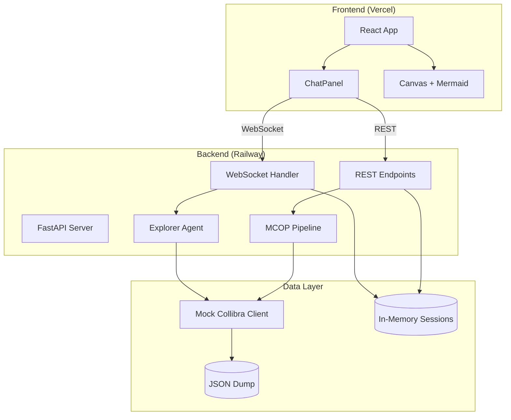

# MCOP Architecture Documentation

Táto dokumentácia popisuje architektonické rozhodnutia a implementačné vzory pre MCOP (Metadata Copilot).

## Obsah

1. [Pydantic AI Tools Pattern](pydantic-ai-tools.md) - Vzory pre Pydantic AI agentov
2. [FastAPI WebSocket](fastapi-websocket.md) - WebSocket implementácia pre real-time chat
3. [Mermaid Diagrams](mermaid-diagrams.md) - ER diagram generovanie
4. [Deployment Guide](deployment.md) - Railway + Vercel nasadenie

## Quick Reference

### Technology Stack
| Vrstva           | Technológia        | Verzia  |
| ---------------- | ------------------ | ------- |
| Backend          | FastAPI            | ≥0.109  |
| Agent Framework  | Pydantic AI        | ≥0.0.49 |
| Frontend         | React + TypeScript | 18+     |
| Diagramy         | Mermaid.js         | ≥10.6   |
| State Management | Zustand            | ≥4.5    |
| Styling          | Tailwind CSS       | ≥3.4    |

### Deployment
| Služba      | Platforma | URL Pattern                 |
| ----------- | --------- | --------------------------- |
| Backend API | Railway   | `https://<app>.railway.app` |
| Frontend    | Vercel    | `https://<app>.vercel.app`  |

### Environment Variables
```bash
# Backend (Railway)
OPENAI_API_BASE=https://your-endpoint.openai.azure.com/
OPENAI_API_KEY=your-key
OPENAI_API_VERSION=2024-10-21
CORS_ORIGINS=https://your-frontend.vercel.app

# Frontend (Vercel)
VITE_API_URL=https://your-backend.railway.app
VITE_WS_URL=wss://your-backend.railway.app
```

## Architecture Diagram



## Data Flow

### Pipeline Flow
```
User Document → Tool 0 (Parse) → Tool 1 (Ingest) → Tool 2 (Structure) → Tool 3 (Quality) → Tool 5 (Diagram)
```

### Chat Flow
```
User Message → WebSocket → Explorer Agent → Tools → Mock Client → Response → WebSocket → UI
```

## Princípy

1. **Separation of Concerns** - Každý Tool má jednu zodpovednosť
2. **Dependency Injection** - Pydantic AI `RunContext[Deps]` pattern
3. **Async First** - Všetky I/O operácie sú async
4. **Type Safety** - Striktné TypeScript a Pydantic modely
5. **Progressive Enhancement** - MVP bez Redis, pripravené na škálovanie

## Ďalšie kroky (Post-MVP)

- [ ] Redis pre session persistence
- [ ] Live Collibra API integrácia
- [ ] Multi-tenant support
- [ ] Authentication (Azure AD)
- [ ] Monitoring (Application Insights)
