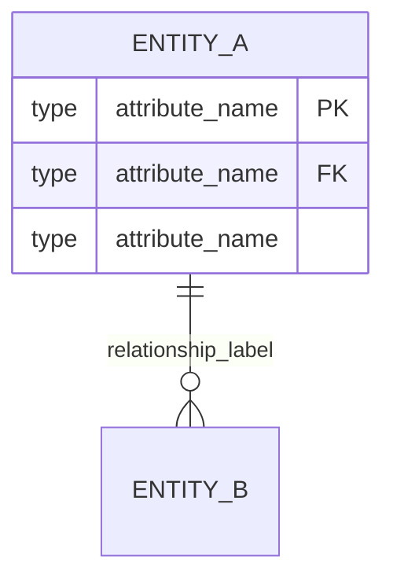
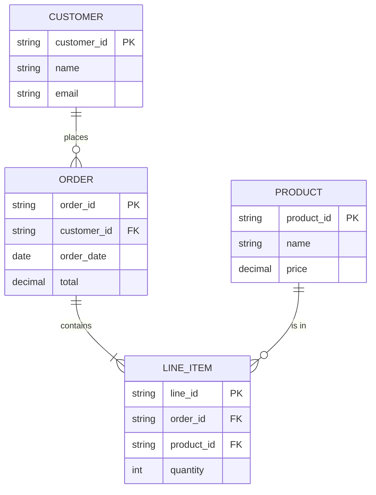
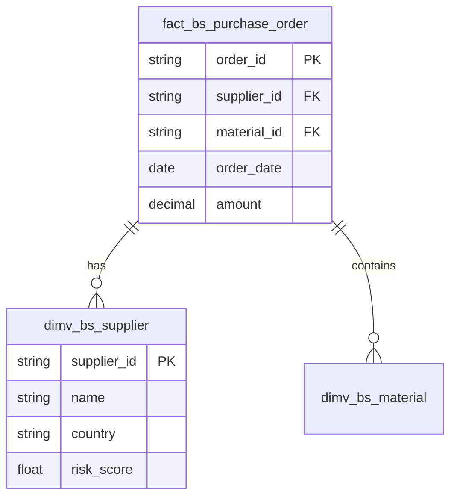

# Mermaid ER Diagram Generation

Tento dokument popisuje generovanie Entity-Relationship diagramov pomocou Mermaid.js.

## Mermaid ER Diagram Syntax

### Základná štruktúra



### Relationship Cardinality

| Syntax | Význam              |
| ------ | ------------------- |
| `\|\|` | Exactly one (1)     |
| `o\|`  | Zero or one (0..1)  |
| `}o`   | Zero or more (0..*) |
| `}\|`  | One or more (1..*)  |
| `\|o`  | Zero or one (0..1)  |
| `o{`   | Zero or more (0..*) |
| `\|{`  | One or more (1..*)  |

### Príklad vzťahov



## MCOP Diagram Generator

### Implementation

```python
# src/tool5/diagram_generator.py
from typing import Optional
import json
from pathlib import Path

def generate_mermaid_diagram(
    structure: dict,
    max_columns: int = 5,
    include_relationships: bool = True
) -> str:
    """
    Generate Mermaid ER diagram from Tool 2 structure output.

    Args:
        structure: Output from Tool 2 (classify_structure)
        max_columns: Maximum columns to display per table
        include_relationships: Whether to include relationship lines

    Returns:
        Mermaid erDiagram code as string
    """
    lines = ["erDiagram"]

    # 1. Generate relationships first (Mermaid prefers this order)
    if include_relationships:
        for fact in structure.get("facts", []):
            for fk in fact.get("foreign_keys", []):
                target = fk.get("target_table", "UNKNOWN")
                cardinality = _get_cardinality(fk)
                label = fk.get("relation_type", "references")
                lines.append(f"    {fact['name']} {cardinality} {target} : \"{label}\"")

    # 2. Generate FACT table definitions
    for fact in structure.get("facts", []):
        lines.append(f"\n    {fact['name']} {{")
        for col in fact.get("columns", [])[:max_columns]:
            col_line = _format_column(col)
            lines.append(f"        {col_line}")
        if len(fact.get("columns", [])) > max_columns:
            lines.append(f"        string ... \"({len(fact['columns']) - max_columns} more)\"")
        lines.append("    }")

    # 3. Generate DIMENSION table definitions
    for dim in structure.get("dimensions", []):
        lines.append(f"\n    {dim['name']} {{")
        for col in dim.get("columns", [])[:max_columns]:
            col_line = _format_column(col)
            lines.append(f"        {col_line}")
        if len(dim.get("columns", [])) > max_columns:
            lines.append(f"        string ... \"({len(dim['columns']) - max_columns} more)\"")
        lines.append("    }")

    return "\n".join(lines)

def _get_cardinality(fk: dict) -> str:
    """Determine relationship cardinality from FK metadata."""
    cardinality_type = fk.get("cardinality", "one_to_many")

    mapping = {
        "one_to_one": "||--||",
        "one_to_many": "||--o{",
        "many_to_one": "}o--||",
        "many_to_many": "}o--o{",
        "zero_to_many": "|o--o{",
    }

    return mapping.get(cardinality_type, "||--o{")

def _format_column(column: dict) -> str:
    """Format a single column definition."""
    col_type = _map_type(column.get("type", "string"))
    col_name = column.get("name", "unknown")

    # Key markers
    markers = []
    if column.get("is_primary_key"):
        markers.append("PK")
    if column.get("is_foreign_key"):
        markers.append("FK")

    # Build line
    if markers:
        return f"{col_type} {col_name} {','.join(markers)}"
    return f"{col_type} {col_name}"

def _map_type(col_type: str) -> str:
    """Map database types to Mermaid-friendly types."""
    type_mapping = {
        "varchar": "string",
        "nvarchar": "string",
        "text": "string",
        "char": "string",
        "int": "int",
        "integer": "int",
        "bigint": "bigint",
        "smallint": "int",
        "tinyint": "int",
        "decimal": "decimal",
        "numeric": "decimal",
        "float": "float",
        "real": "float",
        "double": "float",
        "date": "date",
        "datetime": "datetime",
        "datetime2": "datetime",
        "timestamp": "datetime",
        "time": "time",
        "boolean": "bool",
        "bit": "bool",
        "binary": "binary",
        "varbinary": "binary",
        "uuid": "uuid",
        "guid": "uuid",
    }
    return type_mapping.get(col_type.lower(), "string")
```

### Usage

```python
# Generate diagram from structure
from src.tool5.diagram_generator import generate_mermaid_diagram

structure = {
    "facts": [{
        "name": "fact_bs_purchase_order",
        "columns": [
            {"name": "order_id", "type": "string", "is_primary_key": True},
            {"name": "supplier_id", "type": "string", "is_foreign_key": True},
            {"name": "material_id", "type": "string", "is_foreign_key": True},
            {"name": "order_date", "type": "date"},
            {"name": "amount", "type": "decimal"}
        ],
        "foreign_keys": [
            {"target_table": "dimv_bs_supplier", "relation_type": "has"},
            {"target_table": "dimv_bs_material", "relation_type": "contains"}
        ]
    }],
    "dimensions": [{
        "name": "dimv_bs_supplier",
        "columns": [
            {"name": "supplier_id", "type": "string", "is_primary_key": True},
            {"name": "name", "type": "string"},
            {"name": "country", "type": "string"},
            {"name": "risk_score", "type": "float"}
        ]
    }]
}

diagram = generate_mermaid_diagram(structure)
print(diagram)
```

### Output



## React Mermaid Rendering

### Component

```tsx
// src/components/MermaidDiagram.tsx
import { useEffect, useRef, useState } from 'react';
import mermaid from 'mermaid';

interface Props {
  diagram: string;
  className?: string;
}

// Initialize Mermaid once
mermaid.initialize({
  startOnLoad: false,
  theme: 'default',
  securityLevel: 'loose',
  er: {
    diagramPadding: 20,
    layoutDirection: 'TB',  // Top to bottom
    minEntityWidth: 100,
    minEntityHeight: 75,
    entityPadding: 15,
    useMaxWidth: true,
  },
  themeVariables: {
    primaryColor: '#4f46e5',
    primaryTextColor: '#1f2937',
    primaryBorderColor: '#6366f1',
    lineColor: '#9ca3af',
    secondaryColor: '#f3f4f6',
    tertiaryColor: '#e5e7eb',
  },
});

export function MermaidDiagram({ diagram, className = '' }: Props) {
  const containerRef = useRef<HTMLDivElement>(null);
  const [error, setError] = useState<string | null>(null);
  const [svg, setSvg] = useState<string>('');

  useEffect(() => {
    if (!diagram) return;

    const renderDiagram = async () => {
      try {
        setError(null);

        // Generate unique ID
        const id = `mermaid-${Date.now()}-${Math.random().toString(36).substr(2, 9)}`;

        // Render diagram
        const { svg } = await mermaid.render(id, diagram);
        setSvg(svg);

      } catch (err) {
        console.error('Mermaid render error:', err);
        setError(err instanceof Error ? err.message : 'Failed to render diagram');
      }
    };

    renderDiagram();
  }, [diagram]);

  if (error) {
    return (
      <div className={`p-4 bg-red-50 border border-red-200 rounded ${className}`}>
        <p className="text-red-700 font-medium">Failed to render diagram</p>
        <p className="text-red-600 text-sm mt-1">{error}</p>
        <details className="mt-2">
          <summary className="text-red-500 text-sm cursor-pointer">View source</summary>
          <pre className="mt-2 p-2 bg-red-100 rounded text-xs overflow-auto">
            {diagram}
          </pre>
        </details>
      </div>
    );
  }

  if (!svg) {
    return (
      <div className={`flex items-center justify-center p-8 ${className}`}>
        <div className="animate-spin w-8 h-8 border-4 border-blue-500 border-t-transparent rounded-full" />
      </div>
    );
  }

  return (
    <div
      ref={containerRef}
      className={`mermaid-container ${className}`}
      dangerouslySetInnerHTML={{ __html: svg }}
    />
  );
}
```

### Styling

```css
/* Mermaid diagram styles */
.mermaid-container {
  display: flex;
  justify-content: center;
  align-items: center;
  min-height: 200px;
}

.mermaid-container svg {
  max-width: 100%;
  height: auto;
}

/* Entity styling */
.mermaid-container .er.entityBox {
  fill: #f8fafc;
  stroke: #6366f1;
  stroke-width: 2px;
}

.mermaid-container .er.entityLabel {
  font-weight: 600;
  fill: #1e293b;
}

/* Relationship lines */
.mermaid-container .er.relationshipLine {
  stroke: #64748b;
  stroke-width: 1.5px;
}

.mermaid-container .er.relationshipLabel {
  fill: #475569;
  font-size: 12px;
}
```

## Export Options

### Export to PNG

```typescript
async function exportToPng(svgElement: SVGElement): Promise<Blob> {
  const canvas = document.createElement('canvas');
  const ctx = canvas.getContext('2d');

  const svgData = new XMLSerializer().serializeToString(svgElement);
  const img = new Image();

  return new Promise((resolve, reject) => {
    img.onload = () => {
      canvas.width = img.width * 2;  // 2x for retina
      canvas.height = img.height * 2;
      ctx?.scale(2, 2);
      ctx?.drawImage(img, 0, 0);

      canvas.toBlob((blob) => {
        if (blob) resolve(blob);
        else reject(new Error('Failed to create blob'));
      }, 'image/png');
    };

    img.onerror = reject;
    img.src = 'data:image/svg+xml;base64,' + btoa(unescape(encodeURIComponent(svgData)));
  });
}
```

### Copy Mermaid Source

```typescript
function copyMermaidSource(diagram: string) {
  navigator.clipboard.writeText(diagram).then(
    () => toast.success('Mermaid code copied!'),
    () => toast.error('Failed to copy')
  );
}
```

### Download as Markdown

```typescript
function downloadAsMarkdown(diagram: string, filename: string = 'er-diagram.md') {
  const markdown = `# ER Diagram\n\n\`\`\`mermaid\n${diagram}\n\`\`\`\n`;
  const blob = new Blob([markdown], { type: 'text/markdown' });
  const url = URL.createObjectURL(blob);

  const a = document.createElement('a');
  a.href = url;
  a.download = filename;
  a.click();

  URL.revokeObjectURL(url);
}
```

## Validation

### Mermaid Syntax Validation

```python
def validate_mermaid_syntax(diagram: str) -> tuple[bool, str]:
    """
    Validate Mermaid diagram syntax.

    Returns:
        Tuple of (is_valid, error_message)
    """
    # Check for required elements
    if not diagram.strip().startswith("erDiagram"):
        return False, "Diagram must start with 'erDiagram'"

    lines = diagram.strip().split("\n")

    for i, line in enumerate(lines[1:], start=2):
        line = line.strip()
        if not line:
            continue

        # Check relationship syntax
        if "||" in line or "}o" in line or "|{" in line:
            if ":" not in line:
                return False, f"Line {i}: Relationship missing label (use : \"label\")"

        # Check entity definition
        if line.endswith("{"):
            entity_name = line[:-1].strip()
            if not entity_name.replace("_", "").isalnum():
                return False, f"Line {i}: Invalid entity name '{entity_name}'"

    return True, ""
```

## MCOP Specific Patterns

### FACT/DIMENSION Coloring

```mermaid
%%{init: {'theme': 'base', 'themeVariables': { 'primaryColor': '#4f46e5', 'lineColor': '#6b7280' }}}%%
erDiagram
    fact_bs_purchase_order["🔵 fact_bs_purchase_order"] ||--o{ dimv_bs_supplier["🟢 dimv_bs_supplier"] : has
```

### Large Diagram Handling

```python
def generate_focused_diagram(
    structure: dict,
    focus_table: str,
    depth: int = 1
) -> str:
    """Generate diagram focused on specific table and its neighbors."""
    relevant_tables = {focus_table}

    # Find related tables up to depth
    for _ in range(depth):
        new_tables = set()
        for table in relevant_tables:
            # Find tables this table references
            for fact in structure.get("facts", []):
                if fact["name"] == table:
                    for fk in fact.get("foreign_keys", []):
                        new_tables.add(fk["target_table"])

            # Find tables that reference this table
            for fact in structure.get("facts", []):
                for fk in fact.get("foreign_keys", []):
                    if fk["target_table"] == table:
                        new_tables.add(fact["name"])

        relevant_tables.update(new_tables)

    # Filter structure to only relevant tables
    filtered = {
        "facts": [f for f in structure.get("facts", []) if f["name"] in relevant_tables],
        "dimensions": [d for d in structure.get("dimensions", []) if d["name"] in relevant_tables]
    }

    return generate_mermaid_diagram(filtered)
```

## Testing

```python
import pytest
from src.tool5.diagram_generator import generate_mermaid_diagram, validate_mermaid_syntax

def test_generates_valid_mermaid():
    """Test that generated diagram is valid Mermaid syntax."""
    structure = {
        "facts": [{
            "name": "test_fact",
            "columns": [{"name": "id", "type": "string", "is_primary_key": True}],
            "foreign_keys": []
        }],
        "dimensions": []
    }

    diagram = generate_mermaid_diagram(structure)
    is_valid, error = validate_mermaid_syntax(diagram)

    assert is_valid, f"Invalid diagram: {error}"
    assert "erDiagram" in diagram
    assert "test_fact" in diagram

def test_relationship_cardinality():
    """Test relationship markers are correct."""
    structure = {
        "facts": [{
            "name": "orders",
            "columns": [],
            "foreign_keys": [
                {"target_table": "customers", "cardinality": "many_to_one"}
            ]
        }],
        "dimensions": [{"name": "customers", "columns": []}]
    }

    diagram = generate_mermaid_diagram(structure)

    assert "}o--||" in diagram  # many_to_one marker
```

## Referencie

- [Mermaid ER Diagram Syntax](https://mermaid.js.org/syntax/entityRelationshipDiagram.html)
- [Mermaid Configuration](https://mermaid.js.org/config/setup/interfaces/MermaidConfig.html)
- [Mermaid Live Editor](https://mermaid.live/)
