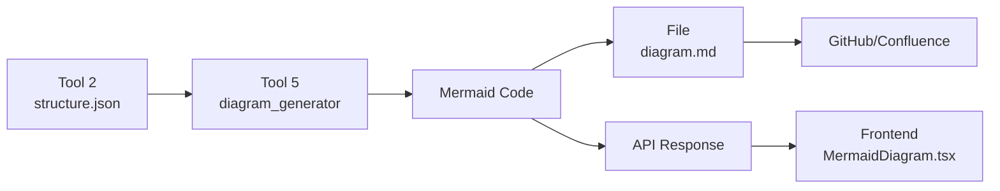

# Tool 5: ER Diagram Generator - Architecture

**Last Updated:** 2025-11-30
**Status:** Planned (Sprint 2)
**Owner:** MCOP Team

---

## Overview

Tool 5 generates Mermaid ER diagrams from Tool 2's structure.json output, visualizing FACT/DIMENSION tables and their relationships.

## Current State vs Target

| Aspect             | Current (Sprint 1)                   | Target (Sprint 2)             |
| ------------------ | ------------------------------------ | ----------------------------- |
| **Implementation** | Inline function in `src/api/main.py` | Dedicated module `src/tool5/` |
| **Testability**    | No tests                             | 8+ unit tests                 |
| **CLI**            | ❌ No                                 | ✅ `python -m src.tool5`       |
| **Quality**        | Basic (max 5 columns)                | Smart column selection        |
| **Documentation**  | Inline comments                      | README + docstrings           |
| **Reusability**    | Tied to API                          | Standalone module             |

## Architecture

### Module Structure

```
src/tool5/
├── __init__.py              # Export generate_mermaid_diagram()
├── diagram_generator.py     # Core logic
├── __main__.py             # CLI entry point
└── README.md               # Usage documentation

tests/
└── test_tool5.py           # Unit tests (8+ scenarios)

data/tool5/
└── diagram.md              # Output (gitignored)
```

### Data Flow



### Function Signature

```python
def generate_mermaid_diagram(
    structure: dict,
    max_columns: int = 5
) -> str:
    """
    Generate Mermaid ER diagram from Tool 2 structure.

    Args:
        structure: {
            "facts": [
                {
                    "name": "fact_orders",
                    "columns": [{"name": "id", "type": "int", "is_primary_key": True}],
                    "foreign_keys": [{"target_table": "dim_customer", "relation_type": "references"}]
                }
            ],
            "dimensions": [
                {
                    "name": "dim_customer",
                    "columns": [{"name": "customer_id", "type": "string", "is_primary_key": True}]
                }
            ]
        }
        max_columns: Maximum columns to display per table

    Returns:
        Mermaid erDiagram code as string
    """
```

## Implementation Details

### 1. Type Mapping

Database types → Mermaid-friendly types:

```python
TYPE_MAPPING = {
    "varchar": "string",
    "nvarchar": "string",
    "text": "string",
    "int": "int",
    "bigint": "bigint",
    "decimal": "decimal",
    "float": "float",
    "date": "date",
    "datetime": "datetime",
    "timestamp": "datetime",
    "boolean": "bool",
}
```

### 2. Key Markers

```python
def _get_key_marker(column: dict) -> str:
    if column.get("is_primary_key"):
        return " PK"
    elif column.get("is_foreign_key"):
        return " FK"
    return ""
```

### 3. Relationship Notation

Mermaid ER syntax:
- `||--o{` - One-to-many
- `||--||` - One-to-one
- `}o--o{` - Many-to-many

**Current implementation:** Uses `||--o{` for all FK relationships

### 4. Generation Strategy

```
1. Collect all relationships (FACT → DIMENSION)
2. Define FACT tables with columns
3. Define DIMENSION tables with columns
4. Wrap in erDiagram block
```

## Integration Points

### Backend API (src/api/main.py)

**Before:**
```python
def _generate_diagram(structure: dict) -> str:
    lines = ["erDiagram"]
    # ... inline implementation ...
    return "\n".join(lines)
```

**After:**
```python
from src.tool5 import generate_mermaid_diagram

@app.get("/api/diagram/{session_id}")
async def get_diagram(session_id: str):
    structure = sessions[session_id]["result"]["structure"]
    diagram = generate_mermaid_diagram(structure)
    return {"diagram": diagram, "format": "mermaid"}
```

### Frontend (frontend/src/components/MermaidDiagram.tsx)

No changes needed - already accepts Mermaid string:

```tsx
export function MermaidDiagram({ diagram }: { diagram: string }) {
    const { svg } = await mermaid.render(id, diagram);
    containerRef.current.innerHTML = svg;
}
```

### CLI Usage

```bash
# Basic usage
python -m src.tool5 --input data/tool2/structure.json

# Custom output
python -m src.tool5 \
    --input data/tool2/structure.json \
    --output /tmp/my_diagram.md \
    --max-columns 8
```

## Testing Strategy

### Unit Tests (tests/test_tool5.py)

1. **Basic diagram generation** - Verify erDiagram structure
2. **Type mapping** - Database types → Mermaid types
3. **Key markers** - PK/FK annotations
4. **Empty structure** - Graceful handling
5. **Max columns limit** - Truncation works
6. **Relationships** - FK connections rendered
7. **Complex structure** - Multiple facts/dimensions
8. **Invalid input** - Error handling

### Integration Tests

```bash
# End-to-end: Tool 2 → Tool 5
python -m src.tool2 --input data/tool1/filtered_bs.json
python -m src.tool5 --input data/tool2/structure.json

# Verify output
test -f data/tool5/diagram.md
grep -q "erDiagram" data/tool5/diagram.md
```

### Manual Testing

```bash
# Generate and render
python -m src.tool5 --input data/tool2/structure.json
cat data/tool5/diagram.md | pbcopy

# Paste to https://mermaid.live/
# Expected: Valid ER diagram with tables and relationships
```

## Performance Considerations

- **Input size:** Typical structure.json is 50-200 KB
- **Processing time:** < 100ms for 50 tables
- **Output size:** ~5-20 KB Mermaid code
- **Memory:** O(n) where n = number of tables

**Optimization:** Limit columns per table (default: 5) to prevent diagram clutter

## Security

- **No user input** - Structure comes from Tool 2 (trusted)
- **No SQL injection** - Pure JSON → string conversion
- **File I/O** - Writes to `data/tool5/` (safe directory)

## Future Enhancements (Post-MVP)

1. **Quality-based color coding**
   - Red: Tables with quality issues (Tool 3)
   - Yellow: Warnings
   - Green: Good quality

2. **Smart column selection**
   - Prioritize business keys
   - Show most frequently used columns
   - Include columns with quality issues

3. **Export formats**
   - PNG/SVG export via Mermaid CLI
   - PlantUML alternative
   - D2 diagram format

4. **Interactive features**
   - Collapsible table sections
   - Filterable by schema/domain
   - Zoom/pan controls

5. **Layout options**
   - Top-bottom (TB) vs Left-right (LR)
   - Hierarchical grouping
   - Custom themes

## Dependencies

### Direct
- `pathlib` (stdlib)
- `json` (stdlib)

### Indirect (via frontend)
- `mermaid.js` (v10.6+) - Frontend rendering

### Test Dependencies
- `pytest`
- `pytest-cov` (optional)

## Rollout Plan

### Phase 1: Module Creation (2 hours)
1. Create `src/tool5/` structure
2. Migrate logic from `main.py`
3. Add `__init__.py` exports

### Phase 2: Testing (1.5 hours)
1. Write unit tests
2. Integration test with Tool 2
3. Manual rendering verification

### Phase 3: CLI (1 hour)
1. Implement `__main__.py`
2. Argument parsing
3. Error handling

### Phase 4: Integration (1 hour)
1. Update `src/api/main.py`
2. Remove inline function
3. Backend tests

### Phase 5: Documentation (30 min)
1. `src/tool5/README.md`
2. Update architecture docs
3. Sprint 2 story completion

**Total: 5-6 hours**

## References

- **Mermaid ER Diagram Docs:** https://mermaid.js.org/syntax/entityRelationshipDiagram.html
- **Tool 2 Output Schema:** `src/tool2/README.md`
- **Story:** `scrum/sprint_2/MCOP-S2-001-tool5-er-diagram.md`
- **Original Implementation:** `src/api/main.py#L240-L270`

---

**Approval Status:**
- [ ] Architecture reviewed
- [ ] Story approved
- [ ] Ready for implementation
