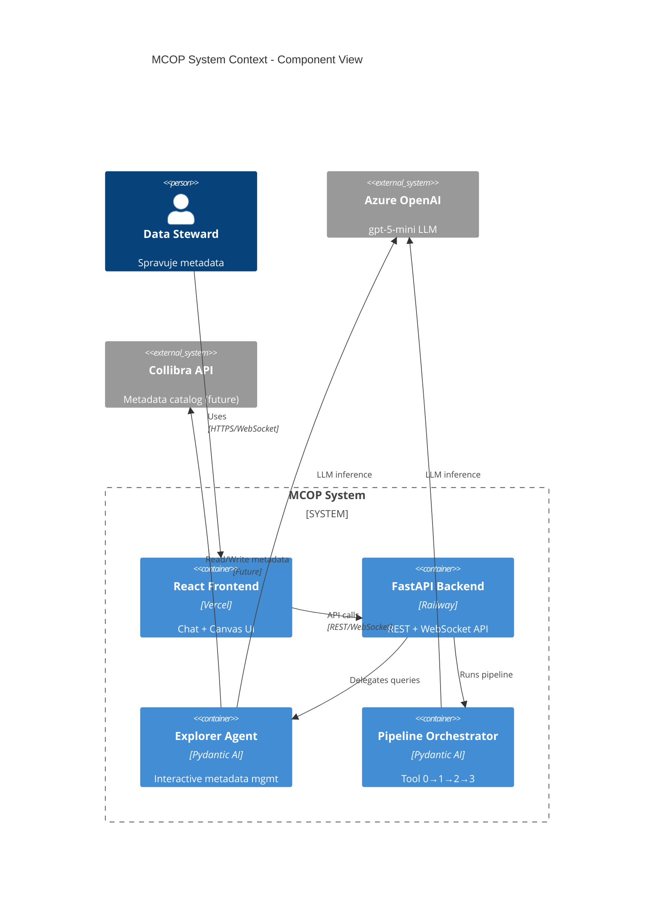
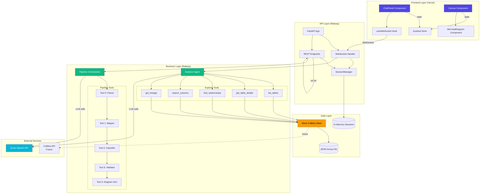
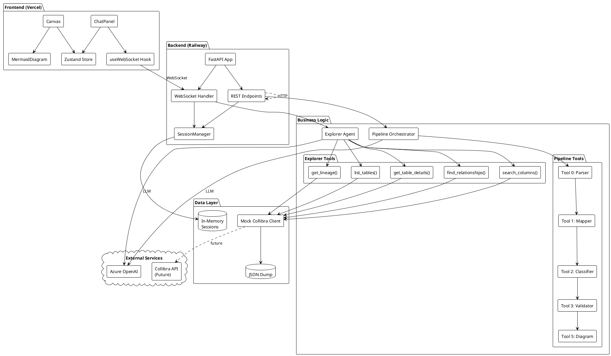

# Component Diagram - MCOP Architecture

Zobrazuje hlavné komponenty systému a ich vzťahy.

## High-Level Component View (Mermaid C4)



## Detailed Component Diagram (Mermaid)



## Component Responsibilities

### Frontend Components

| Component          | Responsibility                                 | Tech Stack      |
| ------------------ | ---------------------------------------------- | --------------- |
| **ChatPanel**      | User input, message history, streaming display | React + Zustand |
| **Canvas**         | Mermaid diagram container, view switching      | React           |
| **MermaidDiagram** | Renders ER diagrams from Mermaid code          | mermaid.js      |
| **useWebSocket**   | WebSocket connection management, reconnection  | WebSocket API   |
| **Zustand Store**  | Global state (messages, diagram, session)      | Zustand         |

### Backend Components

| Component             | Responsibility                        | Tech Stack          |
| --------------------- | ------------------------------------- | ------------------- |
| **FastAPI App**       | HTTP server, routing, middleware      | FastAPI             |
| **WebSocket Handler** | Real-time bidirectional communication | Starlette WebSocket |
| **REST Endpoints**    | Pipeline execution, status checks     | FastAPI routes      |
| **SessionManager**    | Session CRUD, in-memory storage       | Python dict (MVP)   |

### Business Logic Components

| Component                 | Responsibility                    | Dependencies                |
| ------------------------- | --------------------------------- | --------------------------- |
| **Explorer Agent**        | NL query → tool calls → response  | Pydantic AI, Azure OpenAI   |
| **Pipeline Orchestrator** | Sequential Tool 0→1→2→3 execution | Pydantic AI, existing tools |
| **Explorer Tools**        | Collibra API wrapper functions    | Mock Collibra Client        |
| **Pipeline Tools**        | Refactored tools from notebooks   | Existing implementations    |

### Data Layer Components

| Component                | Responsibility                    | Storage                |
| ------------------------ | --------------------------------- | ---------------------- |
| **Mock Collibra Client** | Simulates Collibra REST API       | JSON file              |
| **In-Memory Sessions**   | Temporary session state (MVP)     | Python dict            |
| **JSON Dump**            | Static Collibra metadata snapshot | `data/analysis/*.json` |

## Component Interface Contracts

### Explorer Agent → Mock Collibra

```python
class CollibraAPIMock:
    def list_tables() -> list[dict]
    def get_table(name: str) -> dict
    def get_relationships(table: str) -> list[dict]
    def search_columns(pattern: str) -> list[dict]
    def get_lineage(table: str) -> dict
```

### Frontend ↔ Backend (WebSocket)

```typescript
// Client → Server
{
  "content": string  // User message
}

// Server → Client
{
  "type": "user" | "agent_partial" | "agent" | "tool" | "error",
  "content": string,
  "tool_name"?: string,
  "diagram"?: string  // Mermaid code
}
```

### Frontend ↔ Backend (REST)

```python
# POST /api/pipeline/run
Request: { "document": str }
Response: { "session_id": str, "status": str }

# GET /api/pipeline/{session_id}/status
Response: { "status": str, "has_result": bool, "has_diagram": bool }

# GET /api/diagram/{session_id}
Response: { "diagram": str, "format": "mermaid" }
```

## PlantUML Alternative (Detailed)



## Deployment View

```mermaid
graph LR
    subgraph "Vercel Edge Network"
        FE[Frontend Static Assets]
    end

    subgraph "Railway Cloud"
        BE[Backend Container]
        BE_Data[/data/ Volume]
    end

    subgraph "Azure Cloud"
        OpenAI[OpenAI Service]
    end

    User([User Browser])

    User -->|HTTPS| FE
    User -->|WebSocket| BE
    FE -->|API calls| BE
    BE --> BE_Data
    BE -->|REST| OpenAI

    style FE fill:#0070f3,color:#fff
    style BE fill:#0b0d0f,color:#fff
    style OpenAI fill:#0078d4,color:#fff
```

## Notes

- **MVP Scope:** Mock Collibra client, in-memory sessions
- **Production:** Replace with real Collibra API, Redis sessions
- **Scaling:** Railway horizontal scaling requires Redis
- **Security:** WebSocket origin validation, API key rotation
