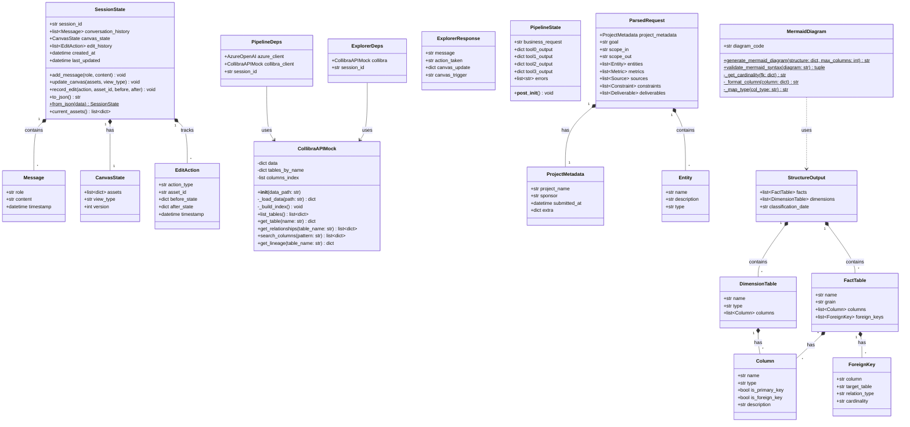

# Class Diagram - MCOP Data Models

Zobrazuje dátové modely, triedy a ich vzťahy.

## Core Data Models (Mermaid)



## PlantUML Alternative (Detailed)

```plantuml
@startuml MCOP_Class_Diagram
!theme plain
skinparam classAttributeIconSize 0

package "Session Management" {
    class SessionState {
        +session_id: str
        +conversation_history: list<Message>
        +canvas_state: CanvasState
        +edit_history: list<EditAction>
        +created_at: datetime
        +last_updated: datetime
        --
        +add_message(role, content): void
        +update_canvas(assets, view_type): void
        +record_edit(action, asset_id, before, after): void
        +to_json(): str
        +{static} from_json(data): SessionState
        +{property} current_assets(): list<dict>
    }

    class Message {
        +role: str
        +content: str
        +timestamp: datetime
    }

    class CanvasState {
        +assets: list<dict>
        +view_type: str
        +version: int
    }

    class EditAction {
        +action_type: str
        +asset_id: str
        +before_state: dict | None
        +after_state: dict
        +timestamp: datetime
    }

    SessionState *-- "*" Message
    SessionState *-- "1" CanvasState
    SessionState *-- "*" EditAction
}

package "Agent Framework" {
    class ExplorerDeps {
        +collibra: CollibraAPIMock
        +session_id: str
    }

    class PipelineDeps {
        +azure_client: AzureOpenAI
        +collibra_client: CollibraAPIMock
        +session_id: str
    }

    class ExplorerResponse <<BaseModel>> {
        +message: str
        +action_taken: str | None
        +canvas_update: dict | None
        +canvas_trigger: str | None
    }

    class PipelineState {
        +business_request: str
        +tool0_output: dict | None
        +tool1_output: dict | None
        +tool2_output: dict | None
        +tool3_output: dict | None
        +errors: list<str>
        --
        +__post_init__(): void
    }
}

package "Data Access" {
    class CollibraAPIMock {
        -data: dict
        -tables_by_name: dict
        -columns_index: list
        --
        +__init__(data_path: str)
        -_load_data(path: str): dict
        -_build_index(): void
        +list_tables(): list<dict>
        +get_table(name: str): dict
        +get_relationships(table_name: str): list<dict>
        +search_columns(pattern: str): list<dict>
        +get_lineage(table_name: str): dict
    }

    ExplorerDeps --> CollibraAPIMock
    PipelineDeps --> CollibraAPIMock
}

package "Tool 0: Parser" {
    class ParsedRequest <<BaseModel>> {
        +project_metadata: ProjectMetadata
        +goal: str
        +scope_in: str
        +scope_out: str
        +entities: list<Entity>
        +metrics: list<Metric>
        +sources: list<Source>
        +constraints: list<Constraint>
        +deliverables: list<Deliverable>
    }

    class ProjectMetadata <<BaseModel>> {
        +project_name: str
        +sponsor: str
        +submitted_at: datetime
        +extra: dict
    }

    class Entity <<BaseModel>> {
        +name: str
        +description: str
        +type: str
    }

    class Metric <<BaseModel>> {
        +name: str
        +formula: str
        +description: str
    }

    ParsedRequest *-- "1" ProjectMetadata
    ParsedRequest *-- "*" Entity
    ParsedRequest *-- "*" Metric
}

package "Tool 2: Structure Classifier" {
    class StructureOutput <<BaseModel>> {
        +facts: list<FactTable>
        +dimensions: list<DimensionTable>
        +classification_date: str
    }

    class FactTable <<BaseModel>> {
        +name: str
        +grain: str
        +columns: list<Column>
        +foreign_keys: list<ForeignKey>
    }

    class DimensionTable <<BaseModel>> {
        +name: str
        +type: str
        +columns: list<Column>
    }

    class Column <<BaseModel>> {
        +name: str
        +type: str
        +is_primary_key: bool
        +is_foreign_key: bool
        +description: str
    }

    class ForeignKey <<BaseModel>> {
        +column: str
        +target_table: str
        +relation_type: str
        +cardinality: str
    }

    StructureOutput *-- "*" FactTable
    StructureOutput *-- "*" DimensionTable
    FactTable *-- "*" Column
    DimensionTable *-- "*" Column
    FactTable *-- "*" ForeignKey
}

package "Tool 5: Diagram Generator" {
    class MermaidDiagram {
        +diagram_code: str
        --
        +{static} generate_mermaid_diagram(structure: dict, max_columns: int): str
        +{static} validate_mermaid_syntax(diagram: str): tuple
        -{static} _get_cardinality(fk: dict): str
        -{static} _format_column(column: dict): str
        -{static} _map_type(col_type: str): str
    }

    MermaidDiagram ..> StructureOutput : uses
}

package "Frontend Models" {
    class Message_FE <<interface>> {
        +id: string
        +type: "user" | "agent" | "agent_partial" | "tool" | "error"
        +content: string
        +timestamp: Date
        +toolName?: string
    }

    class SessionState_FE <<interface>> {
        +sessionId: string | null
        +isConnected: boolean
        +messages: Message[]
        +diagram: string | null
        +isLoading: boolean
        +error: string | null
    }

    SessionState_FE o-- "*" Message_FE
}

@enduml
```



## Entity Relationships Summary

### Session Domain

```
SessionState (1) ──────── (*) Message
     │
     ├─────── (1) CanvasState
     │
     └─────── (*) EditAction
```

### Pipeline Domain

```
ParsedRequest (1) ──────── (1) ProjectMetadata
     │
     ├─────── (*) Entity
     ├─────── (*) Metric
     ├─────── (*) Source
     └─────── (*) Constraint

StructureOutput (1) ──────── (*) FactTable
     │                           │
     │                           ├── (*) Column
     │                           └── (*) ForeignKey
     │
     └─────── (*) DimensionTable
                   │
                   └── (*) Column
```

### Agent Dependencies

```
ExplorerAgent ──uses──> ExplorerDeps ──contains──> CollibraAPIMock
                                                    SessionState (ref)

PipelineAgent ──uses──> PipelineDeps ──contains──> CollibraAPIMock
                                                    AzureOpenAI
```

## Type Hierarchy

### Pydantic Models (Python)

```
BaseModel (Pydantic)
    ├── ParsedRequest
    │   ├── ProjectMetadata
    │   ├── Entity
    │   ├── Metric
    │   └── ...
    ├── StructureOutput
    │   ├── FactTable
    │   ├── DimensionTable
    │   ├── Column
    │   └── ForeignKey
    ├── ExplorerResponse
    └── (other tool outputs)

dataclass (Python)
    ├── SessionState
    │   ├── Message
    │   ├── CanvasState
    │   └── EditAction
    ├── ExplorerDeps
    └── PipelineDeps
```

### TypeScript Interfaces (Frontend)

```
interface Message {
    id: string;
    type: MessageType;
    content: string;
    timestamp: Date;
    toolName?: string;
}

interface SessionState {
    sessionId: string | null;
    isConnected: boolean;
    messages: Message[];
    diagram: string | null;
    isLoading: boolean;
    error: string | null;
}
```

## Key Design Patterns

### 1. Dependency Injection (Pydantic AI)

```python
@dataclass
class ExplorerDeps:
    """Dependencies injected into agent tools via RunContext."""
    collibra: CollibraAPIMock
    session_id: str

@explorer_agent.tool
async def list_tables(ctx: RunContext[ExplorerDeps]) -> list[dict]:
    return ctx.deps.collibra.list_tables()  # Access via ctx.deps
```

### 2. State Pattern (Canvas)

```python
class CanvasState:
    view_type: str  # "table" | "diagram" | "map"
    version: int    # Optimistic locking
```

### 3. Command Pattern (Edit Actions)

```python
@dataclass
class EditAction:
    action_type: str       # "update_description" | "add_dq_rule"
    before_state: dict     # For undo
    after_state: dict      # Current state
```

### 4. Builder Pattern (Mermaid)

```python
MermaidDiagram.generate_mermaid_diagram(
    structure=structure_output,
    max_columns=5,
    include_relationships=True
)
```

## Validation Rules

### Session State

- `session_id` must be valid UUID v4
- `conversation_history` max 100 messages (sliding window)
- `canvas_state.version` incremented atomically
- `last_updated` auto-set on any mutation

### Parsed Request

- `project_metadata.submitted_at` must be ISO 8601
- `entities` min 1 item
- `goal` min 10 characters
- `scope_in` and `scope_out` required

### Structure Output

- `facts` + `dimensions` min 1 combined
- Column names must match `[a-z_]+` pattern
- FK `target_table` must exist in dimensions
- `grain` must be one of: transaction | snapshot | aggregate

## Serialization

### JSON Schema (Tool 0 Output)

```json
{
  "project_metadata": {
    "project_name": "Supplier Risk Analysis",
    "sponsor": "John Doe",
    "submitted_at": "2025-11-30T10:00:00Z"
  },
  "entities": [
    {
      "name": "Supplier",
      "description": "External vendor entity",
      "type": "dimension"
    }
  ]
}
```

### Session Serialization

```python
# To Redis
state.to_json() -> str  # JSON string

# From Redis
SessionState.from_json(data) -> SessionState
```

## Notes

- All Pydantic models use `BaseModel` for validation
- Session models use `@dataclass` for simplicity
- Frontend uses TypeScript interfaces (no runtime validation)
- Dates stored as ISO 8601 strings in JSON
