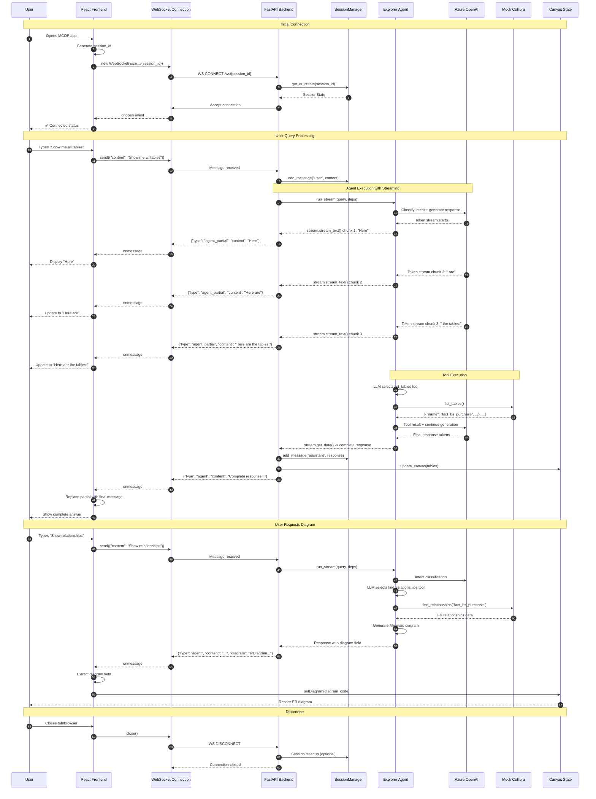
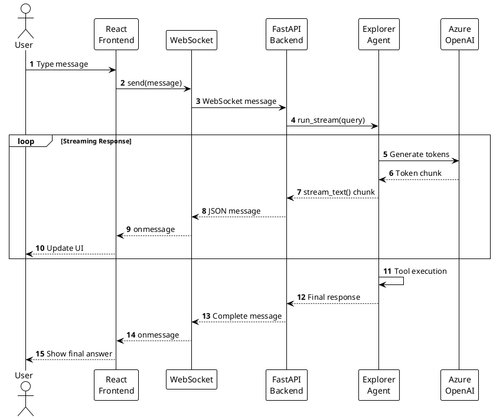
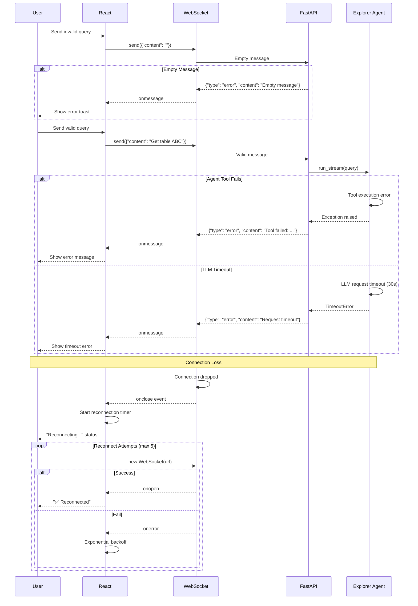
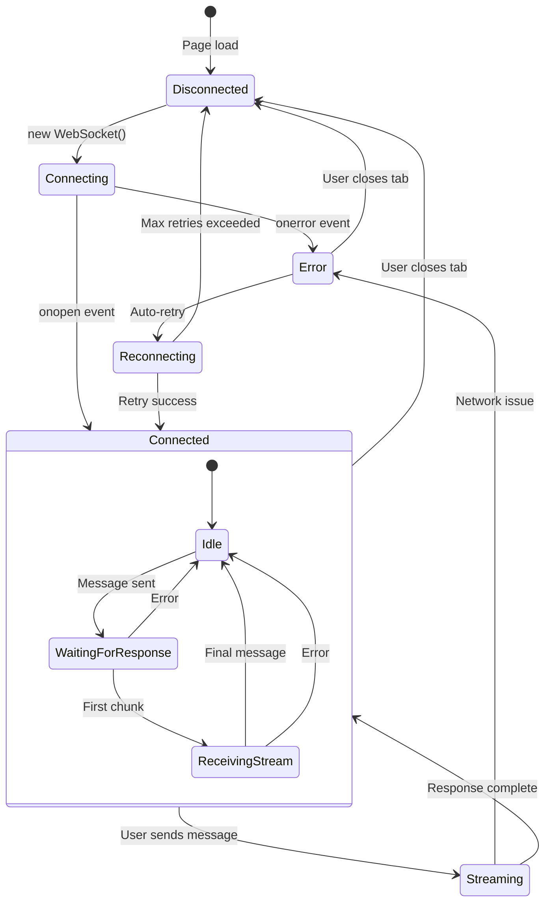
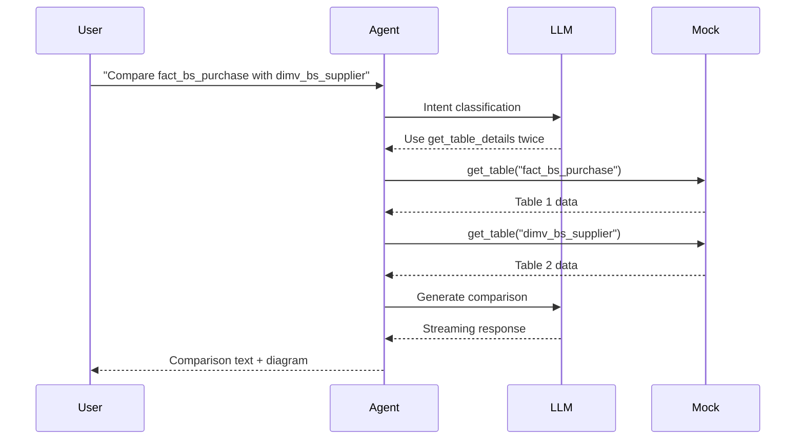
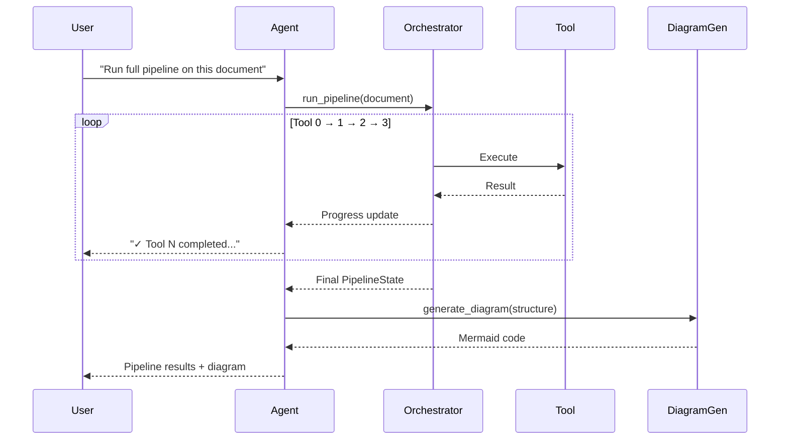

# Sequence Diagram - WebSocket Chat Flow

Zobrazuje časovú postupnosť interakcií pri WebSocket komunikácii.

## Complete WebSocket Flow (Mermaid)



## Simplified Flow (PlantUML)



## Error Handling Flow



## WebSocket Lifecycle States



## Message Protocol Detail

### Client → Server

```json
{
  "content": "Show me all tables"
}
```

### Server → Client (Streaming)

**1. User Echo**
```json
{
  "type": "user",
  "content": "Show me all tables"
}
```

**2. Partial Responses (multiple)**
```json
{
  "type": "agent_partial",
  "content": "Here are the available tables:\n\n1. "
}
```

**3. Tool Execution (optional)**
```json
{
  "type": "tool",
  "content": "[{\"name\": \"fact_bs_purchase\", \"type\": \"FACT\"}]",
  "tool_name": "list_tables"
}
```

**4. Final Response**
```json
{
  "type": "agent",
  "content": "Here are the available tables:\n\n1. fact_bs_purchase_order (FACT)\n2. dimv_bs_supplier (DIMENSION)\n...",
  "diagram": "erDiagram\n  fact_bs_purchase ||--o{ dimv_bs_supplier : has\n..."
}
```

**5. Error Response**
```json
{
  "type": "error",
  "content": "Agent error: Connection timeout"
}
```

## Timing Diagram

```mermaid
gantt
    title WebSocket Message Timing (Typical Query)
    dateFormat  X
    axisFormat %L ms

    section Connection
    WebSocket handshake     :0, 100ms
    Session init            :100ms, 50ms

    section Query Processing
    User types message      :150ms, 500ms
    Send to server          :650ms, 10ms

    section Agent Execution
    LLM intent classification :660ms, 800ms
    Tool execution (list_tables) :1460ms, 200ms
    Generate response       :1660ms, 1200ms

    section Streaming Response
    First chunk arrives     :1660ms, 100ms
    Streaming chunks (x10)  :1760ms, 1100ms
    Final message           :2860ms, 100ms

    section User Experience
    User sees first text    :1760ms, 0ms
    User sees typing effect :1760ms, 1100ms
    Complete answer visible :2960ms, 0ms
```

**Total time:** ~3 seconds from query to complete answer

## Performance Metrics

### Latency Breakdown

| Stage             | Target  | Notes                      |
| ----------------- | ------- | -------------------------- |
| WebSocket connect | < 100ms | Includes TLS handshake     |
| Message send      | < 10ms  | Network RTT                |
| LLM first token   | < 1s    | Azure OpenAI latency       |
| Tool execution    | < 200ms | Mock client fast           |
| Streaming chunk   | < 100ms | Per token batch            |
| Full response     | < 5s    | Depends on response length |

### Throughput

- Concurrent users: 10-50 (MVP)
- Messages/sec: ~10 per instance
- WebSocket connections: ~100 per instance
- Max message size: 1 MB

## Sequence Variations

### Query with Multiple Tools



### Pipeline Execution via WebSocket



## Notes

- WebSocket keeps connection open for entire session
- Streaming provides real-time feedback (ChatGPT-like UX)
- Agent can send diagram in any response via `diagram` field
- Frontend automatically renders Mermaid when present
- Reconnection logic handles network interruptions
- Each message includes type for proper UI handling
