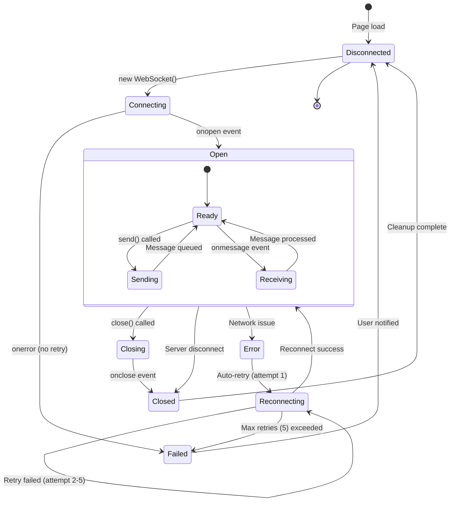

# State Diagrams - System State Machines

Zobrazuje lifecycle a prechody medzi stavmi v systéme.

## 1. Session Lifecycle (Primary State Machine)


### Session States Detail

| State             | Description                       | Timeout | Transitions                                |
| ----------------- | --------------------------------- | ------- | ------------------------------------------ |
| **NoSession**     | Initial state, no session exists  | -       | → Active (on connect)                      |
| **Active**        | User connected, can send messages | 5 min   | → Persisted (idle), → Disconnected (close) |
| **Processing**    | Agent processing user query       | 30s     | → ToolExecution, → Idle (done/error)       |
| **ToolExecution** | Tool being executed               | 10s     | → Streaming                                |
| **Streaming**     | LLM streaming response            | 60s     | → Idle                                     |
| **Persisted**     | Session saved, user disconnected  | 24h     | → Active (reconnect), → Expired            |
| **Disconnected**  | Connection lost, cleanup pending  | 1 min   | → NoSession                                |
| **Expired**       | Session too old, will be deleted  | -       | → NoSession                                |

## 2. Canvas State Machine


### Canvas States Detail

| State           | Content                      | Actions Available          |
| --------------- | ---------------------------- | -------------------------- |
| **Empty**       | No data                      | Wait for agent response    |
| **TableView**   | List of tables with metadata | Sort, filter, show diagram |
| **DiagramView** | Mermaid ER diagram rendered  | Zoom, pan, export SVG      |
| **MapView**     | Entity-attribute mappings    | Filter, search, show table |
| **Error**       | Diagram syntax error         | Show error message, retry  |

## 3. Agent Processing States


### Agent States Detail

| State                  | Duration | Can Cancel? | Next States                             |
| ---------------------- | -------- | ----------- | --------------------------------------- |
| **Idle**               | ∞        | -           | ClassifyingIntent                       |
| **ClassifyingIntent**  | 1-3s     | Yes         | SelectingTool, GeneratingResponse       |
| **SelectingTool**      | <100ms   | Yes         | ExecutingTool                           |
| **ExecutingTool**      | 0.1-2s   | No          | ToolSuccess, ToolFailure                |
| **GeneratingResponse** | 2-10s    | Yes         | StreamingTokens                         |
| **StreamingTokens**    | 5-30s    | Yes         | ResponseComplete                        |
| **ErrorRecovery**      | 1-5s     | No          | SelectingTool, GeneratingResponse, Idle |

## 4. WebSocket Connection States



### Connection States Detail

| State            | Buffering? | Can Send? | Reconnect?   |
| ---------------- | ---------- | --------- | ------------ |
| **Disconnected** | No         | No        | Yes (manual) |
| **Connecting**   | Yes        | No        | No (wait)    |
| **Open**         | No         | Yes       | -            |
| **Sending**      | No         | Yes       | -            |
| **Receiving**    | No         | Yes       | -            |
| **Error**        | Yes        | No        | Yes (auto)   |
| **Reconnecting** | Yes        | No        | Yes (auto)   |
| **Closing**      | Yes        | No        | No           |
| **Closed**       | No         | No        | Yes (manual) |
| **Failed**       | No         | No        | No           |

### Reconnection Policy

```typescript
const RECONNECT_CONFIG = {
  maxRetries: 5,
  initialDelay: 1000,      // 1s
  maxDelay: 30000,         // 30s
  backoffMultiplier: 2,    // Exponential
  jitter: 0.1              // ±10% random
}

// Retry delays: 1s, 2s, 4s, 8s, 16s (then fail)
```

## 5. Message Processing States


## 6. Pipeline Orchestration States


### Pipeline States Detail

| State            | Tool       | Input           | Output           | Error Handling |
| ---------------- | ---------- | --------------- | ---------------- | -------------- |
| **Initialized**  | -          | Document        | -                | -              |
| **RunningTool0** | Parser     | Document        | ParsedRequest    | Fail pipeline  |
| **RunningTool1** | Mapper     | ParsedRequest   | MappingResult    | Retry 3x       |
| **RunningTool2** | Structurer | MappingResult   | StructureOutput  | Fail pipeline  |
| **RunningTool3** | Validator  | StructureOutput | ValidationReport | Warn only      |
| **Completed**    | -          | -               | PipelineState    | -              |
| **ErrorState**   | -          | -               | Error details    | -              |

## 7. Composite State (Full System View)


## State Transition Matrix

### Session State Transitions

|                   | NoSession | Active         | Persisted | Expired     | Disconnected |
| ----------------- | --------- | -------------- | --------- | ----------- | ------------ |
| **User connects** | → Active  | -              | → Active  | -           | -            |
| **5 min idle**    | -         | → Persisted    | -         | -           | -            |
| **24h timeout**   | -         | -              | → Expired | -           | -            |
| **User closes**   | -         | → Disconnected | -         | -           | → NoSession  |
| **Cleanup**       | -         | -              | -         | → NoSession | → NoSession  |

### Agent State Transitions

|                    | Idle          | Classifying      | Tool Execution   | Streaming | Error Recovery   |
| ------------------ | ------------- | ---------------- | ---------------- | --------- | ---------------- |
| **Query received** | → Classifying | -                | -                | -         | -                |
| **Tool selected**  | -             | → Tool Execution | -                | -         | -                |
| **Tool success**   | -             | -                | → Streaming      | -         | -                |
| **Tool failure**   | -             | -                | → Error Recovery | -         | → Tool Execution |
| **Response done**  | -             | -                | -                | → Idle    | → Idle           |

## PlantUML Alternative


## Notes

- **Session lifecycle:** Focus on user experience and reconnection
- **Canvas states:** Allow flexible view switching (Table ↔ Diagram ↔ Map)
- **Agent states:** Include error recovery paths
- **WebSocket states:** Handle network issues gracefully
- **Pipeline states:** Linear with retry logic on Tool 1 only
- **Composite view:** Shows all subsystems running concurrently
