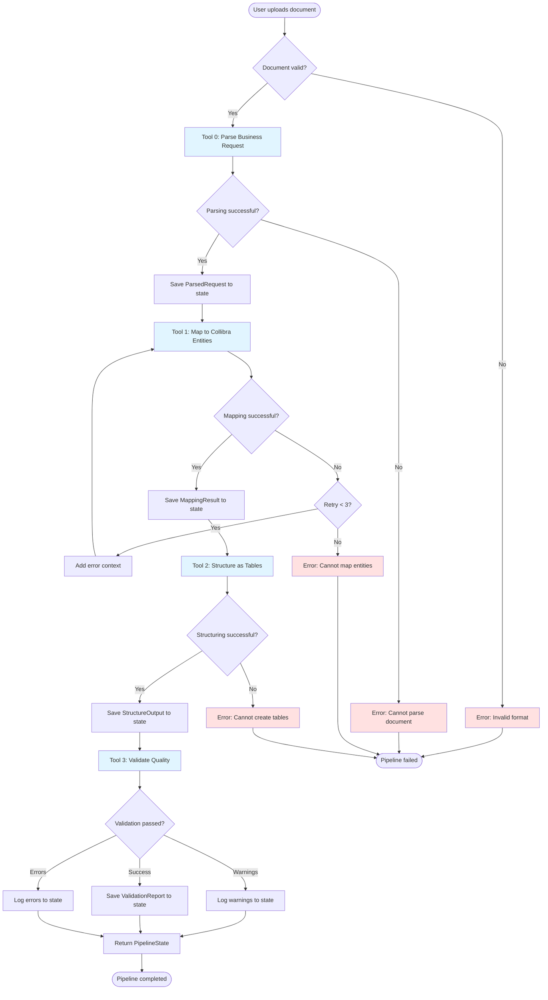
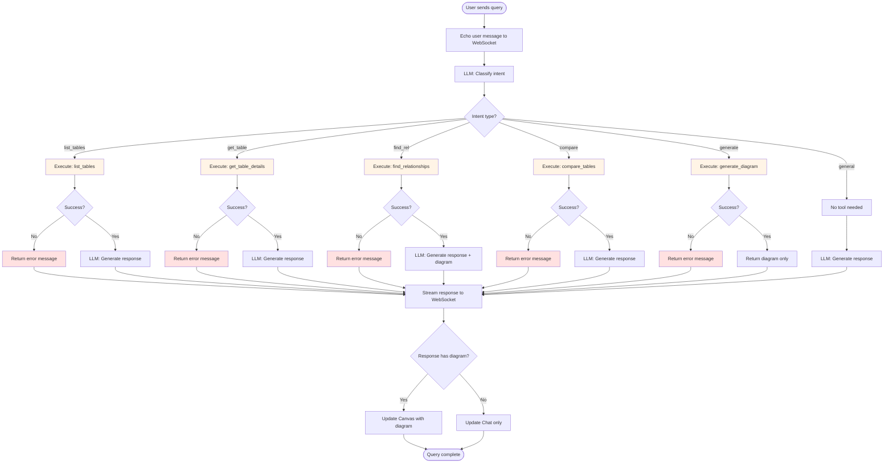
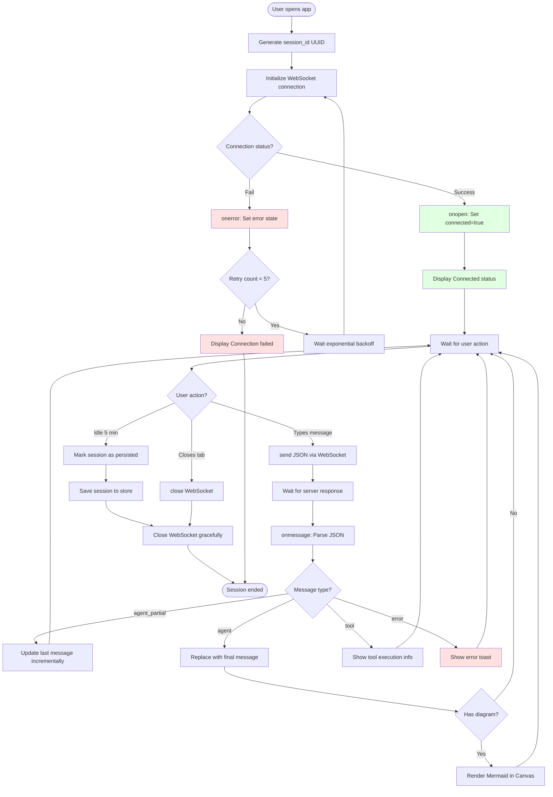
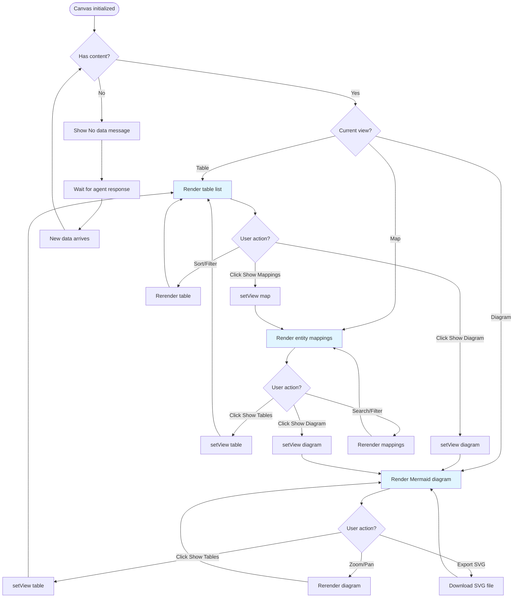
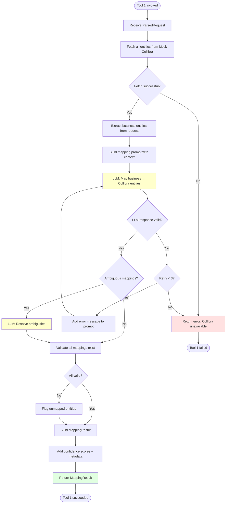
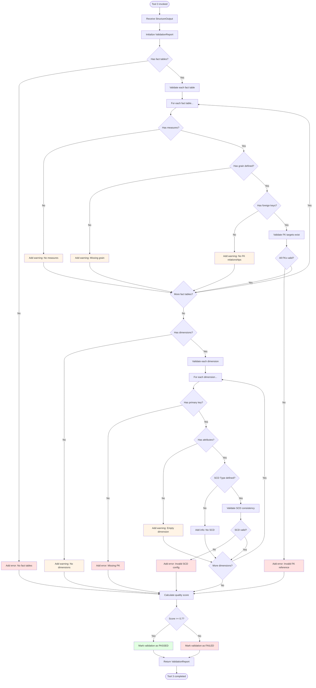
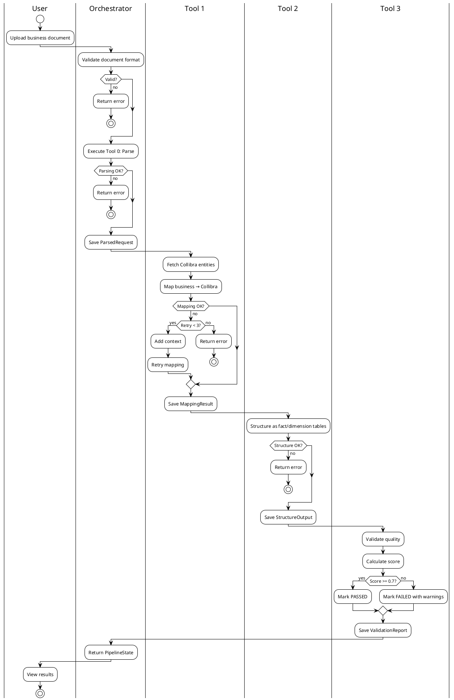
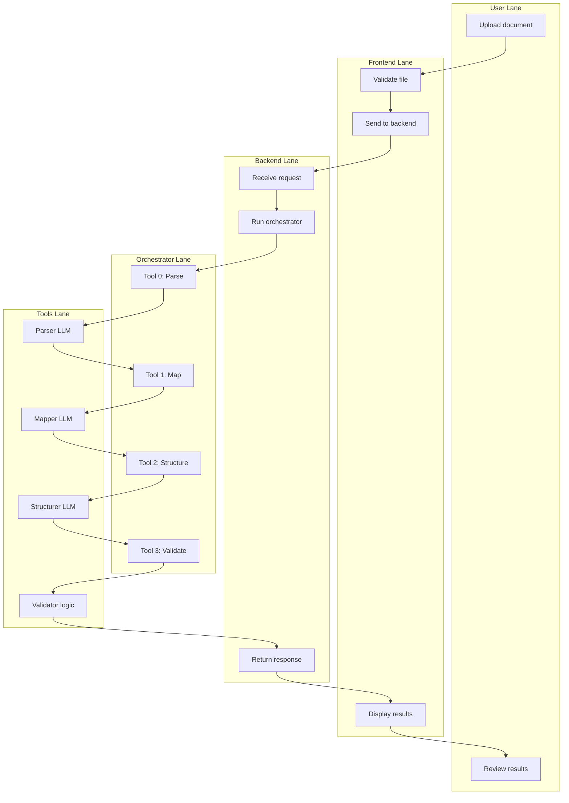

# Activity Diagrams - Business Process Flows

Zobrazuje workflow a rozhodovanie v procesoch.

## 1. MVP Pipeline Orchestration (Tool 0→1→2→3)

## 2. Explorer Agent Query Processing

## 3. WebSocket Connection Management

## 4. Canvas View Switching

## 5. Tool 1 Entity Mapping (Detailed)

## 6. Tool 3 Quality Validation (Detailed)

## 7. PlantUML Activity Diagram (Pipeline)

## 8. Swimlane Diagram (Multi-Actor)

## Activity Flow Summary

### Pipeline Execution Time

| Stage                   | Typical Duration | Max Duration    | Failure Impact         |
| ----------------------- | ---------------- | --------------- | ---------------------- |
| **Document validation** | <100ms           | 500ms           | Stop immediately       |
| **Tool 0: Parse**       | 2-5s             | 30s             | Stop immediately       |
| **Tool 1: Map**         | 3-8s             | 30s × 3 retries | Stop after 3 retries   |
| **Tool 2: Structure**   | 3-6s             | 30s             | Stop immediately       |
| **Tool 3: Validate**    | 1-2s             | 10s             | Continue with warnings |
| **Total pipeline**      | 10-20s           | ~2 min          | -                      |

### Decision Points

1. **Document validation:** Valid format? → Continue / Stop
2. **Tool 0 parsing:** Successful? → Continue / Stop
3. **Tool 1 mapping:** Successful? → Continue / Retry (max 3) / Stop
4. **Tool 2 structuring:** Successful? → Continue / Stop
5. **Tool 3 validation:** Score >= 0.7? → PASSED / FAILED (but continue)

### Parallel Activities

- None in MVP (sequential Tool 0→1→2→3)
- Future: Tool 4/5/6 could run parallel after Tool 3

## Notes

- **Pipeline:** Strict sequential order, fail-fast except Tool 3
- **Explorer Agent:** Branching based on LLM intent classification
- **WebSocket:** Includes reconnection logic with exponential backoff
- **Canvas:** Free switching between views (Table ↔ Diagram ↔ Map)
- **Tool 1:** Complex with LLM retry logic and ambiguity resolution
- **Tool 3:** Comprehensive validation with error/warning/info levels
