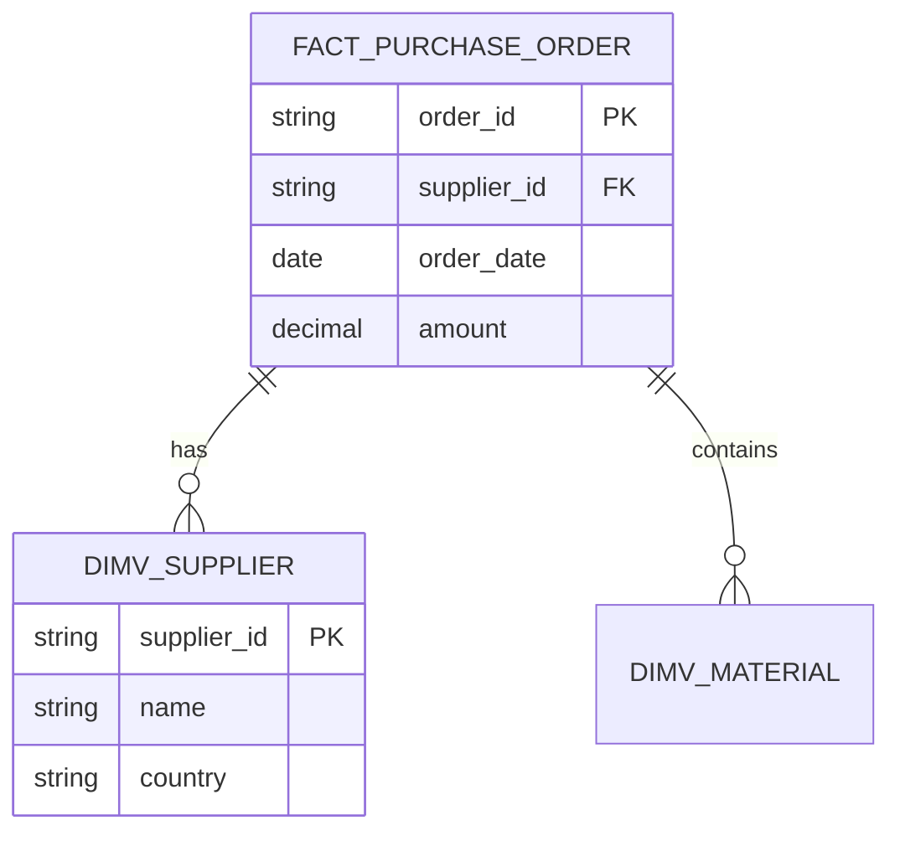
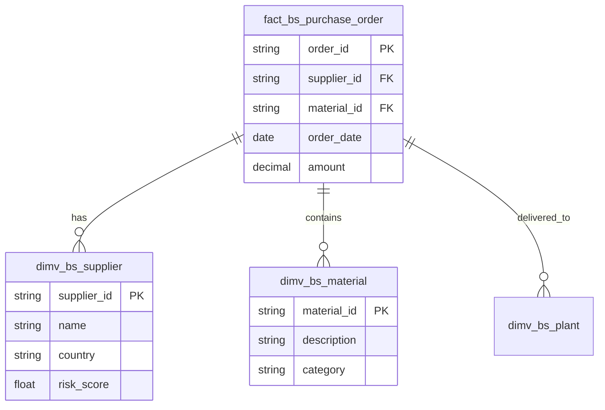

# Tool 5: ER Diagram Generator (Mermaid)

## Brief
Vytvor Tool 5, ktorý generuje Mermaid ER diagram kód z výstupu Tool 2 (structure.json). Diagram zobrazuje FACT a DIMENSION tabuľky s ich vzťahmi.

## Acceptance Criteria

- [ ] `src/tool5/__init__.py` existuje
- [ ] `src/tool5/diagram_generator.py` obsahuje `generate_mermaid_diagram(structure: dict) -> str`
- [ ] Výstup je validný Mermaid `erDiagram` kód
- [ ] Diagram obsahuje:
  - [ ] Všetky FACT tabuľky
  - [ ] Všetky DIMENSION tabuľky
  - [ ] FK vzťahy medzi nimi
  - [ ] Aspoň 3-5 kľúčových stĺpcov pre každú tabuľku
- [ ] Output ukladá do `data/tool5/diagram.md`
- [ ] Test `tests/test_tool5.py` prechádza
- [ ] Vygenerovaný kód sa správne renderuje v GitHub/Confluence

## Technical Notes

### Mermaid ER Diagram Syntax


### Implementácia
```python
# src/tool5/diagram_generator.py
from typing import Optional
import json
from pathlib import Path

def generate_mermaid_diagram(
    structure: dict,
    max_columns: int = 5
) -> str:
    """
    Generate Mermaid ER diagram from structure.json.

    Args:
        structure: Output from Tool 2 (classify_structure)
        max_columns: Maximum columns to display per table

    Returns:
        Mermaid erDiagram code as string
    """
    lines = ["erDiagram"]

    # 1. Generate relationships
    for fact in structure.get("facts", []):
        for fk in fact.get("foreign_keys", []):
            target = fk.get("target_table", "UNKNOWN")
            relation = fk.get("relation_type", "references")
            lines.append(f"    {fact['name']} ||--o{{ {target} : \"{relation}\"")

    # 2. Generate FACT table definitions
    for fact in structure.get("facts", []):
        lines.append(f"\n    {fact['name']} {{")
        for col in fact.get("columns", [])[:max_columns]:
            col_type = _map_type(col.get("type", "string"))
            key_marker = _get_key_marker(col)
            lines.append(f"        {col_type} {col['name']}{key_marker}")
        lines.append("    }")

    # 3. Generate DIMENSION table definitions
    for dim in structure.get("dimensions", []):
        lines.append(f"\n    {dim['name']} {{")
        for col in dim.get("columns", [])[:max_columns]:
            col_type = _map_type(col.get("type", "string"))
            key_marker = _get_key_marker(col)
            lines.append(f"        {col_type} {col['name']}{key_marker}")
        lines.append("    }")

    return "\n".join(lines)

def _map_type(col_type: str) -> str:
    """Map database types to Mermaid-friendly types."""
    type_mapping = {
        "varchar": "string",
        "nvarchar": "string",
        "text": "string",
        "int": "int",
        "integer": "int",
        "bigint": "bigint",
        "decimal": "decimal",
        "float": "float",
        "date": "date",
        "datetime": "datetime",
        "timestamp": "datetime",
        "boolean": "bool",
    }
    return type_mapping.get(col_type.lower(), "string")

def _get_key_marker(column: dict) -> str:
    """Get PK/FK marker for column."""
    if column.get("is_primary_key"):
        return " PK"
    elif column.get("is_foreign_key"):
        return " FK"
    return ""

def save_diagram(
    structure_path: str,
    output_path: str = "data/tool5/diagram.md"
) -> str:
    """Load structure and save diagram to file."""
    structure = json.loads(Path(structure_path).read_text())
    diagram = generate_mermaid_diagram(structure)

    # Wrap in markdown code block
    markdown = f"# ER Diagram\n\n```mermaid\n{diagram}\n```\n"

    Path(output_path).parent.mkdir(parents=True, exist_ok=True)
    Path(output_path).write_text(markdown)

    return diagram

if __name__ == "__main__":
    import argparse
    parser = argparse.ArgumentParser()
    parser.add_argument("--input", default="data/tool2/structure.json")
    parser.add_argument("--output", default="data/tool5/diagram.md")
    args = parser.parse_args()

    diagram = save_diagram(args.input, args.output)
    print(f"✅ Diagram saved to {args.output}")
    print(diagram[:500])
```

### Príklad výstupu
```markdown
# ER Diagram


```

## Testing

### Unit Tests
```python
# tests/test_tool5.py
import pytest
from src.tool5.diagram_generator import generate_mermaid_diagram, _map_type

def test_generate_simple_diagram():
    """Test basic diagram generation."""
    structure = {
        "facts": [{
            "name": "fact_orders",
            "columns": [
                {"name": "order_id", "type": "string", "is_primary_key": True},
                {"name": "customer_id", "type": "string", "is_foreign_key": True}
            ],
            "foreign_keys": [
                {"target_table": "dim_customer", "relation_type": "references"}
            ]
        }],
        "dimensions": [{
            "name": "dim_customer",
            "columns": [
                {"name": "customer_id", "type": "string", "is_primary_key": True},
                {"name": "name", "type": "string"}
            ]
        }]
    }

    diagram = generate_mermaid_diagram(structure)

    assert "erDiagram" in diagram
    assert "fact_orders" in diagram
    assert "dim_customer" in diagram
    assert "||--o{" in diagram  # Relationship marker
    assert "PK" in diagram
    assert "FK" in diagram

def test_type_mapping():
    """Test database type to Mermaid type mapping."""
    assert _map_type("varchar") == "string"
    assert _map_type("INT") == "int"
    assert _map_type("DECIMAL") == "decimal"
    assert _map_type("unknown_type") == "string"

def test_empty_structure():
    """Test handling of empty structure."""
    diagram = generate_mermaid_diagram({"facts": [], "dimensions": []})
    assert diagram == "erDiagram"
```

### Manuálny test renderingu
```bash
# Generate diagram
python src/tool5/diagram_generator.py --input data/tool2/structure.json

# Copy to clipboard and paste to:
# - https://mermaid.live/
# - GitHub issue/PR
# - Confluence page
```

## Definition of Done
- [ ] Všetky AC splnené
- [ ] Unit testy prechádzajú
- [ ] Diagram sa renderuje v GitHub preview
- [ ] Code review approved
