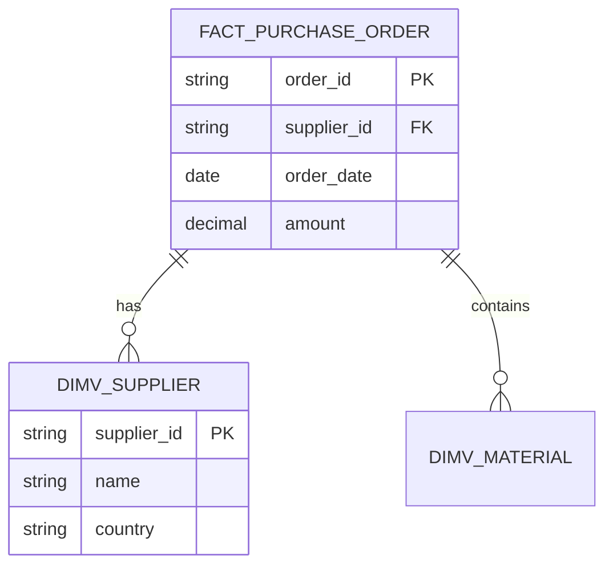
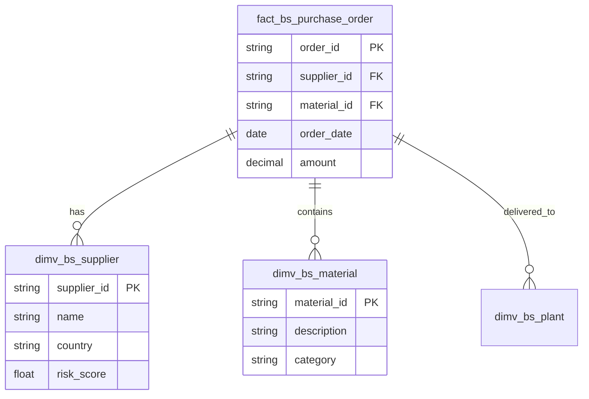

# Tool 5: ER Diagram Generator (Mermaid)

## Brief
Vytvor Tool 5, ktorý generuje Mermaid ER diagram kód z výstupu Tool 2 (structure.json). Diagram zobrazuje FACT a DIMENSION tabuľky s ich vzťahmi.

## Business Context
Tool 5 je posledný chýbajúci kúsok Sprint 1 MVP pipeline. Aktuálne máme:
- ✅ Backend endpoint `_generate_diagram()` v `src/api/main.py` (inline implementation)
- ✅ Frontend `MermaidDiagram.tsx` renderer
- ✅ WebSocket pipeline pre real-time diagram streaming

**Potrebujeme:** Samostatný, testovaný modul s CLI interface a lepšou kvalitou diagramov.

## Acceptance Criteria

- [ ] `src/tool5/__init__.py` existuje
- [ ] `src/tool5/diagram_generator.py` obsahuje `generate_mermaid_diagram(structure: dict) -> str`
- [ ] Výstup je validný Mermaid `erDiagram` kód
- [ ] Diagram obsahuje:
  - [ ] Všetky FACT tabuľky
  - [ ] Všetky DIMENSION tabuľky
  - [ ] FK vzťahy medzi nimi
  - [ ] Aspoň 3-5 kľúčových stĺpcov pre každú tabuľku
- [ ] Output ukladá do `data/tool5/diagram.md`
- [ ] Test `tests/test_tool5.py` prechádza
- [ ] Vygenerovaný kód sa správne renderuje v GitHub/Confluence
- [ ] CLI interface: `python -m src.tool5 --input data/tool2/structure.json`
- [ ] Backend `src/api/main.py` používa Tool 5 namiesto inline funkcie

## Technical Notes

### Mermaid ER Diagram Syntax


### Implementation

#### Module Structure
```
src/tool5/
├── __init__.py           # Exports generate_mermaid_diagram
├── diagram_generator.py  # Main logic
├── __main__.py          # CLI entry point
└── README.md            # Usage docs
```

#### Core Function
```python
# src/tool5/diagram_generator.py
from typing import Optional
import json
from pathlib import Path

def generate_mermaid_diagram(
    structure: dict,
    max_columns: int = 5
) -> str:
    """
    Generate Mermaid ER diagram from structure.json.

    Args:
        structure: Output from Tool 2 (classify_structure)
        max_columns: Maximum columns to display per table

    Returns:
        Mermaid erDiagram code as string
    """
    lines = ["erDiagram"]

    # 1. Generate relationships
    for fact in structure.get("facts", []):
        for fk in fact.get("foreign_keys", []):
            target = fk.get("target_table", "UNKNOWN")
            relation = fk.get("relation_type", "references")
            lines.append(f"    {fact['name']} ||--o{{ {target} : \"{relation}\"")

    # 2. Generate FACT table definitions
    for fact in structure.get("facts", []):
        lines.append(f"\n    {fact['name']} {{")
        for col in fact.get("columns", [])[:max_columns]:
            col_type = _map_type(col.get("type", "string"))
            key_marker = _get_key_marker(col)
            lines.append(f"        {col_type} {col['name']}{key_marker}")
        lines.append("    }")

    # 3. Generate DIMENSION table definitions
    for dim in structure.get("dimensions", []):
        lines.append(f"\n    {dim['name']} {{")
        for col in dim.get("columns", [])[:max_columns]:
            col_type = _map_type(col.get("type", "string"))
            key_marker = _get_key_marker(col)
            lines.append(f"        {col_type} {col['name']}{key_marker}")
        lines.append("    }")

    return "\n".join(lines)

def _map_type(col_type: str) -> str:
    """Map database types to Mermaid-friendly types."""
    type_mapping = {
        "varchar": "string",
        "nvarchar": "string",
        "text": "string",
        "int": "int",
        "integer": "int",
        "bigint": "bigint",
        "decimal": "decimal",
        "float": "float",
        "date": "date",
        "datetime": "datetime",
        "timestamp": "datetime",
        "boolean": "bool",
    }
    return type_mapping.get(col_type.lower(), "string")

def _get_key_marker(column: dict) -> str:
    """Get PK/FK marker for column."""
    if column.get("is_primary_key"):
        return " PK"
    elif column.get("is_foreign_key"):
        return " FK"
    return ""

def save_diagram(
    structure_path: str,
    output_path: str = "data/tool5/diagram.md"
) -> str:
    """Load structure and save diagram to file."""
    structure = json.loads(Path(structure_path).read_text())
    diagram = generate_mermaid_diagram(structure)

    # Wrap in markdown code block
    markdown = f"# ER Diagram\n\n```mermaid\n{diagram}\n```\n"

    Path(output_path).parent.mkdir(parents=True, exist_ok=True)
    Path(output_path).write_text(markdown)

    return diagram
```

#### CLI Interface
```python
# src/tool5/__main__.py
import argparse
from pathlib import Path
from .diagram_generator import save_diagram

def main():
    parser = argparse.ArgumentParser(
        description="Generate Mermaid ER diagram from Tool 2 structure.json"
    )
    parser.add_argument(
        "--input", "-i",
        default="data/tool2/structure.json",
        help="Path to structure.json from Tool 2"
    )
    parser.add_argument(
        "--output", "-o",
        default="data/tool5/diagram.md",
        help="Output path for Mermaid diagram"
    )
    parser.add_argument(
        "--max-columns",
        type=int,
        default=5,
        help="Maximum columns to show per table (default: 5)"
    )
    args = parser.parse_args()

    try:
        diagram = save_diagram(args.input, args.output)
        print(f"✅ Diagram saved to {args.output}")
        print("\nPreview:")
        print("-" * 60)
        print(diagram[:500])
        if len(diagram) > 500:
            print(f"\n... ({len(diagram) - 500} more characters)")
    except FileNotFoundError as e:
        print(f"❌ Error: {e}")
        exit(1)
    except Exception as e:
        print(f"❌ Failed to generate diagram: {e}")
        exit(1)

if __name__ == "__main__":
    main()
```

### Migration from API inline function

#### Before (src/api/main.py)
```python
def _generate_diagram(structure: dict) -> str:
    """Generate Mermaid ER diagram from structure."""
    lines = ["erDiagram"]
    # ... inline implementation ...
    return "\n".join(lines)

@app.get("/api/diagram/{session_id}")
async def get_diagram(session_id: str):
    # ...
    diagram = _generate_diagram(structure)
    # ...
```

#### After (src/api/main.py)
```python
from src.tool5 import generate_mermaid_diagram

@app.get("/api/diagram/{session_id}")
async def get_diagram(session_id: str):
    # ...
    diagram = generate_mermaid_diagram(structure)
    # ...
```

### Example Output
```markdown
# ER Diagram


```

## Testing

### Unit Tests
```python
# tests/test_tool5.py
import pytest
from src.tool5.diagram_generator import generate_mermaid_diagram, _map_type, _get_key_marker

def test_generate_simple_diagram():
    """Test basic diagram generation."""
    structure = {
        "facts": [{
            "name": "fact_orders",
            "columns": [
                {"name": "order_id", "type": "string", "is_primary_key": True},
                {"name": "customer_id", "type": "string", "is_foreign_key": True}
            ],
            "foreign_keys": [
                {"target_table": "dim_customer", "relation_type": "references"}
            ]
        }],
        "dimensions": [{
            "name": "dim_customer",
            "columns": [
                {"name": "customer_id", "type": "string", "is_primary_key": True},
                {"name": "name", "type": "string"}
            ]
        }]
    }

    diagram = generate_mermaid_diagram(structure)

    assert "erDiagram" in diagram
    assert "fact_orders" in diagram
    assert "dim_customer" in diagram
    assert "||--o{" in diagram  # Relationship marker
    assert "PK" in diagram
    assert "FK" in diagram

def test_type_mapping():
    """Test database type to Mermaid type mapping."""
    assert _map_type("varchar") == "string"
    assert _map_type("INT") == "int"
    assert _map_type("DECIMAL") == "decimal"
    assert _map_type("unknown_type") == "string"

def test_get_key_marker():
    """Test PK/FK marker generation."""
    assert _get_key_marker({"is_primary_key": True}) == " PK"
    assert _get_key_marker({"is_foreign_key": True}) == " FK"
    assert _get_key_marker({}) == ""

def test_empty_structure():
    """Test handling of empty structure."""
    diagram = generate_mermaid_diagram({"facts": [], "dimensions": []})
    assert diagram == "erDiagram"

def test_max_columns_limit():
    """Test max_columns parameter."""
    structure = {
        "facts": [{
            "name": "fact_test",
            "columns": [
                {"name": f"col_{i}", "type": "string"} for i in range(10)
            ],
            "foreign_keys": []
        }],
        "dimensions": []
    }

    diagram = generate_mermaid_diagram(structure, max_columns=3)
    # Should only have 3 columns
    col_count = diagram.count("col_")
    assert col_count == 3
```

### Integration Test
```bash
# Generate diagram from real Tool 2 output
python -m src.tool5 --input data/tool2/structure.json --output /tmp/test_diagram.md

# Verify file created
test -f /tmp/test_diagram.md && echo "✅ File created"

# Verify Mermaid syntax
grep -q "erDiagram" /tmp/test_diagram.md && echo "✅ Valid Mermaid syntax"
```

### Manual Rendering Test
```bash
# Generate diagram
python -m src.tool5 --input data/tool2/structure.json

# Copy to clipboard (macOS)
cat data/tool5/diagram.md | pbcopy

# Paste to:
# - https://mermaid.live/
# - GitHub issue/PR
# - Confluence page
```

## Definition of Done
- [ ] Všetky AC splnené
- [ ] Unit testy prechádzajú (8+ tests)
- [ ] CLI interface funguje
- [ ] Backend migrovaný z inline funkcie
- [ ] Diagram sa renderuje v GitHub preview
- [ ] Documentation v `src/tool5/README.md`
- [ ] Code review approved

## Related Stories
- **MCOP-S1-001**: Tool 1-3 Refactor (dependency - Tool 2 needed)
- **MCOP-S1-005**: FastAPI Backend (migration target)
- **MCOP-S1-006**: React Frontend (consumer of diagrams)

## Estimated Time Breakdown
- Setup module structure: 30 min
- Migrate logic from main.py: 1 hour
- Add tests: 1.5 hours
- CLI interface: 30 min
- Documentation: 30 min
- Backend integration: 45 min
- Manual testing & fixes: 1 hour

**Total: 5-6 hours**
