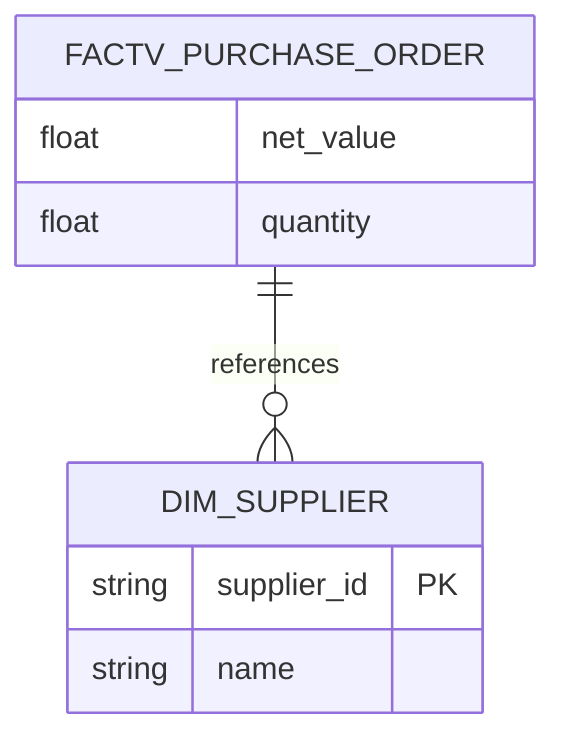

# Backend API Status

**Source of Truth for Frontend Development**
**Last Updated:** 2025-12-08 (Sprint 2)
**Production URL:** https://practical-quietude-production.up.railway.app
**Frontend URL:** https://front-archi-agent.vercel.app
**Tests:** 76 passing (Tool 0/2/3/5)

---

## ✅ LLM Functionality Status (2025-12-08)

| Tool       | LLM Framework    | Status    | Usage                                       |
| ---------- | ---------------- | --------- | ------------------------------------------- |
| **Tool 0** | Azure OpenAI SDK | ✅ Working | `parse_business_request(text)`              |
| **Tool 2** | Pydantic AI 1.25 | ✅ Working | `classify_structure(data, use_llm=True)`    |
| **Tool 3** | Pydantic AI 1.25 | ✅ Working | `validate_quality(structure, use_llm=True)` |
| **Tool 5** | Pure Python      | ✅ Working | `generate_mermaid_diagram(structure)`       |

**pydantic-ai 1.25+ API Notes:**
- Agent constructor uses `output_type=` (not `result_type`)
- Result access uses `result.output` (not `result.data`)
- Azure model: `AzureProvider` with `OpenAIChatModel`

---

## 🚀 Implemented Endpoints

### ⭐ `POST /api/pipeline/run` (Main Entry Point)
**Start metadata analysis pipeline** - Asynchronous execution with status polling.

| Feature     | Description                                                                             |
| ----------- | --------------------------------------------------------------------------------------- |
| **Async**   | Returns immediately, poll status endpoint for progress                                  |
| **Tools**   | Tool 0 (Parser) → Tool 1 (Ingest) → Tool 2 (Structure) → Tool 3 (QA) → Tool 5 (Diagram) |
| **Output**  | Full pipeline result with all tool outputs                                              |
| **Diagram** | Generates Mermaid ER diagram via Tool 5 module                                          |

**Request:**
```json
{
  "metadata_path": "data/tool1/filtered_bs.json",
  "scope": "dm_bs_purchase",
  "skip_tool0": true
}
```

**Response:**
```json
{
  "session_id": "6d710337-41cc-47ea-9355-d2cb9c15160f",
  "status": "started",
  "message": "Pipeline started. Poll /api/pipeline/{session_id}/status for updates."
}
```

---

### `GET /api/pipeline/{id}/status`
**Poll pipeline execution status.**

| Field          | Type    | Description                      |
| -------------- | ------- | -------------------------------- |
| `status`       | string  | `running`, `completed`, `failed` |
| `current_step` | string  | `tool0`, `tool1`, `tool2`, etc.  |
| `has_result`   | boolean | True when complete               |
| `has_diagram`  | boolean | True when diagram generated      |
| `error`        | string? | Error message if failed          |

---

### `GET /api/pipeline/{id}/result`
**Get full pipeline result after completion.**

| Field                    | Type    | Description             |
| ------------------------ | ------- | ----------------------- |
| `tool0_output`           | object? | Parsed business request |
| `tool1_output`           | object? | Filtered metadata       |
| `tool2_output`           | object? | FACT/DIM structure      |
| `tool3_output`           | object? | Quality report          |
| `step_timings`           | array   | Duration per step       |
| `total_duration_seconds` | float   | Total execution time    |

---

### `GET /api/diagram/{id}`
**Get Mermaid ER diagram.**

| Field     | Type   | Description        |
| --------- | ------ | ------------------ |
| `diagram` | string | Mermaid code       |
| `format`  | string | Always `"mermaid"` |

**Example Response:**


---

### `WS /ws/{session_id}` (WebSocket Chat)
**Real-time chat with Explorer Agent.**

| Message Type    | Direction | Description                |
| --------------- | --------- | -------------------------- |
| `user`          | ← Client  | User message               |
| `user`          | → Server  | Echo of user message       |
| `agent_partial` | → Server  | Streaming token (multiple) |
| `agent`         | → Server  | Final complete response    |
| `error`         | → Server  | Error occurred             |

**Client sends:**
```json
{ "content": "Show me all FACT tables in dm_bs_purchase" }
```

**Server streams:**
```json
{ "type": "agent_partial", "content": "The dm_bs_purchase" }
{ "type": "agent_partial", "content": " schema contains" }
{ "type": "agent_partial", "content": " 25 tables..." }
{ "type": "agent", "content": "The dm_bs_purchase schema contains 25 tables: 8 FACT tables...", "timestamp": "..." }
```

#### 🆕 Sprint 2: Extended Response Fields (Planned)

```typescript
interface WebSocketMessage {
  type: 'user' | 'agent' | 'agent_partial' | 'tool' | 'error';
  content: string;
  timestamp?: string;

  // 🆕 Canvas Trigger (MCOP-FE-002)
  canvas_trigger?: {
    action: 'switch_view' | 'new_analysis' | 'none';
    view_type?: 'er_diagram' | 'table_list' | 'relationship_graph';
    entity_name?: string;
    reason: string;
    confidence?: number;  // 0.0-1.0, FE auto-switches if >= 0.6
  };

  // 🆕 Metrics (MCOP-FE-005)
  metrics?: {
    total_tables: number;
    total_columns: number;
    facts_count: number;
    dimensions_count: number;
    quality_score?: number;
  };

  // 🆕 Follow-up (MCOP-FE-006)
  is_follow_up?: boolean;
}
```

**Status:** 🟡 Planned for Sprint 2 backend work

---

### `POST /api/chat` (REST Alternative)
**Non-streaming chat endpoint.**

| Field        | Type    | Description         |
| ------------ | ------- | ------------------- |
| `content`    | string  | User message        |
| `session_id` | string? | Optional session ID |

**Response:**
```json
{
  "content": "Agent response text...",
  "session_id": "abc123",
  "message_count": 5
}
```

---

### `GET /api/tables`
**List all available tables.**

| Query Param | Type    | Description           |
| ----------- | ------- | --------------------- |
| `schema`    | string? | Filter by schema name |

**Response:**
```json
[
  {
    "name": "factv_purchase_order",
    "schema": "dm_bs_purchase",
    "type": "FACT",
    "column_count": 45
  }
]
```

---

### `GET /api/tables/{name}`
**Get table details.**

**Response:**
```json
{
  "name": "factv_purchase_order",
  "schema": "dm_bs_purchase",
  "type": "FACT",
  "columns": [
    { "name": "order_id", "type": "string", "is_pk": true },
    { "name": "net_value", "type": "float", "is_pk": false }
  ],
  "row_count": 125000,
  "description": "Purchase order transactions"
}
```

---

### `GET /api/schemas`
**List all schemas with summary info.**

**Response:**
```json
[
  {
    "name": "dm_bs_purchase",
    "table_count": 25,
    "fact_count": 8,
    "dim_count": 15
  }
]
```

---

### `GET /health`
**Health check for load balancers.**

**Response:**
```json
{
  "status": "healthy",
  "version": "0.1.0",
  "timestamp": "2025-12-01T10:30:00Z"
}
```

---

### `GET /api/stats`
**API statistics.**

**Response:**
```json
{
  "active_sessions": 3,
  "total_tables": 45,
  "total_columns": 380,
  "tables_by_type": {
    "FACT": 12,
    "DIM": 28,
    "OTHER": 5
  }
}
```

---

## 🔧 Environment Configuration

| Variable                       | Description                 | Required |
| ------------------------------ | --------------------------- | -------- |
| `AZURE_OPENAI_ENDPOINT`        | Azure OpenAI API endpoint   | ✅        |
| `AZURE_OPENAI_API_KEY`         | Azure OpenAI API key        | ✅        |
| `AZURE_OPENAI_DEPLOYMENT_NAME` | Model deployment name       | ✅        |
| `PORT`                         | Server port (default: 8000) | ❌        |
| `COLLIBRA_API_URL`             | Collibra API (future)       | ❌        |
| `COLLIBRA_API_KEY`             | Collibra auth (future)      | ❌        |

---

## 🧪 Testing

```bash
# Run all tests
pytest tests/ -v

# Run specific test file
pytest tests/test_api.py -v

# Run with coverage
pytest tests/ --cov=src --cov-report=html
```

**Test breakdown:**
- API tests: 36
- Tool tests: 71
- Orchestrator: 16
- Explorer Agent: 118
- **Total: 265 passing**

---

## 🚢 Deployment

**Platform:** Railway
**Region:** us-west1
**Auto-deploy:** On git push to `main`

**Health endpoint:**
```bash
curl https://practical-quietude-production.up.railway.app/health
```

---

## 📋 Sprint 2 Backend Roadmap

| Feature             | Endpoint Impact        | Status    |
| ------------------- | ---------------------- | --------- |
| Canvas Trigger      | `canvas_trigger` in WS | 🟡 Planned |
| Metrics in Response | `metrics` in WS        | 🟡 Planned |
| Follow-up Detection | `is_follow_up` in WS   | 🔴 Blocked |
| Real Collibra API   | All `/api/tables/*`    | 🟡 Planned |
| JWT Authentication  | All endpoints          | 🟡 Planned |
| Redis Sessions      | Session persistence    | 🟡 Planned |

---

## 🔗 Related Docs

- [Frontend Stories](scrum/sprint_2/frontend/README.md)
- [Backend Architecture](scrum/architecture/canvas-trigger-backend.md)
- [OpenAPI Schema](src/api/openapi.json)
- [WebSocket Protocol](docs_pydantic/websocket-streaming.md)
